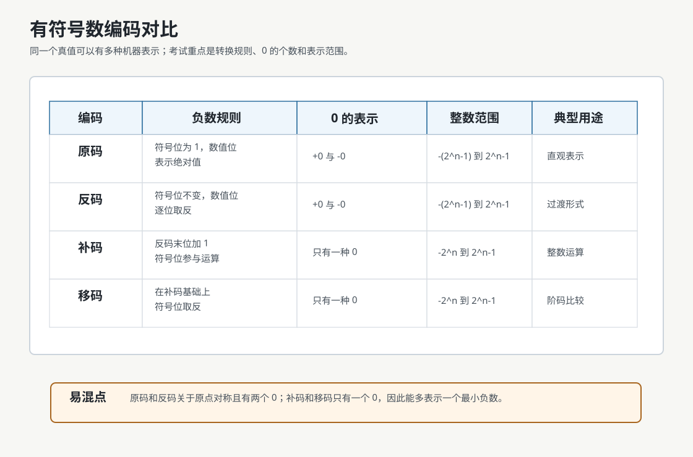
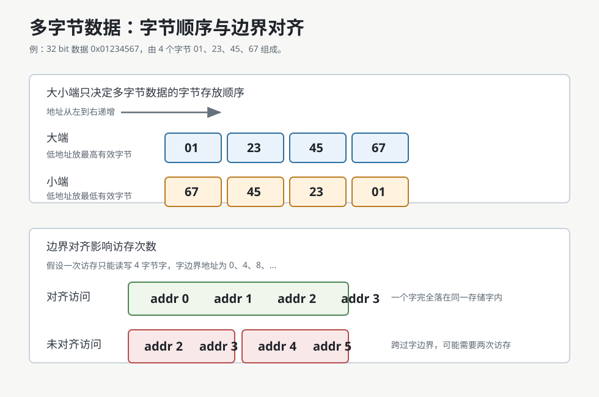

# 数的编码表示

**真值** 是符合人类习惯的数值写法，例如 $+15$、$-8$。

**机器数** 是数值实际存入计算机时的 bit 模式。对于负数，符号也必须被编码成 bit。

| 真值 | 一种机器表示示意 |
|---|---|
| $+15$ | `0 1111` |
| $-8$ | `1 1000` |

> [!important] 先判断解释规则
> `1000` 可以是无符号数 $8$，也可以在 4 位补码中表示 $-8$。bit 串本身不携带解释规则。

## 无符号数

n 位无符号整数全部 bit 都是数值位，表示范围为：

$$
0 \le x \le 2^n - 1
$$

例如 8 位无符号整数的范围是：

$$
0 \le x \le 255
$$

无符号数适合表示地址、长度、计数值等不需要负数的对象。

## 有符号定点数

有符号定点数需要用某种编码规则表示正负号。常见编码包括：

- 原码
- 补码
- 移码

若真值为 $x$，常写作：

- $[x]_{\text{原}}$
- $[x]_{\text{反}}$
- $[x]_{\text{补}}$
- $[x]_{\text{移}}$



## 原码

原码用最高位表示符号，数值位表示真值的绝对值。

| 符号位 | 含义 |
|---|---|
| 0 | 正数 |
| 1 | 负数 |

例如 8 位机器字长：

| 真值 | 原码 |
|---|---|
| $+19$ | `0,0010011` |
| $-19$ | `1,0010011` |

若机器字长为 $n+1$ 位，其中 $n$ 位为数值位，则原码整数范围为：

$$
-(2^n-1) \le x \le 2^n-1
$$

原码的真值 0 有两种表示：

- `0,000...0`
- `1,000...0`

## 补码

补码规则：

- 正数补码与原码相同。
- 负数补码等于其反码末位加 1。

实质是：**n 位补码的最高位权重为负，其余位权重为正**。

例如 4 位补码的位权是：

$$
-2^3,\ 2^2,\ 2^1,\ 2^0
$$

所以：

$$
5_{10} = 0 + 4 + 0 + 1 = 0101_2 
$$

而

$$
-5_{10} = -8 + 0 + 2 + 1 = 1011_2 = 0101_{2}\text{按位取反再加}1
$$


**按位取反再加1即为取相反数操作**，所以负数补码转回正数补/码的方法相同

补码整数范围为：

$$
-2^n \le x \le 2^n-1
$$

补码的真值 0 只有一种表示，因此比原码和反码多表示一个最小负数 $-2^n$即$\displaystyle 1\quad\underbrace{0...0}_{n\text{个}0}$

> [!note] 为什么补码重要
> 补码让减法可以转化为加法，这是整数运算电路统一化的基础。

## 移码

移码是补码加上一个固定的数作为偏移，若字长$n+1$位则这个偏移通常取$2^{n}$

| 真值    | 补码          | 移码          |
| ----- | ----------- | ----------- |
| $+19$ | `0,0010011` | `1,0010011` |
| $-19$ | `1,1101101` | `0,1101101` |

移码只能用于表示整数。若机器字长为 $n+1$ 位，则移码整数范围与补码相同：

$$
-2^n \le x \le 2^n-1
$$

移码的一个重要特点是：编码值越大，真值越大，因此很适合比较大小。


## 定点整数与定点小数

定点数的小数点位置固定。

### 定点整数

定点整数的小数点默认在最低位之后。

例如：

```text
0,0010011
```

可以解释为一个带符号定点整数编码。

### 定点小数

定点小数的小数点默认在符号位之后、数值位之前。

例如：

```text
0.1100000
```

可以解释为 $+0.75$ 的一种定点小数表示。

## 表示范围

若机器字长为 $n+1$ 位，则常见范围如下：

| 编码 | 定点整数范围 | 定点小数范围 |
|---|---|---|
| 原码 | $-(2^n-1) \le x \le 2^n-1$ | $-(1-2^{-n}) \le x \le 1-2^{-n}$ |
| 反码 | $-(2^n-1) \le x \le 2^n-1$ | $-(1-2^{-n}) \le x \le 1-2^{-n}$ |
| 补码 | $-2^n \le x \le 2^n-1$ | $-1 \le x \le 1-2^{-n}$ |
| 移码 | $-2^n \le x \le 2^n-1$ | 不用于定点小数 |

# 数据的存储和排列

一个多字节数据在内存中一定占用连续的若干字节。因此需要讨论字节的顺序以及数据的第一个字节的地址。数据的第一个字节的地址就是数据的地址。



## 大小端模式

**大小端**源自《格列佛游记》，指“打破鸡蛋从大端/小端开始”。

在CS中描述的是多字节数据在内存中的字节排列顺序。

以 4 字节整数 `0x01234567` 为例，它由 4 个字节组成：

```text
01 23 45 67
```

其中：

- `01` 是最高有效字节，MSB。
- `67` 是最低有效字节，LSB。

若地址从低到高递增：

| 模式   | 低地址 -> 高地址    | 解释                 |     
| ---- | ------------- | ------------------ | 
| 大端模式 | `01 23 45 67` | 低地址放最高有效字节（**大端**） |     
| 小端模式 | `67 45 23 01` | 低地址放最低有效字节（**小端**） |     

> [!important] 大小端不改变数值
> `0x01234567` 的数值没有变。大小端只影响它拆成字节后在内存中的摆放顺序。

> [! danger] 寄存器的**值**/存储单元的**数**得转化为人类阅读的形式（**大端**）
> 虽然数的存储方式分为大端小端，但如果问及寄存器的**值**/存储单元的**数**，则要以人类阅读的方式回答，**即最后统一转化为大端**。
> >[! example] 内存单元 1234H 存放数据 56H, 1235H 存放 78H。小端存储。现要从内存单元1234H 开始（包括 1234H）连续取 2 个字节写入寄存器 R1，*则操作结束后 R1 的值为？*
> >答：*7856H*。由于采用小端存储，取得的数据按有效字节从低到高为 56H, 78H。则转化为人类阅读的形式（**大端**）就是 7856H 。

## 边界对齐

1. 对于普通数据成员，起始位置落在该数据大小的整数倍地址上。第一个数据成员放在`offset=0` 的地方。
2. 对于结构体成员，起始位置落在内部最大元素大小的整数倍地址上。
3. 结构体大小应是内部成员中最大对齐参数（对齐参数一般等于元素大小）的整数倍。

对齐访问时，一个字可能一次访存就能读出。未对齐访问时，数据可能跨过存储字边界，需要两次访存，再由硬件拼接。

> [!note] 为什么要对齐
> 边界对齐主要是为了提高访存效率，也能简化硬件处理。
> 有些体系允许未对齐访问但速度较慢，有些体系可能直接禁止某些未对齐访问。


