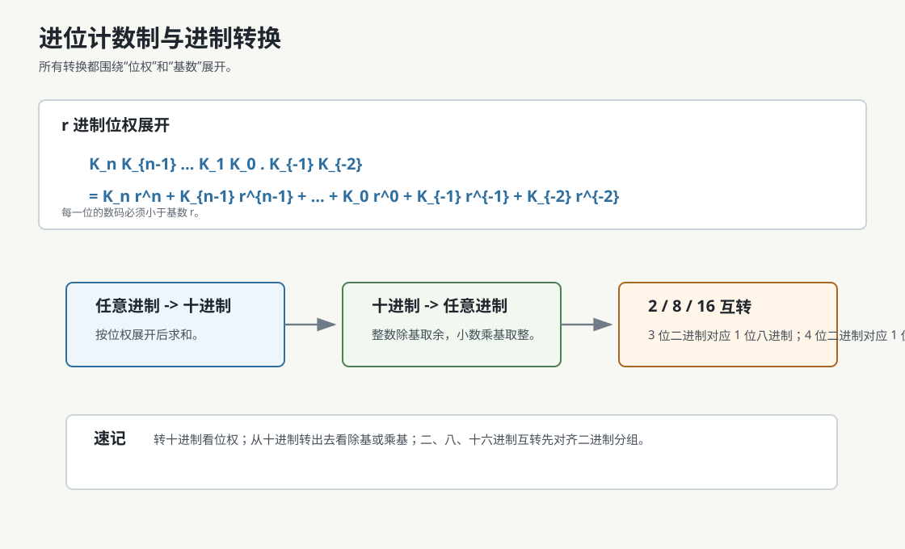

# 进位计数制

进位计数制用有限个数码和位权表示数值。对于 $r$ 进制数：

$$
K_nK_{n-1}\cdots K_1K_0.K_{-1}K_{-2}\cdots
$$

其真值为：

$$
\sum_i K_i r^i
$$

其中每个数码 $K_i$ 必须满足：

$$
0 \le K_i < r
$$

例如：

$$
(975.36)_{10}=9\times10^2+7\times10^1+5\times10^0+3\times10^{-1}+6\times10^{-2}
$$

# 进制转换

## 任意进制转十进制

按位权展开后求和。

>[!example]
> $$
> (1011.01)_2=1\times2^3+0\times2^2+1\times2^1+1\times2^0+0\times2^{-1}+1\times2^{-2}=11.25
> $$

## 十进制转任意进制

整数部分和小数部分分开处理。

| 部分 | 方法 | 读数方向 |
|---|---|---|
| 整数部分 | 除基取余 | 余数从下往上读 |
| 小数部分 | 乘基取整 | 整数部分从上往下读 |

### 整数部分：除基取余

把十进制整数 $N$ 转为 $r$ 进制：

1. 用 $N$ 除以 $r$，记录余数。
2. 用商继续除以 $r$，继续记录余数。
3. 重复直到商为 $0$。
4. 将余数从最后一次到第一次逆序写。

> [!example] $13_{10}$ 转二进制
> $13 \div 2 = 6 \cdots 1$
>
> $6 \div 2 = 3 \cdots 0$
>
> $3 \div 2 = 1 \cdots 1$
>
> $1 \div 2 = 0 \cdots 1$
>
> 余数从下往上读：$1101$，所以 $(13)_{10}=(1101)_2$。

> [!example] $75_{10}$ 转八进制
> $75 \div 8 = 9 \cdots 3$
>
> $9 \div 8 = 1 \cdots 1$
>
> $1 \div 8 = 0 \cdots 1$
>
> 余数从下往上读：$113$，所以 $(75)_{10}=(113)_8$。

### 小数部分：乘基取整

把十进制小数 $F$ 转为 $r$ 进制：

1. 用 $F$ 乘以 $r$。
2. 取乘积的整数部分作为下一位数码。
3. 保留乘积的小数部分继续乘以 $r$。
4. 重复直到小数部分为 $0$，或达到题目要求的精度。
5. 将每次取得的整数部分从第一次到最后一次顺序写出。

> [!example] $0.625_{10}$ 转二进制
> $0.625 \times 2 = 1.25$，取 $1$，保留 $0.25$
>
> $0.25 \times 2 = 0.5$，取 $0$，保留 $0.5$
>
> $0.5 \times 2 = 1.0$，取 $1$，小数部分为 $0$
>
> 整数部分从上往下读：$101$，所以 $(0.625)_{10}=(0.101)_2$。

> [!tip] 带小数的十进制数
> 整数部分和小数部分分别转换，再用小数点连接。例如 $(13.625)_{10}=(1101.101)_2$。

### 二进制、八进制、十六进制互转

二进制与八进制、十六进制互转时，直接按位分组。

| 转换 | 分组规则 |
|---|---|
| 二进制 <-> 八进制 | 3 位二进制对应 1 位八进制 |
| 二进制 <-> 十六进制 | 4 位二进制对应 1 位十六进制 |

> [!tip] 分组方向
> 整数部分从小数点向左分组，不足高位补 0；小数部分从小数点向右分组，不足低位补 0。

### 二进制转八进制

从小数点开始分组：

- 整数部分向左每 3 位一组。
- 小数部分向右每 3 位一组。
- 不足 3 位时补 0。
- 每组二进制直接换成 1 位八进制。

> [!example] $(1101011.1011)_2$ 转八进制
> 整数部分：$1\ 101\ 011$，高位补 0 得 $001\ 101\ 011$
>
> 小数部分：$101\ 1$，低位补 0 得 $101\ 100$
>
> $001=1$，$101=5$，$011=3$，$101=5$，$100=4$
>
> 所以 $(1101011.1011)_2=(153.54)_8$。

### 八进制转二进制

把每一位八进制数展开成 3 位二进制。

> [!example] $(153.54)_8$ 转二进制
> $1=001$，$5=101$，$3=011$，$5=101$，$4=100$
>
> 得 $001101011.101100$，去掉整数最高位多余的 0 和小数末尾补出的 0：
>
> $(153.54)_8=(1101011.1011)_2$。

### 二进制转十六进制

从小数点开始分组：

- 整数部分向左每 4 位一组。
- 小数部分向右每 4 位一组。
- 不足 4 位时补 0。
- 每组二进制直接换成 1 位十六进制。

> [!example] $(1101011.1011)_2$ 转十六进制
> 整数部分：$110\ 1011$，高位补 0 得 $0110\ 1011$
>
> 小数部分：$1011$
>
> $0110=6$，$1011=B$
>
> 所以 $(1101011.1011)_2=(6B.B)_{16}$。

### 十六进制转二进制

把每一位十六进制数展开成 4 位二进制。

> [!example] $(6B.B)_{16}$ 转二进制
> $6=0110$，$B=1011$
>
> 得 $01101011.1011$，去掉整数最高位多余的 0：
>
> $(6B.B)_{16}=(1101011.1011)_2$。

> [!important] 
> 八进制与十六进制之间互转，需要先转二进制再转

# 常见书写方式

| 进制 | 常见写法 |
|---|---|
| 二进制 | $(1011)_2$，`1011B`，`0b1011` |
| 八进制 | $(17)_8$，`17O` |
| 十进制 | $(15)_{10}$，`15D` |
| 十六进制 | $(2F)_{16}$，`2FH`，`0x2F` |

