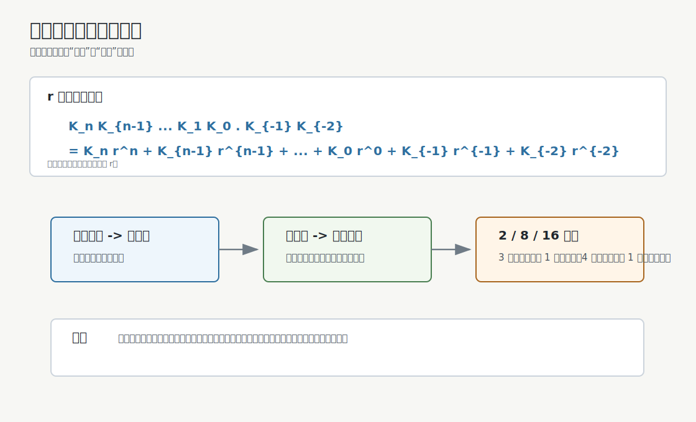
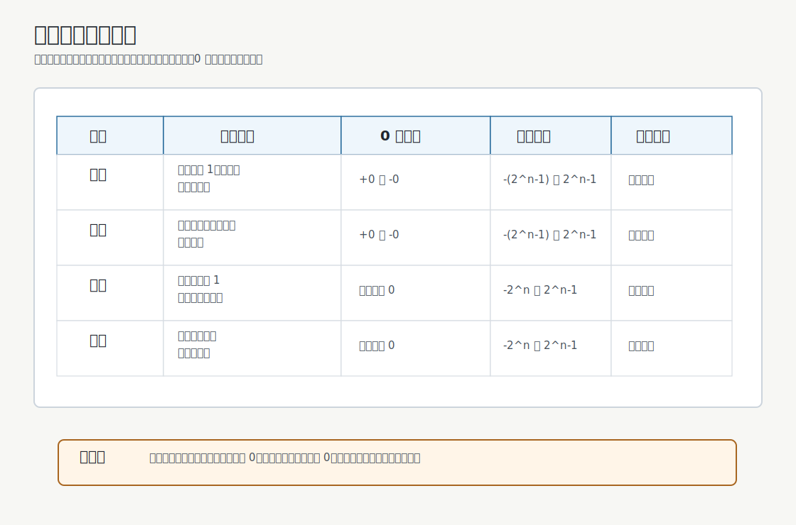
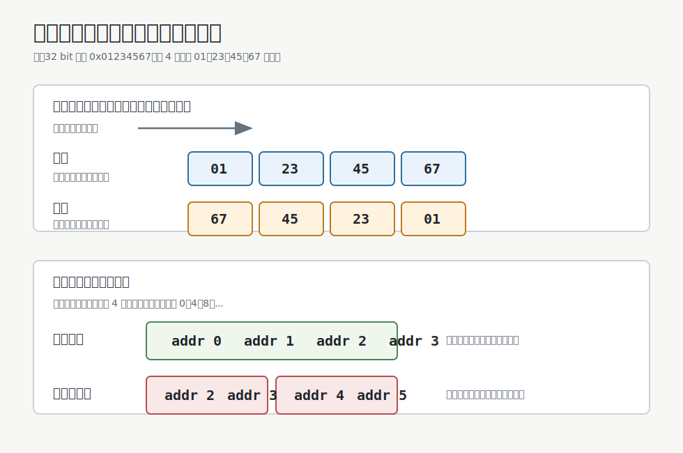
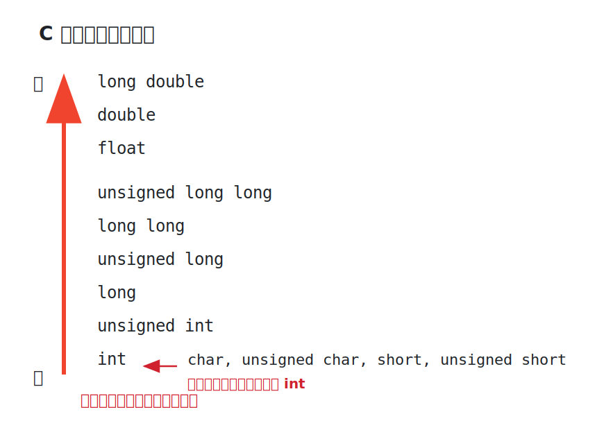

# 进位计数制

进位计数制用有限个数码和位权表示数值。对于 $r$ 进制数：

$$
K_nK_{n-1}\cdots K_1K_0.K_{-1}K_{-2}\cdots
$$

其真值为：

$$
\sum_i K_i r^i
$$

其中每个数码 $K_i$ 必须满足：

$$
0 \le K_i < r
$$

例如：

$$
(975.36)_{10}=9\times10^2+7\times10^1+5\times10^0+3\times10^{-1}+6\times10^{-2}
$$



# 进制转换

## 任意进制转十进制

按位权展开后求和。

>[!example]
> $$
> (1011.01)_2=1\times2^3+0\times2^2+1\times2^1+1\times2^0+0\times2^{-1}+1\times2^{-2}=11.25
> $$

## 十进制转任意进制

整数部分和小数部分分开处理。

| 部分 | 方法 | 读数方向 |
|---|---|---|
| 整数部分 | 除基取余 | 余数从下往上读 |
| 小数部分 | 乘基取整 | 整数部分从上往下读 |

### 整数部分：除基取余

把十进制整数 $N$ 转为 $r$ 进制：

1. 用 $N$ 除以 $r$，记录余数。
2. 用商继续除以 $r$，继续记录余数。
3. 重复直到商为 $0$。
4. 将余数从最后一次到第一次逆序写。


> [!example] $13_{10}$ 转二进制
> $13 \div 2 = 6 \cdots 1$
>
> $6 \div 2 = 3 \cdots 0$
>
> $3 \div 2 = 1 \cdots 1$
>
> $1 \div 2 = 0 \cdots 1$
>
> 余数从下往上读：$1101$，所以 $(13)_{10}=(1101)_2$。

> [!example] $75_{10}$ 转八进制
> $75 \div 8 = 9 \cdots 3$
>
> $9 \div 8 = 1 \cdots 1$
>
> $1 \div 8 = 0 \cdots 1$
>
> 余数从下往上读：$113$，所以 $(75)_{10}=(113)_8$。

### 小数部分：乘基取整

把十进制小数 $F$ 转为 $r$ 进制：

1. 用 $F$ 乘以 $r$。
2. 取乘积的整数部分作为下一位数码。
3. 保留乘积的小数部分继续乘以 $r$。
4. 重复直到小数部分为 $0$，或达到题目要求的精度。
5. 将每次取得的整数部分从第一次到最后一次顺序写出。

> [!example] $0.625_{10}$ 转二进制
> $0.625 \times 2 = 1.25$，取 $1$，保留 $0.25$
>
> $0.25 \times 2 = 0.5$，取 $0$，保留 $0.5$
>
> $0.5 \times 2 = 1.0$，取 $1$，小数部分为 $0$
>
> 整数部分从上往下读：$101$，所以 $(0.625)_{10}=(0.101)_2$。

> [!tip] 带小数的十进制数
> 整数部分和小数部分分别转换，再用小数点连接。例如 $(13.625)_{10}=(1101.101)_2$。

### 二进制、八进制、十六进制互转

二进制与八进制、十六进制互转时，直接按位分组。

| 转换 | 分组规则 |
|---|---|
| 二进制 <-> 八进制 | 3 位二进制对应 1 位八进制 |
| 二进制 <-> 十六进制 | 4 位二进制对应 1 位十六进制 |

> [!tip] 分组方向
> 整数部分从小数点向左分组，不足高位补 0；小数部分从小数点向右分组，不足低位补 0。

### 二进制转八进制

从小数点开始分组：

- 整数部分向左每 3 位一组。
- 小数部分向右每 3 位一组。
- 不足 3 位时补 0。
- 每组二进制直接换成 1 位八进制。

> [!example] $(1101011.1011)_2$ 转八进制
> 整数部分：$1\ 101\ 011$，高位补 0 得 $001\ 101\ 011$
>
> 小数部分：$101\ 1$，低位补 0 得 $101\ 100$
>
> $001=1$，$101=5$，$011=3$，$101=5$，$100=4$
>
> 所以 $(1101011.1011)_2=(153.54)_8$。

### 八进制转二进制

把每一位八进制数展开成 3 位二进制。

> [!example] $(153.54)_8$ 转二进制
> $1=001$，$5=101$，$3=011$，$5=101$，$4=100$
>
> 得 $001101011.101100$，去掉整数最高位多余的 0 和小数末尾补出的 0：
>
> $(153.54)_8=(1101011.1011)_2$。

### 二进制转十六进制

从小数点开始分组：

- 整数部分向左每 4 位一组。
- 小数部分向右每 4 位一组。
- 不足 4 位时补 0。
- 每组二进制直接换成 1 位十六进制。

> [!example] $(1101011.1011)_2$ 转十六进制
> 整数部分：$110\ 1011$，高位补 0 得 $0110\ 1011$
>
> 小数部分：$1011$
>
> $0110=6$，$1011=B$
>
> 所以 $(1101011.1011)_2=(6B.B)_{16}$。

### 十六进制转二进制

把每一位十六进制数展开成 4 位二进制。

> [!example] $(6B.B)_{16}$ 转二进制
> $6=0110$，$B=1011$
>
> 得 $01101011.1011$，去掉整数最高位多余的 0：
>
> $(6B.B)_{16}=(1101011.1011)_2$。

> [!important] 
> 八进制与十六进制之间互转，需要先转二进制再转

# 常见书写方式

| 进制 | 常见写法 |
|---|---|
| 二进制 | $(1011)_2$，`1011B`，`0b1011` |
| 八进制 | $(17)_8$，`17O` |
| 十进制 | $(15)_{10}$，`15D` |
| 十六进制 | $(2F)_{16}$，`2FH`，`0x2F` |

# 数的编码表示

**真值** 是符合人类习惯的数值写法，例如 $+15$、$-8$。

**机器数** 是数值实际存入计算机时的 bit 模式。对于负数，符号也必须被编码成 bit。

| 真值 | 一种机器表示示意 |
|---|---|
| $+15$ | `0 1111` |
| $-8$ | `1 1000` |

> [!important] 先判断解释规则
> `1000` 可以是无符号数 $8$，也可以在 4 位补码中表示 $-8$。bit 串本身不携带解释规则。

## 无符号数

n 位无符号整数全部 bit 都是数值位，表示范围为：

$$
0 \le x \le 2^n - 1
$$

例如 8 位无符号整数的范围是：

$$
0 \le x \le 255
$$

无符号数适合表示地址、长度、计数值等不需要负数的对象。

## 有符号定点数

有符号定点数需要用某种编码规则表示正负号。常见编码包括：

- 原码
- 补码
- 移码

若真值为 $x$，常写作：

- $[x]_{\text{原}}$
- $[x]_{\text{反}}$
- $[x]_{\text{补}}$
- $[x]_{\text{移}}$



## 原码

原码用最高位表示符号，数值位表示真值的绝对值。

| 符号位 | 含义 |
|---|---|
| 0 | 正数 |
| 1 | 负数 |

例如 8 位机器字长：

| 真值 | 原码 |
|---|---|
| $+19$ | `0,0010011` |
| $-19$ | `1,0010011` |

若机器字长为 $n+1$ 位，其中 $n$ 位为数值位，则原码整数范围为：

$$
-(2^n-1) \le x \le 2^n-1
$$

原码的真值 0 有两种表示：

- `0,000...0`
- `1,000...0`

## 补码

补码规则：

- 正数补码与原码相同。
- 负数补码等于其反码末位加 1。

实质是：**n 位补码的最高位权重为负，其余位权重为正**。

例如 4 位补码的位权是：

$$
-2^3,\ 2^2,\ 2^1,\ 2^0
$$

所以：

$$
5_{10} = 0 + 4 + 0 + 1 = 0101_2 = 
$$

而

$$
-5_{10} = -8 + 0 + 2 + 1 = 1011_2 = 0101_{2}\text{按位取反再加}1
$$


**按位取反再加1即为取相反数操作**，所以负数补码转回正数补/码的方法相同

补码整数范围为：

$$
-2^n \le x \le 2^n-1
$$

补码的真值 0 只有一种表示，因此比原码和反码多表示一个最小负数 $-2^n$即$\displaystyle 1\underbrace{0...0}_{n\text{个}0}$

> [!note] 为什么补码重要
> 补码让减法可以转化为加法，这是整数运算电路统一化的基础。

## 移码

移码是补码加上一个固定的数，字长$n+1$位通常取$2^{n}$

| 真值    | 补码          | 移码          |
| ----- | ----------- | ----------- |
| $+19$ | `0,0010011` | `1,0010011` |
| $-19$ | `1,1101101` | `0,1101101` |

移码只能用于表示整数。若机器字长为 $n+1$ 位，则移码整数范围与补码相同：

$$
-2^n \le x \le 2^n-1
$$

移码的一个重要特点是：编码值越大，真值越大，因此很适合比较大小。IEEE 754 浮点数的阶码采用偏置编码，思想上与移码相近。


## 定点整数与定点小数

定点数的小数点位置固定。

### 定点整数

定点整数的小数点默认在最低位之后。

例如：

```text
0,0010011
```

可以解释为一个带符号定点整数编码。

### 定点小数

定点小数的小数点默认在符号位之后、数值位之前。

例如：

```text
0.1100000
```

可以解释为 $+0.75$ 的一种定点小数表示。

## 表示范围

若机器字长为 $n+1$ 位，则常见范围如下：

| 编码 | 定点整数范围 | 定点小数范围 |
|---|---|---|
| 原码 | $-(2^n-1) \le x \le 2^n-1$ | $-(1-2^{-n}) \le x \le 1-2^{-n}$ |
| 反码 | $-(2^n-1) \le x \le 2^n-1$ | $-(1-2^{-n}) \le x \le 1-2^{-n}$ |
| 补码 | $-2^n \le x \le 2^n-1$ | $-1 \le x \le 1-2^{-n}$ |
| 移码 | $-2^n \le x \le 2^n-1$ | 不用于定点小数 |

# 数据的存储和排列

一个多字节数据在内存中一定占用连续的若干字节。因此需要讨论字节的顺序以及数据的第一个字节的地址。



## 大小端模式

**大小端**源自《格列佛游记》，指“打破鸡蛋从大端/小端开始”。

在CS中描述的是多字节数据在内存中的字节排列顺序。

以 4 字节整数 `0x01234567` 为例，它由 4 个字节组成：

```text
01 23 45 67
```

其中：

- `01` 是最高有效字节，MSB。
- `67` 是最低有效字节，LSB。

若地址从低到高递增：

| 模式   | 低地址 -> 高地址    | 记忆方式               |
| ---- | ------------- | ------------------ |
| 大端模式 | `01 23 45 67` | 低地址放最高有效字节（**大端**） |
| 小端模式 | `67 45 23 01` | 低地址放最低有效字节（**小端**） |

> [!important] 大小端不改变数值
> `0x01234567` 的数值没有变。大小端只影响它拆成字节后在内存中的摆放顺序。

## 边界对齐

现代计算机通常按字节编址，即每个字节都有一个地址。但处理器访存时，常按字、半字、字节等单位读写。

若[[Computer-System-Overview#^101878|存储字长]]为 32 bit，则：

| 单位 | 大小 |
|---|---:|
| 字节 | 8 bit |
| 半字 | 16 bit |
| 字 | 32 bit |

**边界对齐指数据的起始地址落在该数据大小的整数倍地址上**。

例如 4 字节 `int`：

- 起始地址为 `0x1000`，能被 4 整除，是对齐的。
- 起始地址为 `0x1001`，不能被 4 整除，是未对齐的。

对齐访问时，一个字可能一次访存就能读出。未对齐访问时，数据可能跨过存储字边界，需要两次访存，再由硬件拼接。

> [!note] 为什么要对齐
> 边界对齐主要是为了提高访存效率，也能简化硬件处理。
> 有些体系允许未对齐访问但速度较慢，有些体系可能直接禁止某些未对齐访问。


# C 语言中数的表示

C 语言中的数值类型可以先分成两大类：**整数类型** 和 **浮点类型**。整数存储方式通常为补码或无符号编码，浮点数为 IEEE 754 编码。

### 整数类型

常见整数类型包括：

| 类型                                       |            常见位宽 | 说明                      |
| ---------------------------------------- | --------------: | ----------------------- |
| `char` / `signed char` / `unsigned char` |           8 bit | 字节级整数，`char` 是否有符号由实现决定 |
| `short` / `unsigned short`               |          16 bit | 短整数                     |
| `int` / `unsigned int`                   |          32 bit | 默认整数类型                  |
| `long` / `unsigned long`                 | 32 bit 或 64 bit | 位宽与平台有关                 |
| `long long` / `unsigned long long`       |          64 bit | 长长整数                    |

> [!note] 位宽不是语法保证
> C 标准只规定不同整数类型的最小范围和相对大小关系，具体位宽与平台、编译器和 ABI 有关。如果题目没有特地说明，则按以上默认值计算。

有符号整数在现代机器中通常用补码表示；无符号整数按普通二进制位权解释。

### 浮点类型

常见浮点类型包括：

| 类型            | 常见格式         |                          典型位宽 | 说明                   |
| ------------- | ------------ | ----------------------------: | -------------------- |
| `float`       | IEEE 754 单精度 |                        32 bit | 1 位符号位、8 位阶码、23 位尾数  |
| `double`      | IEEE 754 双精度 |                        64 bit | 1 位符号位、11 位阶码、52 位尾数 |
| `long double` | 平台相关         | 80 bit、128 bit 或与 `double` 相同 | 具体格式不固定              |

## 类型转换

类型转换要先判断两件事：

1. 位宽是否改变。
2. 解释语义是否改变。

### 截断与扩展

从较长整数类型转为较短整数类型时，通常**保留低位，丢弃高位**。这叫 **位截断**。

```text
int x = 0x12345678;
short y = (short)x;
```

若 `short` 为 16 bit，则 `y` 的低 16 bit 为：

```text
0x5678
```

从较短整数类型转为较长整数类型时，需要扩展高位。扩展方式有以下两种：

#### 零扩展

零扩展用于无符号整数：在高位补 0。

```text
unsigned char x = 0b10110110;
unsigned int y = x;

10110110 -> 00000000 00000000 00000000 10110110
```

零扩展不改变**无符号数**的真值。

#### 符号扩展

符号扩展用于带符号补码整数：用符号位扩展高位。

```text
+90: 0,1011010 -> 0,00000000 1011010
-90: 1,0100110 -> 1,11111111 0100110
```

符号扩展不改变**补码**真值。

> [!warning] 扩展前先看类型
> 同样是 `10000001`，如果它是 `unsigned char`，扩展为 `000...10000001`；如果它是 `signed char` 的补码负数，扩展为 `111...10000001`。

### 相同位宽：语义改变

位宽不变时只改变解释方式。

```c
unsigned char u = 255;   // 11111111
signed char s = (signed char)u;
```

如果 `signed char` 采用 8 位补码，则 `11111111` 被解释为 $-1$。

| bit 模式 | 解释为 `unsigned char` | 解释为 `signed char` |
|---|---:|---:|
| `11111111` | 255 | -1 |
| `10000000` | 128 | -128 |
| `01111111` | 127 | 127 |

### 整数与浮点之间转换

整数转浮点数时，数值意义通常保持。

浮点数转整数时，小数部分会被截去，向 0 取整。

```c
(int)3.9   == 3
(int)-3.9  == -3
```

## 运算时的默认类型提升

C 语言做算术运算时，先看下面这张等级图。




1. `char`、`unsigned char`、`short`、`unsigned short` 等小整数类型，先提升到 `int`。
2. 如果两个操作数类型不同，低等级类型转换为高等级类型。

### 小整数类型先提升

图中最下面的 `char`、`unsigned char`、`short`、`unsigned short` 不直接参加算术运算，而是先提升到 `int`。

```c
unsigned char a = 255;
unsigned char b = 1;
int c = a + b; //256
unsigned char d = a + b; //0, int->unsigned char触发截断
```

`a + b` 计算前，`a` 和 `b` 先提升为 `int`：

$$
255 + 1 = 256
$$

所以 `c` 是 `256`，不是 8 bit 无符号加法溢出后的 `0`。

> [!warning] 小整数不等于小位宽运算
> 看到 `char + char`、`short + short`，先想到“提升到 `int`”，不要直接按 8 bit 或 16 bit 加法算。

### 低等级向高等级转换

小整数提升之后，再比较两个操作数在图中的高低。低的转换成高的，然后再运算。

>[!example] `int + double`：
>
```c
int a = 3;
double b = 0.5;
double c = a + b; 
```
> `double` 高于 `int`，所以 `a` 转换为 `double`。

> [!example] `float + double`：
```c
float f = 1.0f;
double d = 2.0;
double x = f + d;
```
> `double` 高于 `float`，所以 `f` 转换为 `double`。

>[!example] `int + long`：
```c
int i = 10;
long l = 20;
long r = i + l;
```
> `long` 高于 `int`，所以 `i` 转换为 `long`。

### 有符号数和无符号数

同宽的无符号数高于有符号数。

> [!example]
```c
int a = -1;
unsigned int b = 1;
```
> 问`a < b`结果。
比较前，`a` 转换为 `unsigned int`。在 32 bit 无符号数中，`-1` 被解释为：
>
>$$
> 2^{32}-1
> $$
所以 `a < b` 为假。

> [!important] 先转换，再计算
> C 表达式不是先按数学意义算完再看类型，而是先按等级图完成类型转换，再计算。
