# 虚拟机与 VMM

**虚拟机**（Virtual Machine，VM）是由软件构造出来的完整计算机环境。客户软件看到的是一组虚拟硬件：虚拟 CPU、虚拟内存、虚拟磁盘、虚拟网卡和中断控制器等，因此可以像使用真实机器一样安装并运行操作系统。

**虚拟机监控程序**（Virtual Machine Monitor，VMM）也叫 **Hypervisor**。它位于物理硬件与客户软件之间，负责把客户机发出的计算、访存和 I/O 请求映射到真实硬件，并保证不同虚拟机相互隔离。

| 名称                    | 含义                                           |
| --------------------- | -------------------------------------------- |
| 物理机（Physical Machine） | 提供真实 CPU、主存、磁盘和外设的计算机                        |
| 宿主操作系统（Host OS）       | [[#第二类 VMM：运行在宿主操作系统之上\|第二类 VMM]] 所依赖的本机操作系统 |
| 客户操作系统（Guest OS）      | 安装在虚拟机内部、管理虚拟硬件的操作系统                         |
| VMM / Hypervisor      | 创建、运行并管理虚拟机的虚拟化层                             |
| 虚拟机                   | 由一组虚拟硬件和运行其上的客户软件组成的隔离环境                     |

一台物理机可以运行多个虚拟机。每台虚拟机都像拥有独立硬件，实际上只是 VMM 对物理资源进行**分时、分区和映射**：

- 多个 vCPU 被调度到有限的物理 CPU 核上运行；
- 每台虚拟机看到一段连续的“客户物理内存”，再由 VMM 映射到真实主存；
- 虚拟磁盘可能对应镜像文件、逻辑卷或真实磁盘分区；
- 虚拟设备的 I/O 最终由设备模拟程序、宿主驱动或直通设备完成。

>[!note]
>这里的“运行多个虚拟机”首先表示**并发**，不等于所有虚拟机都能真正并行执行。单核物理机只能让不同虚拟机的 vCPU 按时间片轮换运行；多核物理机则可以把不同 vCPU 同时调度到不同物理核心上，实现有限的真正并行。如果处于可运行状态的 vCPU 数量超过物理核心数，同一时刻只能有部分 vCPU 执行，其余 vCPU 必须等待调度。虚拟化能够复用和隔离硬件资源，但不会凭空增加物理机的并行能力。

## 虚拟化与仿真的边界

普通硬件辅助虚拟化通常让客户机与物理机使用相同的 ISA。例如 x86-64 主机直接执行 x86-64 客户机的大部分普通指令，只在敏感操作发生时切换到 VMM，因此性能接近原生执行。

若客户机与主机的 ISA 不同，就必须进行**指令集仿真**或**动态二进制翻译**。例如在 x86-64 主机上模拟 ARM 处理器，需要把 ARM 指令翻译成 x86-64 指令后执行。这属于广义的虚拟机技术，但开销通常明显高于同 ISA 的硬件辅助虚拟化。

> [!note] “虚拟机可以模拟多种 ISA”需要条件
> - 同 ISA 虚拟化：多数指令直接在物理 CPU 上运行，VMM 主要负责隔离和拦截；
> - 跨 ISA 仿真：每段客户指令都可能需要解释或翻译，能够模拟不同 ISA，但性能较低。
>
> 因此，“一台主机可以模拟多种 ISA”在把全系统仿真计入虚拟机技术时成立；不能据此认为 VMware、VirtualBox 等普通虚拟化软件会自动跨 ISA 运行任意客户系统。

## VMM 负责什么

VMM 为客户机维持一套自洽的虚拟硬件状态。

| 资源 | VMM 的主要工作 |
| --- | --- |
| CPU | 创建 vCPU，保存与恢复寄存器状态，调度 vCPU，拦截敏感操作 |
| 主存 | 建立客户物理地址到宿主物理地址的映射，隔离不同虚拟机的内存 |
| I/O | 模拟设备、转发 I/O 请求，或把物理设备直接分配给虚拟机 |
| 中断与时钟 | 注入虚拟中断，维护虚拟定时器和时间状态 |
| 隔离 | 阻止客户机越权访问 VMM、宿主机和其他虚拟机 |
| 管理 | 提供创建、暂停、快照、克隆、迁移和销毁虚拟机的能力 |

# VMM 的两种类型

第一类与第二类 VMM 的根本区别是：**VMM 是否直接位于硬件之上，还是依赖一个通用宿主操作系统提供资源和驱动。**

## 第一类 VMM：直接运行在硬件上

第一类 VMM（Type 1，Bare-metal Hypervisor）直接控制处理器、主存和中断等物理资源，不需要先启动一个通用宿主操作系统。它本身具有调度、内存管理和中断处理等底层能力，客户操作系统运行在 VMM 创建的虚拟机中。

第一类VMM是唯一运行在内核态的程序。

典型结构为：

1. 机器启动后先进入 VMM；
2. VMM 初始化硬件并创建虚拟机；
3. 每台虚拟机运行自己的 Guest OS 和应用程序；
4. VMM 在多台虚拟机之间调度 CPU、分配内存并转发 I/O；
5. 管理工具或专用管理域负责配置虚拟机，但不取代底层 VMM。

**物理资源的最终控制权属于 VMM**。VMware ESXi、Xen 和 Hyper-V 通常归入这一类。

## 第二类 VMM：运行在宿主操作系统之上

第二类 VMM（Type 2，Hosted Hypervisor）以宿主操作系统为运行基础。用户态组件负责虚拟机管理和设备模拟，内核模块或宿主内核提供处理器虚拟化、内存锁定和高速 I/O 等能力。

典型结构为：

1. 物理机先启动 Host OS；
2. Host OS 初始化硬件并加载设备驱动；
3. 用户像启动普通应用一样启动 VMM；
4. VMM 创建虚拟机，并通过 Host OS 或内核模块使用 CPU、主存和设备；
5. Guest OS 与宿主机上的普通进程共同竞争物理资源。

VirtualBox、VMware Workstation 和 Parallels Desktop 是常见的第二类 VMM。它们安装方便，并能复用宿主操作系统成熟的设备驱动，但调用路径通常比第一类 VMM 更长。

## 两类 VMM 的比较

| 对比项    | 第一类 VMM            | 第二类 VMM                       |
| ------ | ------------------ | ----------------------------- |
| 所在位置   | 直接位于硬件之上           | 位于 Host OS 之上，并常配合内核模块        |
| 物理资源控制 | VMM 掌握最终控制权        | Host OS 先管理硬件，VMM 依赖宿主机制使用资源  |
| 设备驱动   | 由 VMM、管理域或专用驱动域提供  | 大量复用 Host OS 的设备驱动            |
| 调度关系   | VMM 直接调度各虚拟机的 vCPU | Host OS 还要调度 VMM 用户态进程及其他宿主进程 |
| 性能     | 路径较短，性能和时延通常更稳定    | 多一层宿主软件路径，开销通常更大              |
| 核心功能   | 直接调度 vCPU、管理内存与中断、隔离虚拟机，并仲裁物理资源 | 借助 Host OS 和内核模块实现 CPU、内存与设备虚拟化 |
| 部署     | 需要专门安装和管理，常用于服务器   | 可作为宿主软件安装，适合桌面和开发测试           |
| 故障影响   | VMM 故障可能影响全部虚拟机    | Host OS 或 VMM 故障都可能影响虚拟机      |
| 典型场景   | 数据中心、云计算、生产服务器     | 桌面虚拟化、教学、兼容性测试                |

> [!warning] 不要用虚拟磁盘形式判断 VMM 类型
> 第一类和第二类 VMM 都可以把虚拟磁盘保存为镜像文件，也可以使用逻辑卷或裸磁盘。镜像文件便于复制和迁移，但“使用文件还是分区”不是区分两类 VMM 的定义标准。

> [!note] KVM 的分类为什么容易产生争议
> KVM 以 Linux 内核模块实现硬件虚拟化，QEMU 等用户态程序负责设备模型和管理。Linux 加载 KVM 后承担了 Hypervisor 的核心职责，因此很多资料把 KVM 归为第一类；若只看它依赖 Linux 的外观，又容易把它误认为第二类。

# 物理资源如何分配给虚拟机

## CPU 虚拟化

VMM 为每台虚拟机创建一个或多个 vCPU。vCPU 不是固定的一颗物理 CPU，而是一组需要保存的处理器状态，包括通用寄存器、控制寄存器、程序计数器和中断状态。VMM 把不同 vCPU 分时调度到物理 CPU 上：

1. 恢复某个 vCPU 的寄存器状态；
2. 让客户代码在物理 CPU 上直接运行；
3. 时间片结束、发生外部中断或触发 VM exit 时收回控制权；
4. 保存该 vCPU 的状态，再运行另一个 vCPU。

因此，一台四核主机可以配置出总数超过四个的 vCPU，但同一时刻真正并行执行的数量仍受物理核心数限制。vCPU 过量配置会增加等待和切换开销。

## 内存虚拟化

客户进程访问内存时通常经历两级地址转换：

$$
\text{客户虚拟地址}\xrightarrow{\text{Guest OS 页表}}\text{客户物理地址}
\xrightarrow{\text{VMM / EPT / NPT}}\text{宿主物理地址}
$$

Guest OS 可以管理自己的页表，却只能把页面映射到 VMM 分配给它的“客户物理内存”。第二级映射由 VMM 和硬件共同控制，客户机不能借此访问其他虚拟机或 VMM 的内存。

早期系统使用影子页表维护合成映射；现代 Intel EPT、AMD NPT 等硬件支持可以直接完成两级页表遍历。宿主机还可能使用内存超分、气球驱动或换页回收虚拟机内存，但这些机制会影响性能。

## I/O 虚拟化

VMM 常用三种方式向客户机提供设备：

| 方式 | 原理 | 特点 |
| --- | --- | --- |
| 设备模拟 | 模拟一种真实设备的寄存器和行为 | 兼容性好，但陷入和模拟开销较大 |
| 半虚拟化设备 | Guest OS 使用面向虚拟化设计的驱动，如 virtio | 减少模拟层次，性能较好，需要客户驱动支持 |
| 设备直通 | 借助 IOMMU 把物理设备直接交给某台虚拟机 | 性能接近原生，但共享、快照和迁移更困难 |

第二类 VMM 常把虚拟 I/O 请求交给 Host OS 的真实设备驱动；第一类 VMM 则由自身驱动、管理域或专用 I/O 域完成。两类系统最终都必须保证 DMA 和中断不会越过虚拟机的隔离边界。

# 特权级与敏感操作

虚拟化的核心难题是：**Guest OS 必须能够执行操作系统工作，却不能取得物理硬件的最终控制权。**

## Ring：传统的处理器特权级

Ring 是 x86 处理器提供的**保护环**，用于隔离操作系统内核和普通应用程序。编号越小，特权越高。

| 保护环           | 典型运行内容      | 权限                     |
| ------------- | ----------- | ---------------------- |
| Ring 0        | 操作系统内核、核心驱动 | 最高，可以执行特权指令并管理页表、中断和设备 |
| Ring 1、Ring 2 | 部分系统服务或驱动   | 介于内核与应用之间，现代通用操作系统很少使用 |
| Ring 3        | 普通应用程序      | 最低，不能直接访问内核内存或执行特权指令   |

普通应用在 Ring 3 中运行，需要文件、网络或内存管理等内核服务时，通过系统调用进入 Ring 0；处理完成后再返回 Ring 3。中断和异常也可能使处理器从低特权级转入内核的处理程序。这个切换由处理器和操作系统共同控制，应用程序不能自行把自己提升到 Ring 0。

Ring 描述的是**一个处理器执行环境内部**的内核态与用户态权限。

## VMX root 与 VMX non-root：虚拟化运行环境

Intel VT-x 在传统 Ring 之外增加了两个 **VMX 运行环境**：

- **VMX root**：VMM 或宿主内核中的虚拟化组件所在的环境，可以配置虚拟机控制结构、处理 VM exit，并决定客户机何时运行；
- **VMX non-root**：Guest OS 和 Guest 应用所在的受控环境。大多数普通指令可以直接执行，但被 VMM 设置为需要拦截的操作会触发 VM exit，返回 root 环境。

root / non-root 描述的是**当前代码属于 VMM 环境还是客户机环境**，Ring 0～Ring 3 描述的是**该环境内部的特权级**。两者相互独立，可以写成：$\text{VMX 运行环境（root / non-root）} \times \text{保护环（Ring 0～3）}$。

比如，**non-root Ring 0** 表示 non-root 环境中的 Ring 0，通常运行 Guest OS 内核；**non-root Ring 3** 表示 non-root 环境中的 Ring 3，通常运行 Guest 应用。相应地，VMM 核心通常运行在 **VMX root Ring 0**。

## 陷入与模拟

经典解决思路是 **trap-and-emulate**：

1. **受控执行**：普通客户指令直接在物理 CPU 上运行；
2. **陷入**：Guest OS 执行需要 VMM 处理的敏感操作时，CPU 产生 trap 或 VM exit；
3. **检查与模拟**：VMM 判断该操作是否合法，更新虚拟 CPU、页表或设备状态；
4. **返回客户机**：VMM 恢复客户机状态，通过 VM entry 继续执行。

Guest OS 看到的是虚拟硬件操作已经完成，但真实硬件是否被访问、以何种方式访问，由 VMM 决定。客户机是否知道虚拟化环境、是否主动配合 VMM，取决于采用的虚拟化方案。

> [!note] 系统调用不一定导致 VM exit
> Guest 应用从用户态发起系统调用时，通常只是从 **non-root Ring 3** 进入 **non-root Ring 0** 的 Guest OS 内核，仍在同一台虚拟机内。只有执行被配置为需要拦截的敏感操作、访问某些虚拟设备或发生外部事件时，才切换到 VMM。

## 客户机会不会主动避开敏感操作

这与第一类或第二类 VMM 无关，关键在于 Guest OS 是否经过虚拟化适配，以及敏感操作由谁改写或拦截。

| 虚拟化方案         | Guest OS 的行为                                   | 敏感操作如何处理                            | 是否由客户机主动避开   |
| ------------- | ---------------------------------------------- | ----------------------------------- | ------------ |
| 完全虚拟化、硬件辅助虚拟化 | 未修改的 Guest OS 仍把自己当作运行在真实硬件上，照常执行原有指令          | 处理器根据 VMM 的配置产生 VM exit，由 VMM 检查或模拟 | 否            |
| 动态二进制翻译       | Guest OS 仍执行原来的代码，并不知道某些指令需要替换                 | VMM 在代码真正运行前扫描并改写敏感指令               | 否，主动改写者是 VMM |
| 半虚拟化          | 修改过的 Guest OS 知道自己位于虚拟机中，把部分敏感操作改成 `hypercall` | VMM 接收 `hypercall`，直接完成对应的虚拟硬件操作    | 是            |
| 混合方案          | Guest OS 的 CPU 核心路径可以保持不变，但使用 `virtio` 等半虚拟化驱动 | CPU 敏感操作由硬件拦截，部分 I/O 主动使用高效的虚拟化接口   | 部分主动配合       |

- **未经修改的客户机**通常不会主动避开。它会照常执行，最终由硬件、VMM 或动态二进制翻译保证操作受控。
- **经过半虚拟化修改的客户机或驱动**会主动配合，把部分操作改为 `hypercall` 或专用虚拟设备接口，以减少陷入和设备模拟开销。
- 主动配合不等于客户机取得真实硬件控制权。请求仍由 VMM 审核和实现。

> [!note] `hypercall` 的调用方向
> system call 是应用程序请求 Guest OS 内核服务；`hypercall` 是 Guest OS 或客户驱动请求 VMM 服务。两者都是受控入口，但跨越的软件边界不同。

早期 x86 的部分敏感指令在低特权级执行时不会可靠陷入，单靠传统 Ring 机制难以实现完整虚拟化，因此曾广泛使用动态二进制翻译和半虚拟化。现代处理器则通过 VMX/SVM、VM entry 和 VM exit 等机制提供硬件辅助。

Intel VT-x 使用 **VMX root / VMX non-root**，AMD-V 使用相近的 host / guest 控制机制。VMM 在 root 模式管理客户机，Guest OS 在 non-root 模式中仍可使用自己的 Ring 0，既保留了操作系统的内核态/用户态结构，又不能控制真实机器。

## Ring 与 root / non-root 是两个维度

“Ring -1”只是对 Hypervisor 控制层的俗称，x86 并没有真的增加一个编号为 $-1$ 的保护环。更准确的理解是：VMX root 与 VMX non-root 各自都可以具有 Ring 0～Ring 3。

| 运行环境 | 常见特权状态 | 能否直接控制物理机 |
| --- | --- | --- |
| VMM 核心 | VMX root Ring 0 | 能，掌握虚拟化和物理资源的最终控制权 |
| 宿主用户态管理程序 | VMX root Ring 3 | 不能直接执行内核特权操作，需要调用宿主内核 |
| Guest OS 内核 | VMX non-root Ring 0 | 只能控制虚拟硬件；敏感操作可触发 VM exit |
| Guest 应用 | VMX non-root Ring 3 | 通过 Guest OS 的系统调用获得服务 |

## VMM 与操作系统特权级的比较

- 若“操作系统”指 **Guest OS**，VMM 的虚拟化控制权高于 Guest OS；
- 若指 **Host OS**，还要区分宿主内核、VMM 内核模块和用户态组件，不能只用一个 Ring 数概括整套软件；
- Guest OS 虽然也在 Ring 0，却处于 non-root 环境，权限仍低于 root 环境中的 VMM。

# 常见用途

- **服务器整合**：在同一台物理服务器上运行多个相互隔离的服务，提高硬件利用率；
- **隔离测试**：同时运行多个操作系统实例，适合兼容性测试、安全实验和软件开发；
- **兼容旧系统**：保留旧操作系统及其运行环境，必要时结合指令集仿真；
- **快照与恢复**：保存虚拟 CPU、内存和磁盘状态，快速回到某个时间点；
- **迁移与弹性调度**：把虚拟机状态迁移到另一台兼容主机，在集群中调整负载。

> [!summary] 核心关系
> VMM 向上提供虚拟硬件，向下控制或借助宿主系统使用真实硬件。第一类与第二类 VMM 的区别在于是否依赖通用 Host OS；CPU 虚拟化的关键是让普通指令直接运行、敏感操作受控退出；Guest OS 可以拥有自己的 Ring 0，但物理资源的最终控制权始终属于 VMM 或承载 VMM 的宿主内核。
