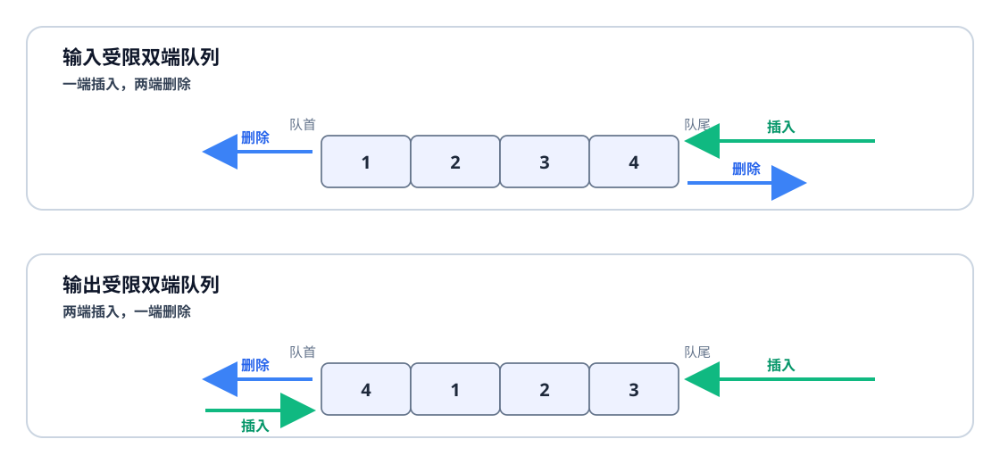

# 出栈序列
## 合法出栈序列的数量

给定 `n` 个不同元素按固定顺序进栈，每个元素都必须进栈一次、出栈一次，问可能得到多少种合法出栈序列。

### 模型分析

对一个含有 `n` 对 `push-pop` 的非空合法序列，最左边一定是一个 `push`。这个 `push` 会被后面某个唯一的 `pop` 匹配。若这一对 `push/pop` 内部包住了 `i` 对 `push-pop`，那么这一对结束后右侧就剩下 `n - 1 - i` 对 `push-pop`。（ `i` 与 `n-1-i` 都可以为 0 ，此时表示空序列）

即

$$
\text{push}\ (i\text{ pairs})\ \text{pop}\ (n-1-i\text{ pairs})
$$

也就是：

- 第一段 `i` 对 `push-pop` 是外层第一对 `push/pop` 里面包住的部分；
- 第二段 `n - 1 - i` 对 `push-pop` 是外层第一对结束后右侧剩下的部分；
- 两段都必须仍然是合法的同类序列。

即：一个规模为 `n` 的合法序列，被第一对匹配的 `push/pop` 切成一个规模为 `i` 的子问题和一个规模为 `n - 1 - i` 的子问题。

### 递推公式

设 $C_n$ 表示含有 `n` 对 `push/pop` 的合法序列数量。

空序列只有一种：

$$
C_0 = 1
$$

对 `n >= 1`，固定第一对匹配的 `push/pop` 内部含有 `i` 对操作，则序列形如：

$$
\text{push}\ (i\text{ pairs})\ \text{pop}\ (n-1-i\text{ pairs})
$$

内部的`i`对与外面的`n-1-i`对依然一定是合法的操作，满足对$C$的定义。

即左侧子序列有 $C_i$ 种选法，右侧有 $C_{n-1-i}$ 种选法。对这个固定的 `i`，共有$C_i C_{n-1-i}$种合法序列。

枚举 `i = 0, 1, ..., n - 1`，就得到：

$$
C_n = \sum_{i=0}^{n-1} C_i C_{n-1-i}
$$

## 判断具体出栈序列是否合法

实际判断时仍以模拟栈最直接：

1. 依次读取目标出栈元素；
2. 若它不在栈顶，就按输入次序继续进栈，直到它到达栈顶；
3. 弹出栈顶；若所有剩余输入都已进栈后仍无法让目标元素到达栈顶，则序列非法。

### 带位置约束的变体

沿着已经确定的出栈位置执行操作，记录：

- 栈内从底到顶有哪些元素；
- 下一个尚未进栈的元素是谁。

#### 已知一个位置，判断另一个位置可能是什么

在任一时刻，下一个出栈元素只有两类可能：

1. **当前栈顶**：可以直接出栈；
2. **某个尚未进栈的元素**：按输入次序继续进栈，直到该元素进栈，再立即将它弹出。

已经进栈但不在栈顶的元素不能成为下一个出栈元素，因为压在它上面的元素必须先弹出。

例如，输入序列为 `1,2,3,4`，已知第一个出栈元素是 `3`。为弹出 `3`，操作只能是：

```text
push 1 → push 2 → push 3 → pop 3
```

此时栈为 `[1,2]`，栈顶是 `2`，尚未进栈的元素只有 `4`。因此第二个出栈元素可以是：

- `2`：直接弹出当前栈顶；
- `4`：先将 `4` 进栈，再弹出 `4`。

`1` 不可能第二个出栈，因为 `2` 仍压在它上面。所以第二个出栈元素的可能值为：

$$
\{2,4\}
$$

如果题目约束的两个位置不相邻，就按同样的方法逐个位置向后推进。判断某个候选值是否可能时，只要能构造出一条到达该位置的合法操作过程，就说明它可能；若它在所有可能状态中都被其他元素压住，则不可能。无须补全并枚举所有出栈排列。

#### 已知第 $k$ 个出栈元素，计算合法序列数

输入为 `1,2,...,n` 时，元素 $m$ 是第 $m$ 个进栈的元素。因此：

> 第 $k$ 个出栈元素是 $m$，等价于第 $m$ 次 `push` 与第 $k$ 次 `pop` 匹配。

**先把“元素的位置”转化为一对指定的 `push-pop`，再用这对匹配操作拆分整个过程。** 
这对匹配的操作把整个过程分成三段：

```text
push m 以前 → push m → 二者之间 → pop m → pop m 以后
```

`push m` 与 `pop m` 之间是一个完整的合法 `push-pop` 序列。这正是[[#合法出栈序列的数量|前文已经讨论过的问题]]。

`push m` 前和 `pop m` 后不一定包含相同数量的 `push` 与 `pop`。但仍可以用递推计数。

设 $F(p,q)$ 表示由 $p$ 次 `push` 和 $q$ 次 `pop` 组成的合法操作序列数。

很显然，合法操作序列去掉最后一项依然是合法操作序列。最后一项若为 `push`，去掉它以后有 $F(p-1,q)$ 种；最后一项若为 `pop`，去掉它以后有 $F(p,q-1)$ 种。因此：

$$
F(p,q)=F(p-1,q)+F(p,q-1)\qquad(p\ge q)
$$

边界为：

$$
F(p,0)=1,\qquad F(p,q)=0\quad(q>p)
$$

特殊地，当 $p=q$ 时，$F(p,p)$ 就是[[#合法出栈序列的数量|合法出栈序列数]]。

现在设在 `push m` 以前已经发生了 $r$ 次 `pop`。三段的方案数有：

1. `push m` 以前共有 $m-1$ 次 `push`、$r$ 次 `pop`，有 $F(m-1,r)$ 种；
2. 在 `push m` 与 `pop m` 之间，还要发生 $k-1-r$ 次 `pop`。这些 `pop` 必须与同样多的 `push` 配对，即$k-1-r$个元素的合法出栈序列数；
3. `pop m` 以后还有 $n-k$ 次 `pop`，以及 $n-m-k+1+r$ 次尚未发生的 `push`。把这段操作倒过来，并交换 `push` 与 `pop`，就得到一个含 $n-k$ 次 `push`、$n-m-k+1+r$ 次 `pop` 的合法序列，因此有 $F(n-k,n-m-k+1+r)$ 种。

对每个可能的 $r$，将三段的数量相乘，再把结果相加即可。从 $r=0$ 开始尝试；若 `push m` 以前的 `pop` 比 `push` 还多，或者第②段需要的元素超过 $m$ 后面尚未输入的元素数量，就舍去该值。

例如，输入为 `1,2,3,4`，要求第二个出栈元素为 `3`，即 $n=4,k=2,m=3$。在 `push 3` 以前只可能已经发生 `0` 次或 `1` 次 `pop`。

当 $r=0$ 时：

$$
F(2,0)\times F(1,1)\times F(2,0)=1
$$

当 $r=1$ 时：

$$
F(2,1)\times F(0,0)\times F(2,1)=2\times1\times2=4
$$

其中 $F(2,1)=F(1,1)+F(2,0)=1+1=2$，直接由上面的递推得到。

所以合法出栈序列共有：

$$
1+4=5\text{ 种}
$$

## 知道输入序列和出栈序列求栈容量最小值

按目标出栈序列执行上面的模拟，并记录过程中栈内元素数量的最大值。这个最大值就是所需的最小栈容量。

原因是：为了让当前目标元素到达栈顶，在它之前尚未输入的元素都必须先入栈，这些占用无法省略；达到该最大值的容量又足以完成整次模拟。若模拟发现出栈序列本身非法，则不存在满足要求的栈容量。

# 使用 $k$ 个队列时的出队序列

设元素按固定次序输入，可以自由分配到 $k$ 个队列中，输出时每次从任一非空队列的队首取元素。

同一队列遵守先进先出，**因此分配到该队列的元素在总出队序列中必须保持原输入次序。** 反过来，只要能把目标出队序列划分成不超过 $k$ 个保持输入相对次序的子序列，就能把每个子序列放入一个队列，并按目标次序选择队首输出。

所以：

> [! conclusion] 多队列出队序列的判定
> 使用 $k$ 个队列能够得到某个目标序列，当且仅当该序列能划分为不超过 $k$ 个保持输入相对次序的子序列。

例如，输入为：

$$
1,2,3,4,5
$$

目标出队序列为：

$$
3,1,4,2,5
$$

可划分为两个递增子序列：

$$
(3,4,5),\qquad(1,2)
$$

分别放入两个队列后，依次从第一个、第二个、第一个、第二个、第一个队列取队首，就能得到目标序列。该排列的最长下降子序列长度为 $2$，所以一个队列不够，两个队列恰好足够。

# [[Deque#受限双端队列|受限双端队列]]的出队序列

受限双端队列只限制某一类操作发生在哪一端：

| 类型 | 插入 | 删除 |
| --- | --- | --- |
| 输入受限双端队列 | 只能从一端插入 | 可以从两端删除 |
| 输出受限双端队列 | 可以从两端插入 | 只能从一端删除 |



## 输入受限双端队列

约定元素按输入序列从队尾进入，出队时可以取队首或队尾。判断一个候选序列时，依次处理它的目标元素：

1. 若目标元素尚未输入，就继续从队尾插入，直到它进入队列。
2. 此时目标元素若在队首或队尾，就从对应端删除；若夹在队列中间，则候选序列非法。

例如输入 `1,2,3,4`，序列 `2,4,3,1` 合法：

```text
队尾插入 1,2 → 队尾删除 2
队尾插入 3,4 → 队尾删除 4 → 队尾删除 3 → 队首删除 1
```

而 `4,2,1,3` 非法：删除 `4` 后队列为 `[1,2,3]`，下一目标 `2` 位于中间，两端都无法删除它。

## 输出受限双端队列

约定元素可以从队首或队尾插入，但只能从队首删除。判断候选序列时，应根据目标出队次序安排每个新元素的插入端，并检查每次要输出的元素是否位于队首。

例如输入 `1,2,3,4`，序列 `4,1,2,3` 合法：先把 `1,2,3` 依次插入队尾，再把 `4` 插入队首，队列成为 `[4,1,2,3]`，随后从队首依次删除即可。

序列 `4,1,3,2` 非法。为了先输出 `4`，必须等 `4` 输入并把它放在队首；删除 `4` 后若要紧接着输出 `1`，`2`、`3` 只能排在 `1` 后面，队列只能是 `[1,2,3]`。删除 `1` 后，`3` 不在队首，无法先于 `2` 输出。
