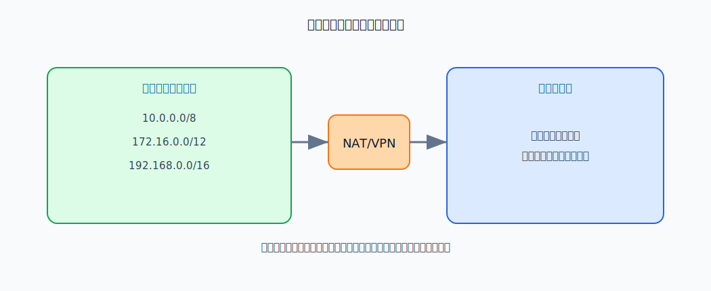
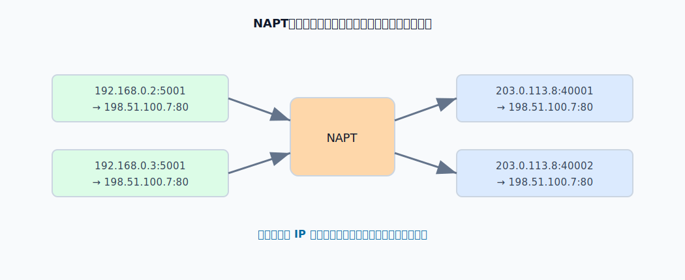
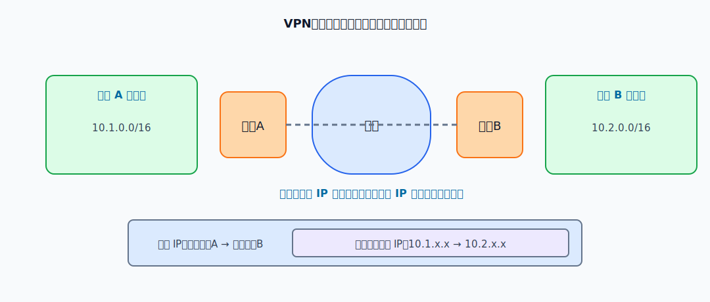

# 私有网络

私有网络使用专用 IPv4 地址。专用地址可以在不同机构内部重复使用，但它们只在机构内部有效，不能作为公网路由的目的地址。

常见专用地址块是：

| 专用地址块 | 范围 |
|---|---|
| `10.0.0.0/8` | `10.0.0.0` - `10.255.255.255` |
| `172.16.0.0/12` | `172.16.0.0` - `172.31.255.255` |
| `192.168.0.0/16` | `192.168.0.0` - `192.168.255.255` |

**公网路由器不会为这些专用地址建立全局路由**。内部主机要访问公网，通常需要 NAT 或代理；多个私有网络要跨公网互联，常用 VPN。

# NAT

NAT 的目的主要是缓解 IPv4 地址不足，并隐藏内部地址结构。NAT 路由器位于私有网络和公网之间，至少拥有一个全球唯一的公网 IPv4 地址。

[html-card height=620](../assets/nat-translation-slides.html)

基本 NAT 改写 IP 地址，并维护转换表。内网主机访问公网时，NAT 路由器把源私有地址改写成公网地址；公网响应回来时，再根据转换表把目的公网地址还原成内部私有地址。

这个改写后的公网地址来自 NAT 路由器在公网侧可使用的全球地址。它可能就是 NAT 路由器公网接口上的地址，也可能是 NAT 路由器管理的一组公网地址池中的某个地址。基本 NAT 只改写 IP 地址，因此一个公网地址在同一时刻通常只能区分一个内部主机的连接；如果 NAT 路由器有 $n$ 个公网地址，最多只能让 $n$ 台内部主机同时用这种方式访问公网。

NAT 的局限也来自这种改写：

- 内部主机默认不容易直接作为公网服务器被外部主动访问。
- 某些把 IP 地址或端口号写入应用层数据的协议，需要额外处理。
- 端到端连接语义被边界设备插入的转换状态改变。

# NAPT

NAPT 同时转换 IP 地址和运输层端口号。它让多台内部主机可以共享同一个公网地址。

NAPT 改写后的公网 IP 一般就是 NAT 路由器公网侧正在使用的地址；真正用来区分不同内部主机和不同连接的是端口号。也就是说，多个内部连接可以共用同一个公网 IP，但会被改写成不同的公网端口。

例如两个内部主机都访问同一个公网服务器的 80 端口：

- `192.168.0.2:5001` 可映射为 `203.0.113.8:40001`。
- `192.168.0.3:5001` 可映射为 `203.0.113.8:40002`。

响应报文回来时，NAPT 根据公网地址和端口号查表，分别还原到不同内部主机。

# VPN

VPN 的目标是在公共因特网上构造逻辑上的专用网络。两个站点可以继续使用私有地址通信，但穿过公网时，内部数据报会被加密并封装成外部 IP 数据报。

隧道封装可以理解成两层 IP 语义：

- 内层 IP 数据报：源和目的可以是私有地址，表示两个私有网络内部主机之间的通信。
- 外层 IP 数据报：源和目的是两个 VPN 网关的公网地址，用来把加密后的载荷送过公共因特网。

常见 VPN 形态包括：

- 内联网 VPN：同一机构不同站点之间互连。
- 外联网 VPN：机构与合作伙伴之间互连。
- 远程接入 VPN：移动用户或远程员工接入机构内部网络。
