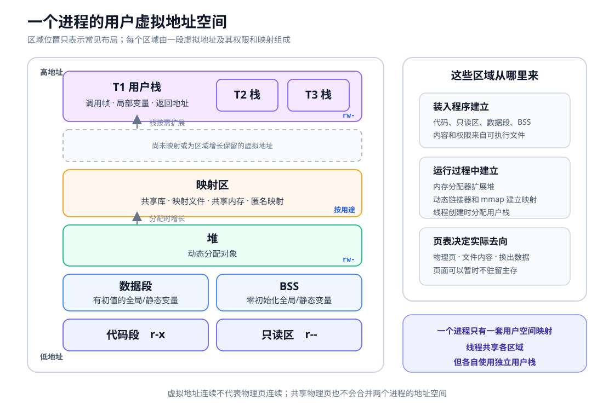

# 进程地址空间

一个进程的地址空间中可以同时有代码段、数据段、堆和栈。

从单线程变成多线程后，进程仍只有一份地址空间。代码、全局数据、堆和映射区不需要复制，只是在这份地址空间中又划出了 T2、T3 的用户栈。

# 地址空间结构

| 区域 | 存放内容 |
| --- | --- |
| 代码段 | 程序的机器指令 |
| 只读区 | 字符串常量和只读常量 |
| 数据段 | 已初始化的全局变量和静态变量 |
| BSS | 未显式初始化或初始化为零的全局变量和静态变量 |
| 堆 | 运行时动态分配的对象 |
| 映射区 | 共享库、内存映射文件和共享内存 |
| 用户栈 | 函数调用帧、局部变量和返回地址等 |

这只是常见划分，不是固定排布。打开文件本身也不在地址空间中：程序只保存文件描述符或句柄值，真正的打开文件对象由内核维护。

> [!question] 为什么叫虚拟地址空间
> 
> 程序发出的地址是**虚拟地址**。CPU 根据页表，把虚拟地址转换为物理地址。因此：
>- 两个进程可以使用相同的虚拟地址，但访问不同的物理页；
>- 一段连续虚拟地址对应的物理页不一定连续；
>- 两个进程也可以把各自的一段虚拟地址映射到同一物理页，从而实现共享内存。
>
> 地址空间不是一整块已经占满的主存。未映射的地址不能访问，已经映射的页面也可能尚未装入主存。

# 多线程的进程地址空间

| 同一进程内共享 | 每个线程独有 |
| --- | --- |
| 代码、只读数据、全局数据、BSS、堆、共享库和其他映射 | 线程 ID、程序计数器、通用寄存器、用户栈、线程局部存储 |

每个线程在共享地址空间中占用不同的栈区域。

程序计数器和通用寄存器不在地址空间中。线程运行时，它们位于 CPU 内；线程被切换出去后，内核或线程库保存其值，以便下次继续执行。

若线程是内核可调度实体，它通常还有一份位于受保护的内核空间的**内核栈**，供进入内核态后处理中断、异常和系统调用。

# 相关说明

- 同一进程内切换线程，通常不切换地址空间，只切换线程现场和栈。
- 切换到另一进程时，通常要切换地址空间映射，并恢复新的运行现场。
- `fork` 创建的子进程起初可以通过写时复制共享物理页，但父子进程仍拥有各自的虚拟地址空间。
- 共享内存不会合并两个进程的地址空间，只会让两段虚拟地址映射到同一组物理页。

相关概念见 [[Process]] 和 [[Thread]]。