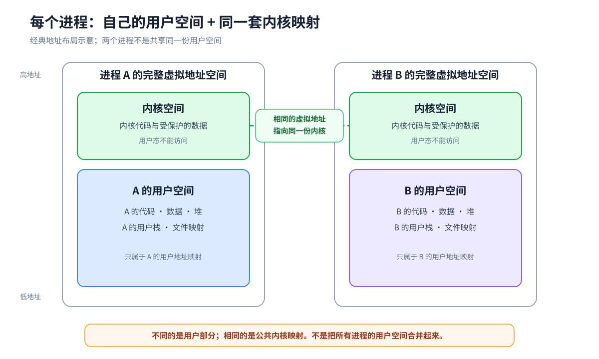

# 进程地址空间

程序运行时会不断产生地址：取下一条指令需要地址，读取变量需要地址，访问数组、对象和函数栈也需要地址。

这些地址不是物理内存条上的实际位置，而是**虚拟地址**。CPU 执行某个进程时，会按照一套地址对应关系解释这些虚拟地址。把这套虚拟地址和对应关系合起来看，就是虚拟地址空间。

按照访问权限，这套地址空间可以分成用户空间和内核空间。

# 用户空间

用户空间是普通程序可以访问的那部分虚拟地址。进程的代码、全局变量、堆、用户栈和文件映射都放在这里。

每个进程都有自己的用户空间。进程 A 和进程 B 都可以访问虚拟地址 0x400000，但这个地址在 A 中可能指向 A 的代码，在 B 中则指向 B 的代码。

所以，虚拟地址更像进程内部使用的门牌号：门牌号相同，不代表背后是同一个房间。

地址怎样对应到物理内存，主要记录在页表中。CPU 访问一个虚拟地址时，硬件会根据当前进程的页表找到物理内存，并检查这次读取、写入或执行是否被允许。

地址空间并不等于已经占用的物理内存。一段虚拟地址可以暂时没有对应的物理页，等到第一次访问时再分配或从文件中读入。

## 用户空间组成

| 区域 | 主要内容 |
| --- | --- |
| 代码段 | 程序的机器指令，通常只读并允许执行 |
| 只读区 | 字符串常量和其他只读数据 |
| 数据段 | 已初始化的全局变量和静态变量 |
| BSS | 未显式初始化或初值为零的全局变量和静态变量 |
| 堆 | 程序运行时动态分配的对象 |
| 映射区 | 共享库、映射文件、共享内存等内容 |
| 用户栈 | 函数调用帧、局部变量、参数和返回地址 |

这些区域的位置不是固定的。操作系统、处理器体系结构和地址随机化都会改变实际布局。它们怎样建立和变化，见 [[Memory-Management-Overview]]。

## 同一进程中的线程共享用户空间

同一进程中的线程都能访问相同的代码、全局数据、堆、共享库和文件映射。

每个线程仍然有自己的程序执行位置、寄存器状态和用户栈。用户栈位于共享的用户空间中，但为每个线程分别划出一块区域。

因此，同一进程内切换线程时，通常不需要更换用户空间；切换到另一个进程时，才需要换成另一个进程的用户地址映射。

# 内核空间

内核空间是只允许内核态代码访问的虚拟地址区域。这里放置内核代码、设备驱动以及进程管理、内存管理、文件管理所需的数据。

用户态代码不能直接读取或修改内核空间。进程发起系统调用后，CPU 会进入内核态，并在该进程的上下文中执行相应的内核代码。

每个进程所使用的完整虚拟地址空间都分成用户部分和内核部分。虽然用户部分因进程而不同，**但内核部分通常映射到同一套内核代码和数据**。

## 内核空间组成

- PCB、打开的文件对象等由内核管理。
- 页表由内核建立和保护，用户程序不能直接修改。
- CPU 寄存器虽然不是地址空间中的一块内存，但任务切换时，内核会保存和恢复它们。
