# 进程同步与进程互斥

并发进程有异步性：各进程以各自独立、不可预知的速度推进。异步本身不是错误，但如果进程之间存在共享数据、共享设备或先后依赖，操作系统就要提供同步互斥机制。

**同步**解决先后顺序问题。**互斥**保证不能同时访问的资源访问不出问题。



| 概念 | 关注点 | 典型问题 | 制约关系 |
| --- | --- | --- | --- |
| 进程同步 | 进程之间的执行先后 | B 必须等 A 产生数据后才能继续处理 | 直接制约 |
| 进程互斥 | 同一资源不能同时访问 | A 使用打印机时，B 不能同时使用同一打印机 | 间接制约 |

同步的关键是“某个动作必须发生在另一个动作之后”。例如进程 A 先对缓冲区数据预处理并写回，进程 B 再读取处理后的数据。若 B 提前读取，就会得到旧数据或未处理数据。

互斥的关键是“同一时刻最多一个进入”。例如打印机、摄像头、某些共享变量、内存缓冲区，都可能在一个时间段内只允许一个进程使用。

# 临界资源与临界区

**临界资源**是一个时间段内只允许一个进程使用的资源。它可以是物理设备，也可以是共享变量、共享数据结构或缓冲区。

**临界区**是进程中访问临界资源的那段代码，也称临界段。

一次互斥访问在逻辑上分为四段：

```text
Pi 进程：
entry section;
{                    // 进入区
	critical section; // 临界区
}    
exit section;        // 退出区
remainder section;   // 剩余区
```

| 部分 | 作用 |
| --- | --- |
| 进入区 | 检查是否可以进入临界区；若可以进入，设置正在访问临界资源的标志 |
| 临界区 | 真正访问临界资源的代码 |
| 退出区 | 清除访问标志，释放临界资源 |
| 剩余区 | 不访问该临界资源的其他代码 |
> [!WARNING]
> 进入区、退出区不是临界区的一部分。它们是为了实现互斥而设置的控制代码；临界区才是真正访问临界资源的代码。

# 互斥原则

| 原则 | 含义 | 违反后的问题 |
| --- | --- | --- |
| 空闲让进 | 临界区空闲时，请求进入的进程应能立即进入 | 资源空着却没人能用 |
| 忙则等待 | 已有进程在临界区时，其他进程必须等待 | 多个进程同时访问临界资源 |
| 有限等待 | 请求进入临界区的进程应在有限时间内进入 | 进程可能饥饿 |
| 让权等待 | 不能进入临界区时，应释放处理机 | 忙等浪费 CPU |

后面分析各种互斥算法时，核心就是看它们是否满足这四条原则。比如，有的算法能保证忙则等待，但做不到让权等待；有的算法因为检查和上锁不能一气呵成，会破坏忙则等待。

# 普通临界区与内核临界区


> [!important] “进程处于临界区时不能调度”这个说法不准确。
> **普通临界区不等于禁止调度；内核程序临界区才是不能调度与切换的典型场景。**


| 类型 | 访问对象 | 是否能进行进程调度 | 原因 |
| --- | --- | --- | --- |
| 普通临界区 | 普通临界资源，如打印机、摄像头、用户共享缓冲区 | 可以 | 这些资源通常不直接影响操作系统内核的调度数据结构 |
| 内核程序临界区 | 内核数据结构，如就绪队列、PCB 队列 | 通常不能 | 调度程序本身可能也要访问这些内核数据结构 |

普通临界区中可以发生调度。比如进程正在等待打印机完成，如果一直不允许调度，CPU 可能长期空闲。

内核程序临界区通常不能随便调度。比如内核代码正在修改就绪队列，还没解锁就切换到调度程序，而调度程序也需要访问就绪队列，就会影响内核管理工作的正确性。因此内核临界区应尽快执行完，再允许调度。
