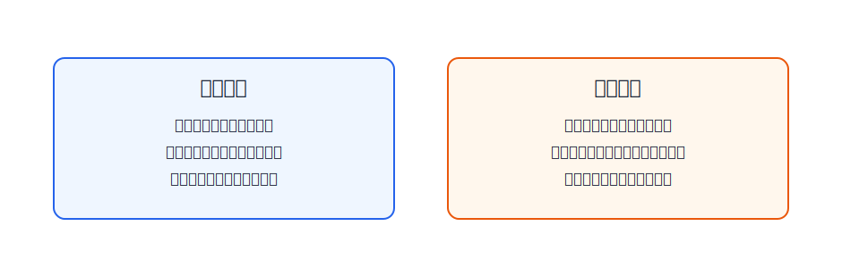
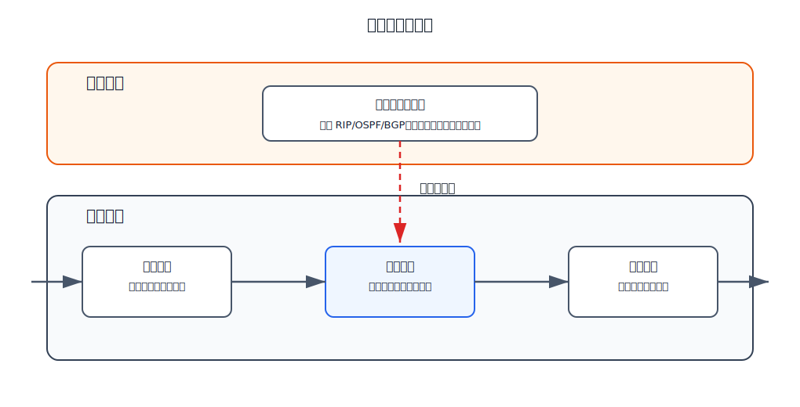

# 路由器

路由器是网络层互联设备。它连接多个网络，根据 IP 数据报的目的地址和转发表，把分组从一个接口转发到另一个接口。

路由器的两项核心功能是：

- **分组转发**：对每个到来的分组查表并转发，这是高速、逐分组的动作。
- **路由选择**：运行路由协议，交换路由信息，计算路由表，这是控制和维护路径的动作。

这两件事分别对应数据层面和控制层面。

# 典型结构

典型路由器由输入端口、交换结构、输出端口和路由选择处理机组成。

| 部件 | 主要作用 |
|---|---|
| 输入端口 | 接收信号，完成物理层和数据链路层处理，并进行查表相关处理 |
| 交换结构 | 把分组从输入端口转移到选定输出端口 |
| 输出端口 | 对要发送的分组排队，重新封装成链路层帧并发送 |
| 路由选择处理机 | 运行路由协议，生成路由表，并向数据层面提供转发表 |

路由器不是简单地把输入线和输出线接起来。它必须先理解收到的帧中承载的 IP 数据报，再根据网络层信息决定下一步。

# 输入端口

信号从输入端口进入路由器后，先经过物理层和数据链路层处理：

1. 物理层把线路上的信号还原成比特流。
2. 数据链路层从比特流中识别帧。
3. 数据链路层检查帧并去掉帧首部和帧尾部。
4. IP 数据报交给网络层处理。

交给网络层后分两种情况：

- 若是普通待转发数据分组，路由器查转发表，决定输出接口或下一跳。
- 若是路由选择协议分组，可能交给路由选择处理机，用于更新路由信息。

普通数据分组走数据层面；路由协议分组会影响控制层面。

# 交换结构

交换结构负责把分组从输入端口移动到输出端口。它解决的是路由器内部“从哪个入口搬到哪个出口”的问题。

可以把它和路由选择区分开：

- 路由选择决定路径和转发表。
- 查表决定这个分组应去哪个输出端口。
- 交换结构执行内部转移。

若多个输入端口同时要把分组送到同一个输出端口，就可能产生排队。

# 输出端口

输出端口负责把分组真正发到下一条链路上。它通常要做这些事：

1. 对等待发送的分组排队。
2. 根据下一跳链路重新封装数据链路层帧。
3. 通过物理层把比特流发送出去。

这里容易混淆的是：路由器转发 IP 数据报时，IP 首部中的源 IP 和目的 IP 通常不变；但每经过一跳，链路层帧的源 MAC 和目的 MAC 都要重新填写。

# 普通分组处理过程

[html-card height=570](../assets/router-packet-processing-slides.html)

普通 IP 数据报进入路由器后的过程可以压缩成一条线：

$$
\text{输入端口接收}
\rightarrow
\text{解帧得到 IP 数据报}
\rightarrow
\text{查转发表}
\rightarrow
\text{交换到输出端口}
\rightarrow
\text{重新成帧发送}
$$

若查表失败，路由器通常丢弃该数据报，并可能发送 ICMP 差错报告。若 TTL 减到 0，也会丢弃并触发时间超过类 ICMP 报文。

# 控制层面和数据层面

路由器内部必须区分两个层面：

| 层面 | 处理对象 | 典型动作 | 时间尺度 |
|---|---|---|---|
| 数据层面 | 一个个到来的普通分组 | 查转发表、转发、排队、丢弃 | 很快，逐分组发生 |
| 控制层面 | 拓扑、链路状态、路由信息 | 运行 RIP/OSPF/BGP，生成路由表 | 较慢，在拓扑或策略变化时更新 |

数据层面依赖控制层面提供的转发表；控制层面不直接处理每一个普通数据分组。

# 排队和拥塞

路由器有输入排队和输出排队。

- **输入排队**：输入端口的分组等待查表或等待交换结构转移。
- **输出排队**：多个输入端口同时送往同一输出端口时，分组在输出端口排队等待发送。

排队会增加排队时延。队列满时，路由器只能丢弃分组。网络层拥塞问题正是从路由器队列、链路容量和输入流量之间的不匹配产生的。
