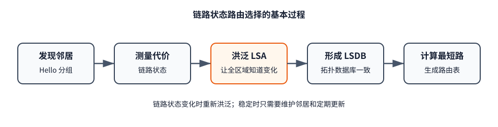
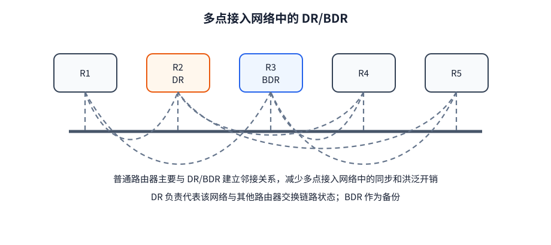
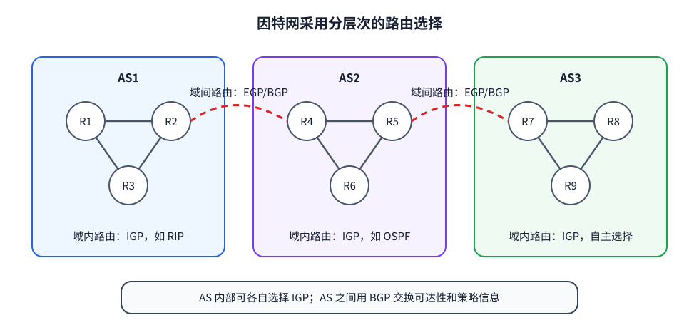

# 路由选择

网络层处理跨网络传输时，要先决定路径，再按路径逐跳转发：

- **路由选择**决定到各目的网络应走哪条路，形成路由表。
- **分组转发**根据转发表查找下一跳和输出接口，把收到的分组送出去。

路由表保存目的网络、下一跳、路径代价等路由信息；转发表通常由路由表派生，并针对高速查找进行组织。教材讨论路由选择时有时把二者统称为“路由表”，但二者承担的工作不同。

**路由选择算法**规定怎样根据已有信息计算路径；**路由选择协议**规定路由器之间交换什么信息、何时交换，以及怎样维护这些信息。协议提供算法所需的输入，算法算出路由，再写入路由表。因此，RIP 与距离向量、OSPF 与链路状态、BGP 与路径向量应当结合起来理解。

## 静态路由和动态路由

| 类型 | 路由从哪里来 | 适用情况 | 局限 |
|---|---|---|---|
| 静态路由 | 管理员手工配置网络路由、默认路由或主机路由 | 规模小、结构稳定或需要严格控制的网络 | 拓扑改变后不能自动调整 |
| 动态路由 | 路由器运行路由协议，自动交换信息并重新计算 | 规模较大、链路或策略可能变化的网络 | 需要通信、计算和维护开销 |

# RIP（路由信息协议）与距离向量算法

“距离向量”中的**距离**，是本路由器到某一个目的网络的代价；**向量**，是把到所有目的网络的距离放在一起形成的一组值。假设路由器 D 到 `N1、N2、N3` 的距离依次为 `1、2、5`，它的距离向量就可以写成 $(1,2,5)$，三个位置分别对应三个目的网络。

RIP（Routing Information Protocol）采用距离向量算法，只与相邻路由器交换自己的距离向量。RIP 把距离定义为**跳数**：直连网络的距离为 1，每多经过一个路由器就加 1；15 是最大有效距离，16 表示不可达。RIP 优先选择跳数较小的路由；到同一目的网络存在多条等价路由时，实现可以保留它们进行负载分担。

## 路由怎样逐跳传播

每个 RIP 路由器的表项至少包含三个关键字段：目的网络、距离和下一跳。例如“到 `N2` 的距离为 5，下一跳为 C”表示：发往 `N2` 的分组先交给相邻路由器 C，并不是说 C 就是目的地。

路由器刚启动时只知道直连网络。随后，它周期性地把自己的距离表发给邻居。假设 D 收到邻居 C 的通告，C 声称自己到某目的网络的距离为 $d$，那么 D 得到的候选路由是：

$$
\text{D 经 C 到该网络的距离}=1+d
$$

D 先把通告中的每个距离加 1，并把相应候选路由的下一跳写成 C，然后逐项处理：

1. D 原来没有该目的网络：加入这条新路由。
2. D 原来的下一跳就是 C：用 C 最新通告的距离更新原表项。即使距离变大也要更新，因为这仍是同一条路径的最新状态。
3. D 原来经另一个邻居到达该网络：C 提供的是一条备选路径。只有它更短时，D 才改走 C；否则保留原路由。

[html-card height=420](../assets/rip-update-process-slides.html)

一台路由器学到新路由后，又会把结果通告给自己的邻居。因此，直连网络的信息先传播一跳，再传播到更远处；经过若干轮交换，各路由器的路由表逐渐稳定。距离向量算法不要求任何一台路由器掌握完整拓扑，这使它简单，但也埋下了坏消息传得慢的环路问题。

## 坏消息传得慢

当一条路径变短时，较小的距离会很快向外传播。

但路径失效时，邻居可能仍保留旧表项，并把失效前的有限距离通告回来。路由器只看见邻居声称的距离，看不出这条路实际上又绕回了自己，于是相互把对方当作下一跳，距离越报越大，形成**距离无穷计数**。

环路不一定只涉及两个路由器。例如 A、C 原来都经 B 到达网络 D，A 与 C 也是邻居。当 B 到 D 的链路失效时，可能出现这样的传播次序：

1. B 的“D 不可达”先到达 A，A 删除经 B 的路由。
2. C 尚未收到坏消息，仍向 A 通告自己可以到达 D。A 不知道 C 的旧路径其实也经过 B，于是改为经 C 到 D。
3. C 随后从 B 得知 D 不可达，却又可能从 A 收到有限距离，于是改为经 A 到 D。
4. A 与 C 的下一跳互相指向对方，通告的距离逐步增加，直到 RIP 把距离增至 16。

这仍是同一个根本问题：**距离向量只携带距离，没有携带完整路径，所以路由器无法判断邻居的路径是否包含自己或已经失效的链路。**

[html-card height=570](../assets/rip-count-to-infinity-slides.html)

RIP 用下列办法限制这种问题：

- 把 16 定义为不可达，使距离不会无限增长。
- 路由变化时发送触发更新，不必只等下一次周期更新。
- 使用水平分割：从某接口学到的路由，不再从同一接口原样通告回去。

这些办法能缩短或阻断一部分错误传播，但不能改变距离向量算法只看到邻居通告、看不到完整路径的特点。

RIPv2 支持 VLSM/CIDR、认证和多播。RIP 报文封装在 UDP 中，使用 520 端口。它实现简单、开销较小，适合小型网络；15 跳的上限和较慢的故障收敛使它不适合大型 AS。

# OSPF（开放最短路径优先）与链路状态算法

**链路**是一台路由器与邻居路由器或直连网络之间的连接，**状态**包括这条连接是否可用以及链路代价。例如，R1 可以通告“连接 R2，代价为 2；连接网络 N1，代价为 1”。

OSPF（Open Shortest Path First）采用链路状态算法。每台路由器把自己的链路状态写入**链路状态通告**（LSA），并扩散到整个区域。LSA 还标明发布者，并用序号、老化时间等信息帮助路由器判断新旧。区域内路由器把所有路由器发布的局部连接拼在一起，形成**链路状态数据库**（LSDB），由此还原该区域的拓扑。

数据库相同不等于路由表相同。每台路由器都以自己为起点运行最短路径优先算法，得到自己的最短路径树，再由此生成下一跳和路由表。

## 从发现邻居到算出路由

一台路由器不能直接采用邻居的路由表，因为双方必须先确认彼此是邻居，再判断各自的 LSDB 缺少或落后了哪些 LSA，最后把这些记录补齐。OSPF 用下面的分组依次完成这条同步过程：

1. **发现邻居**：相邻路由器周期性发送 **Hello 分组**，确认谁在同一条链路上，并维护邻居关系。
2. **比较目录**：需要建立完整邻接关系的路由器先交换 **Database Description 分组** 。它携带本机 LSDB 中各 LSA 的摘要，而不是整份拓扑数据。
3. **索取缺项**：路由器根据摘要发现自己缺少某份 LSA，或本地版本较旧，就发送 **Link State Request** ，明确请求这些 LSA。
4. **发送详情**：对方把被请求的完整 LSA 装入 Link State Update（LSU）分组发回。**LSU 是承载一条或多条 LSA 的协议分组。**
5. **可靠确认并继续扩散**：接收方安装较新的 LSA，发送 **Link State Acknowledgement** ，并把新 LSA 继续洪泛给其他邻接路由器。
6. **计算路由**：区域内 LSDB 收敛后，每台路由器以自己为根运行最短路径算法，形成路由表。
7. **响应变化**：链路建立、失效或代价改变时，相关路由器生成较新的 LSA；它经可靠洪泛传播后，各路由器更新 LSDB 并重新计算受影响的路由。

[html-card height=570](../assets/ospf-lsdb-sync-slides.html)

例如，R1 的 Database Description 表明它保存着“R3 发布的第 12 版 LSA”，而 R2 只有第 10 版。R2 据此知道自己的记录过期，便用 Link State Request 请求 R3 的这份 LSA；R1 再用 Link State Update 发来第 12 版完整内容；R2 安装后用 Link State Acknowledgement 确认。Database Description 只用于找出差异，真正改变 LSDB 的是随后送达的完整 LSA。

## DR、BDR 与区域

在以太网等多路访问网络中，如果每台 OSPF 路由器都与其他路由器建立完整邻接并相互同步，邻接数量会随路由器数量迅速增加。OSPF 因此选举**指定路由器**（DR）和**备用指定路由器**（BDR）：普通路由器主要同 DR、BDR 建立完整邻接，由 DR 负责在该网段集中交换和扩散链路状态；DR 失效时由 BDR 接替。

大型 AS 还可以划分为多个区域。LSA 主要在本区域内洪泛，减少通信量和 LSDB 规模；骨干区域 `Area 0` 连接其他区域，区域边界路由器负责传递区域间路由信息。

OSPF 直接封装在 IP 中，IP 协议号为 89。与 RIP 相比，它能利用链路代价选择路径，拓扑变化通常收敛更快，但洪泛、数据库同步和最短路径计算也带来更高的实现与资源开销。

# 自治系统与分层路由

因特网不由一个机构统一管理，也不能让每台路由器维护全球完整拓扑。实际网络被划分为许多**自治系统**（Autonomous System，AS）：一个 AS 由同一管理机构控制，并在内部采用统一的路由策略。

- 在一个 AS 内部选路，使用**内部网关协议**（IGP），例如 RIP、OSPF。
- 在不同 AS 之间通告和选择路径，使用**外部网关协议**（EGP），目前的核心协议是 BGP。

IGP、EGP 是协议类别，不是某两个具体协议。“网关”是早期术语，在这里可以理解为路由器。这样的分层使路由选择既是分布式的，又能分别处理域内性能和域间策略。

# BGP（边界网关协议）与路径向量算法

RIP 和 OSPF 解决一个 AS 内部怎样选路；BGP（Border Gateway Protocol）解决不同 AS 之间怎样通告可达网络并执行路由策略。

## 路径向量

“路径向量”中的**路径**是到达某个目的网络所经过的有序 AS 序列；**向量**是到不同目的网络的这些路径记录的集合。距离向量为每个目的网络保存一个距离值，路径向量则为每个目的网络保存一条 AS 路径。例如 AS3 发布前缀 `203.0.113.0/24` 时，路径为 `AS3`；AS2 向外继续通告时，路径变成 `AS2 AS3`。BGP 通常只发送新增或发生变化的路径记录，不必每次发送整个集合。

BGP 对等体之间交换的内容称为**网络可达性信息**（network reachability information）。它表示：
1. 哪些目的网络可以经由这个对等体到达；
2. 通往这些目的网络的路径具有什么属性。

在 UPDATE 报文中，一条完整的 BGP 路由由两部分配成：

| 部分 | 回答的问题 | 内容 |
|---|---|---|
| **网络层可达信息**（NLRI） | 到哪里 | 一个或多个目的 IP 前缀，例如 `203.0.113.0/24` |
| **路径属性** | 怎样到达 | 到达这些前缀所需的路径信息和选路依据 |

NLRI 只表示目的前缀，并不包含 AS 路径。`AS-PATH`、`NEXT-HOP` 等属于路径属性：`AS-PATH` 记录通告已经经过的 AS 序列，`NEXT-HOP` 指明发往这些前缀时使用的下一跳；本地偏好则表示本 AS 对不同出口路由的偏好。

因此，一个 BGP 通告表达的是：“这些目的前缀可以沿带有这些属性的路径到达。”接收方得到的不是对方 AS 内部的完整拓扑，而是若干条到同一目的前缀的候选路由，再从中选择本地愿意采用的一条。

## BGP 的路由选择规则

域间没有统一的链路代价，而且运营商还要考虑客户、提供商、对等互联和访问策略，因此 BGP 选择的是**符合本地策略的可用路径**，而不是全网代价最小的路径。

若有两条或多条，则按以下优先级逐级筛选：

1. **本地偏好最高**：本地偏好由本 AS 的管理员按照路由策略设置，用来表示本 AS 更愿意从哪个出口离开，默认值通常为 100。它的优先级最高，因此策略上更受偏好的路由即使经过更多 AS，也可以胜出。
2. **AS 跳数最少**：若本地偏好相同，比较 `AS-PATH`，保留经过 AS 数量较少的路由。这里比较的是 AS 跳数，不是沿途路由器的数量。
3. **到 `NEXT-HOP` 的 AS 内部开销最小（热土豆路由选择）**：若 `AS-PATH` 长度仍相同，选择本 AS 内部距离较近的出口，尽快把分组交给下一个 AS。这里的距离由本 AS 使用的 IGP 计算，只表示从当前路由器到出口的代价，因此并不保证选出的路由在全网范围内最短。
4. **BGP 标识符最小**：若以上条件都相同，选择由 BGP 标识符数值较小的路由器通告的路由，作为最后的判定规则。

只有当前一级无法区分时，才比较下一级；一旦某一级只剩一条路由，选择立即结束。

## 一条 BGP 路由怎样传播

1. **建立会话**：两个 BGP 对等体先建立 TCP 连接，端口为 179。随后交换 OPEN 报文，协商成功后用 KEEPALIVE 确认会话建立。
2. **通告前缀**：某 AS 的 BGP 发言人用 UPDATE 报文通告一个可达前缀。UPDATE 同时携带该前缀的路径属性；这就是路径向量算法的输入。
3. **逐 AS 传播**：向另一个 AS 转发通告时，BGP 发言人把自己的 AS 号加到 AS_PATH 前端。例如 AS3 发出的路径为 `AS3`，经 AS2 再向外通告时变成 `AS2 AS3`。
4. **检查环路**：接收方若在 AS_PATH 中看见自己的 AS 号，就拒绝该路由。完整的 AS 序列使 BGP 能直接识别 AS 级环路，而不是等待距离不断增大。
5. **按策略选路**：接收方先按导入策略决定哪些路由可以使用，再按照[[#BGP 的路由选择规则|上述优先级]]从到同一前缀的候选路由中选出一条。选中的路由写入本地路由表，并按导出策略决定是否继续通告。
6. **在 AS 内传递**：不同 AS 之间的会话称为 eBGP；同一 AS 内的 BGP 发言人可通过 iBGP 传递外部路由。BGP 决定采用哪个 NEXT_HOP，AS 内的 IGP 则负责找到通往该下一跳的具体域内路径。
7. **维护和撤销**：会话正常时用 KEEPALIVE 维持存活；路径改变时通常只发送增量 UPDATE，失效前缀也在 UPDATE 中撤销。检测到协议差错时发送 NOTIFICATION，并关闭会话。

[html-card height=570](../assets/bgp-path-vector-slides.html)

BGP-4 基本协议中的四种报文由此各有明确位置：OPEN 建立 BGP 会话，UPDATE 通告或撤销路由，KEEPALIVE 维持会话，NOTIFICATION 报错并结束会话。初次交换时路由信息较多，之后主要发送增量变化。

# 三类算法与协议的对应关系

| 比较点 | RIP / 距离向量 | OSPF / 链路状态 | BGP / 路径向量 |
|---|---|---|---|
| 使用范围 | AS 内部 | AS 内部 | AS 之间，iBGP 也用于 AS 内传递外部路由 |
| 交换的信息 | 目的网络及距离 | 本路由器的链路状态 | 目的前缀及完整路径属性 |
| 路由器知道什么 | 邻居宣告的距离和下一跳 | 区域内完整拓扑 | 若干条可用 AS 路径，不掌握全球物理拓扑 |
| 怎样选路 | 邻居距离加 1，选择跳数较小者 | 建立 LSDB 后计算最短路径树 | 依次比较本地偏好、AS 跳数、到 `NEXT-HOP` 的内部开销和 BGP 标识符 |
| 怎样避免或限制环路 | 水平分割、触发更新、16 跳上限等缓解 | 序号、老化和一致拓扑基础上的计算 | AS_PATH 中出现自身 AS 时拒绝 |
| 变化怎样传播 | 邻居间逐跳更新 | LSA 在区域内可靠洪泛 | 对等体之间发送增量 UPDATE |
| 报文承载 | UDP 520 | 直接封装在 IP 中，协议号 89 | TCP 179 |
