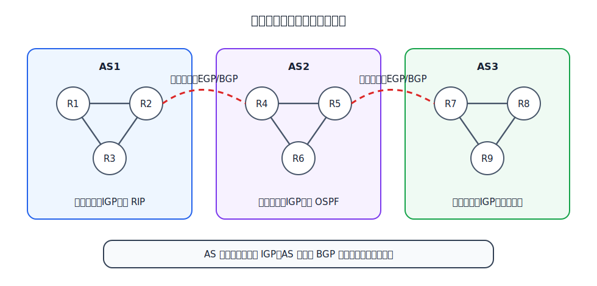
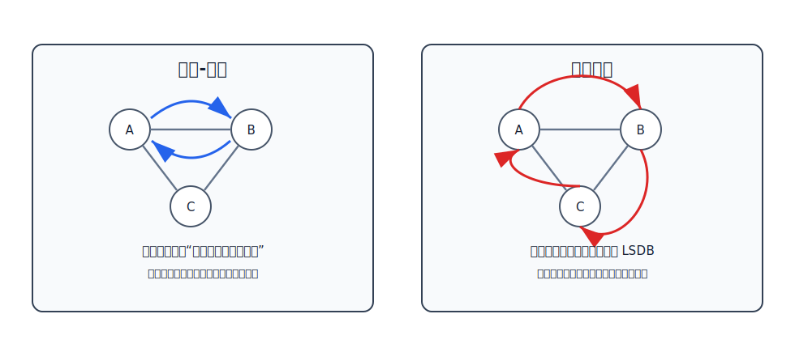

# 路由选择

网络层的核心工作可以分成两件事：

- **分组转发**：路由器收到一个分组后，按分组首部和转发表，把它从合适的接口送出去。
- **路由选择**：路由器通过算法或协议决定到各目的网络应走哪条路径，并据此形成路由表。

路由选择生成的是**路由表**，它关心目的网络、下一跳和路径代价；转发表通常由路由表派生而来，结构更适合高速查找。讨论算法时常把二者都称为路由表，但真正转发时用的是面向查找优化的转发表。

# 静态路由和动态路由

路由选择按配置方式可分为静态路由和动态路由。

| 类型 | 做法 | 优点 | 局限 |
|---|---|---|---|
| 静态路由 | 人工配置网络路由、默认路由、特定主机路由等条目 | 简单，开销小，可控性强 | 拓扑变化后不能自动适应 |
| 动态路由 | 路由器通过路由选择协议自动交换和更新路由信息 | 能适应网络变化，适合大规模网络 | 协议复杂，有通信和计算开销 |

小型、稳定、边界清晰的网络常用静态路由。大规模网络会使用动态路由，因为拓扑、链路状态和策略都可能变化，靠人工维护不现实。

# 因特网为什么要分层路由

因特网规模太大，不可能让每台路由器都知道整个因特网的完整拓扑。实际做法是把因特网划分为许多**自治系统** AS。一个 AS 通常由同一管理机构控制，例如一个 ISP 或大型机构网络。

分层路由把问题拆成两层：

- **域内路由选择**：在一个 AS 内部选择路径，使用内部网关协议 IGP。
- **域间路由选择**：在不同 AS 之间选择可达路径，使用外部网关协议 EGP，典型协议是 BGP。

IGP 和 EGP 是协议类别，不是某个具体协议。RIP、OSPF 属于 IGP；BGP 属于 EGP。早期文档使用“网关”一词，现代语境中可理解为路由器。

因特网路由选择的基本特点是：

- **自适应**：能随网络状态变化而更新路由。
- **分布式**：没有一个中心路由器掌握并计算全网所有路径。
- **分层次**：AS 内部和 AS 之间使用不同类别的路由协议。

# 距离-向量算法

距离-向量算法的基本思想是：每个路由器维护一张到各目的网络的距离表，并周期性地把自己的距离向量发给相邻路由器。

这类算法关心的是“从我这里到某个目的网络还要多远、下一跳是谁”。它不要求路由器掌握完整拓扑，只要求路由器不断接收邻居的距离表，再把邻居给出的距离换算成本路由器自己的候选路由。[[Routing-Protocols#RIP|RIP]] 就是典型的距离-向量协议：RIP 用跳数作为距离，和相邻路由器周期性交换路由信息。

距离-向量表至少要能表达三类信息：

| 信息 | 含义 |
|---|---|
| 目的网络 | 这条路由要到哪个网络 |
| 距离 | 从本路由器到目的网络的代价 |
| 下一跳 | 分组下一步应交给哪个相邻路由器 |

例如，某路由器的条目写成“到网络 `N2`，距离为 5，下一跳为 C”，含义不是“目的主机是 C”，而是“要到 `N2`，先把分组交给相邻路由器 C”。

一个路由器从邻居收到距离向量后，用下面的规则计算候选路径：

$$
\text{经邻居到目的网络的距离}
=
\text{到该邻居的代价}
+
\text{邻居宣告的距离}
$$

[html-card height=590](../assets/distance-vector-update-slides.html)

距离-向量算法只依赖邻居给出的信息。路由器不需要知道完整拓扑，只要不断和邻居交换信息，就能逐步得到到各目的网络的较短路径。

这个“逐步”很关键。刚启动时，路由器通常只知道直连网络；经过多轮邻居交换后，到更远网络的路由才会逐渐传播开来。若网络拓扑发生变化，变化也要通过相邻路由器一跳一跳扩散。

更新路由表时常见几种情况：

| 情况 | 处理 |
|---|---|
| 目的网络原来不存在 | 添加新路由条目 |
| 新路径下一跳与旧路径相同 | 无论距离变大还是变小，都更新，因为这是同一路径的最新消息 |
| 新路径下一跳不同且距离更短 | 改用新下一跳 |
| 新路径下一跳不同但距离不更短 | 保持原条目 |

距离-向量算法的优点是简单、开销较小；问题是每台路由器只知道邻居宣告的距离，不知道完整路径，因此难以及时判断某条路径是否已经形成环路。

## 好消息传得快，坏消息传得慢

距离-向量算法中，“好消息”传播通常很快：如果某路由器发现到某网络的更短路径，邻居很快就能根据更小的距离更新。

“坏消息”传播可能很慢。若某网络不可达，邻居可能仍拿旧信息反向告诉故障路由器，双方相互误导，距离逐步增加，形成**距离无穷计数**。

[html-card height=620](../assets/rip-count-to-infinity-slides.html)

缓解方法包括：

- 设置最大距离，达到该距离就视为不可达。
- 路由表发生变化时立即触发更新，而不只等待周期性更新。
- 水平分割：从某接口学到的路由信息，不再从同一接口反向发回去。

这些方法只能减轻问题，不能从根本上消除。根本原因是距离-向量算法缺少完整路径信息。

# 链路状态算法

链路状态算法的基本思想与距离-向量算法不同：每台路由器不仅和邻居交换距离，而是把自己的链路状态信息扩散出去，使同一区域内的路由器都能形成一致的拓扑数据库。

这类算法关心的是“网络拓扑长什么样”。路由器先描述自己周围的链路，再把这些链路状态通告扩散给同一区域内的其他路由器。每台路由器拿到足够的链路状态后，都能构造出同一份拓扑视图，再从自己的位置出发计算最短路径。[[Routing-Protocols#OSPF|OSPF]] 就是典型的链路状态协议。

链路状态里的“状态”通常包含：

| 信息 | 含义 |
|---|---|
| 邻居是谁 | 本路由器直接连接到哪些路由器或网络 |
| 链路代价 | 经过这条链路的代价，可由带宽、管理配置等因素决定 |
| 通告来源 | 哪台路由器发布了这份链路状态 |
| 序号或新旧信息 | 帮助路由器判断哪份通告更新 |

链路状态算法通常经过这些步骤：

1. 发现邻居。
2. 测量到邻居或直连网络的链路代价。
3. 生成链路状态通告。
4. 用洪泛法把链路状态通告发送给区域内其他路由器。
5. 每台路由器形成链路状态数据库 LSDB。
6. 每台路由器以自己为源点运行最短路径算法，生成路由表。

链路状态算法的关键是：区域内每台路由器最终拥有相同的 LSDB，但每台路由器以自己为起点计算最短路径树，因此得到的下一跳可以不同。

# 两类算法对比

| 比较点 | 距离-向量算法 | 链路状态算法 |
|---|---|---|
| 交换的信息 | 到各目的网络的距离向量 | 本路由器的链路状态 |
| 信息范围 | 主要来自邻居 | 区域内路由器形成一致拓扑视图 |
| 典型协议 | RIP | OSPF |
| 计算方式 | 根据邻居距离加链路代价更新 | 建立 LSDB 后运行最短路径算法 |
| 优点 | 简单，路由器开销小 | 收敛较快，拓扑信息更完整 |
| 问题 | 坏消息传播慢，可能形成路由环路 | 实现复杂，洪泛和数据库维护有开销 |

**距离-向量问邻居“你到那里多远”，链路状态让大家先同步“网络长什么样”。**
