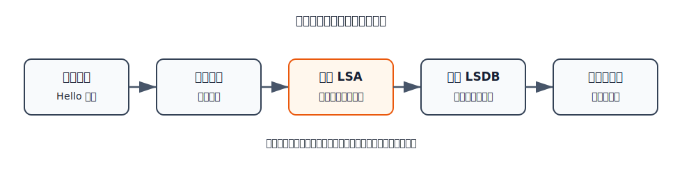
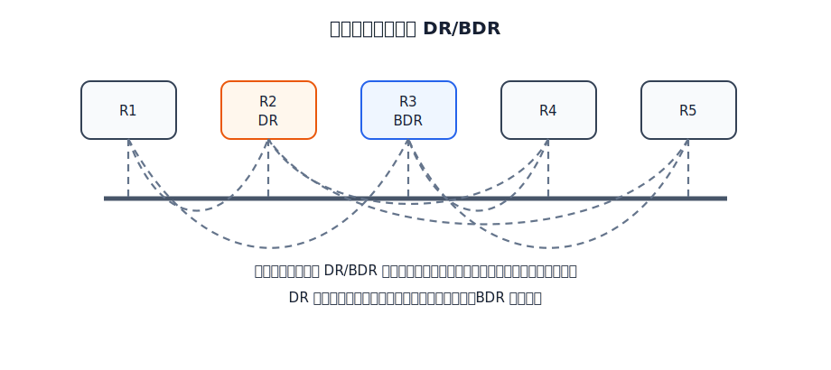
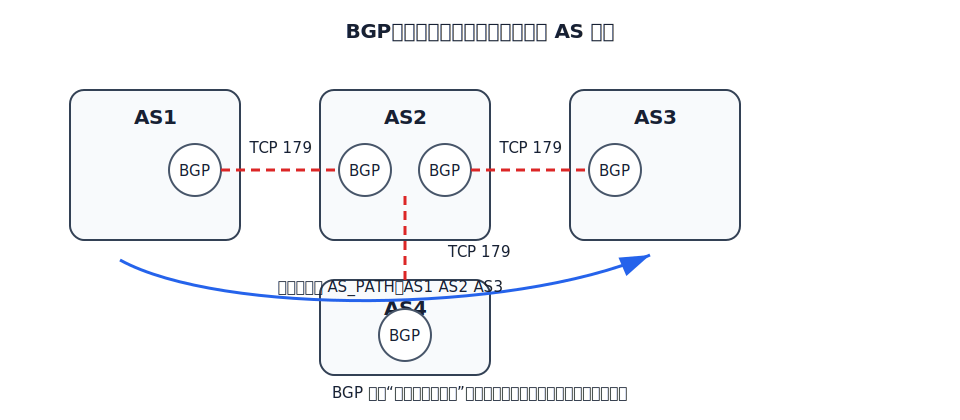

# 路由协议

路由协议运行在路由器之间，用来交换路由信息、维护路由表。它们服务于网络层的路径选择，但具体报文可能封装在不同下层协议中。例如 RIP 报文使用 UDP，BGP 使用 TCP，但它们的核心功能仍是路由选择。

三种协议对比：

| 比较点  | RIP       | OSPF       | BGP          |
| ---- | --------- | ---------- | ------------ |
| 使用范围 | AS 内部     | AS 内部      | AS 之间        |
| 协议类别 | IGP       | IGP        | EGP          |
| 基础思想 | 距离-向量     | 链路状态       | 路径向量与策略      |
| 主要度量 | 跳数        | 链路代价       | AS 路径和策略     |
| 交换对象 | 相邻路由器     | 区域内洪泛链路状态  | BGP 对等站      |
| 传输封装 | UDP 520端口 | 直接封装在 IP 中 | TCP 179端口    |
| 适用特点 | 小规模、简单网络  | 较大 AS，收敛较快 | AS 间可达性和策略控制 |

RIP 和 OSPF 解决的是一个 AS 内部如何选路；BGP 解决的是 AS 之间如何互相通告可达网络，并根据策略选择可接受的路径。

# RIP

RIP 是内部网关协议，基于距离-向量思想。RIP 用**跳数**表示距离：

- 从一个路由器到直连网络的距离为 1。
- 每经过一个路由器，距离加 1。
- 最大有效距离为 15。
- 距离 16 表示不可达。

RIP 认为距离短的路由是好路由。如果到同一目的网络存在多条相同跳数的路由，可以做等价负载均衡。

RIP 的基本工作过程是：

1. 路由器刚开始工作时，只知道自己到直连网络的距离。
2. 每个路由器只和相邻路由器周期性交换路由信息。
3. 每次收到邻居的距离向量后，按“邻居距离 + 到邻居代价”更新本地路由表。
4. 经过若干轮交换后，各路由器得到到本 AS 内各网络的较短路径。

[html-card height=500](../assets/rip-update-process-slides.html)

RIP 的条目更新要抓住三条：

- 同一下一跳传来的更新，无论距离变大还是变小，都要采用。
- 新发现的目的网络要加入路由表。
- 不同下一跳的新路径更短时，改用新路径。

RIP 的典型问题是“坏消息传播慢”。这来自距离-向量算法本身：路由器不知道完整路径，可能被邻居的旧信息误导，形成距离无穷计数。

[html-card height=620](../assets/rip-count-to-infinity-slides.html)

RIP 常用的缓解措施包括：

- 最大距离限制：15 为最大有效距离，16 为不可达。
- 触发更新：路由变化时立即发送更新。
- 水平分割：从某接口学到的路由，不从同一接口反向发送。

RIP2 支持 VLSM/CIDR，提供简单鉴别，并支持多播。RIP 报文使用 UDP 520 端口。

RIP 的优点是实现简单、路由器开销小；缺点是最大距离限制使它不适合大型 AS，且坏消息传播慢。

# OSPF

OSPF 是内部网关协议，基于链路状态算法。它不让路由器只听邻居宣告距离，而是让同一区域内的路由器同步链路状态数据库 LSDB，再各自运行最短路径算法。

OSPF 的核心概念包括：

| 概念 | 含义 |
|---|---|
| Hello 分组 | 发现和维护邻居关系 |
| 链路状态 | 路由器到邻居或直连网络的连接状态和代价 |
| LSA | 链路状态通告，描述本路由器的链路状态 |
| LSU | 链路状态更新分组，用来洪泛发送链路状态 |
| LSDB | 链路状态数据库，同一区域内应保持一致 |

OSPF 的五种分组是：

| 分组 | 作用 |
|---|---|
| Hello | 发现和维护邻居可达性 |
| Database Description | 发送本机 LSDB 摘要 |
| Link State Request | 请求缺少的链路状态项目 |
| Link State Update | 发送链路状态项目的详细信息 |
| Link State Acknowledgement | 确认收到链路状态更新 |

[html-card height=570](../assets/ospf-lsdb-sync-slides.html)

OSPF 的基本过程可以概括为：

1. 相邻路由器周期性交换 Hello 分组，建立和维护邻居关系。
2. 建立邻居关系后，交换数据库描述分组。
3. 若发现自己缺少某些链路状态项目，就发送链路状态请求。
4. 对方用链路状态更新分组发送详细信息。
5. 收到后更新 LSDB，并发送链路状态确认。
6. LSDB 同步后，各路由器运行最短路径算法，得到路由表。
7. 链路状态变化时，使用洪泛法重新扩散更新。

在多点接入网络中，如果所有 OSPF 路由器都彼此建立完全邻接关系，会产生大量邻接和多播分组。OSPF 通过选举 DR 和 BDR 降低开销。

- DR 是指定路由器，代表该多点接入网络与其他路由器交换链路状态。
- BDR 是备用指定路由器，在 DR 故障时接替。
- 普通路由器主要与 DR/BDR 建立邻接关系。

OSPF 还支持区域划分。区域划分把链路状态洪泛限制在区域内部，减少整个 AS 的通信量。骨干区域负责连接其他区域，区域边界路由器在区域之间传递汇总后的路由信息。

# BGP

BGP 是外部网关协议，用于自治系统之间。BGP 不能简单理解成“找最短路”的协议，因为不同 AS 的代价度量不统一，并且 AS 之间的路由选择还受商业关系、访问控制、策略偏好影响。

BGP 的基本对象是 **BGP 发言人**。两个 BGP 发言人先建立 TCP 连接，端口号为 179，然后在 TCP 连接上建立 BGP 会话并交换路由信息。互相建立 BGP 会话的双方称为邻站或对等站。

BGP 发言人交换的是网络可达性信息，尤其是到某网络要经过的一系列 AS。这个 AS 路径既能表达可达性，也能帮助避免 AS 级环路。

BGP-4 有四种报文：

| 报文 | 作用 |
|---|---|
| OPEN | 建立相邻 BGP 发言人的关系，初始化通信 |
| UPDATE | 通告新路由，或撤销过时路由 |
| KEEPALIVE | 周期性确认邻站连通性 |
| NOTIFICATION | 报告检测到的差错 |

BGP 刚运行时，邻站可能交换较完整的路由信息；之后通常只在变化时发送更新，以减少带宽和处理开销。

