# 非抢占和抢占

**抢占**是指当前进程正在 CPU 上运行时，操作系统可以因为新事件发生而强行暂停它，把 CPU 分配给另一个就绪进程。被抢占的进程没有结束，也不一定阻塞，而是回到就绪队列，等待以后继续运行。

非抢占式调度不会打断正在运行的进程。只要一个进程已经获得 CPU，它通常会一直运行到完成、阻塞或主动放弃 CPU。

| 情况 | 非抢占式 | 抢占式 |
| --- | --- | --- |
| 当前进程正在运行 | 继续运行，直到完成、阻塞或主动放弃 CPU | 可能被更合适的就绪进程打断 |
| 新进程到达 | 进入就绪队列等待 | 会触发比较，可能抢走 CPU |
| 判断重点 | 只在调度点选择一次 | 每次就绪队列变化都可能重新选择 |
| 代价 | 上下文切换少，响应可能慢 | 响应更及时，但上下文切换更多 |

比如 SJF/SPF 和 SRTN 的核心差别就在这里：SJF/SPF 默认是非抢占式，进程一旦选中就运行到释放 CPU；SRTN 是抢占式，只要新到达进程的运行时间小于当前进程的剩余运行时间，就会抢占。

# 饥饿

**饥饿**是指某个进程长期处于就绪状态，却因为调度规则持续偏向其他进程而迟迟得不到 CPU。它不是阻塞：阻塞是进程在等 I/O 或事件，暂时不能运行；饥饿是进程明明已经就绪，却总是排不上。

饥饿发生在调度规则长期偏向某一类进程时。SJF/SPF 和 SRTN 都偏向短作业；如果短作业不断到达，长作业可能一直排不上。HRRN 把等待时间放进响应比，等待越久响应比越高，因此长作业不会一直只因为“运行时间长”而被压在后面。

# 批处理调度算法

这一组算法主要关注公平性、平均等待时间、平均周转时间等整体指标。它们不强调交互式系统里的快速响应，也不区分任务紧急程度。

下面统一使用这一组进程：

| 进程 | 到达时间 | 运行时间 |
| --- | --- | --- |
| P1 | 0 | 8 |
| P2 | 1 | 4 |
| P3 | 2 | 9 |
| P4 | 3 | 5 |
| P5 | 6 | 2 |

[html-card height=780](../assets/batch-scheduling-algorithms-slides.html)

> [!summary] 总览
>
> | 算法 | 主要依据 | 优点 | 缺点 | 饥饿 |
> | --- | --- | --- | --- | --- |
> | FCFS | 到达顺序 | 公平，实现简单 | 对短作业不利 | 不会 |
> | SJF / SPF | 运行时间 | 平均等待和周转通常较小 | 对长作业不利，需要预估运行时间 | 可能 |
> | SRTN | 剩余运行时间 | 平均等待和周转可进一步降低 | 切换更频繁，对长作业更不利 | 可能 |
> | HRRN | 等待时间和运行时间的比值 | 兼顾短作业和等待较久的作业 | 每次调度要计算响应比 | 通常不会 |

## FCFS

**FCFS**，First Come First Serve，即**先来先服务**。

FCFS 按作业或进程到达的先后顺序服务。用于作业调度时，看作业到达外存后备队列的顺序；用于进程调度时，看进程到达就绪队列的顺序。

| 角度 | FCFS |
| --- | --- |
| 思想 | 公平排队，先到先服务 |
| 规则 | 按到达顺序依次运行 |
| 抢占性 | 非抢占 |
| 优点 | 公平，实现简单 |
| 缺点 | 对短作业不利；短作业排在长作业后面时，等待时间和带权周转时间会很大 |
| 饥饿 | 不会 |

对统一例子，FCFS 的运行顺序为：

$$
P1 \to P2 \to P3 \to P4 \to P5
$$

| 进程 | 完成时间 | 周转时间 | 等待时间 | 带权周转时间 |
| --- | --- | --- | --- | --- |
| P1 | 8 | $8-0=8$ | $8-8=0$ | $8/8=1$ |
| P2 | 12 | $12-1=11$ | $11-4=7$ | $11/4=2.75$ |
| P3 | 21 | $21-2=19$ | $19-9=10$ | $19/9\approx2.11$ |
| P4 | 26 | $26-3=23$ | $23-5=18$ | $23/5=4.6$ |
| P5 | 28 | $28-6=22$ | $22-2=20$ | $22/2=11$ |

平均周转时间为 $16.6$，平均等待时间为 $11$，平均带权周转时间约为 $4.29$。

## SJF / SPF

**SJF**，Shortest Job First，即**短作业优先**。用于进程调度时，严格说应称为 **SPF**，Shortest Process First，即短进程优先。

SJF/SPF 每次调度时，在已经到达的作业或进程中，选择要求服务时间最短者。默认语境下，SJF/SPF 通常指**非抢占式**算法。

| 角度  | SJF / SPF                     |
| --- | ----------------------------- |
| 思想  | 优先服务短作业，降低平均等待时间和平均周转时间       |
| 规则  | 每次调度时，从已到达者中选择运行时间最短者         |
| 抢占性 | 默认非抢占                         |
| 优点  | **通常能得到较小的平均等待时间和平均周转时间**     |
| 缺点  | 对长作业不利；需要预知运行时间，而用户给出的估计可能不准确 |
| 饥饿  | 可能导致长作业饥饿                     |

对统一例子，0 时刻只有 P1 到达，所以 P1 先运行到 8。8 时刻所有进程都已到达，剩余候选的运行时间分别为 P2=4、P3=9、P4=5、P5=2，所以选择 P5；之后选择 P2、P4，最后 P3。

运行顺序为：

$$
P1 \to P5 \to P2 \to P4 \to P3
$$

| 进程 | 完成时间 | 周转时间 | 等待时间 | 带权周转时间 |
| --- | --- | --- | --- | --- |
| P1 | 8 | $8-0=8$ | $8-8=0$ | $8/8=1$ |
| P2 | 14 | $14-1=13$ | $13-4=9$ | $13/4=3.25$ |
| P3 | 28 | $28-2=26$ | $26-9=17$ | $26/9\approx2.89$ |
| P4 | 19 | $19-3=16$ | $16-5=11$ | $16/5=3.2$ |
| P5 | 10 | $10-6=4$ | $4-2=2$ | $4/2=2$ |

平均周转时间为 $13.4$，平均等待时间为 $7.8$，平均带权周转时间约为 $2.47$。

> [!warning] “SJF 平均等待时间最少”要加条件
> 若所有进程同时到达，非抢占式 SJF 可以得到最少的平均等待时间和平均周转时间。
>
> 若进程陆续到达，抢占式的最短剩余时间[[#SRTN]]优先通常还能得到更小的平均等待时间和平均周转时间。

## SRTN

**SRTN**，Shortest Remaining Time Next，即**最短剩余时间优先**。它是**抢占式**短作业优先。

SRTN 的规则是：每当新进程到达或当前进程完成，重新比较所有就绪进程的**剩余运行时间**，选择剩余时间最短者运行。如果新到达进程比当前进程剩余时间更短，就抢占当前进程。

| 角度 | SRTN |
| --- | --- |
| 思想 | 始终让当前剩余运行时间最短的进程先运行 |
| 规则 | 每次新进程到达或当前进程完成时，比较所有就绪进程的剩余运行时间 |
| 抢占性 | 抢占 |
| 优点 | 通常比非抢占式 SJF/SPF 进一步降低平均等待时间和平均周转时间 |
| 缺点 | 需要知道或估计剩余运行时间；进程切换次数可能增加；对长作业更不利 |
| 饥饿 | 可能导致长作业饥饿 |

对统一例子：

| 时刻 | 就绪队列变化 | 选择 |
| --- | --- | --- |
| 0 | P1 到达，P1 剩 8 | 运行 P1 |
| 1 | P2 到达；P1 剩 7，P2 需 4 | P2 更短，抢占 P1 |
| 2 | P3 到达；P2 剩 3，P3 需 9 | P2 继续运行 |
| 3 | P4 到达；P2 剩 2，P4 需 5 | P2 继续运行 |
| 5 | P2 完成；P1 剩 7，P3 需 9，P4 需 5 | 运行 P4 |
| 6 | P5 到达；P4 剩 4，P5 需 2 | P5 更短，抢占 P4 |
| 8 | P5 完成；P1 剩 7，P3 需 9，P4 剩 4 | 运行 P4 |
| 12 | P4 完成；P1 剩 7，P3 需 9 | 运行 P1 |
| 19 | P1 完成；只剩 P3 | 运行 P3 |

运行顺序为：

$$
P1 \to P2 \to P4 \to P5 \to P4 \to P1 \to P3
$$

| 进程 | 完成时间 | 周转时间 | 等待时间 | 带权周转时间 |
| --- | --- | --- | --- | --- |
| P1 | 19 | $19-0=19$ | $19-8=11$ | $19/8=2.375$ |
| P2 | 5 | $5-1=4$ | $4-4=0$ | $4/4=1$ |
| P3 | 28 | $28-2=26$ | $26-9=17$ | $26/9\approx2.89$ |
| P4 | 12 | $12-3=9$ | $9-5=4$ | $9/5=1.8$ |
| P5 | 8 | $8-6=2$ | $2-2=0$ | $2/2=1$ |

平均周转时间为 $12$，平均等待时间为 $6.4$，平均带权周转时间约为 $1.81$。

对比 SJF/SPF 和 SRTN 时，要抓住“剩余时间”这个词。SJF/SPF 在某次调度时只看每个候选进程的总运行时间；SRTN 在运行过程中持续看剩余运行时间，所以同一个进程可能被拆成多个 CPU 时间段。统一例子中，P1 先运行 1 个时间单位后被 P2 抢占，后来又在 12 到 19 继续运行；P4 也被 P5 抢占后分成两段运行。

## HRRN

**HRRN**，Highest Response Ratio Next，即**高响应比优先**。

FCFS 只看等待时间，不看运行时间；SJF 只看运行时间，不看等待时间。HRRN 同时考虑二者。

$$
\text{响应比}=\frac{\text{等待时间}+\text{要求服务时间}}{\text{要求服务时间}}
$$

也可以写成：

$$
\text{响应比}=1+\frac{\text{等待时间}}{\text{要求服务时间}}
$$

HRRN 是非抢占式算法。只有当前进程完成、阻塞或主动放弃 CPU 时，才重新计算就绪队列中各进程的响应比。

| 角度  | HRRN                                |
| --- | ----------------------------------- |
| 思想  | 同时照顾短作业和等待时间较长的作业                   |
| 规则  | 每次调度时计算响应比，选择响应比最高者                 |
| 抢占性 | 非抢占                                 |
| 优点  | 比 FCFS 更照顾短作业，比 SJF/SPF 更照顾等待已久的长作业 |
| 缺点  | 每次调度都要计算响应比；仍然需要知道或估计要求服务时间         |
| 饥饿  | 通常不会                                |

对统一例子：

- 0 时刻只有 P1 到达，运行 P1。
- 8 时刻 P1 完成：
  - P2 响应比为 $(7+4)/4=2.75$。
  - P3 响应比为 $(6+9)/9\approx1.67$。
  - P4 响应比为 $(5+5)/5=2$。
  - P5 响应比为 $(2+2)/2=2$。
  - 选择 P2。
- 12 时刻 P2 完成：
  - P3 响应比为 $(10+9)/9\approx2.11$。
  - P4 响应比为 $(9+5)/5=2.8$。
  - P5 响应比为 $(6+2)/2=4$。
  - 选择 P5。
- 14 时刻 P5 完成：
  - P3 响应比为 $(12+9)/9\approx2.33$。
  - P4 响应比为 $(11+5)/5=3.2$。
  - 选择 P4。
- 19 时刻 P4 完成，只剩 P3。

运行顺序为：

$$
P1 \to P2 \to P5 \to P4 \to P3
$$

| 进程 | 完成时间 | 周转时间 | 等待时间 | 带权周转时间 |
| --- | --- | --- | --- | --- |
| P1 | 8 | $8-0=8$ | $8-8=0$ | $8/8=1$ |
| P2 | 12 | $12-1=11$ | $11-4=7$ | $11/4=2.75$ |
| P3 | 28 | $28-2=26$ | $26-9=17$ | $26/9\approx2.89$ |
| P4 | 19 | $19-3=16$ | $16-5=11$ | $16/5=3.2$ |
| P5 | 14 | $14-6=8$ | $8-2=6$ | $8/2=4$ |

平均周转时间为 $13.8$，平均等待时间为 $8.2$，平均带权周转时间约为 $2.77$。

HRRN 的优点在于折中：

- 等待时间相同，服务时间短者响应比更高，体现 SJF 的优势。
- 服务时间相同，等待时间长者响应比更高，体现 FCFS 的公平性。
- 长作业等待越久，响应比越高，因此一般不会饥饿。

## 批处理算法横向对比

| 算法 | 抢占性 | 运行顺序 | 平均周转时间 | 平均等待时间 | 平均带权周转时间 |
| --- | --- | --- | --- | --- | --- |
| FCFS | 非抢占 | P1, P2, P3, P4, P5 | 16.6 | 11 | 4.29 |
| SJF / SPF | 非抢占 | P1, P5, P2, P4, P3 | 13.4 | 7.8 | 2.47 |
| SRTN | 抢占 | P1, P2, P4, P5, P4, P1, P3 | 12 | 6.4 | 1.81 |
| HRRN | 非抢占 | P1, P2, P5, P4, P3 | 13.8 | 8.2 | 2.77 |

# 交互式调度算法

交互式系统要让用户的操作尽快得到反应，因此更关心算法的**响应时间**、公平性和任务紧急程度。

| 算法 | 主要依据 | 抢占性 | 适合解决的问题 |
| --- | --- | --- | --- |
| RR | 到达就绪队列的顺序、时间片 | 抢占 | 让每个进程周期性获得 CPU |
| 优先级调度 | 优先级 | 可抢占，也可非抢占 | 区分任务紧急程度 |
| 多级队列调度 | 进程类型所属队列 | 取决于队列间策略 | 按系统进程、交互进程、批处理进程等分类管理 |
| 多级反馈队列调度 | 队列优先级、时间片、运行反馈 | 抢占 | 在响应、公平、短进程优先之间折中 |

| 算法 | 是否区分优先级 | 是否使用时间片 | 是否允许队列迁移 | 主要优点 | 主要风险 |
| --- | --- | --- | --- | --- | --- |
| RR | 否 | 是 | 否 | 公平、响应快 | 时间片过小会增加切换开销 |
| 优先级调度 | 是 | 不一定 | 否 | 能表达任务紧急程度 | 低优先级进程可能饥饿 |
| 多级队列调度 | 是，按队列区分 | 可按队列设置 | 通常不迁移 | 不同类型进程分开管理 | 低优先级队列可能饥饿 |
| 多级反馈队列调度 | 是，按队列动态区分 | 是 | 是 | 综合响应、公平和短进程优先 | 规则复杂，低级队列仍可能饥饿 |

## RR 时间片轮转

**RR**，Round-Robin，即**时间片轮转调度**。

| 角度   | RR                              |
| ---- | ------------------------------- |
| 思想   | 公平地、轮流地为各进程服务，让每个进程在一定时间间隔内得到响应 |
| 规则   | 按进入就绪队列的顺序，每次让队头进程运行一个时间片       |
| 使用对象 | 进程调度                            |
| 抢占性  | 抢占式                             |
| 优点   | 公平，响应快，适合分时系统                   |
| 缺点   | 进程切换频繁，有上下文切换开销；不区分任务紧急程度       |
| 饥饿   | 不会                              |
| 先决条件 | 操作系统实现定时$^1$的机制              |
|      |                                 |
[^1]: 由硬件定时器按设定时间产生时钟中断，使操作系统能够在规定时刻重新获得 CPU 控制权。

如果进程在一个时间片内完成，它主动放弃 CPU；如果时间片用完仍未完成，时钟中断触发调度，操作系统剥夺 CPU，把它放回就绪队列队尾。

> [!note] 同一时刻的入队顺序
> 若某个时刻同时发生新进程到达和当前进程时间片用完，新到达进程先进入就绪队列，当前进程后进入就绪队列。

示例：

| 进程 | 到达时间 | 运行时间 |
| --- | --- | --- |
| P1 | 0 | 5 |
| P2 | 2 | 4 |
| P3 | 4 | 1 |
| P4 | 5 | 6 |

[html-card height=760](../assets/interactive-scheduling-rr-slides.html)

时间片为 2 时，运行顺序为：

$$
P1 \to P2 \to P1 \to P3 \to P2 \to P4 \to P1 \to P4 \to P4
$$

对应的 CPU 占用区间为：

| 进程 | CPU 占用区间 |
| --- | --- |
| P1 | $0\sim2,\ 4\sim6,\ 11\sim12$ |
| P2 | $2\sim4,\ 7\sim9$ |
| P3 | $6\sim7$ |
| P4 | $9\sim11,\ 12\sim14,\ 14\sim16$ |

时间片大小会直接影响系统表现：

| 时间片 | 结果 |
| --- | --- |
| 过大 | 每个进程可能在一个时间片内就完成，RR 退化为 FCFS，响应时间变长 |
| 过小 | 时钟中断和上下文切换太频繁，CPU 时间被调度开销消耗 |
| 合适 | 让交互进程较快得到响应，同时不让切换开销过大 |

* 若系统有 10 个进程轮流执行，时间片为 1 秒，则某个进程最坏可能接近 9 秒才再次得到 CPU
* 若时间片极小，用户感觉响应快，但系统会频繁保存和恢复进程运行现场。

### 时间片大小的确定

设时间片为 $q$，一次上下文切换耗时为 $s$，就绪进程数为 $N$。选择 $q$ 时主要考虑：

- **切换开销**：$q$ 应明显大于 $s$。若进程总是用完整个时间片，调度开销占比约为 $\frac{s}{q+s}$；$q$ 越小，浪费在切换上的比例越高。
- **响应时间**：忽略切换开销时，一个刚错过 CPU 的进程最多要等待约 $(N-1)q$ 才能再次运行。就绪进程越多、响应要求越高，$q$ 越不能过大。
- **CPU 突发长度**：若多数交互进程的单次 CPU 突发能在一个时间片内完成，它们会在用完时间片前主动阻塞，不必经历额外的抢占和重新排队。
- **定时器精度**：时间片不能小到接近系统定时器精度和中断处理时间，否则难以准确执行且开销过大。

标准 RR 通常让同一就绪队列中的进程使用相同时间片，并不逐个进程设置。若系统采用多级队列或多级反馈队列，才常按进程行为区别设置：

| 进程特征           | 常用时间片 | 原因                             |
| -------------- | ----- | ------------------------------ |
| I/O 型，CPU 突发较短 | 较短    | 尽快轮到并产生响应；通常会在时间片耗尽前因 I/O 主动阻塞 |
| CPU 密集型、批处理型   | 较长    | 减少长时间计算中的上下文切换，提高吞吐量           |

## 优先级调度

优先级调度给每个作业或进程设置优先级，调度时选择优先级最高者。

| 角度 | 优先级调度 |
| --- | --- |
| 思想 | 按任务紧急程度或系统偏好分配 CPU |
| 规则 | 每次调度时，从候选者中选择优先级最高者 |
| 使用对象 | 可用于作业调度、进程调度，也可用于 I/O 调度 |
| 抢占性 | 可抢占，也可非抢占 |
| 优点 | 能表达任务紧急程度，适合实时系统；也便于体现系统策略 |
| 缺点 | 高优先级进程不断到来时，低优先级进程可能长期得不到服务 |
| 饥饿 | 可能 |

非抢占式优先级调度只在当前进程完成、阻塞或主动放弃 CPU 时重新选择。抢占式优先级调度还要在就绪队列变化时检查：若新到达进程优先级高于当前运行进程，就抢占当前进程。

优先级可以分为两类：

| 类型    | 含义              | 特点                    |
| ----- | --------------- | --------------------- |
| 静态优先级 | 创建进程时确定，之后不变    | 实现简单，但难以反映运行过程中的变化    |
| 动态优先级 | 创建时有初值，运行过程中可调整 | 更灵活，可以缓解饥饿，也能体现系统当前偏好 |

常见设置思路：

- 系统进程优先级通常高于用户进程。
- 前台进程优先级通常高于后台进程。
- I/O 繁忙型进程可适当提高优先级，因为它尽快运行后常会发起 I/O，使 CPU 和 I/O 设备更容易并行工作。
- 进程在就绪队列中等待很久，可提高优先级，避免饥饿。
- 进程占用 CPU 很久，可降低优先级，把机会让给其他进程。

## 多级队列调度

多级队列调度把就绪队列拆成多个队列，进程创建后按类型进入固定队列。例如：

| 队列 | 常见对象 | 队列内策略 |
| --- | --- | --- |
| 系统进程队列 | 内核服务、系统任务 | 优先级调度 |
| 交互式进程队列 | 终端、编辑器、前台程序 | RR |
| 批处理进程队列 | 后台计算任务 | FCFS 或 SJF |

队列之间常见两种安排：

| 队列间策略 | 含义 |
| --- | --- |
| 固定优先级 | 高优先级队列不空时，低优先级队列不能运行 |
| 时间片划分 | 给不同队列分配固定 CPU 比例，例如 50%、40%、10% |

多级队列调度的关键是分类。一个进程通常固定属于某个队列，队列之间不强调迁移。它能把不同类型进程分开管理，**但如果采用固定优先级，低优先级队列可能长期得不到 CPU**。

## 多级反馈队列调度

多级反馈队列调度保留多个就绪队列，但进程可以根据运行情况在队列之间迁移。

| 角度 | 多级反馈队列 |
| --- | --- |
| 思想 | 在 FCFS 的公平、RR 的响应、SPF 的短进程优先、优先级调度的灵活性之间折中 |
| 规则 | 新进程先进入最高优先级队列；用完本级时间片仍未完成则下降一级；高优先级队列为空时才调度低优先级队列 |
| 使用对象 | 进程调度 |
| 抢占性 | 抢占式 |
| 优点 | 新进程响应快；短进程容易较早完成；不需要预估运行时间；可通过队列和时间片设置体现系统偏好 |
| 缺点 | 规则较复杂；若高优先级进程持续到来，低优先级进程可能饥饿 |
| 饥饿 | 可能 |

基本规则如下：

1. 设置多个就绪队列，优先级从高到低。
2. 高优先级队列时间片小，低优先级队列时间片大。
3. 新进程先进入第 1 级队列。
4. 若进程用完当前队列的时间片仍未完成，降到下一级队列队尾。
5. 若已经在最低级队列，用完时间片仍未完成，则重新回到最低级队列队尾。
6. 只有第 $k$ 级队列为空时，才会调度第 $k+1$ 级队列。
7. 低级队列进程运行时，若更高级队列进入新进程，新进程会抢占 CPU；被抢占进程回到原队列队尾。

[html-card height=800](../assets/multilevel-feedback-queue-slides.html)

统一例子：

| 进程 | 到达时间 | 运行时间 |
| --- | --- | --- |
| P1 | 0 | 8 |
| P2 | 1 | 4 |
| P3 | 5 | 1 |

设三层队列：

| 队列 | 优先级 | 时间片 |
| --- | --- | --- |
| Q1 | 最高 | 1 |
| Q2 | 中 | 2 |
| Q3 | 最低 | 4 |

按抢占规则，运行过程为：

$$
P1(Q1,0\sim1)\to P2(Q1,1\sim2)\to P1(Q2,2\sim4)\to P2(Q2,4\sim5)\to P3(Q1,5\sim6)\to P2(Q2,6\sim8)\to P1(Q3,8\sim12)\to P1(Q3,12\sim13)
$$

这个过程体现了三个机制：

- 新进程先进入最高优先级队列，所以 P1、P2、P3 第一次运行都从 Q1 开始。
- P1 运行时间长，用完 Q1 和 Q2 时间片后逐步下降到 Q3。
- P3 在 5 时刻到达 Q1，会抢占正在 Q2 运行的 P2，因此短交互进程能很快得到响应。

# 算法友好性判断

判断一个 CPU 调度算法对某类进程是否友好，核心就是看：**满足这种特征的进程，是否能更早、更频繁地获得CPU。** 从定量的角度分析，就是它的等待时间、响应时间、周转时间是否因它的这种性质更短。

| 类型      | 特点                | 关注点                        |
| ------- | ----------------- | -------------------------- |
| 短进程     | 执行时间短             | 等待时间、周转时间                  |
| IO 繁忙型  | 频繁地换上换下 CPU       | 响应时间、重新进入就绪队列后是否能快速再次上 CPU |
| CPU 繁忙型 | 如果不打断则几乎一直在 CPU 上 | 连续运行机会                     |
| 长进程     | 执行时间长             | 是否可能饥饿                     |

