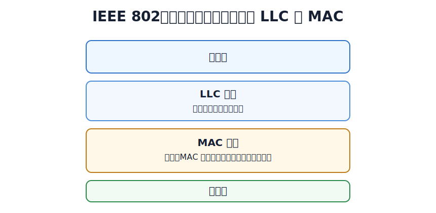
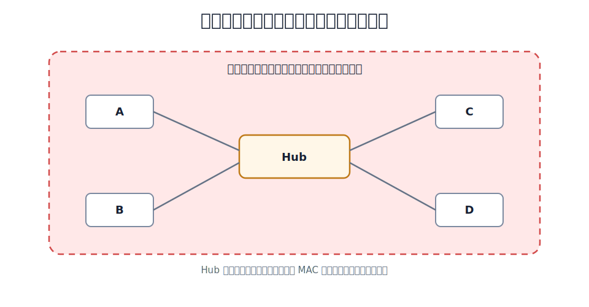
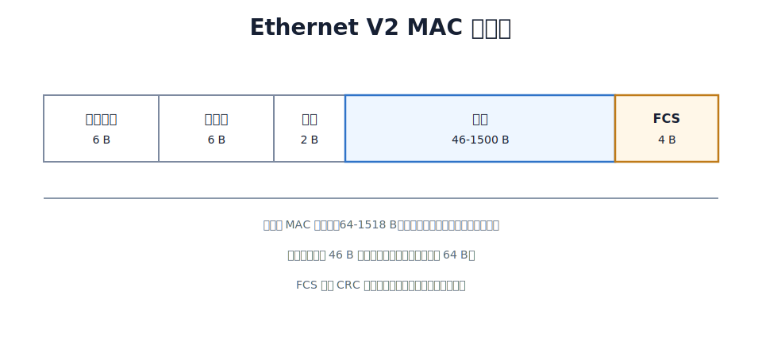
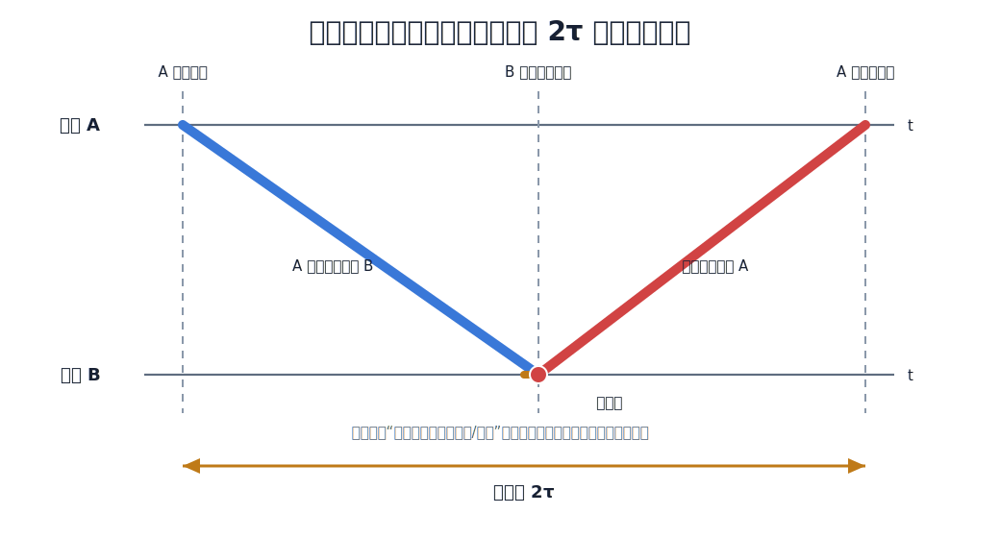

# 以太网与 IEEE 802

局域网 LAN 是覆盖范围较小、通常由一个单位自行建设和管理的计算机网络，例如实验室、办公室、教学楼或园区内部网络。局域网常见特点是：传输距离较短、速率较高、误码率较低，并且多个站点经常共享同一个广播范围。

IEEE 802 标准面向局域网和城域网。它把局域网的数据链路层分为两个子层：

| 子层 | 作用 |
|---|---|
| LLC 子层 | 向网络层提供统一接口，屏蔽不同局域网 MAC 机制的差异 |
| MAC 子层 | 处理成帧、MAC 地址、介质访问控制、差错检测等与具体局域网有关的问题 |

以太网最初来自 DIX Ethernet V2 标准。IEEE 802.3 在此基础上制定以太网标准。实际网络设备通常兼容 Ethernet V2 帧和 IEEE 802.3 相关规范。

以太网向上提供的是**无连接、不可靠的帧传输服务**。

- 无连接：发送帧之前不先建立数据链路层连接。
- 不可靠：接收方用 FCS 检测差错，发现错帧就丢弃；以太网本身不确认、不重传、不保证按序交付。
- 尽最大努力交付：没有检测出错误的帧才向上交付，可靠性通常由高层协议处理。

802.11 无线链路误码率较高，数据链路层会使用确认机制；传统以太网链路质量较好，数据链路层通常不做可靠传输。

# 高速以太网的发展

以太网后来从 10 Mb/s 发展到百兆、千兆、万兆以及更高速率。它们仍然沿用以太网帧格式和 IEEE 802.3 的基本体系，但高速化后逐渐脱离共享介质争用。

| 类型         | 典型特点                                                                                      |
| ---------- | ----------------------------------------------------------------------------------------- |
| 100BASE-T  | 又称快速以太网，速率 100 Mb/s；仍使用 IEEE 802.3 帧格式。若使用集线器和半双工链路，仍可使用 CSMA/CD；若使用交换机全双工链路，则不使用 CSMA/CD |
| 千兆以太网      | 速率 1 Gb/s；全双工时不使用 CSMA/CD。半双工兼容场景中曾引入载波延伸、分组突发来维持碰撞检测约束                                   |
| 10GE       | 10 Gb/s，以全双工为主，不使用 CSMA/CD；开始面向城域网和广域网主干等场景                                               |
| 40GE/100GE | 只工作在全双工方式，不使用 CSMA/CD；仍使用 IEEE 802.3 帧格式并保留最小帧长、最大帧长规则                                    |

因此，CSMA/CD 是共享式、半双工以太网时代的核心机制；现代交换式全双工以太网不再需要它。

# 共享式以太网

共享式以太网的特点是：多个站点共享同一个传输介质，同一时刻只允许一个站点成功发送帧。若两个站点同时发送，信号会在共享介质上叠加，接收方无法还原出正确帧，这就是碰撞。

早期共享式以太网使用同轴电缆形成总线。后来出现使用集线器和双绞线的星型结构。集线器 Hub 工作在物理层，只会把一个端口收到的比特信号再生并转发到其他端口；它不识别 MAC 地址，不检查帧，不学习转发表，也不隔离碰撞域。

因此，使用集线器的星型以太网，物理连线看起来像星型，逻辑上仍然像一条共享总线，所有站点仍在同一个碰撞域中。

> [!note]
> **碰撞域**是可能互相碰撞的一组站点范围。一个碰撞域中，任意时刻只能有一个站点成功发送帧。集线器不隔离碰撞域，交换机端口可以隔离碰撞域。

# 网络适配器与 MAC 地址

网络适配器也称网卡。主机通过网卡接入局域网，帧的发送、接收、封装、校验和 MAC 地址识别通常由网卡完成。

MAC 地址是数据链路层地址，用来标识局域网中的网络接口。常见 MAC 地址长 48 bit，通常写成 6 个十六进制字节，例如 `00-1A-2B-3C-4D-5E`。

共享式以太网中，所有站点都能收到信道上的帧，但网卡会检查目的 MAC 地址。只有目的 MAC 地址匹配自己、目的地址为广播地址，或网卡处于特殊接收模式时，主机才会向上交付该帧。

MAC 地址并不只有“某台主机的地址”一种情况。按照目的地址的含义，可以分成：

| 地址类型 | 含义          | 典型形式                |
| ---- | ----------- | ------------------- |
| 单播地址 | 标识一个网络接口    | 普通网卡 MAC 地址         |
| 多播地址 | 标识一组接收接口    | 发送给某个多播组            |
| 广播地址 | 发送给局域网内所有站点 | `FF-FF-FF-FF-FF-FF` |

按照管理方式，又可以区分为：

| 地址类型 | 含义 |
|---|---|
| 全球管理地址 | 由 IEEE 分配地址块，厂商写入网卡，通常具有全球唯一性 |
| 本地管理地址 | 由本地管理员或系统软件设置，不保证全球唯一 |

从位标志角度看，MAC 地址中有两个容易混淆的标志位：

| 标志位 | 含义 |
|---|---|
| I/G 位 | Individual/Group，指出地址是单个接口地址还是组地址 |
| G/L 位 | Global/Local，指出地址是全球管理地址还是本地管理地址 |

这些分类主要影响接收方如何判断“这个帧是否应该交给我”。普通单播帧只交给目标接口；广播帧会被同一广播域内所有站点接收；多播帧交给加入对应多播组的接口。

# 以太网 MAC 帧

常见 Ethernet V2 MAC 帧格式如下：

| 字段   |        长度 | 作用                                   |
| ---- | --------: | ------------------------------------ |
| 目的地址 |       6 B | 接收方 MAC 地址，广播地址为 `FF-FF-FF-FF-FF-FF` |
| 源地址  |       6 B | 发送方 MAC 地址                           |
| 类型   |       2 B | 标明上层协议，例如 IPv4、ARP、IPv6              |
| 数据   | 46-1500 B | 上层交付的数据；不足 46 B 时需要填充                |
| FCS  |       4 B | CRC 检错码，用于检测帧在传输中是否出错                |

以太网帧最小长度为 64 B，最大长度通常为 1518 B。这 64 B 包括目的地址、源地址、类型、数据和 FCS，不包括物理层前导码。

# CSMA/CD

共享式以太网使用 CSMA/CD：Carrier Sense Multiple Access with Collision Detection，载波监听多址接入/碰撞检测。

这个名字可以拆开理解：

| 部分 | 含义 |
|---|---|
| CS | 发送前监听信道，若信道忙则等待 |
| MA | 多个站点接入同一共享介质 |
| CD | 发送过程中继续检测碰撞，发现碰撞就停止发送 |

CSMA/CD 的发送过程可以分成两条分支：没有碰撞时直接发送完成；发生碰撞时停止、干扰、退避、重发。

1. 发送前监听信道。
	1. 若信道忙，继续监听，直到信道空闲。
2. 信道空闲后，等待**帧间最小间隔**，再开始发送。
3. 发送过程中继续监听信道，边发送边检测碰撞。
4. 若发送完成前没有检测到碰撞，本帧发送成功。
	1. 若检测到碰撞，立即停止发送正常帧，并发送**干扰信号**。
	2. 执行截断二进制指数退避，等待随机时间后重新竞争信道。

* 帧间最小间隔是相邻两帧之间必须保留的最短空闲时间。经典以太网规定它为 96 bit time。它给接收站点和网络接口留出处理上一帧、准备下一帧的时间。

* 干扰信号 jam signal 是碰撞后发送的一小段特殊比特序列，用来强化碰撞影响，使同一碰撞域内其他站点也能明确检测到碰撞。经典以太网中常按 32 bit 干扰信号理解。

[html-card height=760](../assets/csma-cd-send-process-slides.html)

CSMA/CD 只能减少碰撞、检测碰撞、处理碰撞，不能彻底消除碰撞。原因是信号传播需要时间：一个站点监听到本端信道空闲时，远端站点发出的信号可能还没有传播到本端。

# 争用期

设共享总线两端最远站点之间的单程传播时延为 $\tau$。最坏情况是：

1. 站点 A 开始发送。
2. A 的信号快到达最远端 B 时，B 还没有检测到 A 的信号，于是也开始发送。
3. A 和 B 的信号在 B 附近发生碰撞。
4. 碰撞造成的异常信号再从 B 附近传播回 A。

因此，A 最迟要经过约 $2\tau$ 才能知道自己发送的帧是否发生碰撞。这个时间称为**争用期**或**碰撞窗口**。

图中横轴是时间，纵向上下两条线分别表示站点 A 和站点 B。蓝线表示 A 的信号从 A 传播到 B；橙线表示 B 在还没听到 A 之前也开始发送；红线表示碰撞造成的异常信号传播回 A。红线不是“原来的数据帧倒着走”，而是碰撞这一事件的影响沿共享介质返回发送端。

结论很关键：发送站点从开始发送算起，经过一个争用期仍未检测到碰撞，就可以认为本次发送不会再发生碰撞。

# 最小帧长

为了让发送方在发送完帧之前还能检测到碰撞，以太网要求：

$$
T_{\text{send}} \ge 2\tau
$$

其中 $T_{\text{send}}$ 是发送完整帧所需的发送时延。换成帧长：

$$
L_{\min} = R \times 2\tau
$$

10 Mb/s 共享式以太网规定争用期为 $51.2\mu s$，也就是 512 bit time。因此最小帧长为：

$$
10\text{ Mb/s} \times 51.2\mu s = 512\text{ bit}=64\text{ B}
$$

如果接收站点收到长度小于 64 B 的以太网帧，通常可判定它是碰撞导致的异常残帧，应丢弃。

# 截断二进制指数退避

检测到碰撞后，多个站点如果立刻重发，很容易再次同时发送并再次碰撞。退避算法的目标是：让发生碰撞的站点各自随机等待一段时间，把再次发送的时刻错开。

基本退避时间取一个争用期，即 512 bit time。对 10 Mb/s 以太网来说，512 bit time 就是 $51.2\mu s$。

第 $m$ 次碰撞后：

$$
k=\min(m,10)
$$

站点从下面的整数集合中随机选一个 $r$：

$$
r \in \{0,1,2,\cdots,2^k-1\}
$$

然后等待：

$$
r \times 512 \text{ bit time}
$$

这就是“二进制指数”的含义：碰撞次数越多，$2^k$ 越大，可选的退避时隙范围越大，多个站点再次选到同一个发送时刻的概率越低。

“截断”指 $k$ 最大只取到 10，退避范围不会无限扩大。若同一帧连续发送失败达到 16 次，以太网会放弃发送该帧，并向上层报告失败。

举例：

| 碰撞次数 $m$ | $k$ | 可选 $r$ | 等待时间 |
|---:|---:|---|---|
| 1 | 1 | 0 或 1 | $0$ 或 $1$ 个争用期 |
| 2 | 2 | 0 到 3 | $0$ 到 $3$ 个争用期 |
| 3 | 3 | 0 到 7 | $0$ 到 $7$ 个争用期 |
| 10 | 10 | 0 到 1023 | $0$ 到 $1023$ 个争用期 |
| 11 到 16 | 10 | 0 到 1023 | 退避范围不再扩大 |

# 共享式以太网的局限

共享式以太网的根本限制来自共享介质：

- 同一碰撞域内任意时刻只能有一个站点成功发送。
- 站点越多，碰撞概率越高。
- 链路越长，传播时延越大，争用期越长，最小帧长和性能约束越明显。
- 使用集线器扩展物理范围会扩大碰撞域。
- CSMA/CD 要求边发送边检测，因此共享式以太网只能半双工工作。

交换式以太网用交换机端口隔离碰撞域，并在全双工链路上消除共享介质争用。

## 信道利用率

共享式以太网的信道利用率受传播时延和碰撞影响。直观地说，站点真正发送数据帧的时间越长，争用、传播和碰撞处理占的比例越小；传播时延越大，站点越多，碰撞和等待带来的开销越明显。

常用参数：

$$
a=\frac{\tau}{T_0}
$$

其中 $\tau$ 是端到端单程传播时延，$T_0$ 是发送一帧所需时间。$a$ 越小，说明传播时延相对于帧发送时间越小，信道利用率越高。要让 $a$ 小，就要限制共享式以太网的物理范围，减少端到端传播时延。

这解释了两个结论：

- 共享式以太网的总线长度不能太长，否则争用期变长，碰撞检测和最小帧长约束更严重。
- 以太网最初更适合局域网，而不适合直接作为广域网技术。

