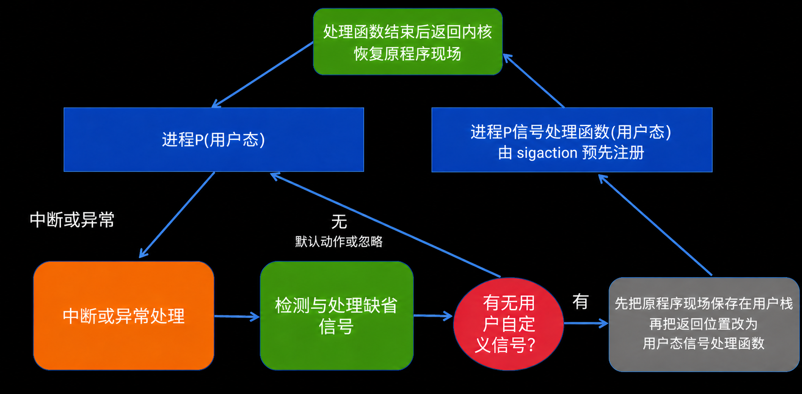

# 信号

信号是操作系统向进程通知事件的一种机制。信号来自需要通知进程的事件或发送请求。内核处理这些事件或请求时，生成相应信号并将其记为待处理。

内核在让接收进程返回用户态前，检查并处理该进程尚未接收的信号。

信号机制的核心是三类控制信息：

| 信息      | 含义                          |
| ------- | --------------------------- |
| 待处理信号集  | 哪些信号已经到达，但还没有被处理            |
| 信号屏蔽字   | 哪些信号暂时被屏蔽，暂不投递给进程处理         |
| 信号处理动作表 | 每种信号采用默认处理、忽略，还是调用进程注册的处理函数 |

待处理状态为按信号编号设置的位：某位为 1 表示该类信号尚未处理。同类标准信号在未处理期间再次到来，通常仍只保留一次待处理状态。

# 自定义信号处理函数

进程通过 `sigaction` 系统调用登记某个信号的处理动作。内核把处理函数地址、处理期间附加屏蔽的信号集合和相关标志保存到信号处理动作表。

内核保存的是用户态处理函数的入口地址。这个入口地址在用户空间里。**处理函数代码属于该进程的用户地址空间，不会也绝不能复制到内核空间。**

用户提供的代码不会以内核权限运行，因此不会破坏用户态与内核态之间的保护边界。

# 信号处理过程

1. 信号产生。来源可能是终端输入、定时器、异常、I/O 状态变化，或其他进程请求发送信号。
2. 内核把信号记为待处理。表示信号已经发生，但还没有交给目标进程或线程处理。
3. 检查屏蔽字。若该信号被屏蔽，暂不处理；若未屏蔽，等待合适时机投递。
4. 返回用户态前检查。系统调用和同步异常通常在当前线程的进程上下文中进入内核；外部中断则可能在任意任务运行时进入中断上下文。无论信号由哪类事件产生，内核都可以在目标线程以后准备返回用户态时检查其未屏蔽的待处理信号。
5. 选择处理动作。若动作为忽略，内核不再递达；若为默认动作，内核执行终止、停止、继续等相应操作；若注册了自定义处理函数，则准备切回用户态执行它。
	若进程注册了自定义处理函数，内核按以下执行：
	   1. 保存原程序现场。内核把原程序以后继续运行所需的信息保存到该进程的用户栈中，包括原执行位置、寄存器和信号屏蔽字。
	   2. 改变返回位置。内核把这次返回用户态后要执行的位置改为信号处理函数入口。
	   3. 执行处理函数。内核返回用户态，CPU 开始执行进程注册的处理函数。
	   4. 恢复现场。处理函数结束后，发起 `sigreturn` 系统调用，内核恢复原程序现场。
6. 回到原执行流。内核从信号帧中取回原执行位置、寄存器和信号屏蔽字，再次返回用户态，进程从被信号打断的位置继续执行。

不是所有信号都能被捕获、屏蔽或忽略。`SIGKILL` 和 `SIGSTOP` 不能被进程改写处理方式，否则进程可能拒绝被系统终止或暂停。

# 信号和异常/中断

信号可以作为异常和中断处理之后的用户态通知方式。

| 来源 | 内核处理 | 可能转化出的信号 |
| --- | --- | --- |
| 终端产生中断事件 | 终端驱动和内核处理控制字符 | `SIGINT` |
| 定时器到期 | 内核处理定时器中断或定时事件 | `SIGALRM` |
| 子进程退出 | 内核更新子进程状态，通知父进程 | `SIGCHLD` |
| 用户程序访问非法地址 | CPU 触发异常，内核判断无法继续正常执行 | `SIGSEGV` |
| 算术异常 | CPU 触发异常，内核定位到当前进程 | `SIGFPE` |

异常或中断使 CPU 转入内核态执行相应处理路径。若这个事件需要通知某个用户进程，内核可以在该进程的待处理信号集中设置对应信号。之后，当目标线程被调度运行并准备回到用户态时，信号机制再把事件交给它处理。

异常与中断的基本机制见 [[Exception-And-Interrupt]]。

> [!warning] 信号不是信号量
> 信号用于异步通知事件，例如终止、子进程退出。信号量用于同步、互斥或资源计数，例如缓冲区是否有空位、临界区是否可进入。二者名字相近，但用途完全不同。
