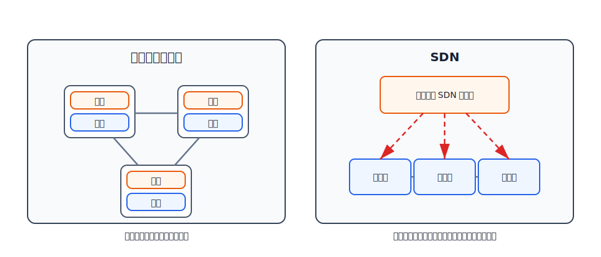
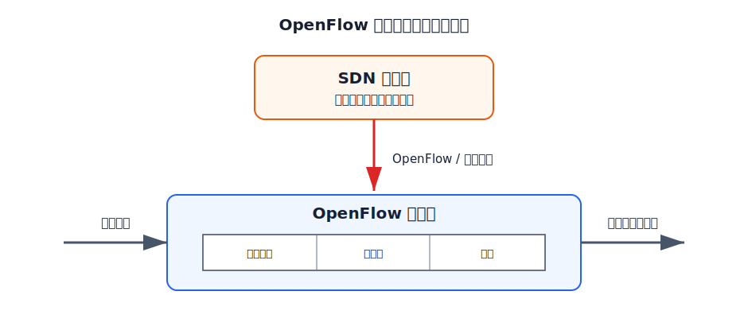
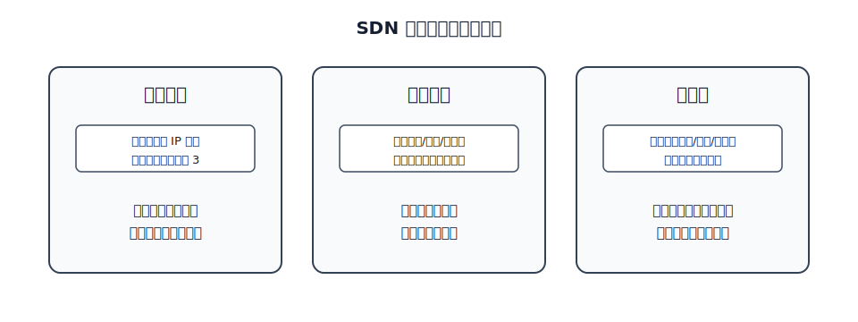

# SDN

软件定义网络 SDN 的核心是把传统网络设备中的**控制层面**和**数据层面**分离。

传统路由器内部同时有两类功能：

- 数据层面：根据转发表快速转发分组。
- 控制层面：运行路由协议，交换路由信息，计算路由表和转发表。

SDN 把控制功能从数据层设备中抽离出来，放到逻辑集中的控制器中。数据层设备变得更简单，主要按控制器下发的规则执行“匹配 + 动作”。

这里的“逻辑集中”不等于物理上只有一台控制器。实际部署中可以有多台服务器组成控制层面，但对数据层设备来说，它表现为统一的网络控制中心。

# 传统转发和广义转发

传统 IP 转发可以概括为：

$$
\text{匹配目的网络前缀}
\rightarrow
\text{选择输出接口或下一跳}
$$

也就是说，路由器通常按目的 IP 地址做最长前缀匹配，然后转发分组。

SDN 把这种方式扩展为**广义转发**：

$$
\text{匹配多层首部字段}
\rightarrow
\text{执行指定动作}
$$

匹配字段不局限于目的 IP 前缀，可以包括：

- 入端口。
- 源 MAC 地址、目的 MAC 地址。
- 源 IP 地址、目的 IP 地址。
- 运输层源端口、目的端口。
- 协议类型等其他首部字段。

动作也不局限于转发，可以包括：

- 转发到某个端口。
- 丢弃。
- 改写首部字段。
- 复制到多个端口。
- 发送给控制器。
- 按规则做负载均衡。

[html-card height=650](../assets/openflow-match-action-slides.html)

# OpenFlow

OpenFlow 是 SDN 控制器和数据层设备之间常见的通信接口。SDN 并不必然等于 OpenFlow，但 OpenFlow 是理解 SDN 流表机制的典型入口。

OpenFlow 有两层含义：

- 它是 SDN 控制器与网络设备之间的通信协议。
- 它规定了交换机按流表完成网络交换功能的逻辑结构。

在 SDN 中，完成“匹配 + 动作”的设备通常称为 OpenFlow 交换机或分组交换机。它不一定只工作在网络层，因为匹配字段可以跨越数据链路层、网络层和运输层。

# 流表

OpenFlow 交换机中的核心结构是流表。流表由 SDN 控制器计算、安装和管理。

一个流表项通常包含三部分：

| 组成 | 含义 |
|---|---|
| 匹配字段 | 用哪些首部字段判断分组是否属于这条流 |
| 计数器 | 记录命中次数、字节数等统计信息 |
| 动作 | 命中后如何处理分组 |

这里的“流”可以理解为共享某些首部字段值的一串分组。例如，入端口相同、目的 IP 前缀相同、TCP 目的端口相同的一组分组，可以被同一条流表项匹配。

如果分组匹配不上任何流表项，交换机可以丢弃它，也可以把它发送给控制器，由控制器决定是否安装新的流表项。

# SDN 控制器

SDN 控制器常被称为网络操作系统。它维护网络范围内的状态，并向上层网络控制应用提供接口。

SDN 控制器可以分成三层理解：

| 层次 | 作用 |
|---|---|
| 通信层 | 与数据层设备通信，下发规则，接收事件 |
| 网络范围状态管理层 | 维护链路、交换机、主机、流表、计数器等全局状态 |
| 网络控制应用接口 | 让路由、防火墙、负载均衡等应用读取状态并下发控制决策 |

控制器需要知道网络状态，才能决定如何安装流表。例如链路故障、设备上线、端口状态变化、流量计数器变化，都可能触发控制应用重新计算规则。

# 四个关键特征

SDN 体系结构有四个关键特征：

| 特征 | 含义 |
|---|---|
| 基于流的转发 | 分组按流表规则处理，而不只是按目的 IP 前缀转发 |
| 数据层面与控制层面分离 | 数据层设备负责快速执行，控制逻辑位于外部控制器 |
| 控制功能位于数据层设备之外 | 路由、策略、安全、负载均衡等控制功能由控制器和应用实现 |
| 网络可编程 | 控制应用可以通过控制器改变网络行为 |

# 典型应用

SDN 的灵活性来自流表规则。改变匹配字段和动作，就能让同一套数据层设备实现不同网络行为：

- **简单转发**：匹配目的 IP 前缀，转发到指定端口。
- **负载均衡**：匹配源地址、目的地址、入端口等字段，把不同流分配到不同路径。
- **防火墙**：匹配入端口、地址或端口号，对不符合策略的分组执行丢弃。

传统路由器的主要动作是“按路由表转发”。SDN 的动作空间更大，控制规则也更集中，因此适合需要统一策略控制和快速调整的网络环境。
