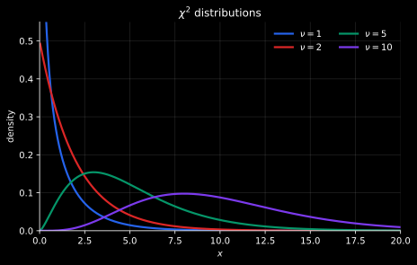
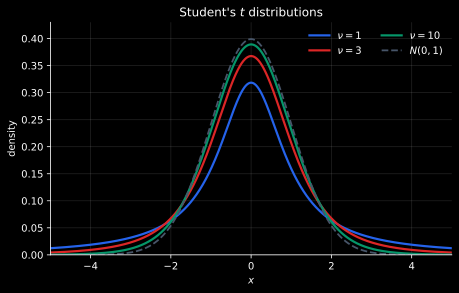
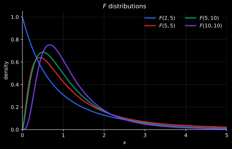

# 概率极限定理

## 切比雪夫不等式

对任意 $\varepsilon>0$，

$$
P\{|X-\operatorname{E}(X)|<\varepsilon\}
\geqslant 1 -\frac{\operatorname{D}(X)}{\varepsilon^2}.
$$
## 大数定律

前提条件： $X_1,X_2,\ldots$ 独立同分布，$E(X_i)=\mu$，且方差存在。

则

$$
\bar X_n=\frac1n\sum_{i=1}^{n}X_i
\xrightarrow{P}\mu.
$$

**样本均值会依概率收敛到期望。** 使用极限形式表述：$$\lim_{ n \to \infty } P\left\{ \left| \frac{1}{n}\sum_{i=1}^{n}X_{i}-\mu \right|<\varepsilon \right\}=1$$

## 中心极限定理

前提条件： $X_i$ 独立同分布，$E(X_i)=\mu$，$\operatorname{D}(X_i)=\sigma^2<\infty$

则

$$
\lim_{ n \to \infty } \frac{\sum_{i=1}^{n}X_i-n\mu}{\sigma\sqrt n}

\sim N(0,1).
$$

$$
\lim_{ n \to \infty } \bar X_n\sim N\left(\mu,\frac{\sigma^2}{n}\right).
$$

# 样本、统计量与观测值

- **样本**：$\displaystyle X_1,\ldots,X_n$ 是从总体独立同分布抽取的随机变量，实际观测到的数值记为 $\displaystyle x_1,\ldots,x_n$。
- **统计量**：不含未知总体参数的样本函数 $\displaystyle T=T(X_1,\ldots,X_n)$，随样本变化，本身也是随机变量。
- **观测值**：将观测数据代入统计量，得到具体数值 $\displaystyle t=T(x_1,\ldots,x_n)$。

例如，$\displaystyle \bar X=\frac1n\sum_{i=1}^nX_i$ 是统计量；观测到 $\displaystyle (x_1,x_2,x_3)=(2,4,6)$ 时，$\displaystyle \bar x=4$ 是它的观测值。若总体均值 $\displaystyle \mu$ 未知，$\displaystyle \bar X-\mu$ 就不是统计量，因为仅凭样本不能算出它的数值。

# 三大抽样分布
## 上分位数

对连续型随机变量 $X$，上 $\alpha$ 分位数 $x_\alpha$ 满足

$$
P\{X>x_\alpha\}=\alpha.
$$

下标表示右尾面积。

## $\chi^2$ 分布

**若 $X_1,\ldots,X_n$ 相互独立**且均服从 $N(0,1)$，则

$$
U=\sum_{i=1}^{n}X_i^2\sim\chi^2(n).
$$

性质：
1. $E(U)=n,\operatorname{D}(U)=2n.$
2. 若 $U\sim\chi^2(m)$、$V\sim\chi^2(n)$ 且相互独立，则 $U+V\sim\chi^2(m+n).$

## $t$ 分布

若$Z\sim N(0,1),U\sim\chi^2(n),$ **$Z$与$U$独立**，则

$$
T=\frac{Z}{\sqrt{U/n}}\sim t(n).
$$

性质：
1. $t$ 分布关于零对称。即$E(t)=0,t_{1-\alpha}(n)+t_{\alpha}(n)=0$
2. $t \sim \displaystyle\lim_{ n \to \infty }t(n)\implies t \sim N(0,1)$

## $F$ 分布

若$U\sim\chi^2(m),\qquad V\sim\chi^2(n)$,$U,V$独立,则

$$
F=\frac{U/m}{V/n}\sim F(m,n).
$$

性质：
1. 若 $F\sim F(m,n)$，则$\frac1F\sim F(n,m),$ 从而上分位数满足$F_\alpha(m,n)=\frac1{F_{1-\alpha}(n,m)}$
2. $t \sim t(n)\implies t^{2} \sim F(1,n)$

## 统计量分布的标准化方法

**先拆出标准正态变量，再看平方和、平方根与比值，最后补系数。**

1. **统一尺度**：正态变量或正态线性组合 $\displaystyle L$，先化为 $\displaystyle \frac{L-E(L)}{\sqrt{D(L)}}$；平方项也要除以对应方差。
2. **检查独立性与自由度**：独立标准正态变量的平方和才直接服从卡方分布，个数就是自由度。不同线性组合可能共享原变量；若它们联合正态，可通过协方差为零证明独立。样本残差平方和的自由度为 $\displaystyle n-1$。
3. **匹配结构**：设 $\displaystyle Z\sim N(0,1)$、$\displaystyle U\sim\chi^2(r)$、$\displaystyle V\sim\chi^2(s)$，且相互独立，则：

$$
U\sim\chi^2(r),\qquad
\frac{Z}{\sqrt{\frac{U}{r}}}\sim t(r),\qquad
\frac{\frac{U}{r}}{\frac{V}{s}}\sim F(r,s).
$$

例如，遇到 $\displaystyle Y=\frac{Z}{\sqrt U}$，应写 $\displaystyle \sqrt r\,Y\sim t(r)$；遇到 $\displaystyle Y=\frac UV$，应写 $\displaystyle \frac srY\sim F(r,s)$。

> [!example] 分子、分母共享原变量时，怎样识别分布
> 设 $\displaystyle X_1,X_2,X_3$ 独立同分布于 $\displaystyle N(0,\sigma^2)$，其中 $\displaystyle \sigma>0$。求统计量 $\displaystyle R=\frac{X_1+X_2}{\sqrt{(X_1-X_2)^2+2X_3^2}}$ 经怎样的倍数变换服从 $\displaystyle t$ 分布，并求 $\displaystyle R^2$ 对应的 $\displaystyle F$ 分布。
>
> 将三个线性组合分别除以自身标准差：
>
> $$
> Z=\frac{X_1+X_2}{\sqrt2\sigma},\qquad
> A=\frac{X_1-X_2}{\sqrt2\sigma},\qquad
> B=\frac{X_3}{\sigma}.
> $$
>
> 三者都服从标准正态分布。由于 $\displaystyle \operatorname{Cov}(X_1+X_2,X_1-X_2)=\sigma^2-\sigma^2=0$，且三者联合正态，$\displaystyle Z,A$ 独立；$\displaystyle B$ 又与它们独立。因此 $\displaystyle U=A^2+B^2\sim\chi^2(2)$，且 $\displaystyle Z$ 与 $\displaystyle U$ 独立。
>
> 代回原式，注意分母还缺少“除以自由度”：
>
> $$
> R=\frac{Z}{\sqrt{A^2+B^2}}=\frac{Z}{\sqrt U},\qquad
> \sqrt2R=\frac{Z}{\sqrt{\frac U2}}\sim t(2).
> $$
>
> 再平方，分子 $\displaystyle Z^2\sim\chi^2(1)$，所以：
>
> $$
> 2R^2=\frac{\frac{Z^2}{1}}{\frac U2}\sim F(1,2).
> $$

# 样本数字特征

样本均值与样本方差、样本标准差为

$$
\bar X=\frac1n\sum_{i=1}^{n}X_i,
\qquad
S^2=\frac1{n-1}\sum_{i=1}^{n}(X_i-\bar X)^2\qquad S=\sqrt{ S^{2} }.
$$

> [!note] 样本方差分母为什么是 $n-1$
> 对每一项写成 $X_i-\mu=(X_i-\bar X)+(\bar X-\mu)$，平方后从 $i=1$ 求到 $n$：交叉项为 $2(\bar X-\mu)\sum_{i=1}^{n}(X_i-\bar X)=0$，所以
> $$
> \sum_{i=1}^{n}(X_i-\mu)^2=\sum_{i=1}^{n}(X_i-\bar X)^2+n(\bar X-\mu)^2.
> $$
> 两边取期望，左边为 $n\sigma^2$，右边第二项为 $nD(\bar X)=\sigma^2$，因此 $E[\sum_{i=1}^{n}(X_i-\bar X)^2]=(n-1)\sigma^2$。所以除以 $n-1$ 才有 $E(S^2)=\sigma^2$；若除以 $n$，期望为 $(n-1)\sigma^2/n$，不满足无偏性。

若 $X_1,\ldots,X_n$ 独立同分布，$E(X_i)=\mu$，$D(X_i)=\sigma^2<\infty$，则
$$
 E(\bar X)=\mu,\qquad D(\bar X)=\frac{\sigma^2}{n},\qquad E(S^2)=\sigma^2.
$$

若进一步 $X_i\sim N(\mu,\sigma^2)$ ：

$$
\frac{\bar X-\mu}{\sigma/\sqrt n}\sim N(0,1).
$$

$$
\frac{\sum_{i=1}^{n}(X_i-\mu)^2}{\sigma^2}
\sim\chi^2(n).
$$
以已知 $\mu$ 为中心时有 $n$ 个独立标准正态平方项；以 $\bar X$ 为中心时却有 $\sum_{i=1}^{n}\frac{(X_i-\bar X)}{\sigma}=0$，因此只剩 $n-1$ 个线性无关的服从标准正态分布的随机变量。

$$
\frac{(n-1)S^2}{\sigma^2}\sim\chi^2(n-1).
$$

在正态总体下，$\bar X$ 与 $S^2$ 独立，因此

$$
\frac{\bar X-\mu}{S/\sqrt n}\sim t(n-1).
$$

# 顺序统计量

将样本从小到大排列：

$$
X_{(1)}\le X_{(2)}\le\cdots\le X_{(n)}.
$$

$X_{(k)}$ 称为第 $k$ 个顺序统计量；$X_{(1)}$、$X_{(n)}$ 分别为样本最小值、最大值。

事件 $\{X_{(k)}\le x\}$ 表示至少有 $k$ 个样本不超过 $x$，因此
$$F_{X_{(k)}}(x)=\sum_{j=k}^{n}\binom nj[F(x)]^j[1-F(x)]^{n-j}.$$
求导有：
$$
f_{X_{(k)}}(x)
=\frac{n!}{(k-1)!(n-k)!}
[F(x)]^{k-1}[1-F(x)]^{n-k}f(x).
$$

# 参数的点估计

## 矩估计

**原点矩**以零为中心，**中心矩**先减去均值。假设相应矩存在，$\displaystyle k$ 阶总体矩与样本矩分别为：

| 矩   | 总体矩                                                                 | 样本矩                                                       |
| --- | ------------------------------------------------------------------- | --------------------------------------------------------- |
| 原点矩 | $\displaystyle E(X^k)$                                           | $\displaystyle A_k=\frac1n\sum_{i=1}^nX_i^k$           |
| 中心矩 | $\displaystyle E[(X-E(X))^k]$ $\displaystyle E[(X-E(X))^2]=D(X)$ | $\displaystyle B_k=\frac1n\sum_{i=1}^n(X_i-\bar X)^k$  |

**估计步骤**：先由总体分布算出含未知参数的总体矩，再令它等于能由样本算出的样本矩，解出参数。例如 $\displaystyle E_\theta(X^2)=g(\theta)$，就解 $\displaystyle g(\hat\theta)=A_2$；代入观测数据时，右侧是已知数 $\displaystyle \frac1n\sum_{i=1}^nx_i^2$。

若无法直接得到对应样本矩，则利用原点矩与中心矩的关系将形式进行转化。

最常用关系：$$E(X^{2})=EX^{2}+E[(X-E(X))^2]$$

> [!example] 二阶原点矩的矩估计
> 设 $\displaystyle (X_1,X_2,\ldots,X_n)$ 为总体 $\displaystyle X$ 的简单随机样本。已知$\displaystyle \bar X$与$S^{2}$，求 $\displaystyle E(X^2)$ 的矩估计量。
> 二阶总体原点矩用二阶样本原点矩。但二阶样本原点矩无法得到，于是根据$E(X^{2})=DX+E^{2}X$，找它们对应的样本矩进行估计：
>
> $$
> \widehat{E(X^2)}
> =\bar X^2+\frac{n-1}nS^2.
> $$
>
> >[!danger] 矩估计不要求无偏
> > 二阶中心样本矩不是方差$S^{2}$，是$\displaystyle\frac{n-1}{n}S^{2}$。

## 最大似然估计

把样本观测值固定，将联合概率或联合概率密度看成参数的函数：

$$
L(\theta)=\prod_{i=1}^{n}f(x_i;\theta).
$$

通常改求对数似然 $\ell(\theta)=\ln L(\theta)$ 的最大值。

> [!example] 最大似然估计
> 设 $X_1,\ldots,X_n$ 独立同分布，且密度为 $f(x;\theta)=\theta^2xe^{-\theta x}$，其中 $x>0$、$\theta>0$。给定观测值$(x_{1},\ldots,x_{n})$后，联合似然函数为：
>
> $$
> L(\theta)=\prod_{i=1}^{n}\theta^2x_i e^{-\theta x_i}
> =\theta^{2n}\left(\prod_{i=1}^{n}x_i\right)e^{-\theta\sum_{i=1}^{n}x_i}.
> $$
>
> 取对数得到：
>
> $$
> \ell(\theta)=\ln L(\theta)=2n\ln\theta+\sum_{i=1}^{n}\ln x_i-\theta\sum_{i=1}^{n}x_i, \quad\theta >0
> $$
>
> 求导，并令导函数大于 0 与导函数小于 0，得到让对数似然达到极大值的值为 $\displaystyle\hat\theta=\frac{2n}{\sum_{i=1}^{n}x_i}$。即：
>
> $$
> \hat\theta=\frac{2n}{\sum_{i=1}^{n}x_i}=\frac{2}{\bar x}.
> $$

若 $u(\theta)$ 在定义域内严格单调，则 $u(\hat\theta)$ 是 $u(\theta)$ 的最大似然估计。

## 评价标准

- 无偏性：先按定义展开 $E(\hat\theta)$；若计算结果为 $\theta$，就得到 $E(\hat\theta)=\theta$，因此 $\hat\theta$ 无偏。
- 有效性：先分别证明两个估计量都无偏，再计算 $D(\hat\theta_1)$ 与 $D(\hat\theta_2)$；若 $D(\hat\theta_1)<D(\hat\theta_2)$，则 $\hat\theta_1$ 更有效。
- 一致性（相合性）：要证明对任意 $\varepsilon>0$ 有 $\displaystyle\lim_{ n \to \infty }P\{|\hat\theta_n-\theta|\ge\varepsilon\}=0$。可利用切比雪夫不等式构造这个形式，概率的下界必然为0，再取极限将概率的上界$1 -\frac{\operatorname{D}(X)}{\varepsilon^2}$逼近于 0 ，根据夹逼定理得概率等于 0，于是证明依概率收敛。

# 参数的区间估计

区间估计先写出一个分布已知的统计量的中间 $1-\alpha$ 概率区间，再把不等式反解为未知参数的范围。

设总体为 $N(\mu,\sigma^2)$。下面分别列出已知分布的统计量，并说明如何由概率区间反解出参数区间。
## 估计 $\mu$

若 $\sigma^2$ 已知，

$$
\frac{\bar X-\mu}{\sigma/\sqrt n}\sim N(0,1),
$$

由 $\displaystyle P\left\{ -z_{\frac{\alpha}{2}}< Z< z_{\frac{\alpha}{2}} \right\}=1-\alpha$，代入 $\displaystyle Z=\frac{\bar X-\mu}{\sigma/\sqrt n}$，再反解 $\mu$，得到： 

$$
\left(
\bar X-z_{\alpha/2}\frac{\sigma}{\sqrt n},
\bar X+z_{\alpha/2}\frac{\sigma}{\sqrt n}
\right).
$$

若 $\sigma^2$ 未知，

$$
\frac{\bar X-\mu}{S/\sqrt n}\sim t(n-1),
$$

同理反解 $\mu$，得到：

$$
\left(
\bar X-t_{\alpha/2}(n-1)\frac{S}{\sqrt n},
\bar X+t_{\alpha/2}(n-1)\frac{S}{\sqrt n}
\right).
$$

## 估计 $\sigma^2$

若 $\mu$ 已知，

$$
\frac{\sum_{i=1}^{n}(X_i-\mu)^2}{\sigma^2}\sim\chi^2(n),
$$

反解 $\sigma^2$，得到：

$$
\left(
\frac{\sum_{i=1}^{n}(X_i-\mu)^2}{\chi^2_{\alpha/2}(n)},
\frac{\sum_{i=1}^{n}(X_i-\mu)^2}{\chi^2_{1-\alpha/2}(n)}
\right).
$$

若 $\mu$ 未知，

$$
\frac{(n-1)S^2}{\sigma^2}\sim\chi^2(n-1),
$$

解得：

$$
\left(
\frac{(n-1)S^2}{\chi^2_{\alpha/2}(n-1)},
\frac{(n-1)S^2}{\chi^2_{1-\alpha/2}(n-1)}
\right).
$$

# 假设检验

假设检验用样本判断关于总体的某个说法是否应被拒绝。先提出两个相互对立的假设：

- **原假设 $\displaystyle H_0$**：检验时暂且认为成立的说法，是确定检验统计量分布、计算概率的依据。
- **备择假设 $\displaystyle H_1$**：与 $\displaystyle H_0$ 对立的说法；样本提供足够证据使我们拒绝 $\displaystyle H_0$ 时，就支持 $\displaystyle H_1$。

**小概率原理**：小概率事件在一次试验中通常不会发生。若检验统计量的观测值落入预先选定的、在原假设 $\displaystyle H_0$ 下概率很小的区域（拒绝域），就据此拒绝 $\displaystyle H_0$，支持备择假设 $\displaystyle H_1$。

这是带有犯错风险的判断，并非逻辑上的反证；未落入拒绝域时不拒绝 $\displaystyle H_0$，也不代表已证明 $\displaystyle H_0$ 正确。第一类错误概率不超过显著性水平 $\displaystyle \alpha$。

## 两类错误

- **第一类错误**：$\displaystyle H_0$ 为真却拒绝它。显著性水平 $\displaystyle \alpha$ 是这类错误概率的上限。
- **第二类错误**：$\displaystyle H_0$ 为假却不拒绝它。对给定的备择参数值，其概率记为 $\displaystyle \beta$，正确拒绝的概率（检验功效）为 $\displaystyle 1-\beta$。

## 检验统计量与拒绝域

这里只讨论单个正态总体的均值，设 $\displaystyle X_1,\ldots,X_n$ 独立同分布于 $\displaystyle N(\mu,\sigma^2)$，以 $\displaystyle \mu_0$ 为待检验的均值。

**拒绝域的形式与 $\displaystyle H_1$ 一致**：$\displaystyle H_1:\mu>\mu_0$ 对应右侧，$\displaystyle H_1:\mu<\mu_0$ 对应左侧，$\displaystyle H_1:\mu\ne\mu_0$ 对应双侧。拒绝域包含临界点，使用 $\displaystyle \geqslant$ 或 $\displaystyle \leqslant$。

先根据方差是否已知选择 $\displaystyle Z$ 或 $\displaystyle T$ 统计量，再按 $\displaystyle H_1$ 选尾部，令该尾部在 $\displaystyle \mu=\mu_0$ 时的概率为 $\displaystyle \alpha$，解出临界值。两种分布在此时都关于零对称：单侧取一个尾部，双侧取两尾各 $\displaystyle \frac{\alpha}{2}$。

单侧检验的 $\displaystyle H_0$ 包含一侧的所有均值，其第一类错误概率在边界 $\displaystyle \mu=\mu_0$ 处最大。因此按边界计算临界值，就能保证整个 $\displaystyle H_0$ 下的第一类错误概率都不超过 $\displaystyle \alpha$。

> [!example] 已知方差，检验 $\displaystyle H_0:\mu\leqslant\mu_0$，$\displaystyle H_1:\mu>\mu_0$
> 在边界 $\displaystyle \mu=\mu_0$ 处，$\displaystyle Z=\frac{\bar X-\mu_0}{\frac{\sigma}{\sqrt n}}\sim N(0,1)$。记此时的概率为 $\displaystyle P_0$，则：
>
> $$
> P_0(Z\geqslant c)=\alpha
> \Rightarrow c=z_\alpha
> \Rightarrow Z\geqslant z_\alpha
> \iff \bar X\geqslant \mu_0+z_\alpha\frac{\sigma}{\sqrt n}.
> $$
>
> 若改为 $\displaystyle H_0:\mu\geqslant\mu_0$、$\displaystyle H_1:\mu<\mu_0$，取左尾 $\displaystyle Z\leqslant -z_\alpha$；若改为 $\displaystyle H_0:\mu=\mu_0$、$\displaystyle H_1:\mu\ne\mu_0$，取双尾 $\displaystyle \lvert Z\rvert\geqslant z_{\frac{\alpha}{2}}$。

## 正态总体均值检验的六种情况

| 条件与假设                                                                        | 检验统计量及其在 $\displaystyle \mu=\mu_0$ 时的分布                                                                     | 临界值推导与拒绝域（$\displaystyle P_0$ 表示 $\displaystyle \mu=\mu_0$ 时的概率，分位数均为上分位数）                                                                                                  |
| ---------------------------------------------------------------------------- | ----------------------------------------------------------------------------------------------- | --------------------------------------------------------------------------------------------------------------------------------------------------------------------- |
| 方差已知，双侧。 $\displaystyle H_0:\mu=\mu_0$ $\displaystyle H_1:\mu\ne\mu_0$ | $\displaystyle Z=\frac{\bar X-\mu_0}{\frac{\sigma}{\sqrt n}}\sim N(0,1)$                        | $\displaystyle P_0(\lvert Z\rvert\geqslant c)=\alpha\Rightarrow c=z_{\frac{\alpha}{2}}$ 拒绝域：$\displaystyle \lvert Z\rvert\geqslant z_{\frac{\alpha}{2}}$           |
| 方差已知，右侧。 $\displaystyle H_0:\mu\leqslant\mu_0$ $\displaystyle H_1:\mu>\mu_0$   | $\displaystyle Z=\frac{\bar X-\mu_0}{\frac{\sigma}{\sqrt n}}\sim N(0,1)$                        | $\displaystyle P_0(Z\geqslant c)=\alpha\Rightarrow c=z_\alpha$ 拒绝域：$\displaystyle Z\geqslant z_\alpha$                                                             |
| 方差已知，左侧。 $\displaystyle H_0:\mu\geqslant\mu_0$ $\displaystyle H_1:\mu<\mu_0$   | $\displaystyle Z=\frac{\bar X-\mu_0}{\frac{\sigma}{\sqrt n}}\sim N(0,1)$                        | $\displaystyle P_0(Z\leqslant c)=\alpha\Rightarrow c=-z_\alpha$ 拒绝域：$\displaystyle Z\leqslant -z_\alpha$                                                           |
| 方差未知，双侧。 $\displaystyle H_0:\mu=\mu_0$ $\displaystyle H_1:\mu\ne\mu_0$ | $\displaystyle T=\frac{\bar X-\mu_0}{\frac{S}{\sqrt n}}\sim t(n-1)$ $\displaystyle S$ 为样本标准差 | $\displaystyle P_0(\lvert T\rvert\geqslant c)=\alpha\Rightarrow c=t_{\frac{\alpha}{2}}(n-1)$ 拒绝域：$\displaystyle \lvert T\rvert\geqslant t_{\frac{\alpha}{2}}(n-1)$ |
| 方差未知，右侧。 $\displaystyle H_0:\mu\leqslant\mu_0$ $\displaystyle H_1:\mu>\mu_0$   | $\displaystyle T=\frac{\bar X-\mu_0}{\frac{S}{\sqrt n}}\sim t(n-1)$ $\displaystyle S$ 为样本标准差 | $\displaystyle P_0(T\geqslant c)=\alpha\Rightarrow c=t_\alpha(n-1)$ 拒绝域：$\displaystyle T\geqslant t_\alpha(n-1)$                                                   |
| 方差未知，左侧。 $\displaystyle H_0:\mu\geqslant\mu_0$ $\displaystyle H_1:\mu<\mu_0$   | $\displaystyle T=\frac{\bar X-\mu_0}{\frac{S}{\sqrt n}}\sim t(n-1)$ $\displaystyle S$ 为样本标准差 | $\displaystyle P_0(T\leqslant c)=\alpha\Rightarrow c=-t_\alpha(n-1)$ 拒绝域：$\displaystyle T\leqslant -t_\alpha(n-1)$                                                 |
