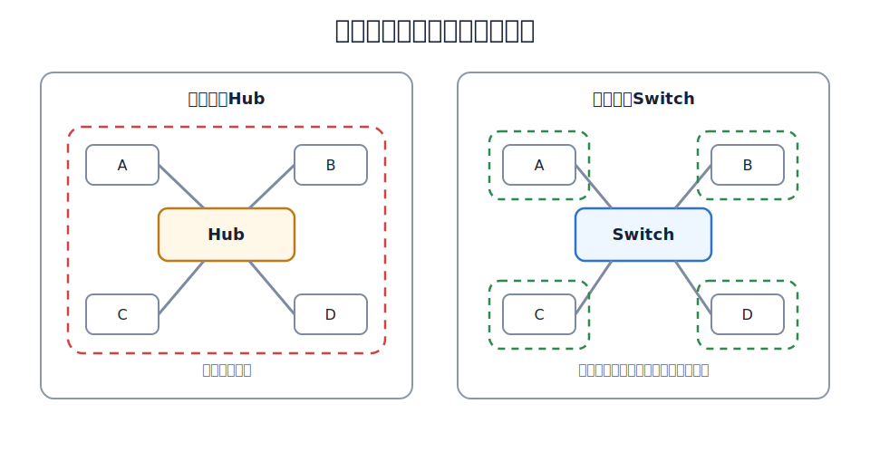
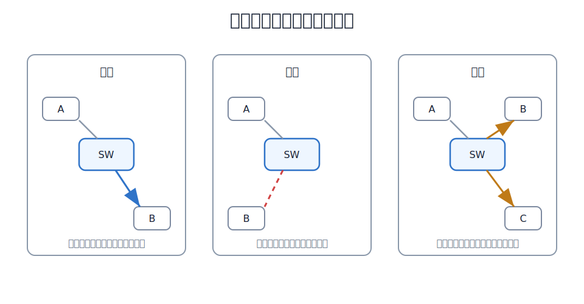
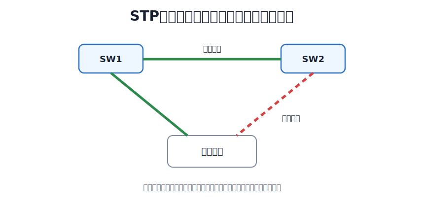

# 交换式以太网

[[Shared-Ethernet|共享式以太网]]把多个站点放在同一个碰撞域中。交换式以太网使用交换机连接站点，每个交换机端口通常形成独立链路。若端口直接连接主机或另一台交换机，该链路可工作在**全双工方式**，不再争用共享介质，也就不需要 CSMA/CD。

交换机工作在**数据链路层**。它不是简单地转发比特，而是接收完整帧，检查帧，读取 MAC 地址，并根据交换表决定如何处理帧。

> [!summary] 交换机提高性能的原因
>- 隔离碰撞域：每个端口独立，减少或消除碰撞。
>- 支持全双工：直接连接主机或交换机时，收发可同时进行。
>- 并行交换：交换机内部交换结构可以让多对端口同时转发不同帧。

> [!note]
> 交换机隔离**碰撞域**，但默认不隔离**广播域**。广播帧仍会被交换机泛洪到同一 VLAN 内的其他端口。

# 网桥与交换机

网桥 Bridge 和以太网交换机 Switch 都工作在数据链路层，都根据 MAC 地址转发帧。可以把交换机理解为多端口、高性能、硬件化实现的网桥。

| 设备 | 工作层次 | 主要依据 | 典型行为 |
|---|---|---|---|
| 集线器 | 物理层 | 比特信号 | 一个端口进，其他端口出 |
| 网桥 | 数据链路层 | MAC 地址 | 连接多个网段，软件转发较多 |
| 交换机 | 数据链路层 | MAC 地址 | 多端口并行交换，硬件转发 |

# 交换表

交换机维护一张交换表，也称 MAC 地址表或转发表。表项通常包含：

| 字段 | 含义 |
|---|---|
| MAC 地址 | 某个主机或接口的 MAC 地址 |
| 接口号 | 到达该 MAC 地址应从哪个端口转发 |
| 老化时间 | 表项多久未被刷新后失效 |

交换表不是手工提前填好的。透明网桥和交换机通常通过**自学习**建立交换表。

# 自学习

交换机每收到一个无误码帧，先看源 MAC 地址。

若帧从端口 $P$ 进入，源 MAC 地址为 $S$，交换机就记录：

$$
S \rightarrow P
$$

这表示：以后若要把帧发给 $S$，应该从端口 $P$ 转发。

**自学习只看源地址，不看目的地址**。目的地址用于决定本次帧如何转发。

[html-card height=760](../assets/switch-learning-forwarding-slides.html)

# 转发、过滤、泛洪

交换机查目的 MAC 地址后，有三种基本处理。

| 情况 | 条件 | 动作 |
|---|---|---|
| 转发 | 目的 MAC 在交换表中，且对应端口不是入端口 | 从表项指定端口转发 |
| 过滤 | 目的 MAC 在交换表中，但对应端口就是入端口 | 丢弃，不再转发 |
| 泛洪 | 目的 MAC 未知，或目的地址是广播地址 | 从除入端口外的其他端口转发 |

过滤容易被忽略。若交换机发现目的主机就在帧进入的同一网段或同一端口方向，说明该帧不需要经过交换机转发，交换机应丢弃它。

# 碰撞域与广播域

交换机端口隔离碰撞域。若交换机每个端口直接连接一台主机，并工作在全双工方式，则主机和交换机之间不存在共享介质争用。

但普通二层交换机默认不隔离广播域。广播帧、未知单播帧会在同一 [[VLAN|VLAN]] 内泛洪。若没有 VLAN，一个交换式以太网通常仍是一个广播域。

| 设备 | 隔离碰撞域 | 隔离广播域 |
|---|---|---|
| 集线器 | 否 | 否 |
| 交换机 | 是 | 默认否 |
| 路由器 | 是 | 是 |

# 生成树协议

交换网络中若存在二层环路，广播帧和未知单播帧可能沿环路不断转发，造成广播风暴；交换机还可能从不同端口反复学习同一个 MAC 地址，导致交换表震荡。

生成树协议 STP 的作用是：在有环的物理拓扑中，逻辑上阻塞部分冗余链路，形成无环的树形转发拓扑。

STP 并不是把冗余链路拔掉。被阻塞的端口通常不参与普通数据帧转发；当活动链路故障时，交换机可以重新计算生成树，让备用链路参与转发。

