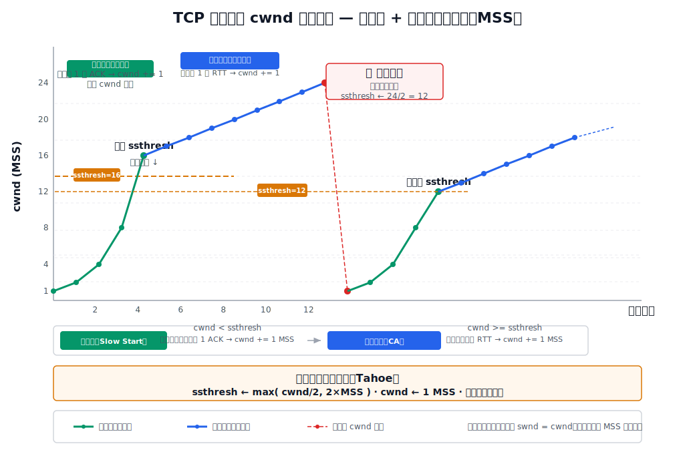
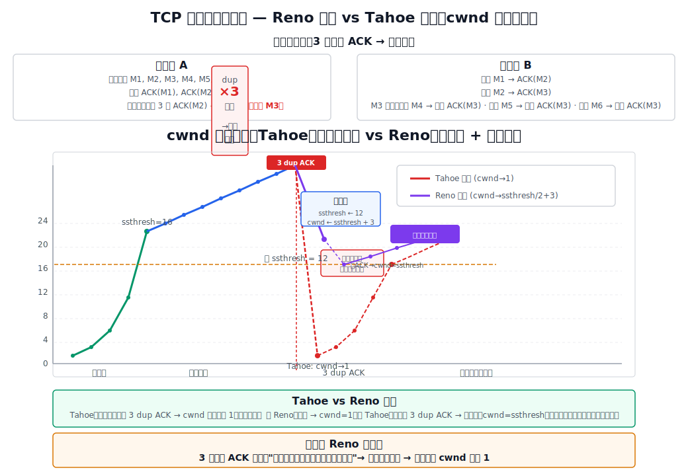
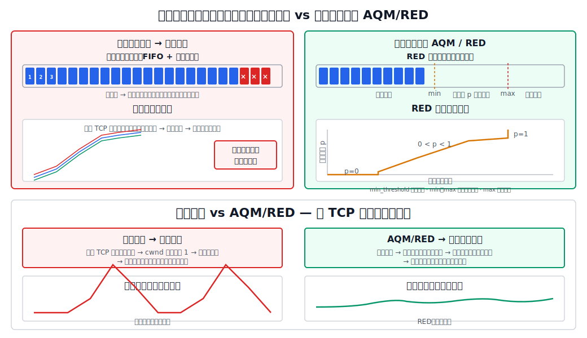

# 拥塞控制要解决的问题

[[Network-Congestion-Control|拥塞]]是**网络内部**的问题——路由器缓存、链路带宽、处理能力等资源不足以承载当前的通信量，导致队列溢出和大量丢包。

拥塞控制与[[TCP-Flow-Control|流量控制]]的目标不同：

| 维度 | 流量控制 | 拥塞控制 |
|---|---|---|
| 要解决的问题 | 接收方来不及处理 | 网络来不及转发 |
| 范围 | 点对点 | 全局 |
| 反馈来源 | 接收方直接通告 rwnd | 发送方通过超时、重复 ACK 等推断 |

拥塞控制的核心思想：**试探着增加发送窗口，丢包了就减小，但不应一次砍过头。**

## 开环控制与闭环控制

从控制论的角度，拥塞控制分为两类：

| | 开环控制 | 闭环控制 |
|---|---|---|
| 思路 | 设计阶段就保证问题不发生 | 运行时根据反馈动态调整 |
| 适用条件 | 流量特征可准确规定、性能要求可事先获得 | 流量特征不可准确描述、网络不提供资源预留 |
| 因特网选择 | — | ✅ 因特网采用闭环控制 |

闭环控制包含三个环节：监测拥塞（何时何地发生）→ 传递拥塞信息（传送到能采取行动的地方）→ 调整网络运行（解决拥塞问题）。

## 显式反馈与隐式反馈

根据拥塞信息的反馈形式，闭环控制又分为两种：

| | 显式反馈 | 隐式反馈 |
|---|---|---|
| 信息来源 | 拥塞节点（路由器）直接向源站发送拥塞通知 | 源站通过观测网络行为自行推断 |
| 典型方式 | ICMP 源站抑制报文、分组中标记拥塞位（如 ECN） | 超时重传、RTT 增大、重复 ACK |
| 因特网选择 | 需要网络层配合，部分机制可用 | ✅ **TCP 主要使用隐式反馈** |

> TCP 判断拥塞的依据是**超时重传**——在传输质量较好的网络中，因误码丢包的概率远小于 1%，超时重传几乎就意味着网络拥塞。

# 核心变量

## cwnd、rwnd 与 swnd

TCP 发送方维护一个**拥塞窗口** `cwnd`（Congestion Window）。它完全由发送方根据网络反馈自行估算，接收方不知道它的值。

最终决定发送速率的窗口是：

$$
\text{swnd} = \min(\text{cwnd},\ \text{rwnd})
$$

讨论拥塞控制时，通常假设 `rwnd` 足够大（接收方不构成瓶颈），此时 `swnd = cwnd`。换言之，在这一假设下，**`cwnd` 是多少 MSS，就能连续发送多少个 TCP 报文段**。

## ssthresh：慢开始门限

慢开始门限 `ssthresh` 将拥塞控制分成两个阶段：

$$
\begin{cases}
\text{cwnd} < \text{ssthresh} & \rightarrow \text{慢开始（指数增长）} \\[4pt]
\text{cwnd} > \text{ssthresh} & \rightarrow \text{拥塞避免（线性增长）}
\end{cases}
$$

当 $\text{cwnd}=\text{ssthresh}$ 时，慢开始和拥塞避免都可以使用。教材例题中常把“达到门限”作为切换点处理：增长到 `ssthresh` 后，下一轮按拥塞避免的线性规则继续增长。

`ssthresh` 的初始值通常较大（如 16 MSS），在发生拥塞后会被重新赋值为当前 `cwnd` 的一半。

# 为什么 cwnd 用 MSS 作单位？发送窗口上限是 MSS 吗？

**发送窗口的上限远大于 MSS。**

**MSS（最大报文段长度）限制的是单个 TCP 报文段数据载荷的最大长度**——每个报文段最多携带 MSS 字节的应用数据。对以太网环境，MSS 通常为 1460 字节。

**发送窗口 swnd 限制的是"已发送但未确认"的总数据量**。窗口内可以有多个报文段同时在网络中传输（"在飞"）。cwnd=1 时可以连续发 1 个报文段，cwnd=24 时可以连续发 24 个报文段。

用公式表述：

$$
\begin{aligned}
\text{每个报文段数据量} &\le \text{MSS} \\[4pt]
\text{发送窗口总量} = \text{swnd} &= cwnd \times \text{MSS} \quad (\text{当 } cwnd \text{ 以 MSS 为单位时})
\end{aligned}
$$

因此，发送窗口的实际字节上限为：

$$
\text{swnd}_{\max} = \min(\text{cwnd}_{\max},\ \text{rwnd}_{\max})
$$

其中 `rwnd` 的字段为 16 bit，最大 $2^{16}-1 = 65535$ 字节；启用窗口扩大选项后可达约 1 GB。`cwnd` 没有协议字段限制，完全由算法动态决定。**两者都可以远远大于一个 MSS。**

在拥塞控制的讨论和示例中，为方便理解，通常以 MSS 为单位表示 `cwnd`（例如"cwnd=4"即 $4 \times \text{MSS}$ 字节），但这只是简化计算的单位选择，并不意味着窗口被 MSS 封顶。

# 一、慢开始

## 动机

连接刚建立时，发送方完全不知道网络的拥塞状况。若一上来就以大窗口注入数据，极易引发拥塞。更好的策略是**从小到大逐渐试探**。

## 算法

慢开始的核心规则：**每收到一个对新报文段的确认，cwnd 加 1（以 MSS 计）。**

由于每个 RTT 内发出的报文段会在 RTT 结束时得到确认，这个"每 ACK +1"的规则在效果上等价于**每经过一个传输轮次（RTT），cwnd 翻倍**。

初始 `cwnd = 1` MSS。

| 轮次 | cwnd（可发送报文段数） | 本轮发送 | 收到 ACK 后 cwnd |
|---|---|---|---|
| 1 | $1$ | M0 | $1+1 = 2$ |
| 2 | $2$ | M1, M2 | $2+2 = 4$ |
| 3 | $4$ | M3–M6 | $4+4 = 8$ |
| 4 | $8$ | M7–M14 | $8+8 = 16$ |

"慢开始"其实并不慢——cwnd 从 1 增长到 16 只需 4 个 RTT。当 `cwnd` 达到 `ssthresh` 时，停止慢开始，转入拥塞避免。

# 二、拥塞避免

进入拥塞避免阶段后，增长速度大幅放慢：**每经过一个 RTT，cwnd 加 1（以 MSS 计）。**

| 轮次 | cwnd |
|---|---|
| 5 | $16 \rightarrow 17$ |
| 6 | $17 \rightarrow 18$ |
| 7 | $18 \rightarrow 19$ |
| $\vdots$ | $\vdots$ |
| 13 | $23 \rightarrow 24$ |

拥塞避免使 cwnd 线性增长，网络在接近拥塞点时不会突然崩溃。

## 超时后的统一处理（Tahoe）

当某个发送的报文段超时重传时，发送方判断网络发生了拥塞：

1. **更新 ssthresh**：$\displaystyle \text{ssthresh} \leftarrow \max\!\left(\frac{\text{cwnd}}{2},\ 2\times \text{MSS}\right)$
2. **重置 cwnd**：$\text{cwnd} \leftarrow 1\text{ MSS}$
3. **重新执行慢开始**

从 cwnd 曲线上看，这形成了一个"锯齿"——指数上升 → 线性上升 → 骤降至 1 → 指数上升 → 线性上升 → ……

[html-card height=760](../assets/tcp-congestion-control-slides.html)

# 三、快重传

## 问题：个别丢包 ≠ 网络拥塞

Tahoe 的问题是：不管丢包原因是什么，只要超时就一刀切，cwnd 砍到 1。但实际网络中有些丢包是**个别报文段因误码丢失**，网络本身没有拥塞。

快重传的目的是：**收到 3 个重复 ACK 时立即重传，不等超时计时器**。

## 机制

接收方每收到一个失序报文段，就立即发送一个重复 ACK（不延迟），确认号仍指向期望的下一字节。

发送方计数：当收到**第 3 个重复 ACK** 时，判定对应报文段已丢失，立刻重传——不等超时计时器到时。

> 为什么是 3 个？1 个重复 ACK 可能是网络中的报文段乱序到达；2 个可能是较大程度的乱序；但连续 3 个重复 ACK 几乎可以确定是丢包了。

快重传使 TCP 在个别丢包时**不触发超时**，因而不会错误地把 cwnd 砍为 1。实践证明，使用快重传可使全网吞吐量提高约 20%。

# 四、快恢复

快恢复与快重传配合使用，是 TCP Reno 的核心改进。

## Reno 的处理（与 Tahoe 对比）

| 事件 | Tahoe（1988） | Reno（1990） |
|---|---|---|
| **超时重传** | ssthresh ← cwnd/2，cwnd ← 1，慢开始 | 同 Tahoe |
| **收到 3 dup ACK** | ssthresh ← cwnd/2，cwnd ← 1，慢开始 | ssthresh ← cwnd/2，cwnd ← ssthresh + 3，快恢复 |

Reno 的逻辑是：收到 3 个重复 ACK 意味着"后续数据已经到达接收方"，说明网络仍然可以正常传输——只是中间丢了一个报文段。不需要把 cwnd 降到 1 从头开始。

## 快恢复步骤

1. ssthresh ← cwnd / 2
2. cwnd ← ssthresh + 3（+3 是因为 3 个重复 ACK 意味着有 3 个报文段已经离开网络到达了接收方）
3. 每额外收到一个重复 ACK，cwnd += 1
4. 收到**新的累积确认**后：cwnd ← ssthresh，**直接进入拥塞避免**（跳过慢开始）

# 四算法总览

# Tahoe 与 Reno 的差异

| | Tahoe | Reno |
|---|---|---|
| 包含算法 | 慢开始、拥塞避免 | + 快重传、快恢复 |
| 超时后 | cwnd→1，慢开始 | cwnd→1，慢开始（同 Tahoe） |
| 3 dup ACK 后 | cwnd→1，慢开始 | cwnd→ssthresh+3，快恢复 → 拥塞避免 |
| 对个别丢包的效率 | 低（不必要的慢开始） | 高（避免不必要回到指数增长） |

# 与网络层的协作：AQM 与 RED

TCP 拥塞控制运行在运输层，但它严重依赖网络层路由器的分组丢弃行为。

## 尾部丢弃与全局同步

最简单的路由器策略是 FIFO + **尾部丢弃**：队列满了就把后续到达的分组全部丢弃。

当多个 TCP 连接的分组恰好经过同一拥塞路由器时，这些连接的发送方**几乎同时超时**，全部 cwnd 降为 1，全部重新慢开始。网络吞吐量剧烈振荡，随后又大量注入数据——这就是**全局同步**。

## 主动队列管理 AQM

AQM 的思路是**主动**在队列还未满时就丢弃分组（或标记拥塞），让 TCP 发送方能**提前**减速。其中最有名的是**随机早期检测 RED**。

RED 维护两个门限（队列长度的最小门限和最大门限），对每个到达的分组：

- 平均队列长度 < 最小门限 → 正常排队（不丢弃）
- 平均队列长度 > 最大门限 → 丢弃该分组
- 最小门限 ≤ 平均队列长度 ≤ 最大门限 → **以概率 $p$ 随机丢弃**

随机丢弃让只有部分 TCP 连接触发超时，不同连接在不同时间点降速，**避免全局同步**，使网络吞吐量保持相对平稳。

> IETF 曾推荐在路由器中部署 RED \[RFC 2309\]，但实际部署中 RED 的参数选择困难，目前并非所有路由器都使用 RED。

# 拥塞控制总结

TCP 拥塞控制是一套不断演进的算法族：

1. **慢开始**：cwnd 从 1 开始，每 ACK +1，实际每 RTT 翻倍，指数增长到 ssthresh 为止
2. **拥塞避免**：cwnd 超出 ssthresh 后，每 RTT +1，线性缓慢增长
3. **快重传**：收到 3 个重复 ACK 而非等待超时，即判定丢包并立即重传
4. **快恢复**：快重传后不将 cwnd 降为 1，而是减半后直接进入拥塞避免

核心规律：$\text{cwnd}$ 增长（试探网络容量）→ 丢包（容量已到）→ $\text{cwnd}$ 减半（为网络降压）→ 再次增长（继续试探）——形成"锯齿状"的 **AIMD**（Additive Increase, Multiplicative Decrease）模式。
