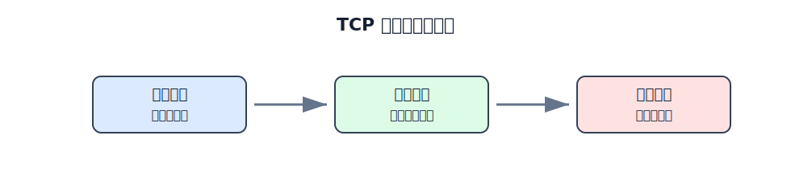
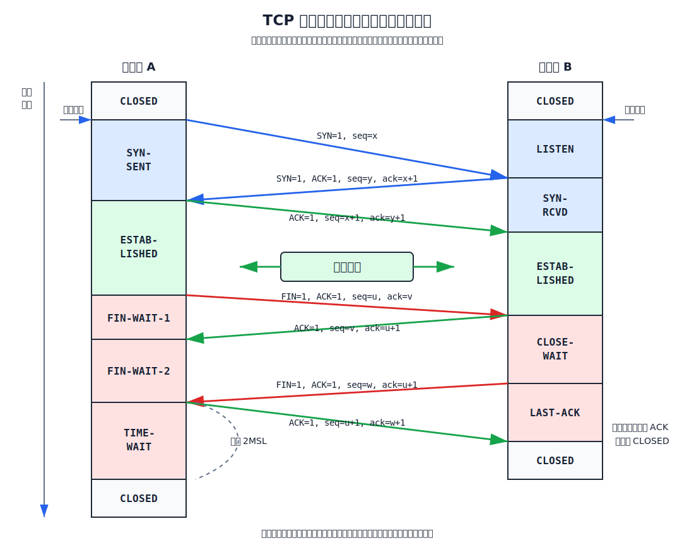

# TCP 连接管理

TCP 是面向连接的协议。通信双方传送数据前要建立连接，数据传输结束后要释放连接。

每个连接通常需要记录：

- 本端和对端的 IP 地址、端口号。
- 当前连接状态。
- 当前发送序号和接收序号。
- 发送缓存、接收缓存和重传队列。
- 发送窗口、接收窗口和相关计时器。

这些信息常放在传输控制块 TCB 中。

# TCP 状态

TCP 状态名用于描述连接处于建立、传输、释放过程中的哪个阶段。

常见状态含义：

| 状态            | 含义                           |
| ------------- | ---------------------------- |
| `LISTEN`      | 服务器被动打开，等待连接请求               |
| `SYN-SENT`    | 客户端已发送 `SYN`，等待服务器确认         |
| `SYN-RCVD`    | 服务器已收到 `SYN` 并发送 `SYN+ACK`   |
| `ESTABLISHED` | 连接已建立，可双向传输数据                |
| `FIN-WAIT-1`  | 主动关闭方已发送 `FIN`，等待确认          |
| `FIN-WAIT-2`  | 主动关闭方的 `FIN` 已被确认，等待对方 `FIN` |
| `CLOSE-WAIT`  | 被动关闭方收到 `FIN`，等待本地应用关闭       |
| `LAST-ACK`    | 被动关闭方已发送 `FIN`，等待最后 ACK      |
| `TIME-WAIT`   | 主动关闭方等待 2MSL 后关闭             |
| `CLOSED`      | 连接关闭                         |

# 三报文握手

建立 TCP 连接时，服务器先被动打开，进入 `LISTEN` 状态；客户端主动打开，向服务器发起连接请求。

[html-card height=650](../assets/tcp-three-way-handshake-slides.html)

三报文握手过程：

| 次序 | 报文段 | 主要字段 | 状态变化 |
|---|---|---|---|
| 1 | 客户端请求连接 | `SYN=1, ACK=0, seq=x` | 客户端进入 `SYN-SENT` |
| 2 | 服务器同意连接 | `SYN=1, ACK=1, seq=y, ack=x+1` | 服务器进入 `SYN-RCVD` |
| 3 | 客户端确认 | `ACK=1, seq=x+1, ack=y+1` | 双方进入 `ESTABLISHED` |

`SYN` 报文段不能携带数据，但要消耗一个序号。因此第一次握手后，客户端下一个可用序号是 `x+1`；第二次握手后，服务器下一个可用序号是 `y+1`。

三报文握手要解决三个问题：

- 确认双方的发送能力和接收能力。
- 协商双方的初始序号。
- 防止已失效的连接请求报文段造成错误连接。

# 为什么不是两报文握手

两报文握手的问题是：服务器在第二个报文发出后就可能认为连接已经建立，但客户端未必真的还想建立连接。

[html-card height=620](../assets/tcp-two-way-handshake-problem-slides.html)

典型错误场景：

1. 客户端曾经发送过一个连接请求 `SYN`，但该报文在网络中滞留。
2. 客户端已经放弃这次连接，又重新建立并释放过连接。
3. 旧的 `SYN` 后来才到达服务器。
4. 如果只用两报文握手，服务器回复 `SYN+ACK` 后就可能进入连接建立状态。
5. 客户端不会使用这个旧连接，服务器却为它分配资源并等待数据。

第三个报文的作用就是让服务器确认：客户端确实收到了服务器的初始序号，也确实要建立这次连接。

# 四报文挥手

TCP 是全双工通信。一个方向不再发送数据，并不意味着另一个方向也不能发送数据。因此连接释放通常需要四个报文段。

[html-card height=680](../assets/tcp-four-way-close-slides.html)

假设客户端主动关闭连接，过程如下：

| 次序 | 报文段 | 主要字段 | 含义 |
|---|---|---|---|
| 1 | 客户端发送释放请求 | `FIN=1, ACK=1, seq=u, ack=v` | 客户端没有数据要发送 |
| 2 | 服务器确认 | `ACK=1, seq=v, ack=u+1` | 客户端到服务器方向关闭 |
| 3 | 服务器发送释放请求 | `FIN=1, ACK=1, seq=w, ack=u+1` | 服务器也没有数据要发送 |
| 4 | 客户端确认 | `ACK=1, seq=u+1, ack=w+1` | 服务器收到后关闭 |

`FIN` 即使不携带数据，也要消耗一个序号。因此对 `FIN seq=u` 的确认是 `ack=u+1`。

第二个报文后，连接进入半关闭状态：客户端不再发送数据，但服务器仍可继续发送剩余数据。等服务器数据发送完毕后，才发送自己的 `FIN`。

# TIME-WAIT 与 2MSL

主动关闭方发送最后一个 ACK 后，不会立刻进入 `CLOSED`，而是进入 `TIME-WAIT`，等待 2MSL。

MSL 是 Maximum Segment Lifetime，即报文段在网络中的最长寿命。

[html-card height=620](../assets/tcp-2msl-slides.html)

等待 2MSL 有两个作用：

- 确保最后一个 ACK 能让被动关闭方进入 `CLOSED`。如果最后 ACK 丢失，被动关闭方会重传 `FIN`，主动关闭方仍能再次发送 ACK。
- 让本次连接中残留在网络里的旧报文段全部消失，避免影响相同四元组的新连接。

四元组是：

$$
(\text{源 IP},\ \text{源端口},\ \text{目的 IP},\ \text{目的端口})
$$

# 保活计时器

TCP 连接建立后，如果一端主机故障但没有正常释放连接，另一端可能长期不知道对方已经不可达。保活计时器用于发现这种异常。

典型机制是：

1. 服务器每收到一次客户端数据，就重新设置保活计时器（通常为 **2 小时**）。
2. 若 2 小时内无数据到达，保活计时器到期，服务器向客户端发送**探测报文段**。
3. 此后每隔 **75 秒**发送一次探测，若连续发送 **10 个**探测报文段后仍无响应，服务器认为客户端主机故障，关闭该连接。

保活计时器不是可靠传输的核心机制。它解决的是长时间空闲连接中，对端故障但没有正常发送 `FIN` 或 `RST` 的情况。
