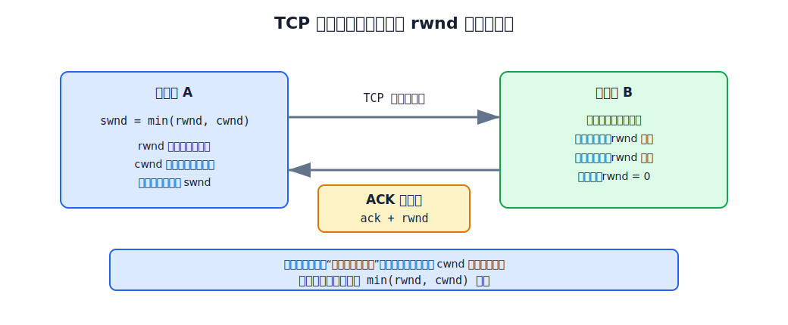
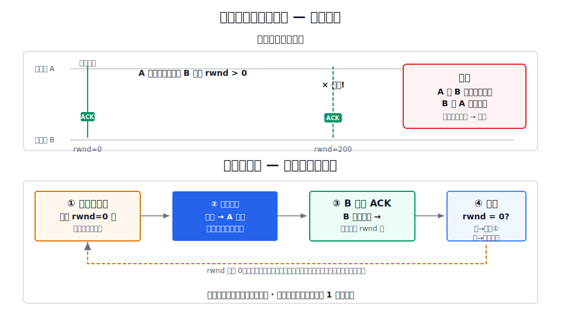

# TCP 流量控制

TCP 流量控制的目标是：**防止发送方发送太快，导致接收方接收缓存溢出而丢包**。它不是解决网络拥塞，而是解决接收方的处理能力瓶颈——应用程序一时来不及从接收缓存中取走数据。

流量控制与[[TCP-Reliable-Transmission|TCP 可靠传输]]以及[[Sliding-Window|滑动窗口]]机制紧密配合，但解决的问题不同。可靠传输关注确认、重传和按序交付；流量控制关注接收方的缓存水位。

# rwnd：接收窗口通告

流量控制的基本方法是：**接收方通过 TCP 首部的窗口字段，把自己接收缓存的可用空间大小通告给发送方。** 这个值记为 `rwnd`（receiver window）。

发送方收到报文段后，从中取出确认号 `ack` 和窗口值 `rwnd`，结合拥塞窗口 `cwnd` 构造发送窗口：

$$
\text{swnd} = \min(\text{rwnd}, \text{cwnd})
$$

在仅讨论流量控制时，通常暂不考虑 `cwnd`，令 $\text{swnd} = \text{rwnd}$。

窗口字段为 16 bit，所以 `rwnd` 最大为 $2^{16}-1 = 65535$ 字节。启用窗口扩大选项后，实际窗口可达更大值。

# 流量控制过程

以一个完整的过程为例说明接收方如何动态调整 `rwnd`。

[html-card height=520](../assets/tcp-flow-control-slides.html)

**初始状态**：主机 A 要发送 600 字节数据，接收方 B 的初始接收缓存可用空间为 400 字节，B 通告 `rwnd=400`。A 据此将 `swnd` 设为 400。

| 阶段  | A 的操作                            | B 的反馈                                                     | swnd 变化                                                     |
| --- | -------------------------------- | --------------------------------------------------------- | ----------------------------------------------------------- |
| ①   | 连续发送 `1-100`、`101-200`、`201-300` | —                                                         | `400→300→200→100`（已发未确认逐渐填满窗口）                              |
| ②   | —                                | ACK=201, rwnd=300（第一次流量控制：B 的应用进程读取较慢，缓存可用空间从 400 缩到 300） | `swnd → 300`，窗口覆盖 `201-500`。其中 `201-300` 已发未确认，`301-500` 可发 |
| ③   | 发送 `301-400`、`401-500`           | —                                                         | 可用窗口归零，A 暂停发送                                               |
| ④   | `201-300` 超时重传                   | ACK=501, rwnd=100（第二次流量控制：B 的应用进程仍未取走足够数据）                | `swnd → 100`，窗口覆盖 `501-600`                                 |
| ⑤   | 发送 `501-600`                     | ACK=601, rwnd=0（第三次流量控制：B 的接收缓存已满）                        | `swnd → 0`，A 必须停止发送                                         |

**核心规律**：接收方每次 ACK 都可能携带新的 `rwnd` 值。`rwnd` 变小 → 发送窗口收紧；`rwnd` 变大 → 发送窗口扩大。发送方不主动决定窗口，而是被动地根据接收方的反馈来调整。

# 零窗口与持续计时器

## 零窗口死锁

当 `rwnd=0` 时，发送方停止发送数据。问题在于：如果接收方后来有了可用空间，通过一个新的 ACK 通告 `rwnd > 0`，但这个 ACK **丢失了**：

发送方在等接收方通知窗口打开，接收方在等发送方发数据——双方都在等对方，形成**死锁**。

## 持续计时器

TCP 用**持续计时器**解决零窗口死锁：

1. 发送方收到 `rwnd=0` 后启动持续计时器。
2. 计时器超时 → 发送方发送一个**零窗口探测报文段**（携带 1 字节数据，这是 TCP 允许的最少数据量）。
3. 接收方收到探测报文段后回复 ACK，其中包含**当前的 `rwnd` 值**。
4. 如果 `rwnd` 仍为 0，重新启动持续计时器；如果 `rwnd > 0`，发送方恢复发送。

持续计时器的时间通常比 RTO 长，但不固定。探测报文段可能多次发送，直到窗口打开或连接超时。

# 窗口不建议向后收缩

TCP 标准**强烈不推荐**接收方缩小已经通告过的窗口。原因：发送方可能在收到收缩通知之前，已经发出了窗口内靠后的数据。如果此时强行收缩窗口，会导致"已发送但被禁止"的冲突——数据已在网络中，但按新规则变成了违规发送。

接收方只应在应用进程取走数据后**扩大**窗口，或在数据堆积时**不扩大**窗口。如果需要"缩小"窗口（缓存被其他用途挤占），正确做法是**不扩大**而非**回缩**——即保持当前通告的 `rwnd` 不变，等旧数据被确认自然消耗掉旧窗口，再通告更小的新窗口。

# 流量控制 vs 拥塞控制

流量控制经常与拥塞控制目标完全不同：

| 维度 | 流量控制 | 拥塞控制 |
|---|---|---|
| 要解决的问题 | 接收方来不及处理 | 网络来不及转发 |
| 作用范围 | 点对点（发送方 ↔ 接收方） | 全局（涉及所有主机和路由器） |
| 控制变量 | `rwnd`（接收方通告） | `cwnd`（发送方根据网络反馈估算） |
| 反馈来源 | 接收方直接告诉发送方 | 发送方通过超时、重复 ACK 等隐式推断 |
| 最终约束 | $\text{swnd} = \min(\text{rwnd}, \text{cwnd})$ | 同上——两者同时约束发送窗口 |

流量控制怕**接收方撑死**，拥塞控制怕**网络堵死**。TCP 发送窗口取二者最小值，既不能发得比接收方能收的快，也不能发得比网络能转发的快。
