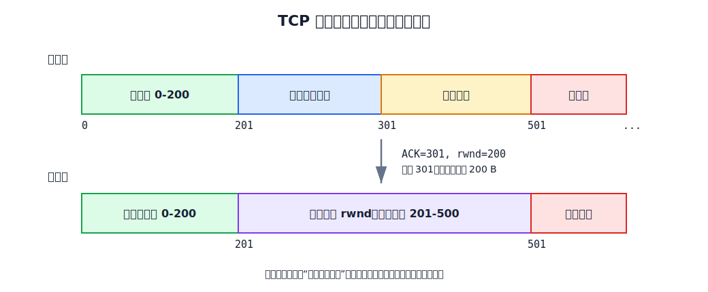
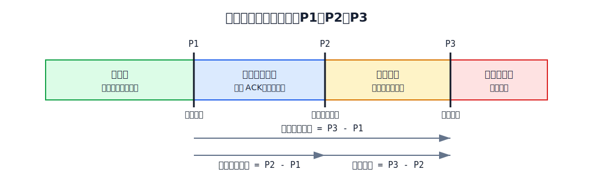
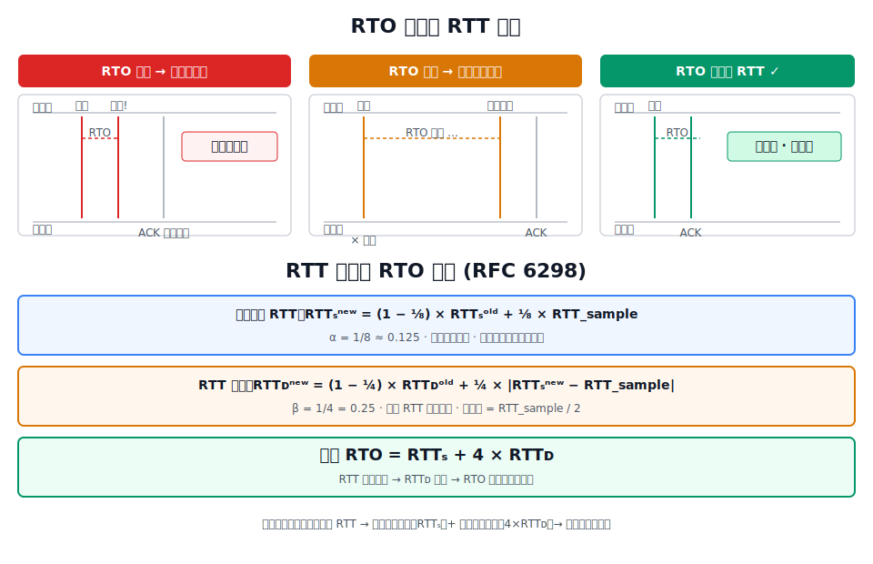
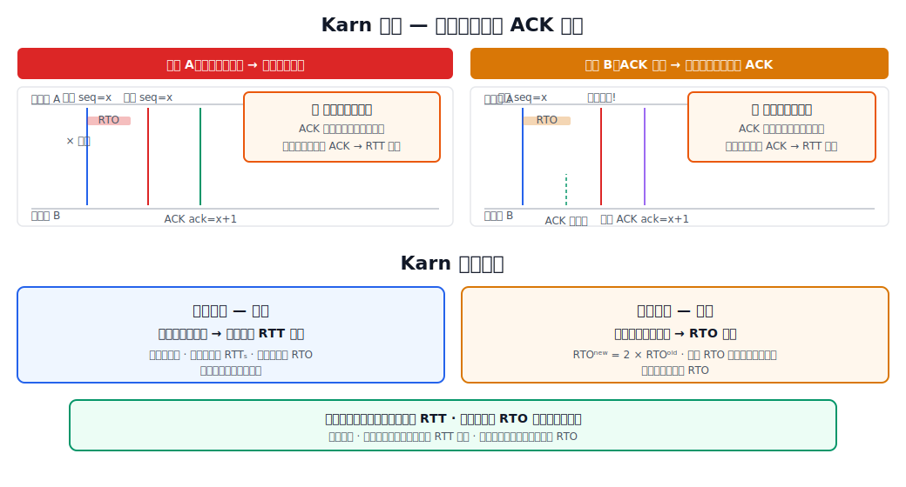
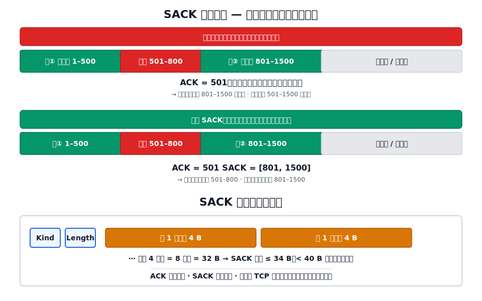

# TCP 可靠传输

TCP 可靠传输的目标是：**无差错、无丢失、无重复、按序交付**。为实现这一目标，TCP 采用基于字节序号的[[Sliding-Window|滑动窗口]]、累积确认、超时重传和选择确认等机制。
# 字节编号与累积确认

## 字节流编号

TCP 面向字节流，对发送缓存中的每一个字节分配一个 32 bit 序号。序号字段 `seq` 的值是本报文段数据载荷**第一个字节**的序号。

确认号 `ACK_n` 是累积确认：它表明序号 $n-1$ 及之前的所有字节都已正确按序收到，接收方期望下一个收到的是序号 $n$ 的字节。只有 `ACK=1` 时确认号字段才有效。

上图展示了 TCP 可靠传输的基本单位：发送方按字节序号维护发送窗口，接收方用累积确认号说明“下一个期望字节”，窗口由确认号和接收窗口共同推动。

## 发送窗口与三个指针

TCP 的发送窗口不是固定大小，它取决于接收方通告的接收窗口 `rwnd` 和发送方估算的拥塞窗口 `cwnd`：

$$
\text{swnd} = \min(\text{rwnd}, \text{cwnd})
$$

为了方便描述发送窗口内各字节的状态，TCP 使用三个指针标记发送窗口：

[html-card height=520](../assets/tcp-send-window-sliding.html)

| 指针 | 含义 | 作用 |
|---|---|---|
| $P_1$ | 已发送但尚未收到确认的第一个字节序号 | 窗口后沿 |
| $P_2$ | 允许发送但尚未发送的第一个字节序号 | 可用窗口起点 |
| $P_3$ | 不允许发送的第一个字节序号 | 窗口前沿 |

由此可以算出：

| 计算式 | 含义 |
|---|---|
| $P_3-P_1$ | 当前发送窗口大小 |
| $P_2-P_1$ | 已发送但未确认的字节数 |
| $P_3-P_2$ | 可用窗口/有效窗口 |

后沿 $P_1$ 只有两种可能：不动（没有新确认），前移（收到新确认）。后沿绝不后移。

前沿 $P_3$ 有三种可能：前移（常态）、不动（无确认或无窗口变化，或者确认前移恰好被窗口收缩抵消）、后缩（接收方通知窗口变小——TCP 标准强烈不推荐，因为可能导致已有的窗口内数据被禁止发送）。

## 接收窗口

接收方也维护一个接收窗口。窗口内的序号是允许接收的范围，窗口外的数据不允许接收。对于不按序到达的数据，TCP 标准没有强制规定——若一律丢弃则窗口管理简单但带宽利用差，TCP 通常**临时缓存**乱序到达的数据，等到所缺字节补齐后再按序交付给应用进程。

# 确认策略

## 累积确认

TCP 采用累积确认：确认号 $ack=n$ 表示期望收到 $n$，之前的数据都已交付。累积确认的优点是即使某个确认丢失，后续确认可以"覆盖"丢失的信息。但代价是，当数据出现空洞时，接收方只能反复确认最后一个按序到达的字节。

## 延迟确认与捎带确认

- **延迟确认**：接收方不必每收到一个报文段就立即确认。可以等一小段时间再确认，减少确认报文段数量。但延迟不能超过 0.5 秒。若收到一连串最大长度的报文段，则必须每隔一个报文段就发送一个确认。
- **捎带确认**：当接收方自己也有数据要发送时，可以把确认信息"捎带"在数据报文段中一起发出。但实际中不常见，因为大多数应用很少同时在两个方向上持续发送数据。

# 往返时间 RTT 与超时重传时间 RTO

## RTO 的意义

当发送方发出的报文段在预期时间内没有收到确认时，触发超时重传。RTO（Retransmission Time-Out）决定了发送方等多久才判定超时。

- RTO 过小 → 网络稍有抖动就误判超时，产生不必要的重传，浪费带宽。
- RTO 过大 → 真的丢包时迟迟不重传，降低传输效率。
- 理想的 RTO 应略大于实际 RTT。

## 问题：RTT 是变化的

因特网的路径、路由、负载时刻变化，同一个 TCP 连接上的不同报文段的 RTT 波动可能很大。因此不能直接用某一次 RTT 测量样本作为 RTO，需要平滑处理。

## 加权平均 RTT（$RTT_S$）

\[RFC6298\] 建议用指数加权移动平均来平滑 RTT：

$$
RTT_S^{\text{new}} = (1-\alpha) \times RTT_S^{\text{old}} + \alpha \times RTT_{\text{sample}}
$$

其中推荐值 $\alpha = 1/8 = 0.125$。$\alpha$ 小意味着新的 RTT 样本对平滑值的影响较小，平滑值更稳定。

## RTT 偏差 $RTT_D$ 与 RTO

仅用平滑 RTT 还不够——RTT 的波动幅度（偏差）也很重要。如果 RTT 抖动很大，RTO 应该留出更大的余量。\[RFC6298\] 定义 $RTT_D$ 为 RTT 偏差的加权平均值：

$$
RTT_D^{\text{new}} = (1-\beta) \times RTT_D^{\text{old}} + \beta \times |RTT_S^{\text{new}} - RTT_{\text{sample}}|
$$

其中 $\beta = 1/4 = 0.25$。

最终 RTO：

$$
RTO = RTT_S + 4 \times RTT_D
$$

第一次测量时，$RTT_S$ 取第一个 RTT 样本值，$RTT_D$ 取该样本值的一半。

# Karn 算法

## ACK 歧义问题

当发生超时重传后，发送方收到一个确认——这个确认到底是对**原报文段**的确认，还是对**重传报文段**的确认？发送方无法区分：

[html-card height=560](../assets/tcp-karn-ack-ambiguity.html)

- **情况 A**：原报文段丢失 → 重传 → 收到确认。此确认实际对应重传报文段，但若误当作原报文段，RTT 样本就会偏大。
- **情况 B**：原报文段未丢失，但 ACK 迟到 → 超时重传 → 收到迟到 ACK。此确认实际对应原报文段，但若误当作重传报文段，RTT 样本就会偏小。

两种情况都会导致 RTO 计算错误。

## Karn 算法的规则

**基本规则**：在计算加权平均 $RTT_S$ 时，凡是重传过的报文段，不采用其 RTT 样本。也就是说，一旦发生重传，本轮不更新 $RTT_S$ 和 $RTO$。

**修正规则**：Karn 算法基本规则有一个副作用——网络时延突然持续增大后，RTO 一直不变，导致每次超时重传但永远不更新 RTO。修正方法是：**报文段每重传一次，RTO 翻倍**：

$$
RTO^{\text{new}} = 2 \times RTO^{\text{old}}
$$

这保证了在网络持续拥塞时，RTO 能快速增长，避免反复重传加重拥塞。

# 选择确认 SACK

## 累积确认的不足

累积确认只能报告"按序收到的最远字节"。当多个不连续的字节块已被接收，而中间有缺失时（如下图：收到 `1-500` 和 `801-1000`，缺少 `501-800`），如果只用累积确认，接收方只能反复确认 `ack=501`：

发送方不知道后续数据已收到，可能重传整个 `501-1000` 而非仅重传缺失的 `501-800`。

## SACK 机制

SACK 将接收缓存中不连续字节块的边界信息反馈给发送方，为只重传缺失的数据块提供依据，避免发送方完全不知道后续哪些字节已经到达。

**使用前提**：在 TCP 连接建立时，双方在首部选项字段中协商"允许 SACK"。

**格式**：SACK 选项使用 TCP 首部选项字段（最长 40 B）。每对边界（左边界和右边界）各占 4 B（序号为 32 bit）。因此最多可报告 4 个不连续字节块：

$$
\underbrace{1\text{ B}}_{\text{kind}} + \underbrace{1\text{ B}}_{\text{length}} + \underbrace{4\times 2\times 4 = 32\text{ B}}_{\text{最多 4 组边界}} = 34\text{ B} \le 40\text{ B}
$$

**注意**：累积确认号 `ack` 的语义不变——它依然指向按序收到的最后一个字节的下一个位置。SACK 只做补充说明，不替代累积确认。SACK 选项本身只报告边界信息，具体重传策略由 TCP 实现决定。

# 发送/接收缓存与窗口的关系

发送窗口是发送缓存的子集，接收窗口是接收缓存的子集：

- **发送缓存**存放两类数据：(1) 应用进程交付 TCP 但尚未发送的字节；(2) 已发送但尚未收到确认的字节（已确认的可以删除）。
- **接收缓存**存放两类数据：(1) 已按序收到但尚未被应用进程读取的字节；(2) 不按序到达但暂时缓存的乱序字节。

如果接收方应用进程来不及读取，接收缓存逐渐填满，接收窗口缩小直至为 0。若应用进程及时读取，接收窗口扩大但不超过接收缓存总容量。
