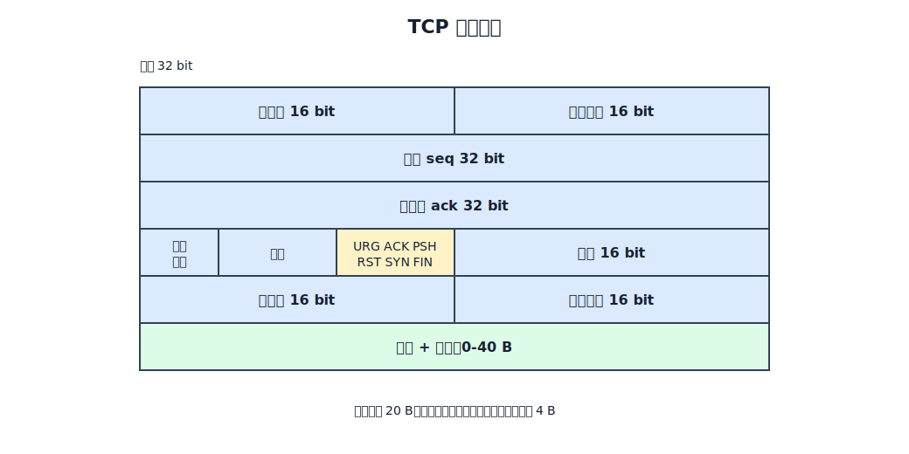
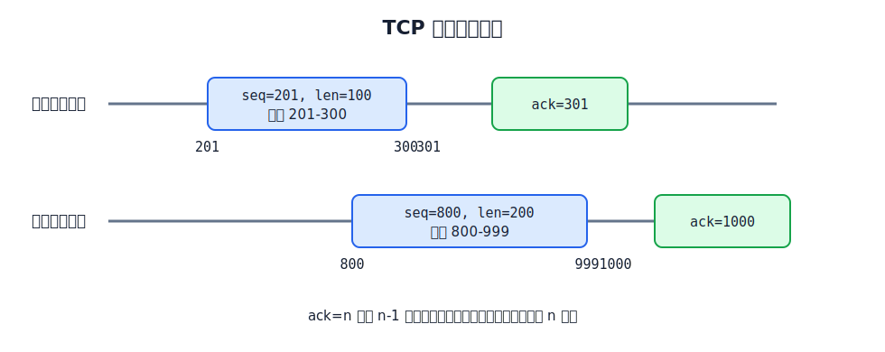
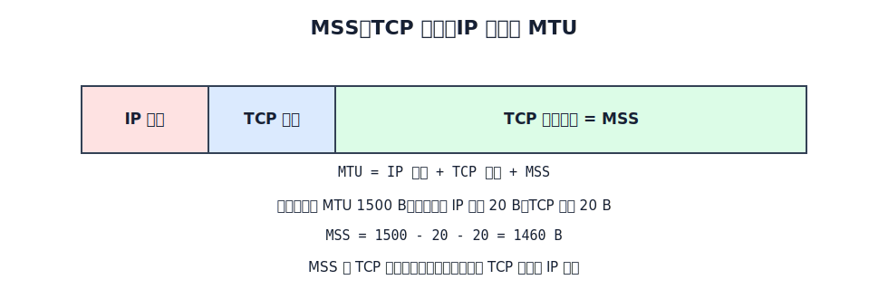
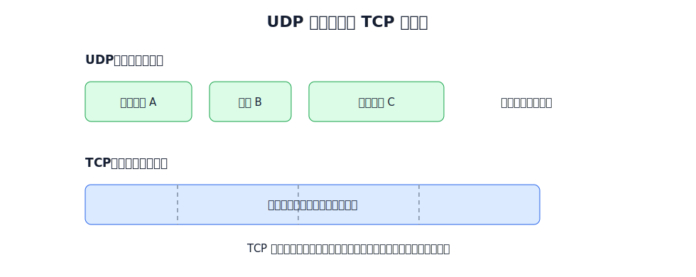

# TCP 报文段

TCP 为应用层提供面向连接、可靠、全双工的字节流服务。应用进程交给 TCP 的数据会先进入发送缓存，TCP 再按当前发送策略取出一段字节，加上 TCP 首部，形成 TCP 报文段。

TCP 报文段由两部分构成：

- TCP 首部：承载端口、序号、确认、窗口、标志位、检验和、选项等控制信息。
- 数据载荷：从 TCP 字节流中取出的若干字节。

TCP 的连接管理、可靠传输、流量控制和拥塞控制都依赖首部字段。先把首部字段读懂，才能读懂 TCP 的过程。

# 首部格式

TCP 首部最小 20 B，最大 60 B。前 20 B 是固定首部，后面最多 40 B 是选项和填充。

| 字段 | 长度 | 含义 |
|---|---:|---|
| 源端口、目的端口 | 各 16 bit | 标识通信双方应用进程 |
| 序号 `seq` | 32 bit | 本报文段数据载荷第一个字节的序号 |
| 确认号 `ack` | 32 bit | 期望收到对方下一个字节的序号 |
| 数据偏移 | 4 bit | TCP 首部长度，单位是 4 B |
| 保留 | 6 bit | 保留，通常置 0 |
| 标志位 | 6 bit | `URG ACK PSH RST SYN FIN` |
| 窗口 | 16 bit | 发送本报文段一方的接收窗口大小 |
| 检验和 | 16 bit | 检查 TCP 首部、数据载荷和伪首部 |
| 紧急指针 | 16 bit | `URG=1` 时指出紧急数据长度 |
| 选项与填充 | 0-40 B | MSS、窗口扩大、时间戳、SACK 等 |

数据偏移字段以 4 B 为单位表示 TCP 首部长度：

$$
\text{TCP 首部长度}=\text{数据偏移字段值}\times 4\text{ B}
$$

固定首部 20 B，所以数据偏移最小为 `0101`，即 $5\times 4=20$ B。首部最大 60 B，所以数据偏移最大为 `1111`，即 $15\times 4=60$ B。

# 序号与确认号

TCP 是面向字节流的协议。序号字段不是“第几个报文段”，而是本报文段数据载荷中第一个字节的编号。

确认号 `ack=n` 表示：

- 序号 `n-1` 及之前的所有字节都已正确收到。
- 接收方下一步期望收到序号 `n` 开始的数据。

只有 `ACK=1` 时，确认号字段才有效。TCP 连接建立后，传送的报文段通常都把 `ACK` 置为 `1`。

例子：

- 客户端发送 `seq=201`、载荷 100 B 的报文段，说明本段数据覆盖字节 `201-300`。
- 服务器确认号填 `ack=301`，说明 `201-300` 已收到，下一字节期望从 `301` 开始。
- 若服务器同时发送 `seq=800`、载荷 200 B 的数据，则这段数据覆盖字节 `800-999`。
- 客户端对它的确认号应为 `ack=1000`。

# 关键标志位

TCP 首部中的 6 个传统标志位用于表达报文段的控制语义。

| 标志位 | 含义 |
|---|---|
| `URG` | 紧急指针有效，载荷中有紧急数据 |
| `ACK` | 确认号字段有效 |
| `PSH` | 推送，要求尽快发送或尽快交付应用进程 |
| `RST` | 复位连接，用于严重差错、拒绝非法报文段或拒绝连接 |
| `SYN` | 同步序号，用于建立连接 |
| `FIN` | 发送方数据发送完毕，请求释放连接 |

`SYN` 和 `FIN` 都会消耗一个序号，即使它们不携带数据。这个细节在连接建立和释放时非常重要：

- `SYN=1, seq=x` 后，下一次发送数据的第一个字节序号从 `x+1` 开始。
- `FIN=1, seq=u` 后，对方确认应为 `ack=u+1`。

# 窗口字段

窗口字段表示发送本报文段一方还能接收多少字节。它不是发送方想发多少，而是接收方通过报文段告诉对方“我还能收多少”。

例如，一个报文段中：

- 确认号 `ack=800`。
- 窗口 `window=1000`。

含义是：序号 `800-1799` 的数据可以继续发送。这个字段是 TCP 流量控制的基础。

# 检验和

TCP 检验和的计算方式与 UDP 类似，但伪首部中的协议号为 `6`。检验和计算输入包括：

- TCP 首部。
- TCP 数据载荷。
- 12 B 伪首部。

伪首部不属于真正发送的 TCP 首部。它只参与检验和计算，用来把源 IP、目的 IP 和协议号也纳入检查范围。

# 选项与 MSS

TCP 首部选项用于扩展 TCP 功能，常见选项包括 MSS、窗口扩大因子、时间戳和 SACK 许可。

MSS 是 Maximum Segment Size，表示 TCP 报文段中**数据载荷部分**的最大长度，不包括 TCP 首部，也不包括 IP 首部。

在典型以太网 MTU 为 1500 B，且不考虑 IP/TCP 选项时：

$$
\text{MSS}=1500-20-20=1460\text{ B}
$$

MSS 太小会让首部开销比例变大；MSS 太大可能导致 IP 分片。通常希望 MSS 尽可能大，但又不让封装后的 IP 数据报超过路径 MTU。

**MSS 协商**：在 TCP 连接建立的三报文握手阶段，双方各自在 `SYN` 报文段的选项字段中填入自己支持的 MSS 值。连接建立后，**MSS 取双方提出的较小值**。若一方未填写 MSS 选项，则默认 MSS = 536 B——这是 IPv4 要求每台主机都必须能接收的 IP 数据报最小重组缓冲区长度（576 B）减去 IP 首部（20 B）和 TCP 固定首部（20 B）后的值。

# TCP 与 UDP 的数据单位差异

UDP 以报文为单位交付，TCP 以字节流为单位交付。TCP 不保证接收应用进程每次读到的数据块，与发送应用进程每次写入的数据块一一对应。

TCP 的可靠传输、流量控制和拥塞控制都是围绕字节序号与滑动窗口展开的，而不是围绕“第几个应用报文”展开。
