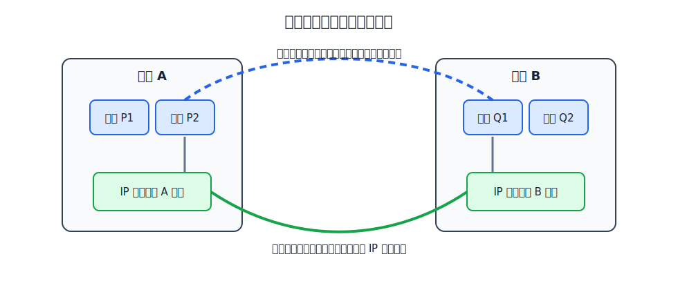
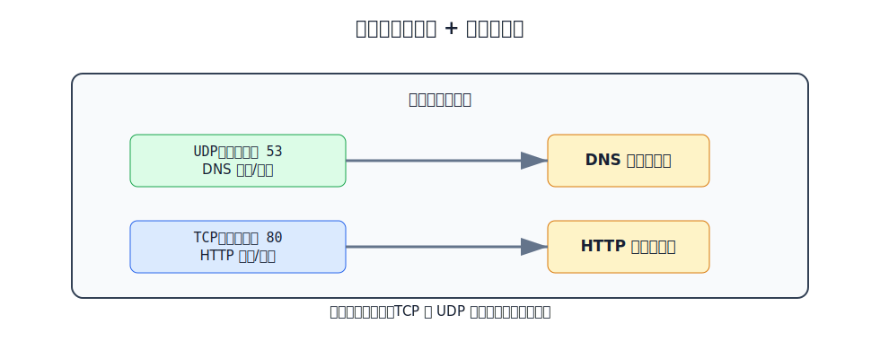
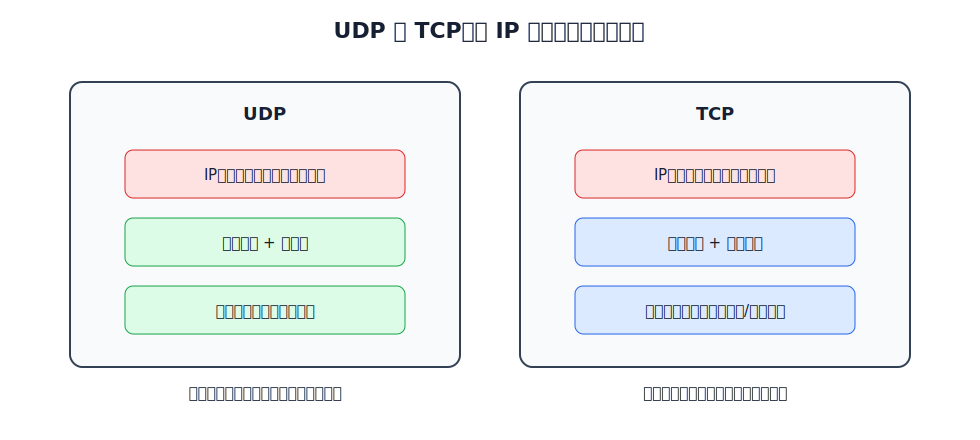

# 运输层解决什么问题

网络层把 IP 数据报从一台主机送到另一台主机，运输层则把数据交给正确的应用进程。换句话说：

| 层次 | 通信范围 | 标识对象 |
|---|---|---|
| 网络层 | 主机到主机 | IP 地址 |
| 运输层 | 进程到进程 | 端口号 |

进程到进程通信是逻辑通信。两端运输层看起来像是在水平通信，但数据实际仍要向下交给网络层、数据链路层和物理层，再在接收端逐层向上交付。

在 TCP/IP 体系中，运输层最重要的两个协议是 UDP 和 TCP：

| 协议 | 运输层数据单元 | 基本服务 |
|---|---|---|
| UDP | UDP 用户数据报 | 无连接、不可靠、首部小 |
| TCP | TCP 报文段 | 面向连接、可靠、面向字节流 |

# 端口号

一台主机上可能同时运行很多网络应用。运输层用端口号区分这些应用进程。

端口号长度为 16 bit，取值范围是 `0-65535`。

| 类型 | 范围 | 用途 |
|---|---:|---|
| 熟知端口号 | `0-1023` | 分配给重要服务器程序 |
| 登记端口号 | `1024-49151` | 给一般服务器程序登记使用 |
| 短暂端口号 | `49152-65535` | 客户端运行时临时选择 |

常见熟知端口号：

| 应用层协议 | 运输层协议 | 端口号 |
|---|---|---:|
| FTP | TCP | `21/20` |
| DNS | UDP | `53` |
| DHCP | UDP | `67/68` |
| HTTP | TCP | `80` |
| HTTPS | TCP | `443` |
| SMTP | TCP | `25` |
| BGP | TCP | `179` |
| RIP | UDP | `520` |

> [!note] 端口号的本地意义
> 端口号只在本机运输层协议栈内用来标识应用进程。不同主机上的同一端口号没有必然关系；TCP 的 `53` 端口和 UDP 的 `53` 端口也属于不同的端口空间。

# 复用与分用

发送方的多个应用进程把数据交给运输层，运输层根据应用选择 UDP 或 TCP 封装，这叫复用。接收方收到 UDP 用户数据报或 TCP 报文段后，根据协议类型和目的端口号把数据交给对应应用进程，这叫分用。

[html-card height=620](../assets/transport-port-mux-demux-slides.html)

# UDP 与 TCP 的服务模型

UDP 和 TCP 都运行在 IP 之上。IP 本身不保证可靠交付，UDP 基本保留这种简单模型，只增加端口分用和检验和；TCP 则在运输层补上连接管理、确认、重传、流量控制和拥塞控制等机制。

| 维度 | UDP | TCP |
|---|---|---|
| 连接 | 无连接，发送前不握手 | 面向连接，通信前建立连接 |
| 可靠性 | 不确认、不重传、不保证有序 | 确认、重传、有序交付 |
| 数据形态 | 保留应用报文边界 | 面向字节流 |
| 通信方式 | 可单播、多播、广播 | 点对点单播连接 |
| 首部开销 | 固定 8 B | 最小 20 B，最大 60 B |
| 典型场景 | DNS、DHCP、RIP、实时音视频、简单请求响应 | HTTP、HTTPS、SMTP、FTP、BGP |

实时语音、视频会议这类应用通常更怕等待重传造成时延抖动；文件传输、网页访问、邮件传送更需要可靠、有序的字节流。
