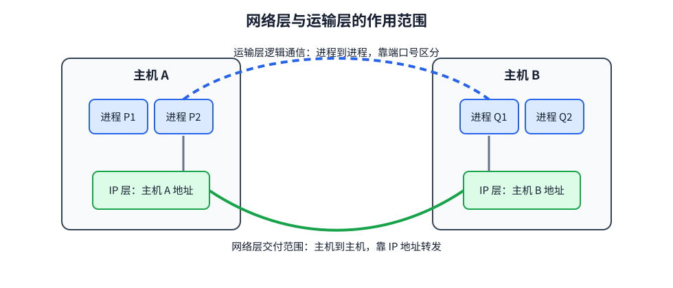
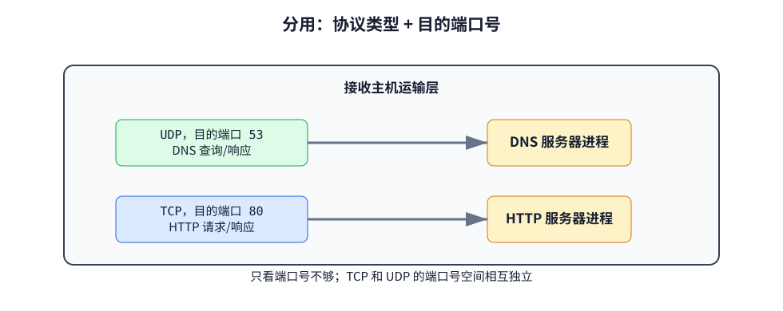
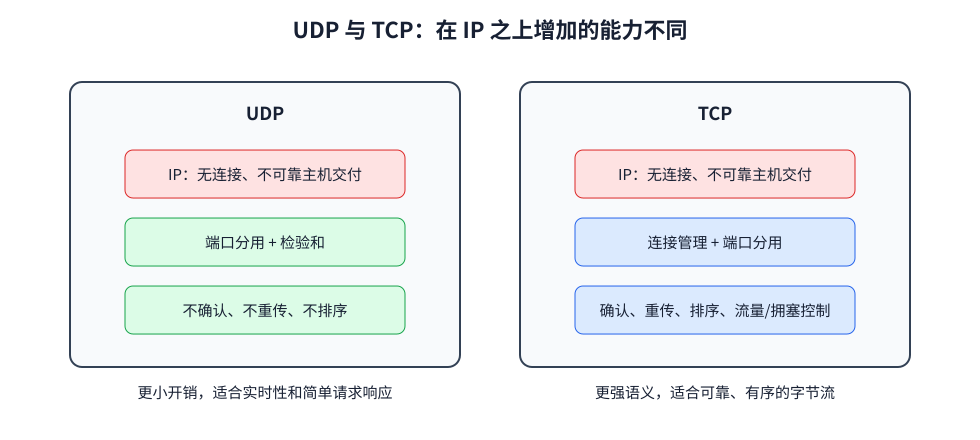

# 运输层解决什么问题

网络层把 IP 数据报从一台主机送到另一台主机，运输层则把数据交给正确的应用进程。换句话说：

| 层次 | 通信范围 | 标识对象 |
|---|---|---|
| 网络层 | 主机到主机 | IP 地址 |
| 运输层 | 进程到进程 | 端口号 |

进程到进程通信是逻辑通信。两端运输层看起来像是在水平通信，但数据实际仍要向下交给网络层、数据链路层和物理层，再在接收端逐层向上交付。

在 TCP/IP 体系中，运输层最重要的两个协议是 UDP 和 TCP：

| 协议 | 运输层数据单元 | 基本服务 |
|---|---|---|
| UDP | UDP 用户数据报 | 无连接、不可靠、首部小 |
| TCP | TCP 报文段 | 面向连接、可靠、面向字节流 |

# 套接字

**套接字**（socket）是操作系统提供给进程的通信端点。进程通过套接字接口创建端点、绑定本地地址、发送或接收数据；操作系统在套接字对象中维护所用协议、本地 IP 与端口、对端信息、收发缓冲区和通信状态。

端口号只是套接字端点信息的一部分，不能单独代表进程或一条 TCP 连接：

- UDP 套接字至少绑定本地 IP 与本地端口，发送数据报时还要指定或预先记录对端；
- TCP 监听套接字绑定本地地址并等待连接；每次连接建立后，操作系统创建相应的已连接套接字，用四元组区分它与其他连接。

有些教材把 `(IP 地址, 端口号)` 简称为“套接字地址”。它表示网络中的一个端点地址；操作系统中的套接字对象还包含协议状态和缓冲区，二者不要混为同一个概念。

# 端口号

一台主机上可能同时运行很多网络应用。运输层用端口号区分这些应用进程。

端口号长度为 16 bit，取值范围是 `0-65535`。

| 类型 | 范围 | 用途 |
|---|---:|---|
| 熟知端口号 | `0-1023` | 分配给重要服务器程序 |
| 登记端口号 | `1024-49151` | 给一般服务器程序登记使用 |
| 短暂端口号 | `49152-65535` | 客户端运行时临时选择 |

常见熟知端口号：

| 应用层协议 | 运输层协议 |                                      端口号 |
| ----- | ----- | :---------------------------------------: |
| FTP   | TCP   |               `21`(控制连接)/`20`(主动模式的数据连接) |
| DNS   | UDP   |                                     `53` |
| DHCP  | UDP   |              `67`（服务器端）/`68`（客户端） |
| HTTP  | TCP   |                                     `80` |
| HTTPS | TCP   |                                    `443` |
| SMTP  | TCP   |                                     `25` |
| BGP   | TCP   |                                    `179` |
| RIP   | UDP   |                                    `520` |

> [!note]
> 端口号只在本机运输层某种协议栈内用来标识应用进程。不同主机上的同一端口号没有必然关系；TCP 的 `53` 端口和 UDP 的 `53` 端口也属于不同的端口空间。

> [!danger] 连接数不受 $2\times 65536$ 限制
> 端口号只有 16 bit，不等于一台主机最多只能存在 $2\times 65536$ 条 TCP 连接。每条连接由 `(源 IP, 源端口, 目的 IP, 目的端口)` 四元组标识；同一个服务器端口可以同时出现在许多连接中，只要其余字段不同即可。实际连接数还受可用 IP、对端组合、内存和操作系统资源限制。

# 复用与分用

**复用**不是简单地给一个上层 PDU 加首部，而是让许多应用的通信共同使用同一套运输层和网络层服务：发送端从不同套接字接收数据，在首部写入端口号等端点信息，再把产生的 TCP 报文段或 UDP 用户数据报统一交给 IP。

**分用**是复用的逆过程。接收端不能只知道“这是一个运输层 PDU”，还必须利用首部中的标识把它送入正确套接字：

- UDP 的基本分用主要看运输层协议和目的端口号；
- TCP 已建立连接的分用看源 IP、源端口、目的 IP、目的端口组成的四元组。

因此，同一服务器的多个 TCP 连接可以共享本地端口（例如都以本地端口 `80` 为服务器端点），但因客户端 IP 或客户端端口不同而仍能被分开。若操作系统允许进程继承或共享监听套接字，多个工作进程也可以共同受理同一端口上的连接；这不改变“已建立连接按四元组分用”的规则。

[html-card height=620](../assets/transport-port-mux-demux-slides.html)

# UDP 与 TCP 的服务模型

UDP 和 TCP 都运行在 IP 之上。IP 本身不保证可靠交付，UDP 基本保留这种简单模型，只增加端口分用和检验和；TCP 则在运输层补上连接管理、确认、重传、流量控制和拥塞控制等机制。

| 维度 | UDP | TCP |
|---|---|---|
| 连接 | 无连接，发送前不握手 | 面向连接，通信前建立连接 |
| 可靠性 | 不确认、不重传、不保证有序 | 确认、重传、有序交付 |
| 数据形态 | 保留应用报文边界 | 面向字节流 |
| 通信方式 | 可单播、多播、广播 | 点对点单播连接 |
| 首部开销 | 固定 8 B | 最小 20 B，最大 60 B |
| 典型场景 | DNS、DHCP、RIP、实时音视频、简单请求响应 | HTTP、HTTPS、SMTP、FTP、BGP |

实时语音、视频会议这类应用通常更怕等待重传造成时延抖动；文件传输、网页访问、邮件传送更需要可靠、有序的字节流。
