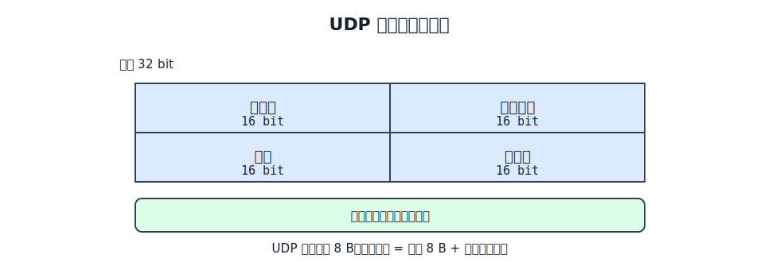
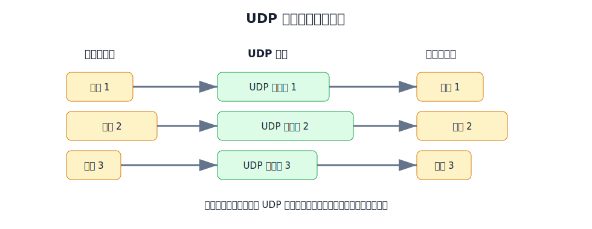
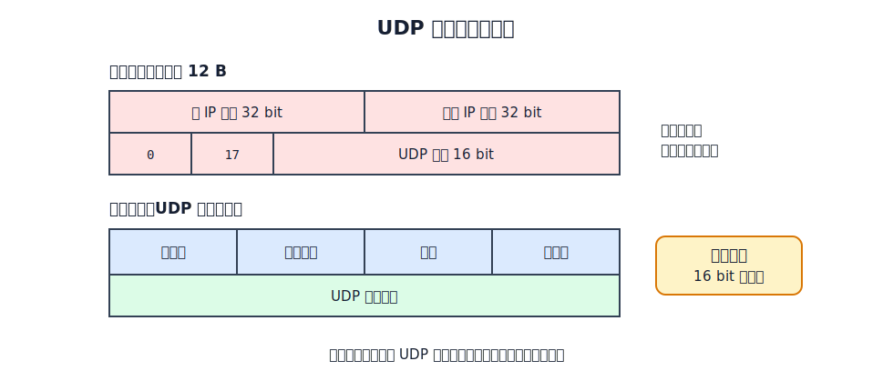

# UDP 的位置

UDP 是运输层协议。它在 IP 提供的主机到主机交付之上，增加了两件事：

- 用端口号把数据交给正确的应用进程。
- 用检验和检查 UDP 用户数据报是否出现误码。

**UDP 不建立连接，不维护可靠传输状态**。发送方把应用报文交给 UDP 后，UDP 封装成一个 UDP 用户数据报并交给 IP；接收方若检出误码就丢弃，不确认、不重传、不排序。

# UDP 用户数据报

UDP 用户数据报由 UDP 首部和数据载荷组成。首部固定 8 B，包含 4 个字段，每个字段 2 B。

| 字段 | 长度 | 含义 |
|---|---:|---|
| 源端口 | 16 bit | 发送进程使用的端口号；接收方回送响应时作为目的端口 |
| 目的端口 | 16 bit | 接收进程使用的端口号；接收方据此分用 |
| 长度 | 16 bit | UDP 首部和 UDP 数据载荷的总长度 |
| 检验和 | 16 bit | 检查 UDP 首部、数据载荷和伪首部是否出错 |

UDP 长度字段是**整个** UDP 用户数据报的长度。因为 UDP 首部固定 8 B，所以：

$$
\text{UDP 数据载荷长度}=\text{UDP 长度字段表示长度}-8\text{ B}
$$

# 报文边界

UDP 保留应用报文边界。应用进程一次交给 UDP 的一份报文，会被封装成一个 UDP 用户数据报；接收方 UDP 也按一个个 UDP 用户数据报向上交付。

这与 TCP 的字节流模型不同。UDP 以报文为单位交付：发送方一次交付的应用报文，对应接收方一次收到的 UDP 数据载荷。TCP 以字节流为单位交付，应用程序需要自己从连续字节流中恢复报文边界。

# UDP 检验和

计算 UDP 检验和时，是把三部分临时拼在一起计算：

- 12 B **伪首部**。
- UDP 首部。
- UDP 数据载荷。

其中，UDP 首部和 UDP 数据载荷是真正发送的 UDP 用户数据报；伪首部不是 UDP 用户数据报的一部分，也不会向下发送。它只在计算检验和时临时加入，使 UDP 能够同时检查 IP 源地址、IP 目的地址和协议号是否匹配。

IPv4 下 UDP 伪首部包含：

| 字段       |     长度 | 含义              |
| -------- | -----: | --------------- |
| 源 IP 地址  | 32 bit | 发送主机 IP 地址      |
| 目的 IP 地址 | 32 bit | 接收主机 IP 地址      |
| 全 0      |  8 bit | 填充字段            |
| 协议号      |  8 bit | UDP 为 `17`      |
| UDP 长度   | 16 bit | UDP 首部和数据载荷的总长度 |

## 计算方法

UDP 使用 **16 bit 反码加法**计算检验和：

1. 把伪首部、UDP 首部和数据载荷按网络字节序每 2 B 划分为一个 16 bit 字。发送端先把 UDP 首部的检验和字段置为全 0。
2. 将所有 16 bit 字逐个相加。若最高位产生进位，不能直接丢弃，而要把进位加回结果的最低位，这称为**回卷**。
3. 对最终的 16 bit 累加和逐位取反，所得结果写入检验和字段。

若数据载荷的字节数为奇数，计算前在末尾临时补一个全 0 字节，使参与计算的总长度为偶数；这个填充字节不计入 UDP 长度，也不随数据发送。

[html-card height=690](../assets/udp-checksum-calculation-slides.html)

上例的 16 bit 累加和为 `0x0D0B`，逐位取反后得到检验和 `0xF2F4`。接收端把收到的检验和字段也纳入相同计算：

$$
\mathtt{0x0D0B}+\mathtt{0xF2F4}=\mathtt{0xFFFF}
$$

最终结果为 16 bit 全 1，检验通过；否则检验失败，UDP 丢弃该用户数据报。UDP 本身不会请求重传，也不会向发送方确认。

> [!note] 全 0 与全 1 的特殊含义
> 在 IPv4 中，UDP 检验和字段为全 0 表示发送方未计算检验和。若实际计算出的检验和恰好为全 0，发送时应改写为全 1。IPv6 中 UDP 检验和通常是必需的，不能用全 0 表示省略。

> [!warning] 伪首部不属于真正的 UDP 首部
> UDP 首部仍然只有 8 B。伪首部只是检验和计算时的辅助数据，不会作为 UDP 数据报的一部分在网络中传输。

# UDP 适用场景

UDP 适合应用自己能够接受或处理不可靠性的场景：

- 实时语音、视频会议：过期数据重传价值很低，低时延更重要。
- DNS 查询：请求和响应短，应用可以自行超时重试。
- DHCP、RIP 等协议：协议本身较简单，常使用广播或组播。
- 多播、广播通信：UDP 可以配合 IP 多播和广播使用；TCP 连接只适合点对点单播。

UDP 把可靠性、顺序控制、重传策略等问题留给应用层或直接放弃，从而换来更小的首部和更低的协议状态开销。
