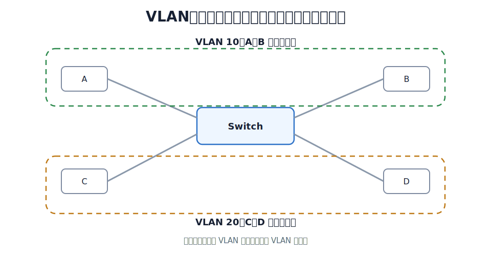
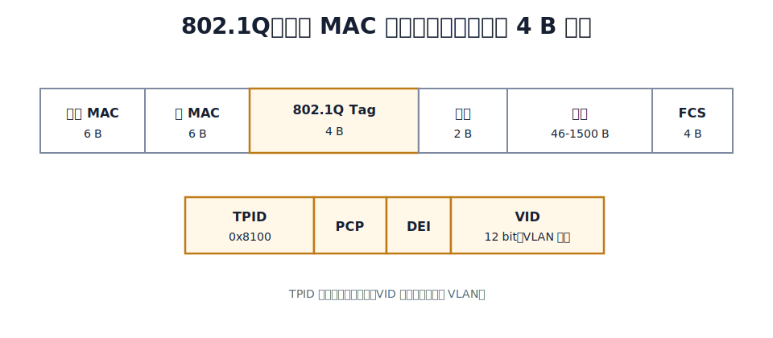

# VLAN

VLAN 是 Virtual LAN，虚拟局域网。它把一个物理局域网划分成多个逻辑局域网，使不同 VLAN 形成不同广播域。

没有 VLAN 时，一个交换式以太网通常仍是一个广播域。广播帧会被交换机泛洪到除入端口以外的其他端口。划分 VLAN 后，广播帧只在同一 VLAN 内转发。

VLAN 的作用：

- 限制广播范围，减轻广播风暴影响。
- 划分$^{1}$逻辑网络。
- 主机物理位置变化时，可通过调整交换机端口配置改变所属 VLAN。
- 隔离二层通信，增强管理和安全性。

$^{1}$划分方式：1. 基于 switch 端口 2. 基于 MAC 地址 3. 基于 IP 地址。

> [!note] VLAN 是交换机本身提供的服务
> VLAN 不是 IP 子网。实际组网中常把一个 VLAN 配合一个 IP 子网使用，但二者属于不同层次：VLAN 是二层广播域划分，IP 子网是三层地址规划。

# 802.1Q 帧

IEEE 802.1Q 通过在以太网帧中插入 VLAN 标签来标识帧所属 VLAN。标签长度为 4 B，插在源 MAC 地址和类型字段之间。

VLAN 标签中的关键字段：

| 字段 | 长度 | 含义 |
|---|---:|---|
| TPID | 16 bit | 标签协议标识符，典型值为 `0x8100`，表示这是 802.1Q 帧 |
| PCP | 3 bit | 优先级 |
| DEI | 1 bit | 拥塞时可丢弃指示 |
| VID | 12 bit | VLAN ID |

VID 共 12 bit，理论取值为 0 到 4095。其中 0 和 4095 保留，常用有效 VLAN ID 为 1 到 4094。

# Access 接口

Access 接口通常连接普通主机。普通主机一般收发不带 VLAN 标签的以太网帧。

Access 接口有一个 PVID。PVID 表示该接口默认所属 VLAN。

Access 接口处理规则可以这样记：

- 入方向：收到普通以太网帧后，交换机按接口 PVID 给帧打上 VLAN 标签。
- 出方向：若帧要从 Access 接口发给主机，交换机通常先去掉 VLAN 标签，再发送普通以太网帧。

# Trunk 接口

Trunk 接口通常连接交换机与交换机，或交换机与路由器。它可以承载多个 VLAN 的帧。

Trunk 接口也有 PVID。它既能传送带标签帧，也可能对 PVID 对应 VLAN 的帧进行去标签转发，具体行为取决于设备规则和配置。考试语境下常见规则是：

- 收到未打标签帧：按 Trunk 接口的 PVID 打标签。
- 转发 VID 等于接口 PVID 的帧：可去标签后转发。
- 转发 VID 不等于接口 PVID 的帧：保留标签转发。

[html-card height=760](../assets/vlan-access-trunk-tagging-slides.html)

# PVID

PVID 是 Port VLAN ID，端口 VLAN ID。它表示端口收到未打标签帧时，应该把该帧归入哪个 VLAN。

PVID 的意义是：普通以太网帧本身没有 VLAN 信息，交换机必须根据入端口给它补上所属 VLAN。

Access 接口的 PVID 通常就是该主机所属 VLAN。Trunk 接口的 PVID 用于处理未打标签帧，也常对应 native VLAN 或默认 VLAN。

# VLAN 间通信

不同 VLAN 是不同广播域。二层交换机不会直接在不同 VLAN 之间转发普通二层帧。

若 VLAN 10 中的主机要与 VLAN 20 中的主机通信，通常需要三层设备参与，例如路由器、三层交换机或单臂路由。此时通信已经从二层交换转为三层转发。

# 易混点

| 易混点                | 正确理解                       |
| ------------------ | -------------------------- |
| VLAN 是否隔离碰撞域       | 交换机端口隔离碰撞域；VLAN 主要隔离广播域    |
| VLAN 是否等于子网        | 不等于，但常配合使用                 |
| 主机是否必须识别 802.1Q 标签 | 普通主机通常接在 Access 口，不需要处理标签  |
| Trunk 是否只传一个 VLAN  | Trunk 用来承载多个 VLAN          |
| PVID 是否写在帧里        | PVID 是端口属性，不是帧字段；帧中写的是 VID |
|                    |                            |
