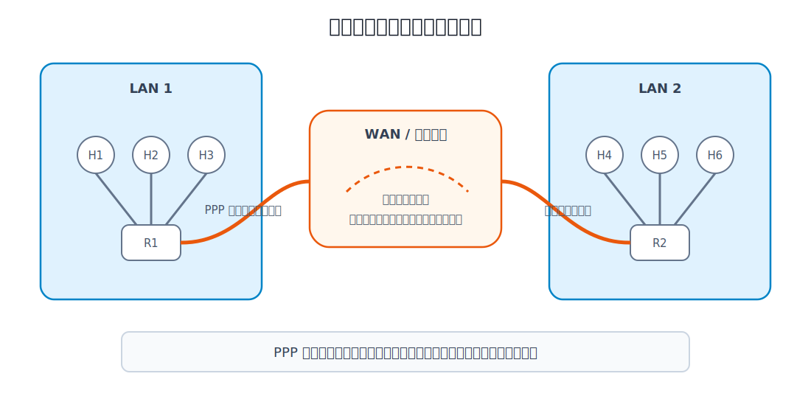
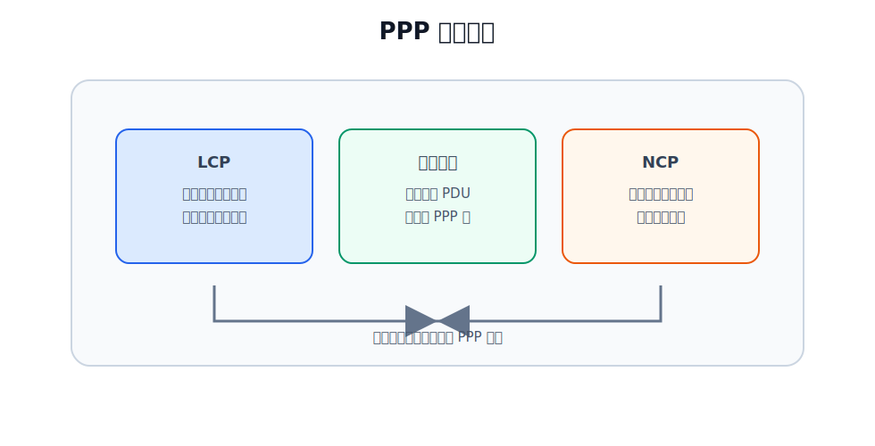
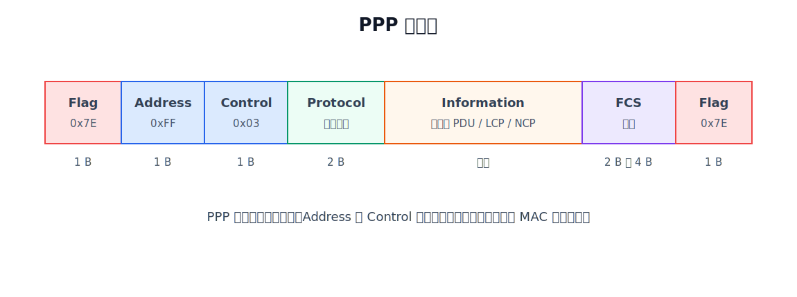

# 广域网与点对点链路

广域网 WAN（Wide Area Network）覆盖范围大，常用于连接相距较远的局域网、园区网、数据中心或运营商网络。它的重点不是“很多主机直接共享一个局域网介质”，而是通过通信子网把远距离节点连接起来。

局域网与广域网的差异：

| 对比项 | 局域网 LAN | 广域网 WAN |
|---|---|---|
| 覆盖范围 | 房间、楼宇、园区 | 城市、地区、国家甚至全球 |
| 常见管理者 | 单位、学校、企业内部 | 运营商、专线服务商、大型机构 |
| 典型链路形态 | 广播链路或交换式局域网 | 点对点链路、交换网络、运营商承载网络 |
| 数据链路层重点 | MAC、局域网帧、交换机、VLAN | 点对点封装、链路建立、链路配置 |
| 典型协议 | Ethernet、802.11 | PPP、HDLC 等 |

PPP 主要解决的是：一段点对点链路如何建立、如何配置、如何封装网络层分组、如何成帧和检错。

点对点链路与广播链路的区别如下：

| 链路类型  | 链路上有几个发送竞争者 | 是否需要 MAC 争用机制 | 例子              |
| ----- | ----------: | ------------- | --------------- |
| 点对点链路 |       2 个端点 | 通常不需要         | 用户主机到 ISP、路由器专线 |
| 广播链路  |    多个站点共享信道 | 需要            | 共享式以太网、无线局域网    |

PPP 讨论的点对点链路是**全双工**链路：链路两端都可以发送和接收。它不用于单工链路，也不用于半双工的多站点共享链路。

# PPP 协议

PPP（Point-to-Point Protocol，点对点协议）是常用的点对点数据链路层协议。它比早期 HDLC 更简单，适用于现代误码率较低的点对点链路。

PPP 的典型场景有：

- 用户计算机通过点对点链路接入 ISP。
- 广域网中两个路由器通过专用线路互连。
- PPPoE 把 PPP 运行在以太网上，使运营商可以用以太网接口提供宽带接入服务。

PPP 的主要特点：

| 特点        | 含义                                        |
| --------- | ----------------------------------------- |
| 点对点       | 链路两端明确，不需要解决多站点共享信道的争用问题                  |
| 全双工       | 链路两端都能发送和接收，PPP 不支持单工或半双工链路                |
| 面向连接      | 传输网络层数据前，先建立并配置 PPP 链路                    |
| 简单        | 不把可靠传输、流量控制、复杂编号等机制放进 PPP 本身              |
| 封装多种网络层协议 | 通过 Protocol 字段标明信息字段承载的是 IP、LCP、NCP 或其他协议 |
| 支持多种物理链路  | 既支持面向字节的异步链路，也支持面向比特的同步链路                 |
| MTU 约束    | 网络层 PDU 装入 PPP 帧的信息字段，长度受最大传送单元 MTU 限制     |
| 透明传输      | 信息字段中即使出现帧定界符，也能被正确传输                     |
| 差错检测      | 用 FCS 检测帧是否出错，错帧直接丢弃                      |
| 链路状态检测    | 能检测链路是否正常工作，并通过 LCP 建立、测试、终止链路            |
| 参数协商      | 可协商最大帧长、鉴别方式等链路参数，也可通过 NCP 协商网络层地址和协议参数   |
| 不可靠传输     | 通常不确认、不重传、不编号、不做流量控制                      |
| 不支持多点线路   | PPP 面向一条点对点链路，不用于多个站点共享同一条链路的场景           |

> [!note]
> PPP 的“简单”不是功能少到只能发数据。它仍然有 LCP、NCP、帧定界、透明传输、差错检测和链路状态管理；它省掉的是确认、重传、流量控制、复杂序号、半双工链路和多点线路支持这些机制。

# PPP 的连接过程

PPP 是**面向连接**的。这里的连接指数据链路层连接，不是 TCP 连接，也不是物理线路本身。物理层连接可用之后，PPP 还要通过 LCP、可选鉴别、NCP 等步骤，把这条链路配置成能承载网络层数据的数据链路。

[html-card height=720](../assets/ppp-link-state-machine-slides.html)

PPP 链路状态可以按“先建立、再传输、最后释放”理解：

| 状态 | 含义 |
|---|---|
| 静止 | 物理层连接还不存在，或链路已经结束 |
| 建立 | 物理层连接可用，LCP 开始协商链路参数 |
| 鉴别 | 如果配置要求身份鉴别，则使用 PAP、CHAP 等进行鉴别 |
| 网络 | NCP 为具体网络层协议进行配置，例如使用 IPCP 配置 IP |
| 打开 | PPP 链路可传输网络层数据 |
| 终止 | 出现故障或一端请求结束，释放链路并回到静止 |

“建立”状态解决的是 PPP 链路本身怎么工作，例如最大帧长、是否需要鉴别、采用什么鉴别协议。“网络”状态解决的是网络层协议怎么在这条链路上运行，例如使用 IP 时由 IPCP 配置 IP 模块。二者都发生在真正传输网络层数据之前。

> [!note]
> **面向连接**和**可靠传输**不是一回事。PPP 面向连接，因为它传数据前要建立和配置链路；但 PPP 通常不提供可靠传输，因为出错帧只丢弃，不确认、不重传。

# PPP 的组成

PPP 的组成正好对应它的连接和传输过程。

| 组成部分 | 作用 | 对应阶段 |
|---|---|---|
| LCP | 建立、配置、测试、终止 PPP 链路 | 建立、终止 |
| NCP | 为不同网络层协议分别进行配置 | 网络 |
| 网络层 PDU 封装方法 | 把网络层 PDU 封装进 PPP 帧的信息字段 | 打开 |

LCP 先把点对点物理链路变成可用的 PPP 链路。若链路需要鉴别，LCP 协商出的鉴别协议会参与后续鉴别过程。NCP 再针对上层网络协议进行配置。配置完成后，PPP 才把网络层 PDU 封装到 PPP 帧中发送。

# PPP 帧格式

PPP 链路进入打开状态后，网络层 PDU、LCP 分组或 NCP 分组都要装入 PPP 帧传输。

| 字段 | 长度 | 含义 |
|---|---:|---|
| Flag | 1 B | 帧定界符，固定为 `0x7E` |
| Address | 1 B | 地址字段，固定为 `0xFF` |
| Control | 1 B | 控制字段，固定为 `0x03` |
| Protocol | 2 B | 指明信息字段中承载的协议 |
| Information | 可变 | 承载网络层 PDU 或 LCP/NCP 等控制数据 |
| FCS | 2 B 或 4 B | 帧检验序列，用于差错检测 |
| Flag | 1 B | 下一帧或本帧的结束定界符 |

Address 和 Control 字段在 PPP 中没有像局域网 MAC 地址那样的寻址意义。PPP 是点对点链路，两端明确，不需要在帧内标识多个站点的 MAC 地址。

Protocol 字段决定 Information 字段的解释方式：

| Protocol 字段含义 | Information 字段可能承载 |
|---|---|
| LCP | PPP 链路建立、配置、测试、终止相关控制分组 |
| NCP | 某个网络层协议的配置分组，例如 IPCP |
| IP 等网络层协议 | 真正要传输的网络层数据 |

# PPP 的透明传输

PPP 用 `0x7E` 作为 Flag 字段来标识帧边界。如果 Information 字段中本来就出现 `0x7E`，接收方可能误以为帧结束。因此 PPP 必须实现透明传输：数据载荷中即使出现与定界符相同的内容，也不能破坏帧边界识别。

PPP 既支持面向字节的异步链路，也支持面向比特的同步链路，所以透明传输有两种做法。

| 链路类型 | 填充方法 | 核心规则 |
|---|---|---|
| 面向字节的异步链路 | 字节填充 | 遇到特殊字节就插入转义字节 `0x7D` |
| 面向比特的同步链路 | 零比特填充 | 数据中每出现 5 个连续 `1`，发送方插入 1 个 `0` |

## 字节填充

面向字节的链路按字节处理数据。PPP 字节填充的常见规则是：

- 若信息字段中出现 `0x7E`，发送方把它变成 `0x7D 0x5E`。
- 若信息字段中出现转义字节 `0x7D`，发送方把它变成 `0x7D 0x5D`。
- 若信息字段中出现某些控制字符，例如数值小于 `0x20` 的字符，也可以先变换，再在前面插入 `0x7D`。

接收方看到 `0x7D`，就知道后面的字节不是普通字节，而是经过转义的内容，于是执行反向变换，恢复原始数据。

## 零比特填充

面向比特的同步链路按比特流处理数据。PPP 的 Flag 是：

$$
01111110
$$

为了避免数据中出现与 Flag 相同的比特串，发送方扫描数据部分：每遇到 5 个连续的 `1`，就在后面插入一个 `0`。接收方在接收时执行逆操作：看到 5 个连续的 `1` 后，若下一个比特是填充的 `0`，就删除它。

这与 [[Data-Link-Layer-Functions|数据链路层功能]] 中的透明传输思想一致：让载荷中的特殊模式不再具有定界含义。

# PPP 的差错处理

PPP 帧中的 FCS 用于差错检测。接收方发现帧出错后会丢弃该帧，但 PPP 本身通常不确认、不重传、不编号、不做流量控制。

原因在于：

- 现代点对点有线链路误码率较低。
- PPP 主要承担链路建立、链路配置、封装和检错。
- 可靠传输通常交给更高层协议处理，例如 TCP。
- 如果数据链路层也复杂重传，可能和高层可靠机制重复。

因此，PPP 与 802.11 的处理方式不同。802.11 无线链路误码率高，并且需要配合 CSMA/CA 判断帧是否成功，所以数据链路层使用 ACK；PPP 面向较可靠的点对点链路，协议设计更简单。

# PPPoE

PPPoE 是 PPP over Ethernet，即把 PPP 帧封装到以太网上运行。

它出现的背景是：运营商希望继续使用 PPP 的用户鉴别、计费和链路管理能力，同时又希望用户侧使用常见的以太网接口接入。PPPoE 因此把以太网作为承载环境，在以太网之上运行 PPP。

PPPoE 不是把以太网变成点对点物理线路，而是在以太网环境中建立 PPP 会话。理解 PPPoE 时要分清两层：

| 层次 | 作用 |
|---|---|
| 以太网 | 提供接入侧二层承载和以太网帧传输 |
| PPP | 提供用户会话、鉴别、配置和网络层 PDU 封装 |
