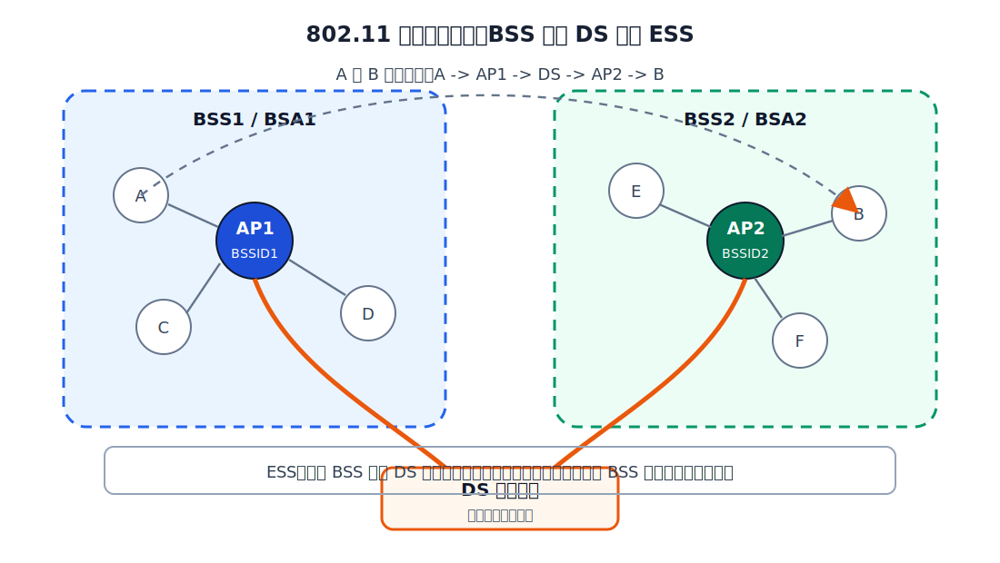
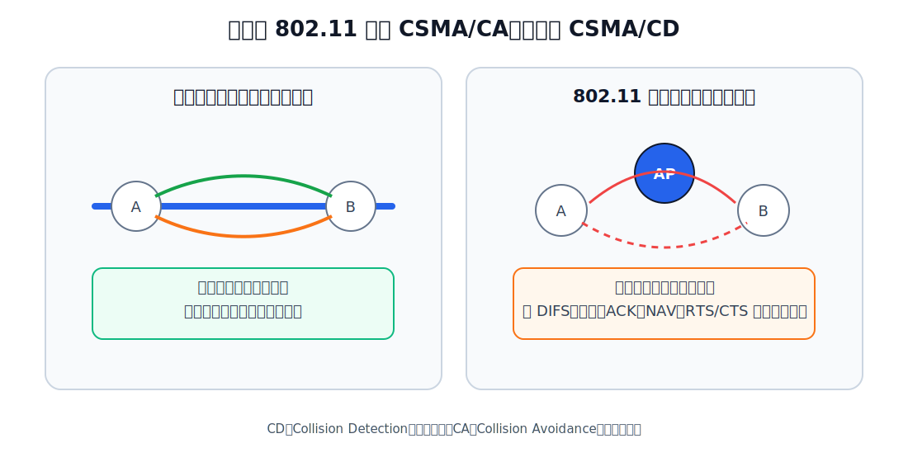
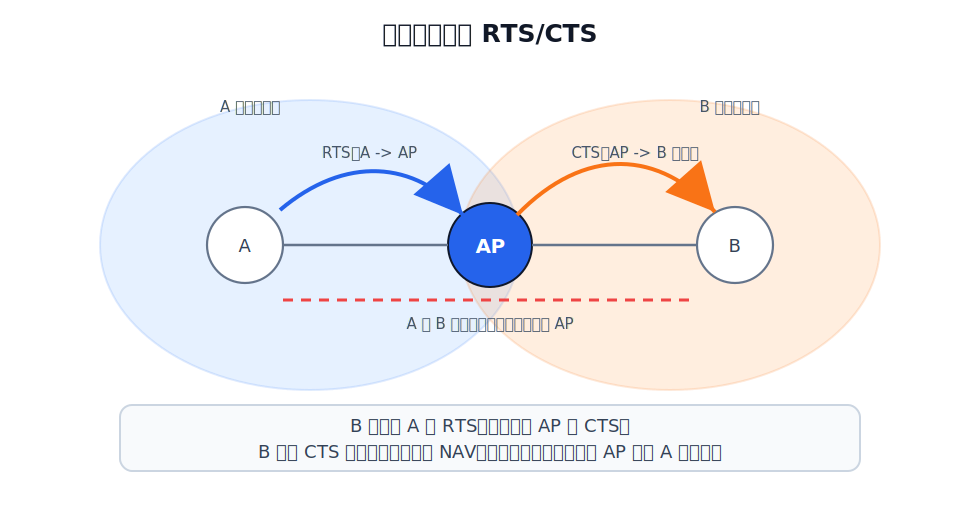
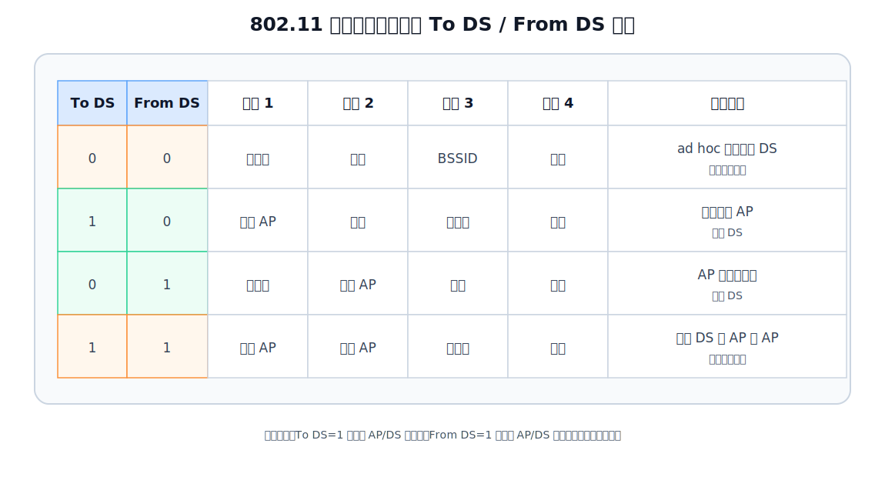

# 802.11 无线局域网

802.11 是无线局域网 WLAN 的主要标准族。它仍然属于 IEEE 802 局域网体系，数据链路层仍分为 LLC 子层和 MAC 子层；但因为传输介质变成无线信道，介质访问控制、可靠传输和帧地址字段都比有线以太网复杂。

802.11 与共享式以太网的核心差异是：

| 对比项 | 共享式以太网 | 802.11 WLAN |
|---|---|---|
| 传输介质 | 有线共享介质 | 无线信道 |
| 冲突处理 | CSMA/CD，发送中检测碰撞 | CSMA/CA，发送前尽量避免碰撞 |
| 可靠性 | 数据链路层通常不确认、不重传 | 数据链路层使用 ACK |
| 中心设备 | 集线器只是物理层转发 | AP 参与关联、转发和接入 DS |

共享式以太网的 CSMA/CD 见 [[Shared-Ethernet|共享式以太网]]。这里重点看无线环境为什么需要另一套机制。

# BSS、AP、BSSID、ESS、DS

## BSS

**基本服务集** BSS（Basic Service Set）是 802.11 WLAN 的最小构件。

在有固定基础设施的 WLAN 中，一个 BSS 通常包含：

- 一个 AP。
- 若干移动站 STA，例如笔记本、手机、平板。
- 一个无线覆盖范围 BSA（Basic Service Area）。

在基础结构模式中，移动站之间不直接互相转发数据。即使两个站点位于同一个 BSS 中，数据帧也通常先发给 AP，再由 AP 转发给目标站点。

## AP

AP（Access Point）是接入点。它既是无线侧的中心接入设备，也是连接无线 BSS 与分配系统 DS 的桥接设备。

AP 的作用可以分成三层看：

| 角度 | AP 的作用 |
|---|---|
| 无线接入 | 发送信标帧，允许移动站扫描、认证、关联 |
| BSS 内转发 | 接收站点发来的 802.11 帧，再转发给同一 BSS 内的目标站点 |
| 接入 DS | 把无线帧转到 DS，例如有线以太网；也把 DS 中来的帧转回无线站点 |

因此，AP 不是无线版的集线器。它会参与 MAC 层帧处理，并且在无线网络和分配系统之间起桥接作用。

## BSSID 与 SSID

| 名称 | 含义 | 典型形式 | 作用 |
|---|---|---|---|
| BSSID | Basic Service Set Identifier | AP 的 MAC 地址 | 唯一标识一个 BSS |
| SSID | Service Set Identifier | 最长 32 字节的网络名 | 用户看到的 Wi-Fi 名称 |

一个常见场景是：多个 AP 使用同一个 SSID，组成同一个可漫游的无线网络；但每个 AP 对应的 BSS 不同，因此 BSSID 也不同。终端界面上看到的是 SSID，802.11 帧中常常需要带 BSSID 来明确自己关联的是哪一个 AP。

## DS 与 ESS

**分配系统** DS（Distribution System）负责把多个 BSS 连接起来。DS 最常见的实现是以太网，也可以是点对点链路或其他无线链路。

多个 BSS 通过 DS 连接后，对上层表现为一个**扩展服务集** ESS（Extended Service Set）。ESS 的目的不是让每个 BSS 看起来彼此无关，而是让上层仍然把它看成一个局域网。

例如，站点 A 在 BSS1，站点 B 在 BSS2，A 给 B 发数据时，路径可以表示为 A 到 AP1，再经过 DS 到 AP2，最后到 B。

若 DS 是以太网，那么 AP1 和 AP2 之间转发的通常是以太网帧；若 DS 也是 802.11 无线链路，则 AP 之间还会使用 802.11 的地址字段来标明发送 AP 和接收 AP。

## 漫游与关联

移动站要加入某个 BSS，必须先选择 AP 并与该 AP 建立关联。关联成功后，站点才属于这个 AP 所在的 BSS，并通过该 AP 收发数据。

移动站发现 AP 的方式有两种：

| 扫描方式 | 过程 |
|---|---|
| 被动扫描 | AP 周期性发送信标帧 Beacon，站点监听信标帧 |
| 主动扫描 | 站点发送探测请求 Probe Request，等待 AP 的探测响应 Probe Response |

漫游时，移动站从一个 AP 的 BSS 移动到另一个 AP 的 BSS，并重新关联到新的 AP。802.11 标准定义了关联等基本服务，但不规定具体漫游实现算法。

## 基础结构模式与 ad hoc 模式

802.11 有两种典型组网方式。

| 模式 | 是否有 AP | 通信方式 | 特点 |
|---|---|---|---|
| 基础结构模式 | 有 | 站点通过 AP 通信 | 最常见，可接入 DS 和外部网络 |
| ad hoc 模式 | 无 | 站点在通信范围内直接通信 | 组网简单，但标准本身不提供多跳路由 |

ad hoc 模式也称自组织模式。它允许站点在彼此无线覆盖范围内直接通信，但 802.11 的 ad hoc 模式只支持单跳通信；多跳路由属于更高层或专门的自组织网络路由协议问题。

# 802.11 物理层标准

802.11 是一个标准族，物理层会随着频段、调制方式、带宽和天线技术变化而变化。数据链路层讨论 CSMA/CA、ACK、NAV、RTS/CTS 时，不需要记住所有物理层细节，但应知道不同 802.11 标准的差异主要来自物理层。

| 标准 | 频段 | 典型物理层技术 | 直观特点 |
|---|---|---|---|
| 802.11b | 2.4 GHz | DSSS | 速率较低，传播距离相对较远 |
| 802.11a | 5 GHz | OFDM | 速率较高，传播距离相对较短 |
| 802.11g | 2.4 GHz | OFDM | 在 2.4 GHz 上提供较高速率 |
| 802.11n | 2.4 GHz / 5 GHz | OFDM、MIMO | 使用多天线提高吞吐量 |
| 802.11ac | 5 GHz | OFDM、MIMO | 进一步提高速率 |
| 802.11ax | 2.4 GHz / 5 GHz | OFDMA、MIMO | 即 Wi-Fi 6，提升高密度场景效率 |

这些物理层标准影响速率、覆盖范围、抗干扰能力和可支持的用户密度；但只要仍在 802.11 WLAN 的 MAC 层框架内，基本介质访问思想仍围绕 CSMA/CA 展开。

#  CSMA/CD 在 WLAN 上的局限

802.11 仍然使用 CSMA 的“先听后说”思想，但不能照搬 CSMA/CD。原因主要有两个。

## 发送时难以检测碰撞

有线共享介质中，站点可以边发送边监听介质上的电信号变化，从而检测碰撞。无线环境中，发送端自己的发射信号往往远强于接收到的远端信号，边发边准确检测碰撞很困难。

所以，无线站点更适合在发送前尽量降低碰撞概率，发送后通过 ACK 判断是否成功。

## 隐藏站问题

隐藏站问题是无线局域网的典型问题：A 和 B 都能与 AP 通信，但 A 与 B 彼此听不到。

如果 A 正在向 AP 发送，B 因为听不到 A，可能误以为信道空闲，也向 AP 发送。这样 AP 处发生碰撞。A 和 B 对彼此来说就是隐藏站。

CSMA/CD 假设站点能够比较可靠地监听到共享介质上的发送行为；无线局域网中这个假设不成立，因此 802.11 使用 CSMA/CA。

# CSMA/CA

CSMA/CA 是 Carrier Sense Multiple Access with Collision Avoidance，载波监听多址接入/碰撞避免。

它的基本思想是：

- 发送前监听信道。
- 信道空闲后先等待帧间间隔。
- 必要时进行随机退避。
- 数据帧发送后等待 ACK。
- 通过 NAV 和 RTS/CTS 减少隐藏站带来的碰撞。

802.11 MAC 层定义了两种介质访问控制方式：

| 方式  | 全称                                | 特点                                  |
| --- | --------------------------------- | ----------------------------------- |
| DCF | Distributed Coordination Function | 分布式协调功能，站点通过 CSMA/CA 争用信道，必须实现      |
| PCF | Point Coordination Function       | 点协调功能，通常由 AP 集中轮询，提供无争用服务，可选但实际较少使用 |

通常讨论 802.11 的 CSMA/CA 时，默认是在说 DCF。

## 帧间间隔：SIFS 与 DIFS

802.11 规定站点必须在信道持续空闲一段时间后才能发送帧。这段时间称为帧间间隔 IFS（Interframe Space）。

不同帧等待的 IFS 不同。高优先级帧等待时间短，低优先级帧等待时间长。

| IFS | 含义 | 典型用途 | 直观作用 |
|---|---|---|---|
| SIFS | Short IFS | ACK、CTS、分片后的后续数据帧 | 最短，使一次对话中的响应帧优先发送 |
| DIFS | DCF IFS | 普通数据帧、管理帧 | 普通争用发送前需要等待 |

SIFS 比 DIFS 短，这会形成一种优先级关系：**已经开始的一次帧交换中的响应帧，比其他站点新发起的数据帧更早获得发送机会**。

例如 A 向 B 发送 DATA 后，B 若正确收到，需要返回 ACK。此时其他站点即使也想发送普通数据帧，也必须等信道空闲满 DIFS 后才能争用；而 B 只需要等 SIFS 就能发送 ACK。因为 SIFS 更短，所以 ACK 会先发出，其他站点会继续等待。这样，DATA -> ACK 这次交换可以连续完成，不会被其他普通数据帧插入打断。

CTS 也是同理：A 发出 RTS 后，B 等 SIFS 就返回 CTS。其他站点要发普通数据帧要等 DIFS，因此 CTS 可以优先发出，把这次预约过程继续下去。

## 退避计时器

如果信道刚从忙变为空闲，多个站点可能都在等待发送。若它们都在 DIFS 后立即发送，仍然容易碰撞。因此 CSMA/CA 使用退避计时器。

退避过程可以按“选择一个随机时隙数，然后只在信道空闲时倒计时”来理解。

[html-card height=720](../assets/csma-ca-backoff-slides.html)

1. 站点有帧要发，先监听信道。
2. 若信道忙，站点不发送，等待信道从忙变为空闲。
3. 信道空闲后，站点先连续等待一个 DIFS。若 DIFS 期间信道又变忙，则回到等待信道空闲。
4. DIFS 结束后，站点从当前争用窗口 CW 中随机选一个整数 $r$，表示还要等待 $r$ 个时隙。
5. 每经过一个空闲时隙，退避计时器减 1。
6. 如果倒计时过程中信道变忙，计时器立即冻结，剩余值不清零。
7. 等信道再次空闲，并重新等待 DIFS 后，计时器从冻结时的剩余值继续倒计时。
8. 当计时器减到 0，站点获得发送机会，开始发送数据帧。

争用窗口用于降低多个站点同时发送的概率。窗口越大，随机选择的范围越大，同时选到同一个时隙的概率越低，但平均等待时间也更长。发生重传时，争用窗口通常按二进制指数退避扩大；发送成功后，争用窗口恢复到较小范围。

> [!note]
> 退避计时器不是按真实时间一直倒计时，而是只在信道保持空闲的时隙中倒计时。信道一忙就冻结，这一点是理解 CSMA/CA 退避过程的关键。

只有一种常见情况可以不退避：站点要发送第一个数据帧，且检测到信道已经空闲足够长时间。除此之外，信道忙后再发送、重传、连续发送下一个帧，通常都要执行退避。

## 虚拟载波监听与 NAV

物理载波监听只能回答“我现在是否听到无线信号”。但无线局域网还需要处理“我虽然听不到某个站点，但我知道信道已经被预约”的情况。

802.11 因此引入**虚拟载波监听**。数据帧、RTS、CTS 中可以携带持续期字段，说明本次通信还需要占用信道多长时间。其他站点听到这些帧后，把自己的 NAV（Network Allocation Vector，网络分配向量）设置为相应时间。

某个站认为信道忙，可能有两种原因：

- 物理载波监听检测到信道忙。
- NAV 还没有倒计时到 0，虚拟载波监听认为信道忙。

NAV 的关键价值是：站点不必真正听到所有无线信号，只要听到数据帧、RTS 或 CTS 中的持续期字段之一，就能推迟访问。

## 基本发送过程

展示一个普通数据帧的 CSMA/CA 发送过程：源站等待 DIFS 后发送数据，目的站等待 SIFS 后返回 ACK；其他站点根据持续期字段设置 NAV，在这段时间内推迟发送。

[html-card height=720](../assets/csma-ca-basic-send-slides.html)

802.11 使用 ACK 的原因是无线链路误码率较高，而且发送端不能像 CSMA/CD 那样可靠地在发送中检测碰撞。若源站没有在超时时间内收到 ACK，就认为该帧可能丢失或碰撞，需要退避后重传。

## RTS/CTS 信道预约

RTS/CTS 是可选的信道预约机制，常用于降低隐藏站带来的碰撞开销。

RTS/CTS 的完整过程如下。

[html-card height=720](../assets/rts-cts-reservation-slides.html)

1. 源站监听信道，若空闲则等待 DIFS。
2. 源站发送 RTS（Request To Send），说明自己想发送，并给出本次通信需要占用信道的持续时间。
3. 目的站正确收到 RTS 且信道可用，等待 SIFS 后发送 CTS（Clear To Send）。
4. 源站收到 CTS 后，等待 SIFS，再发送数据帧。
5. 目的站正确收到数据帧后，等待 SIFS，返回 ACK。
6. 其他站点只要听到 RTS、CTS 或数据帧中的持续期字段，就设置 NAV，在对应时间内推迟发送。

RTS/CTS 本身会带来额外开销，因此不一定总是使用。常见策略是：数据帧较长时使用 RTS/CTS；数据帧较短时直接发送，因为预约开销可能超过收益。

>[!note] RTS/CTS 可以解决隐藏站问题
>B 听不到 A 的 RTS，但可能听得到 AP 的 CTS。B 一旦听到 CTS，就知道 AP 接下来要接收 A 的数据，于是根据 CTS 中的持续时间设置 NAV，暂时不发送。

# 802.11 MAC 帧

802.11 MAC 帧分为三类：

| 类型 | 作用 | 例子 |
|---|---|---|
| 数据帧 | 承载上层数据 | 普通数据帧 |
| 控制帧 | 控制信道访问和可靠传输 | ACK、RTS、CTS |
| 管理帧 | 建立和维护无线连接 | Beacon、Probe Request、Probe Response、Association |

控制帧和管理帧不是“额外背景知识”。CSMA/CA 的 ACK、RTS、CTS 属于控制帧；扫描和关联依赖管理帧。

## 802.11 数据帧的 4 个地址字段

以太网帧通常只需要目的 MAC 地址和源 MAC 地址。802.11 数据帧可能有 4 个地址字段，因为无线站点、AP、DS 之间的关系更复杂。

关键控制位是：

- To DS：帧是否去往分配系统。
- From DS：帧是否来自分配系统。

| To DS | From DS | 地址 1 | 地址 2 | 地址 3 | 地址 4 | 场景 |
|---:|---:|---|---|---|---|---|
| 0 | 0 | 目的站 | 源站 | BSSID | 未用 | ad hoc 或不经过 DS 的同一 BSS 通信 |
| 1 | 0 | 接收 AP | 源站 | 目的站 | 未用 | 站点发往 AP，再进入 DS |
| 0 | 1 | 目的站 | 发送 AP | 源站 | 未用 | AP 从 DS 转发给站点 |
| 1 | 1 | 接收 AP | 发送 AP | 目的站 | 源站 | 无线 DS 中 AP 到 AP 的转发 |

最常见的是中间两种。

例如站点 A 通过 AP1 给站点 B 发送数据：

1. A 先把 802.11 帧发给 AP1：To DS = 1，From DS = 0。地址 1 是 AP1，地址 2 是 A，地址 3 是 B。
2. 若 B 在 AP1 的同一 BSS 中，AP1 再把帧转发给 B：To DS = 0，From DS = 1。地址 1 是 B，地址 2 是 AP1，地址 3 是 A。
3. 若 B 位于另一个 BSS，AP1 先通过 DS 把帧送到 AP2，再由 AP2 发给 B。

802.11 帧中需要 AP 地址，是因为无线站点可能处在多个 AP 的信号覆盖范围内，但它只能与某个 AP 建立关联。帧必须明确当前由哪个 AP 接收或发送。以太网帧中通常不需要携带 AP 地址，因为 AP 在 DS 侧像透明网桥一样工作。
