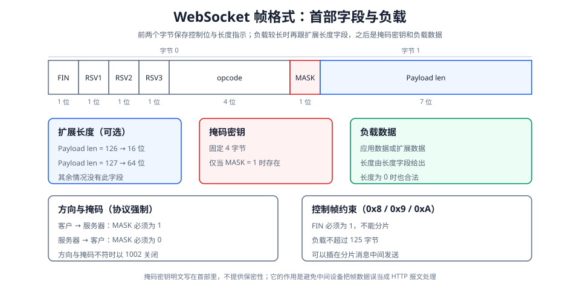

# 实时通信上 HTTP 协议的不足

[[../posts/HTTP|HTTP]] 是请求/响应协议：报文只能由客户发起，服务器只能被动应答，即使已经知道有新数据也送不出去。

聊天、协同编辑、实时行情这类应用要的正是“一有新数据就送过来”，于是只能在客户发起的请求上做文章，常见做法有三种。

1. **短轮询**按固定间隔重复发请求，大多数时候问出的只是“还没有数据”：间隔越短越浪费，越长延迟越大。
2. **长轮询**把请求挂起，有数据才应答，延迟因此变小，代价是每条消息仍需走完一次完整的请求/响应。
3. **SSE** 让客户只请求一次，之后由服务器持续推送，省掉了重复请求，代价是方向只剩服务器到客户，HTTP/1.1 下同一域名的连接数也有限。


[html-card height=700](../assets/websocket-push-comparison-slides.html)

# WebSocket 

WebSocket 是独立的应用层协议（RFC 6455）。它先借一次 HTTP 请求完成握手；连接建立后，帧在两个方向上独立传送，任何一方都可以随时发送，不必等对方先提出请求。

前面三种做法都受同一条限制：**服务器只能应答客户已经发出的请求，不能自行向客户发送数据**。要让服务器主动送数据，只能由客户挂起一个不结束的请求，而且一个方向就需要一条这样的通道。

而 WebSocket 取消了这条限制，实现了全双工，不再需要靠挂起请求来换取发送权，也不必为两个方向各维护一条通道。消息越频繁、越短小，收益越明显：聊天、协同编辑的光标同步、游戏输入都是典型场景。

> [!warning] WebSocket 不一定优于其他 3 种方案
> WebSocket 的优势在连接数、服务端状态和每条消息开销，不在延迟。若服务器到客户用 SSE、客户到服务器用 POST，单条消息的传输延迟与 WebSocket 相同，只有长轮询会因应答结束到下一次请求之间的空隙而变慢；只做服务器单向推送时，SSE 更简单。

应用层以**消息**为单位收发，看到的是完整消息而不是字节流。

地址形式与 HTTP 对应：`ws://` 默认端口 **80**，`wss://` 默认端口 **443**（在 TLS 之上）。

**握手段用 HTTP 完成，握手之后这条连接上不再出现 HTTP 报文**。这样 WebSocket 就能复用 HTTP 的端口和代理配置。

# 用 HTTP 请求完成协议升级

WebSocket 握手借用了 HTTP/1.1 的**协议升级**机制。

[html-card height=660](../assets/websocket-handshake-slides.html)

## 客户的升级请求

客户先与服务器建立 TCP 连接，然后在连接上发送一个普通的 HTTP 请求，只是把方法固定为 `GET` 并加上升级相关的首部：

```http
GET /chat HTTP/1.1
Host: example.com
Upgrade: websocket
Connection: Upgrade
Sec-WebSocket-Key: dGhlIHNhbXBsZSBub25jZQ==
Sec-WebSocket-Version: 13
Origin: https://example.com
```

各首部的作用：

| 首部 | 作用 |
|---|---|
| `Upgrade: websocket` | 声明希望把这条连接升级为 WebSocket，不是要取一个资源 |
| `Connection: Upgrade` | HTTP/1.1 要求升级必须显式声明；中间设备缺少这一行可能不转发升级请求 |
| `Sec-WebSocket-Key` | 客户随机生成的 16 字节数据的 Base64 编码，用于让服务器证明自己确实理解 WebSocket 协议 |
| `Sec-WebSocket-Version: 13` | 协议版本号；服务器不支持该版本时返回 `426 Upgrade Required` |
| `Origin` | 浏览器自动携带的来源信息；服务器据此校验请求是否来自允许的页面 |
| `Sec-WebSocket-Protocol` | 可选首部，列出客户支持的子协议，如 `graphql-transport-ws`、`mqtt` |
| `Sec-WebSocket-Extensions` | 可选首部，列出客户希望启用的扩展，如 `permessage-deflate` 压缩 |

两个可选首部需要双方都同意：服务器从客户列出的子协议里选一个，并通过 `Sec-WebSocket-Protocol` 返回，扩展同理。真正需要额外留意的是 `Origin`：WebSocket 不受同源策略限制，跨域页面同样能发起连接，来源校验只能由服务器自己检查 `Origin` 来完成，否则会出现跨站 WebSocket 劫持。

## 服务器的升级响应

服务器同意升级时，返回表示协议切换的 `101`：

```http
HTTP/1.1 101 Switching Protocols
Upgrade: websocket
Connection: Upgrade
Sec-WebSocket-Accept: s3pPLMBiTxaQ9kYGzzhZRbK+xOo=
```

`Sec-WebSocket-Accept` 由客户的 `Sec-WebSocket-Key` 计算得到：把该值与本协议规定的固定字符串 `258EAFA5-E914-47DA-95CA-C5AB0DC85B11` 拼接，取 SHA-1 摘要后再做 Base64 编码：

$$
\text{Sec-WebSocket-Accept} = \text{Base64}\!\left(\text{SHA-1}\!\left(\text{Sec-WebSocket-Key} \parallel \text{GUID}\right)\right)
$$

客户收到响应后会自己算一遍并比对，以此确认对方是真懂 WebSocket 的服务器，而不是某个把请求当普通 HTTP 处理、恰好回了 `101` 的中间设备。固定 GUID 的作用也在于此：它让这次升级请求与普通 HTTP 请求无法互相冒充。

`101` 的语义是**切换协议** 。此后双方按 WebSocket 帧格式解析字节，不再解析 HTTP。

服务器不同意升级时会返回 `400`、`403`、`426` 之类的普通响应，客户把它当作本次连接的失败结果即可，连接不会升级。

# 帧

握手完成后，这条连接上的数据单位是**帧**（frame）。



## 帧的组成

帧首部的前两个字节固定，其余部分长度可变；长度字段必须用**最短的**表示方式，能用 7 位就不要用 16 位：

| 字段 | 长度 | 说明 |
|---|---|---|
| **FIN** | 1 位 | 值为 1 表示这是当前消息的最后一帧，值为 0 表示后面还有分片 |
| **RSV1**、**RSV2**、**RSV3** | 各 1 位 | 保留位，没有协商对应扩展时必须为 0 |
| **opcode** | 4 位 | 帧类型，取值见下节 |
| **MASK** | 1 位 | 值为 1 表示负载被掩码，此时首部中还有 4 字节掩码密钥 |
| **Payload len** | 7 位 | 0～125 直接表示负载长度；为 126 时后随 16 位长度；为 127 时后随 64 位长度 |
| **Extended payload length** | 0／16／64 位 | 负载较长时补充的长度字段 |
| **Masking-key** | 0 或 32 位 | `MASK` 为 1 时存在，负载数据逐字节与它异或 |
| **Payload data** | 可变 | 应用数据或扩展数据 |

## opcode

opcode 决定这一帧承载什么内容，取值分两类。承载应用数据的是数据帧，只有三个取值：

| opcode | 名称 | 说明 |
|---|---|---|
| `0x0` | Continuation | 同一条消息的后续分片 |
| `0x1` | Text | 负载是 UTF-8 文本 |
| `0x2` | Binary | 负载是二进制数据 |

控制帧不携带应用数据，只负责管理连接本身，取值同样只有三个。它们**不能分片**（FIN 必须为 1）、**负载不超过 125 字节**，但**可以插在一条分片消息的中间**发送，所以长消息传输过程中也能及时处理关闭和心跳：

| opcode | 名称 | 说明 |
|---|---|---|
| `0x8` | Close | 发起或应答关闭握手 |
| `0x9` | Ping | 探测对方是否仍在，收到方应回 Pong |
| `0xA` | Pong | 对 Ping 的应答 |

## 掩码

掩码是协议强制的，不允许协商取消：客户发往服务器的帧，`MASK` 必须为 1，负载用 4 字节随机密钥逐字节异或；服务器发往客户的帧，`MASK` 必须为 0，负载不加任何处理。接收方发现方向与掩码规则不符时，按协议错误（状态码 1002）关闭连接。

掩码不是为了加密，因为密钥就写在同一个帧的首部里，任何人都能还原。它的目的是**防止中间设备误解析**：如果一个被缓存的 WebSocket 数据恰好看起来像一条 HTTP 请求，不理解协议的代理或缓存就可能按 HTTP 处理它并污染缓存。加上随机的掩码后，数据无法被伪造成合法的 HTTP 请求。

## 消息与帧的关系

一条**消息**由一帧或多帧组成。短消息只用一个 FIN 为 1 的数据帧承载；长消息被拆成一个 FIN 为 0 的首帧、若干 `0x0` Continuation 帧，以及最后一帧 FIN 为 1 的收尾帧。接收方按 FIN 和 opcode 把分片重新拼成完整消息后才交给应用，所以应用只看到“消息”，看不到分片过程。Text 帧的负载必须是合法 UTF-8，否则接收方以状态码 1007 关闭连接。

# 连接维护

## 心跳

WebSocket 连接是长连接，长时间没有数据时可能被中间的 NAT 或防火墙静默回收，两端都以为连接还在，实际已经不可用。协议为此提供了 Ping／Pong 控制帧：一侧发送 Ping，另一侧**必须**尽快回送一个负载与 Ping 相同的 Pong。应用层也可以约定自己的心跳消息，例如每隔 30 秒发一次业务层 ping，用来同时检测业务逻辑是否仍然健康。

## 关闭握手

关闭连接不是直接断开 TCP，而是先交换 Close 帧：

1. 一方发送 Close 帧，可携带 2 字节状态码和一段原因说明。
2. 另一方回送 Close 帧。
3. 双方随后断开 TCP 连接。

常用状态码：

| 状态码 | 含义 |
|---|---|
| `1000` | 正常关闭 |
| `1001` | 端点离开（如页面被关闭、服务器下线） |
| `1002` | 协议错误（如掩码方向不符、保留位不为 0） |
| `1003` | 收到无法接受的数据类型 |
| `1007` | 负载与类型不符（如 Text 帧不是合法 UTF-8） |
| `1008` | 违反策略（如未通过鉴权） |
| `1009` | 消息过大 |
| `1011` | 服务器遇到非预期情况 |
| `1006` | 连接异常关闭，**只在本机上报**，不会出现在线上传出的 Close 帧中 |

# 与其他实时方案的对比

| 维度 | 短轮询 | 长轮询 | SSE | WebSocket |
|---|---|---|---|---|
| 通信方向 | 请求/响应 | 请求/响应 | 服务器 → 客户单向 | **双向全双工** |
| 连接数 | 每条请求一条短连接 | 每次等待占一条连接 | 一条长连接 | 一条长连接 |
| 每条消息的额外开销 | 一整套 HTTP 首部 | 一整套 HTTP 首部 | 事件文本格式 | 2 字节帧首部（客户方向加 4 字节掩码密钥） |
| 实时性 | 取决于轮询间隔 | 较好，仍有等待与超时 | 好 | 好 |
| 协议 | HTTP | HTTP | HTTP | 握手用 HTTP，之后是独立协议 |
| 断线重连 | 天然无状态 | 天然无状态 | 浏览器内置自动重连 | 需要应用自己实现重连与补发 |
| 适用场景 | 数据变化很慢、实现最简单 | 兼容性要求极高 | 只读的实时数据推送 | 双向实时交互 |

选择时不必都上 WebSocket：只需要服务器单向推送时，SSE 更简单；两侧都以请求/响应为主时，普通 HTTP 更合适。

# 典型用途

用得最多的场合是双向实时交互：即时通信里的聊天消息、在线客服与多人协作光标同步，行情推送和监控大屏，以及协同编辑、远程终端、在线代码运行环境。这些应用如果退回轮询，实时性与开销都无法兼顾。

在反向代理和网关前部署时要注意：`Upgrade` 和 `Connection` 首部必须被显式转发，否则握手会失败；同时需要放宽长连接的读超时，例如 Nginx 中的 `proxy_read_timeout`。若前面是 HTTP/2 或 HTTP/3 网关，WebSocket 需要改用扩展 CONNECT 方式建立：HTTP/2 上由 RFC 8441 定义，HTTP/3 上由 RFC 9220 定义。
