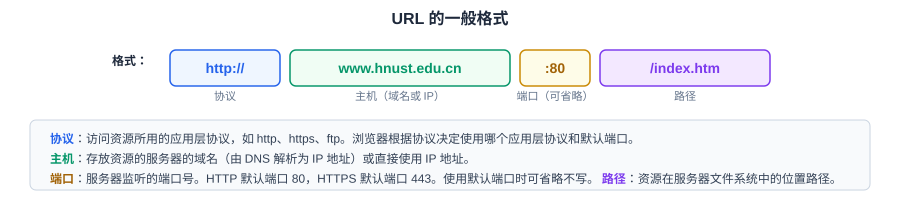

# 万维网是什么

**万维网**（World Wide Web，WWW）并非某种特殊的计算机网络，而是一个大规模的、联机式的信息储藏所，是运行在因特网上的一个**分布式应用**。万维网利用网页之间的**超链接**，将不同网站的网页链接成一张逻辑上的信息网。

因特网提供的是主机与主机之间的分组传送能力，万维网则是建立在这套能力之上的应用：用户点击链接，浏览器向对应服务器请求文档，服务器把文档返回给浏览器，浏览器解析并渲染。

万维网依靠三个基本要素工作：**URL** 标识资源，**HTTP** 传送资源（见 [[../posts/HTTP]]），**HTML** 描述文档的结构和内容。

**超文本**（hypertext）指包含指向其他文档的链接的文本；**超媒体**（hypermedia）进一步把链接与图片、音频、视频等非文本内容结合起来。正是超链接让分布在不同服务器上的文档组成一张信息网，用户不必知道文档实际存放在哪台主机上。

# URL：统一资源定位符

万维网上的每一个文档（网页、图片、视频等）在整个因特网范围内都有唯一的标识符，即**统一资源定位符 URL**。

URL 的一般格式：

$$
\text{<协议>://<主机>:<端口>/<路径>}
$$

| 组成部分 | 说明 | 示例 |
|---|---|---|
| 协议 | 访问资源所用的应用层协议 | `http`、`https`、`ftp` |
| 主机 | 存放资源的服务器的域名或 IP 地址 | `www.hnust.edu.cn` |
| 端口 | 服务器监听的端口号（可省略，使用协议默认端口） | HTTP 默认 `80`，HTTPS 默认 `443` |
| 路径 | 资源在服务器上的位置路径 | `/index.htm`、`/images/logo.png` |

例如 `http://www.hnust.edu.cn:80/index.htm` 中：

- 协议 `http` → 使用 HTTP。
- 主机 `www.hnust.edu.cn` → 湖南科技大学 Web 服务器。
- 端口 `80` → HTTP 默认端口，通常省略不写。
- 路径 `/index.htm` → 请求网站首页文件。

> 用户通常只需要在浏览器地址栏输入域名和路径。协议和端口如果使用默认值，浏览器会自动补充。

# 万维网文档

万维网服务器上的文档通常由三种类型的文件构成：

- **HTML**（超文本标记语言）：定义网页的**结构**和内容。包含文本、图片、链接等元素，由浏览器解析并渲染。
- **CSS**（层叠样式表）：定义网页的**样式**。控制颜色、字体、布局等视觉呈现。
- **JavaScript**：定义网页的**行为**。实现交互功能、动态内容更新等。

这些文档可以是事先设计好的**静态页面**，也可以是服务器后端程序根据用户请求自动生成的**动态页面**。无论哪种，最终都需要从服务器传送到用户浏览器进行解析和渲染。

# 浏览器与服务器

万维网采用 [[Application-Models|客户/服务器（C/S）方式]]：**浏览器**是客户，主动发起请求，解析响应并渲染页面；**万维网服务器**被动等待请求，收到请求后取出或生成文档返回。

# 一次万维网访问的完整过程

用户在地址栏输入 URL 或点击超链接后，一次访问要依次经过下列阶段：

1. **解析 URL**：从 URL 中取出协议、主机名、端口号和路径。这一步只处理字符串，还没有产生任何网络流量。
2. **域名解析**：把主机名转换为 IP 地址，由 [[Domain-Name-System|域名系统]] 完成。
3. **建立连接**：与服务器建立 TCP 连接，HTTP 默认端口 80，HTTPS 默认端口 443；握手与释放的过程见 [[TCP-Connection-Management]]。
4. **交换报文**：客户通过这条连接发送 HTTP 请求报文，服务器执行相应操作后返回 HTTP 响应报文。
5. **渲染与续取**：浏览器解析响应中的文档并渲染。文档里通常还有图片、样式表、脚本等引用对象，每获取一个对象都要回到第 3、4 步。
