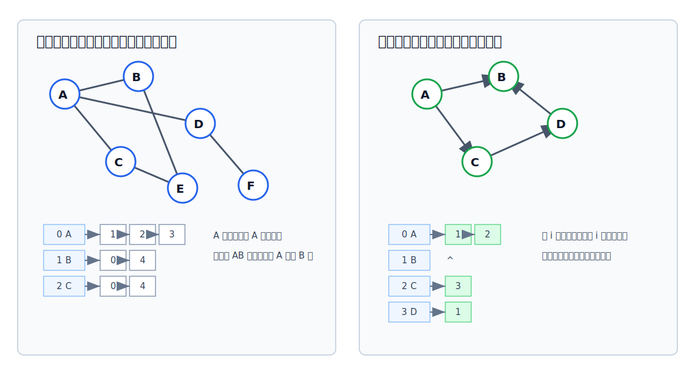

# 邻接表法

邻接表法用一个顶点表保存所有顶点，再给每个顶点接一条链表，链表中保存与该顶点直接相关的边或弧。它本质上是**顺序存储 + 链式存储**：顶点表适合按编号定位顶点，边结点链表只保存实际存在的边或弧。



## 为什么需要邻接表

[[adjacency-matrix|邻接矩阵]]必须开 $|V|\times |V|$ 个单元。若图很稀疏，大量位置只是表示“没有边”，空间浪费明显。

邻接表只保存实际存在的边或弧，因此更适合[[sparse-and-dense-graph|稀疏图]]。

## 存储结构

邻接表一般由两类结点组成：

| 结点 | 保存内容 | 作用 |
|---|---|---|
| 顶点表结点 | 顶点数据 `data`，第一条边或弧的指针 `firstArc` | 顺序存储所有顶点，支持按编号访问 |
| 边/弧结点 | 邻接点编号 `adjvex`，下一条边或弧的指针 `next`，可选权值 `weight` | 链式保存某个顶点的邻接关系 |

```c
#include <stdbool.h>

#define MAX_VERTEX_NUM 100

typedef char VertexType;
typedef int EdgeType;

typedef struct ArcNode {
    int adjvex;                // 邻接点下标：若本结点挂在 u 的链表中，则表示 u -> adjvex
    EdgeType weight;           // 边或弧的权值；无权图可统一记为 1
    struct ArcNode *next;      // 指向同一个顶点链表中的下一条边或弧
} ArcNode;

typedef struct VertexNode {
    VertexType data;           // 顶点本身的信息，例如顶点名 A、B、C
    ArcNode *firstArc;         // 链表头指针，指向该顶点的第一条边或弧
} VertexNode;

typedef struct {
    VertexNode vertices[MAX_VERTEX_NUM]; // 顶点表：顺序存储所有顶点
    int vertexCount;                     // 顶点数，遍历顶点表时使用
    int edgeCount;                       // 边或弧的数量；无向边仍按一条边统计
    bool directed;                       // true 表示有向图；false 表示无向图
} ALGraph;
```

> [!tip] 和树的孩子表示法的关系
> 树的孩子表示法也是“顺序表 + 链表”：顺序表保存每个结点，链表保存该结点的孩子。邻接表把这个思想推广到图：顶点表保存顶点，每条链表保存该顶点的邻接点。

## 无向图邻接表

无向边 $(u,v)$ 与两个顶点都相关，所以要存两次：

- 在 $u$ 的链表中加入 $v$。
- 在 $v$ 的链表中加入 $u$。

[html-card height=860 step=80](../assets/adjacency-list-build.html)

因此无向图中边结点数量是 $2|E|$，整体空间复杂度为：

$$
O(|V|+2|E|)
$$

在无向图邻接表中，顶点 $v_i$ 的度就是第 $i$ 条链表中的边结点个数。

## 有向图邻接表

有向图的邻接表通常保存**出边表**。若存在弧 $\langle u,v\rangle$，只在 $u$ 的链表中加入 $v$。

[html-card height=800 step=80](../assets/adjacency-list-directed.html)

因此有向图中弧结点数量是 $|E|$，整体空间复杂度为：

$$
O(|V|+|E|)
$$

对有向图：

- 出度：直接数该顶点链表中的弧结点个数，很方便。
- 入度：需要扫描所有顶点的链表，统计哪些弧结点的 `adjvex` 指向该顶点，不方便。
- 总度：入度 + 出度。

若题目需要频繁找入边，可以使用逆邻接表或后续的十字链表。

## 表示方式不唯一

只要顶点编号确定，同一个图的邻接矩阵表示是唯一的；但邻接表表示不唯一。

原因是：同一个顶点的邻接点可以按不同顺序链接。例如 A 的邻接点可以写成：

```text
A -> B -> C -> D
```

也可以写成：

```text
A -> D -> C -> B
```

两者表示的是同一个图，只是链表结点顺序不同。遍历算法若基于邻接表，遍历序列也可能受链表顺序影响。

## 基本操作

```c
#include <stdbool.h>
#include <stdlib.h>

// Returns whether `from` has a direct edge or arc to `to`.
//
// Args:
//   graph: adjacency-list graph to query.
//   from: start vertex index.
//   to: end vertex index.
//
// Returns:
//   true if `to` appears in `from`'s adjacency list; false otherwise.
bool Adjacent(const ALGraph *graph, int from, int to) {
    // 邻接表不能像邻接矩阵那样 O(1) 定位 edge[from][to]。
    // 必须沿 from 的链表查找，看是否存在邻接点 to。
    for (ArcNode *arc = graph->vertices[from].firstArc; arc != NULL; arc = arc->next) {
        if (arc->adjvex == to) {
            return true;
        }
    }

    return false;
}

// Inserts one arc node into `from`'s adjacency list.
//
// Args:
//   graph: adjacency-list graph to modify.
//   from: start vertex index; the new node is inserted into this list.
//   to: end vertex index; stored as the new node's adjvex.
//   weight: edge or arc weight.
//
// Side effects:
//   Allocates one ArcNode and inserts it at the head of `from`'s list.
void AddArc(ALGraph *graph, int from, int to, int weight) {
    ArcNode *arc = malloc(sizeof(ArcNode));
    if (arc == NULL) {
        return;
    }
    arc->adjvex = to;
    arc->weight = weight;

    // 头插法的关键两步不能颠倒：
    // 先让新结点指向原来的第一个结点，再把头指针改为新结点。
    arc->next = graph->vertices[from].firstArc;
    graph->vertices[from].firstArc = arc;
}

// Adds one edge or arc.
//
// Args:
//   graph: adjacency-list graph to modify.
//   from: start vertex index.
//   to: end vertex index.
//   weight: edge or arc weight.
//
// Side effects:
//   For a directed graph, inserts only <from, to>. For an undirected graph,
//   inserts both from -> to and to -> from.
void AddEdge(ALGraph *graph, int from, int to, int weight) {
    // 有向图中，这一句插入弧 <from, to>。
    AddArc(graph, from, to, weight);

    if (!graph->directed) {
        // 无向边 (from, to) 要在两个端点的链表中各存一次。
        AddArc(graph, to, from, weight);
    }

    ++graph->edgeCount;
}
// Returns the out-degree of `vertex`.
//
// Args:
//   graph: adjacency-list graph to query.
//   vertex: vertex index.
//
// Returns:
//   Length of `vertex`'s adjacency list. For an undirected graph, this is the
//   ordinary degree.
int OutDegree(const ALGraph *graph, int vertex) {
    int degree = 0;

    // 有向图默认保存出边表，所以 vertex 链表的长度就是出度。
    // 无向图中同理，该链表长度就是 vertex 的度。
    for (ArcNode *arc = graph->vertices[vertex].firstArc; arc != NULL; arc = arc->next) {
        ++degree;
    }

    return degree;
}

// Returns the in-degree of `vertex`.
//
// Args:
//   graph: adjacency-list graph to query.
//   vertex: vertex index.
//
// Returns:
//   Number of arc nodes in the whole graph whose adjvex equals `vertex`.
int InDegree(const ALGraph *graph, int vertex) {
    int degree = 0;

    // 入边不在 vertex 自己的链表中，而是散落在其他顶点的出边表里。
    // 因此必须扫描整个邻接表，统计哪些弧的终点是 vertex。
    for (int i = 0; i < graph->vertexCount; ++i) {
        for (ArcNode *arc = graph->vertices[i].firstArc; arc != NULL; arc = arc->next) {
            if (arc->adjvex == vertex) {
                ++degree;
            }
        }
    }

    return degree;
}
```

> [!warning] 头插法会改变邻接点顺序
> 上面的 `AddArc` 使用头插法，代码简单，但同一顶点的邻接点顺序与边输入顺序相反。若题目要求按输入顺序访问邻接点，应使用尾插法:

```c
// Inserts one arc node at the tail, using ordinary pointers.
//
// Args:
//   graph: adjacency-list graph to modify.
//   from: start vertex index; the new node is inserted into this list.
//   to: end vertex index; stored as the new node's adjvex.
//   weight: edge or arc weight.
//
// Side effects:
//   Appends one ArcNode. This preserves the input order of adjacent vertices.
void AddArc(ALGraph *graph, int from, int to, int weight) {
    ArcNode *arc = malloc(sizeof(ArcNode));
    if (arc == NULL) {
        return;
    }

    arc->adjvex = to;
    arc->weight = weight;
    arc->next = NULL;
	
	// 需要判断链表是否为空
    if (graph->vertices[from].firstArc == NULL) {
        // 空链表没有尾结点，直接修改头指针。
        graph->vertices[from].firstArc = arc;
        return;
    }

    ArcNode *tail = graph->vertices[from].firstArc;

    // tail 是普通结点指针，所以它停在“最后一个结点”上。
    while (tail->next != NULL) {
        tail = tail->next;
    }

    // 找到最后一个结点后，修改它的 next。
    tail->next = arc;
}
```

> 若题目要求按顶点编号访问邻接点，则应插入后排序或按序插入。
## 与邻接矩阵对比

| 对比项      | 邻接表                                        | 邻接矩阵         |
| -------- | ------------------------------------------ | ------------ |
| 空间复杂度    | 无向图 $O(\|V\|+2\|E\|)$；有向图 $O(\|V\|+\|E\|)$ | $O(\|V\|^2)$ |
| 适合图类型    | 稀疏图                                        | 稠密图          |
| 表示方式     | 不唯一                                        | 顶点编号确定后唯一    |
| 判断两点是否相邻 | 扫描对应链表，最坏 $O(\|V\|)$                       | $O(1)$       |
| 找某顶点的邻接点 | 直接遍历该顶点链表                                  | 扫描对应行或列      |
| 无向图求度    | 数该顶点链表结点，方便                                | 扫描对应行或列      |
| 有向图求出度   | 数该顶点链表结点，方便                                | 扫描对应行        |
| 有向图求入度   | 扫描整个邻接表，不方便                                | 扫描对应列        |
| 找有向图出边   | 遍历该顶点链表，方便                                 | 扫描对应行        |
| 找有向图入边   | 扫描整个邻接表，不方便                                | 扫描对应列        |
