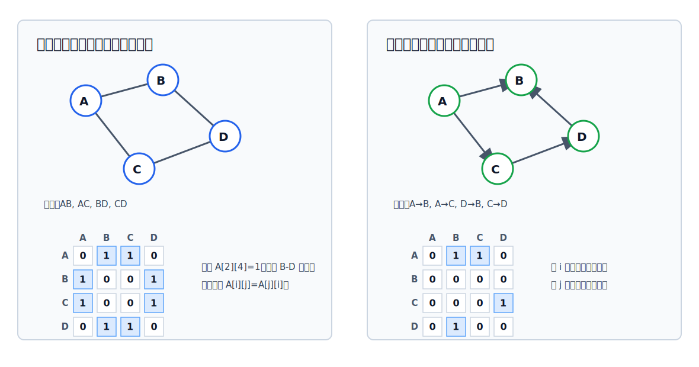

# 邻接矩阵法

邻接矩阵法用一个二维数组保存顶点之间是否有边、弧或权值。它的核心优点是判断两个顶点是否相邻很直接，核心代价是空间只和顶点数有关，即使边很少也要开 $|V|^2$ 个单元。



## 基本定义

设图 $G=(V,E)$ 有 $n$ 个顶点，将顶点编号为 $v_1,v_2,\cdots,v_n$。邻接矩阵 $A$ 是一个 $n\times n$ 的矩阵：

$$
A[i][j]=
\begin{cases}
1, & (v_i,v_j)\in E \text{ 或 } \langle v_i,v_j\rangle\in E\\
0, & (v_i,v_j)\notin E \text{ 且 } \langle v_i,v_j\rangle\notin E
\end{cases}
$$

- 对无向图，$A[i][j]=1$ 表示 $v_i$ 与 $v_j$ 之间有边。
- 对有向图，$A[i][j]=1$ 表示存在从 $v_i$ 指向 $v_j$ 的弧。
- 顶点中可以保存更复杂的信息；矩阵单元可以用 `bool`、枚举型或整型表示边是否存在。

> [!warning] 0 和 $\infty$ 的语义不同
> 在普通 0/1 邻接矩阵中，`0` 只表示“没有边或弧”，它不是代价。
>
> 在带权图或最短路径算法使用的代价矩阵中，矩阵单元表示“从 $v_i$ 到 $v_j$ 的代价”。这时不相连的两个顶点不能写成 `0`，否则会被算法误认为存在一条零代价边，应写成 $\infty$；主对角线通常写成 `0`，表示顶点到自身的代价为 `0`。

[html-card height=820 step=80](../assets/adjacency-matrix-build.html)

## 无向图的邻接矩阵

无向边 $(v_i,v_j)$ 没有方向，所以矩阵中要同时记录两个位置：

$$
A[i][j]=1,\quad A[j][i]=1
$$

因此无向图的邻接矩阵一定关于主对角线对称。

> [!tip] 度的计算
> 在无向图中，第 $i$ 个顶点的度等于第 $i$ 行非零元素个数，也等于第 $i$ 列非零元素个数。

## 有向图的邻接矩阵

有向弧 $\langle v_i,v_j\rangle$ 只能说明从 $v_i$ 到 $v_j$ 有边，不能反推从 $v_j$ 到 $v_i$ 有边：

$$
A[i][j]=1 \not\Rightarrow A[j][i]=1
$$

> [!tip] 入度、出度与总度
> - 第 $i$ 行非零元素个数：$v_i$ 的出度。
> - 第 $i$ 列非零元素个数：$v_i$ 的入度。
> - 第 $i$ 个顶点的度：第 $i$ 行非零元素个数 + 第 $i$ 列非零元素个数。

用邻接矩阵求某个顶点的度、入度或出度，都需要扫描一整行或一整列，时间复杂度为 $O(|V|)$。

## 查找相邻边或弧

邻接矩阵适合快速判断两个指定顶点之间是否有边或弧：

```c
// Returns whether there is an edge or arc from `from` to `to`.
//
// Args:
//   matrix: 0/1 adjacency matrix; 1 means adjacent, 0 means not adjacent.
//   from: row index, representing the start vertex.
//   to: column index, representing the end vertex.
//
// Returns:
//   true if `from` is directly adjacent to `to`; false otherwise.
bool AdjacentInBinaryMatrix(int matrix[][MAX_VERTEX_NUM], int from, int to) {
    // 普通 0/1 邻接矩阵只表达“是否有边或弧”：
    // matrix[from][to] == 1 表示 from 到 to 有直接关系。
    return matrix[from][to] == 1;
}
```

但如果要列出某个顶点的全部邻接边，就要扫描矩阵：

- 无向图：扫描第 $i$ 行或第 $i$ 列，非零位置就是相邻顶点。
- 有向图找出边：扫描第 $i$ 行。
- 有向图找入边：扫描第 $i$ 列。

这些操作的时间复杂度都是 $O(|V|)$。

## 带权图的邻接矩阵

[[weighted-graph|带权图]]也称网。带权图的矩阵单元不再只表示 0 或 1，而是保存边或弧的权值。

常用约定：

- 若 $v_i$ 到 $v_j$ 有边或弧，则 `edge[i][j]` 保存权值。
- 若 $v_i$ 到 $v_j$ 没有边或弧，则 `edge[i][j]` 记为 $\infty$。
- 主对角线常记为 $0$，表示顶点到自身的距离为 $0$；也有材料会把所有不存在的边统一记作 $\infty$，做题时按题目约定判断。
- C 语言里常用一个足够大的整数表示 $\infty$，例如 `INT_MAX` 或自定义 `INF`。

## C 语言表示

```c
#include <stdbool.h>
#include <limits.h>

#define MAX_VERTEX_NUM 100
#define INF (INT_MAX / 2)

typedef char VertexType;
typedef int EdgeType;

typedef struct {
    VertexType vertex[MAX_VERTEX_NUM];              // 顶点表：vertex[i] 是第 i 个顶点的数据
    EdgeType edge[MAX_VERTEX_NUM][MAX_VERTEX_NUM];  // 矩阵：edge[i][j] 描述 i 到 j 的边、弧或权值
    int vertexCount;                                // 当前顶点数，决定需要扫描的矩阵范围
    int edgeCount;                                  // 边或弧的数量；无向边只按一条边统计
    bool directed;                                  // true 表示有向图；false 表示无向图
    bool weighted;                                  // true 表示矩阵单元保存权值；false 表示只保存 0/1
} MGraph;

// Initializes an adjacency-matrix graph.
//
// Args:
//   graph: graph object to initialize.
//   vertexCount: number of vertices used by the graph.
//   directed: true for a directed graph, false for an undirected graph.
//   weighted: true when edge[][] stores weights, false when it stores 0/1.
//
// Side effects:
//   Clears the matrix and sets the graph metadata.
void InitGraph(MGraph *graph, int vertexCount, bool directed, bool weighted) {
    graph->vertexCount = vertexCount;
    graph->edgeCount = 0;
    graph->directed = directed;
    graph->weighted = weighted;

    for (int i = 0; i < vertexCount; ++i) {
        for (int j = 0; j < vertexCount; ++j) {
            if (weighted) {
                // 带权图中，矩阵单元表示“代价”。
                // 自己到自己通常记为 0；不相连不能记为 0，应记为 INF。
                graph->edge[i][j] = (i == j) ? 0 : INF;
            } else {
                // 普通邻接矩阵中，0 表示“没有边或弧”，不是代价。
                graph->edge[i][j] = 0;
            }
        }
    }
}

// Adds one edge or arc to an adjacency-matrix graph.
//
// Args:
//   graph: graph object to modify.
//   from: start vertex index.
//   to: end vertex index.
//   weight: edge weight; ignored as a weight when graph->weighted is false.
//
// Side effects:
//   Writes edge[from][to]. For an undirected graph, also writes edge[to][from].
void AddEdge(MGraph *graph, int from, int to, int weight) {
    // 无权图只关心有无边，用 1 表示存在；
    // 带权图要保存题目给出的权值。
    int value = graph->weighted ? weight : 1;

    // 有向图中，这一句表示弧 <from, to>。
    graph->edge[from][to] = value;

    if (!graph->directed) {
        // 无向图的边 (from, to) 没有方向，矩阵必须保持对称。
        graph->edge[to][from] = value;
    }

    ++graph->edgeCount;
}

// Returns whether there is an edge or arc from `from` to `to`.
//
// Args:
//   graph: graph object to query.
//   from: start vertex index.
//   to: end vertex index.
//
// Returns:
//   true if an edge or arc exists; false otherwise.
bool HasEdge(const MGraph *graph, int from, int to) {
    if (graph->weighted) {
        // 带权图允许权值为 0，所以不能用 edge[from][to] != 0 判断是否有边。
        // 这里约定 INF 才表示“不相连”，并排除主对角线的自到自距离。
        return from != to && graph->edge[from][to] != INF;
    }

    // 无权图中，0/1 的语义就是“无边/有边”。
    return graph->edge[from][to] != 0;
}

// Returns the out-degree of `vertex`.
//
// Args:
//   graph: graph object to query.
//   vertex: vertex index.
//
// Returns:
//   Number of arcs leaving `vertex`. In an undirected graph, this is the degree.
int OutDegree(const MGraph *graph, int vertex) {
    int degree = 0;

    for (int j = 0; j < graph->vertexCount; ++j) {
        // 固定行 vertex，逐列检查 vertex -> j。
        // 有向图中这正是出边；无向图中这一行也能统计该顶点关联的边。
        if (HasEdge(graph, vertex, j)) {
            ++degree;
        }
    }

    return degree;
}

// Returns the in-degree of `vertex`.
//
// Args:
//   graph: graph object to query.
//   vertex: vertex index.
//
// Returns:
//   Number of arcs entering `vertex`.
int InDegree(const MGraph *graph, int vertex) {
    int degree = 0;

    for (int i = 0; i < graph->vertexCount; ++i) {
        // 固定列 vertex，逐行检查 i -> vertex。
        // 只有有向图才需要专门区分入度；无向图扫行扫列结果相同。
        if (HasEdge(graph, i, vertex)) {
            ++degree;
        }
    }

    return degree;
}

// Returns the total degree of `vertex`.
//
// Args:
//   graph: graph object to query.
//   vertex: vertex index.
//
// Returns:
//   In-degree plus out-degree for a directed graph; ordinary degree for an
//   undirected graph.
int TotalDegree(const MGraph *graph, int vertex) {
    if (graph->directed) {
        // 有向图的度是入度和出度之和。
        return InDegree(graph, vertex) + OutDegree(graph, vertex);
    }

    // 无向图没有入/出方向，扫一行得到的就是度。
    return OutDegree(graph, vertex);
}
```

> [!warning] 带权图的边判断
> 对带权图，不能只用 `edge[i][j] != 0` 判断是否有边，因为 $0$ 可能是合法权值，也可能是主对角线。更稳妥的做法是把“无边”统一记为 `INF`，或者另设 `bool hasEdge[][]`。

## 性能与适用场景

邻接矩阵的空间复杂度为：

$$
O(|V|^2)
$$

它只和顶点数有关，和实际边数无关。因此：

- 适合存储[[sparse-and-dense-graph|稠密图]]。
- 不适合存储稀疏图，因为大量矩阵单元可能都表示“无边”。
- 判断两个顶点是否相邻是 $O(1)$。
- 查找一个顶点的全部邻接点需要 $O(|V|)$。

## 无向图邻接矩阵的压缩存储

无向图的邻接矩阵是对称矩阵，因此可以只存主对角线加下三角区，或只存主对角线加上三角区。这样可以把 $n\times n$ 个单元压缩为：

$$
\frac{n(n+1)}{2}
$$

若按行优先存储主对角线和下三角区，且矩阵下标从 $1$ 开始、一维数组下标从 $0$ 开始，则：

$$
k=\frac{i(i-1)}{2}+j-1,\quad i\ge j
$$

若遇到 $i<j$，利用对称性 $a_{i,j}=a_{j,i}$，转成：

$$
k=\frac{j(j-1)}{2}+i-1,\quad i<j
$$

```c
// Converts a symmetric matrix coordinate to a compressed-array index.
//
// Args:
//   row: 1-based row index in the full matrix.
//   col: 1-based column index in the full matrix.
//
// Returns:
//   0-based index in the one-dimensional array that stores the main diagonal
//   and lower triangle by row-major order.
int LowerTriangleIndex(int row, int col) {
    if (row >= col) {
        // 已经在主对角线或下三角区，按行优先直接定位。
        // row 和 col 使用 1 起始下标，返回的一维数组下标从 0 开始。
        return row * (row - 1) / 2 + col - 1;
    }

    // 若访问的是上三角元素 a[row][col]，利用对称性转成 a[col][row]。
    return col * (col - 1) / 2 + row - 1;
}
```

## 矩阵幂与路径条数

设图 $G$ 的邻接矩阵为 $A$，且矩阵元素只表示 $0/1$。则：

$$
A^n[i][j]
$$

表示从顶点 $i$ 到顶点 $j$ 的长度为 $n$ 的路径条数。

这里的路径长度按边或弧的条数计算。例如 $A^2[i][j]$ 会枚举所有中间顶点 $k$：

$$
A^2[i][j]=\sum_{k=1}^{|V|}A[i][k]\cdot A[k][j]
$$

每一项 $A[i][k]\cdot A[k][j]$ 表示“能否从 $i$ 先到 $k$，再从 $k$ 到 $j$”。乘积为 $1$ 就代表存在一条经过 $k$ 的长度为 $2$ 的路径。

[html-card height=840 step=80](../assets/adjacency-matrix-path-count.html)

> [!example]
> 若 $A^2[2][2]=i$，表示从顶点 $2$ 出发，走两条边又回到顶点 $2$ 的路径有 i 条。
