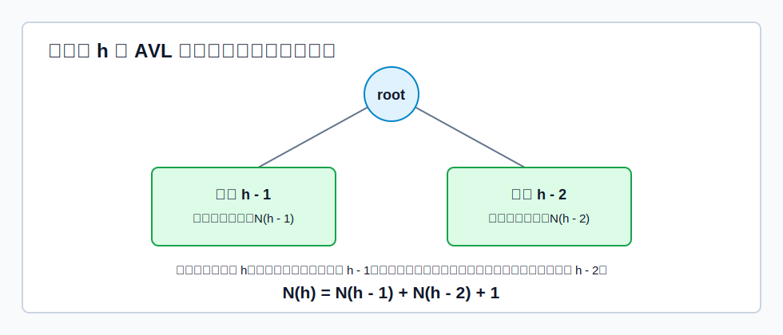

# 定义与性质

**AVL 树**是一种自平衡的[[binary-search-tree|二叉排序树]]。它不仅满足 BST 的左小右大性质，还要求：

> [!important]
> 对树上任一结点，其左子树和右子树的高度差绝对值不超过 `1`。

结点的**平衡因子**定义为：

$$
BF = h_{left} - h_{right}
$$

因此 AVL 树中任一结点的平衡因子只能是 `-1`、`0`、`1`。只要有一个结点的平衡因子绝对值大于 `1`，整棵树就不是 AVL 树。

AVL 树首先是 BST，所以中序遍历仍得到递增序列；查找过程也与 BST 完全一致。区别在于：插入、删除后如果破坏平衡，需要通过旋转恢复平衡。

若树高为 $h$，查找一个关键字最多比较 $h$ 次。因此 AVL 树的高度上界直接决定查找性能。

## 高度为 $h$ 的 AVL 树至少有多少个结点？

1. 要让整棵 AVL 树高度达到 $h$，根的某一棵子树高度至少要达到 $h-1$。
2. 为了让结点总数尽量少，另一棵子树应尽可能矮。
3. 但 AVL 要求左右子树高度差不能超过 `1`，所以另一棵子树最低只能是 $h-2$。
4. 两棵子树本身也必须是 AVL 树，而且也要各自取最少结点。

令 $N(h)$ 表示高度为 $h$ 的 AVL 树至少包含的结点数，则：

$$
N(0)=0,\quad N(1)=1,\quad N(2)=2
$$

$$
N(h)=N(h-1)+N(h-2)+1
$$

这里的 `+1` 是根结点。这个递推的本质是：根结点把问题拆成“高度 $h-1$ 的最小 AVL 子树”和“高度 $h-2$ 的最小 AVL 子树”。

## 高度为 $h$的 AVL 树有几种可能形态？

设 $S(h)$ 表示高度为 $h$ 的 AVL 树形态数。按根结点**分治**：

- 整棵树高度为 $h$，所以左右子树中至少有一棵高度为 $h-1$。
- AVL 要求左右子树高度差不超过 `1`，所以另一棵子树高度只能是 $h-1$ 或 $h-2$。
- 因此根的左右子树高度组合只有三类：$(h-1,h-1)$、$(h-1,h-2)$、$(h-2,h-1)$。
- 每一类中，左子树形态数与右子树形态数相乘；三类情况再相加。

可递推写为：

$$
S(0)=1,\quad S(1)=1
$$

$$
S(h)=S(h-1)^2+2S(h-1)S(h-2)
$$

其中：

- $S(h-1)^2$ 对应左右子树都高 $h-1$。
- $2S(h-1)S(h-2)$ 对应一边高 $h-1$、另一边高 $h-2$，且较高子树可以在左边或右边。

# 插入

AVL 插入先按 [[binary-search-tree#插入与构造|BST 规则插入]]。新结点一定先作为叶结点出现。插入后，从插入点向上检查祖先结点的平衡因子，找到第一个失衡结点，称为**最小不平衡子树**的根。

插入只会让某条查找路径上的结点高度发生变化，其他分支不受影响。因此只需要沿插入路径向上找。

[html-card height=720](../assets/avl-rotations.html)

## LL 型

若新结点插入到失衡结点 `A` 的左孩子 `B` 的左子树中，使 `BF(A)` 从 `+1` 变成 `+2`，属于 LL 型。

处理：对 `A` 做**右单旋**。

- `B` 上升，成为这棵子树的新根。
- `A` 下降，成为 `B` 的右孩子。
- `B` 原右子树改接为 `A` 的左子树。

这样仍保持 BST 的中序关系：

$$
BL < B < BR < A < AR
$$

## RR 型

若新结点插入到失衡结点 `A` 的右孩子 `B` 的右子树中，使 `BF(A)` 从 `-1` 变成 `-2`，属于 RR 型。

处理：对 `A` 做**左单旋**。

- `B` 上升，成为这棵子树的新根。
- `A` 下降，成为 `B` 的左孩子。
- `B` 原左子树改接为 `A` 的右子树。

中序关系保持为：

$$
AL < A < BL < B < BR
$$

## LR 型

若新结点插入到 `A` 的左孩子 `B` 的右子树中，属于 LR 型。

手算时可以一步到位看最终形态：`C` 是 `A`、`B`、`C` 三个结点中关键字居中的结点，所以调整后让 `C` 成为这棵子树的新根。

具体连接：

1. `C->left = B`，`C->right = A`。
2. `C` 原来的左子树 `CL` 挂到 `B` 的右边。
3. `C` 原来的右子树 `CR` 挂到 `A` 的左边。

这等价于“先对 `B` 左旋，再对 `A` 右旋”，但画图时直接按最终连接更快。

中序关系保持为：

$$
BL < B < CL < C < CR < A < AR
$$

## RL 型

若新结点插入到 `A` 的右孩子 `B` 的左子树中，属于 RL 型。

手算时同样一步到位：`C` 是 `A`、`B`、`C` 三个结点中关键字居中的结点，调整后让 `C` 成为这棵子树的新根。

具体连接：

1. `C->left = A`，`C->right = B`。
2. `C` 原来的左子树 `CL` 挂到 `A` 的右边。
3. `C` 原来的右子树 `CR` 挂到 `B` 的左边。

这等价于“先对 `B` 右旋，再对 `A` 左旋”，但画图时直接按最终连接更清楚。

中序关系保持为：

$$
AL < A < CL < C < CR < B < BR
$$

## 插入后为什么只调一次

插入导致最小不平衡子树高度增加 `1`。经过 LL/RR/LR/RL 调整后，这棵最小不平衡子树的高度会恢复到插入前的高度。

因此，对插入而言，只要把最小不平衡子树调整平衡，它上面的祖先结点也会恢复平衡，不需要继续向上调整。

# 删除

AVL 删除分两步：

1. 先按[[binary-search-tree|二叉排序树]]的删除方法删除目标结点。
2. 从实际被删除的位置向上回溯，检查是否出现失衡；若失衡，则旋转恢复。

BST 删除的三种情况仍适用：

- 叶结点：直接删除。
- 只有一棵子树：用唯一子树替代该结点。
- 有两棵子树：用直接前驱或直接后继替代，再转化为删除前驱/后继。

[html-card height=700](../assets/avl-delete-propagation.html)

删除后调整的核心步骤：

1. 从删除位置向根回溯，找到第一个平衡因子绝对值超过 `1` 的结点 `A`。
2. 在 `A` 的两棵子树中选择更高的孩子 `B`。
3. 在 `B` 的两棵子树中选择更高的孩子 `C`。
4. 根据 `C` 相对于 `A` 的位置判断 LL、RR、LR、RL，并旋转。
5. 若旋转后这棵子树高度下降，继续向上检查祖先。

删除和插入的重要区别：

- 插入调整后，最小不平衡子树高度通常恢复到插入前，因此不平衡不会继续向上传导。
- 删除调整后，某棵子树可能比删除前更矮，祖先结点的平衡因子可能继续变化，所以删除可能需要多次向上调整。

调整类型可按下面判断：

| 失衡结点 | 较高孩子 | 孙子位置 | 调整 |
|---|---|---|---|
| `BF(A)=+2` | 左孩子 `B` | `B` 的左侧更高或左右等高 | LL，右单旋 |
| `BF(A)=+2` | 左孩子 `B` | `B` 的右侧更高 | LR，`C` 上升，`B/A` 分居左右 |
| `BF(A)=-2` | 右孩子 `B` | `B` 的右侧更高或左右等高 | RR，左单旋 |
| `BF(A)=-2` | 右孩子 `B` | `B` 的左侧更高 | RL，`C` 上升，`A/B` 分居左右 |

其中“左右等高”一般出现在删除场景。它说明单旋即可恢复当前失衡，但旋转后子树高度可能下降，要继续向上检查。

# 查找性能

AVL 查找过程与 BST 一致：

- 小于当前结点，进入左子树。
- 大于当前结点，进入右子树。
- 等于当前结点，查找成功。
- 走到空指针，查找失败。

由于 AVL 树高度保持在 $O(\log_2 n)$，所以：

$$
Search = O(\log_2 n)
$$

插入、删除也都只沿根到叶的一条路径查找位置，再做有限次旋转；每次旋转是局部常数时间操作，因此：

$$
Insert = O(\log_2 n),\quad Delete = O(\log_2 n)
$$

AVL 树的特点是查找性能稳定，适合以查找为主、插入删除相对较少的场景。若插入删除频繁，[[red-black-tree|红黑树]]通常更实用，因为它对“平衡”的要求较弱，调整次数往往更少。
