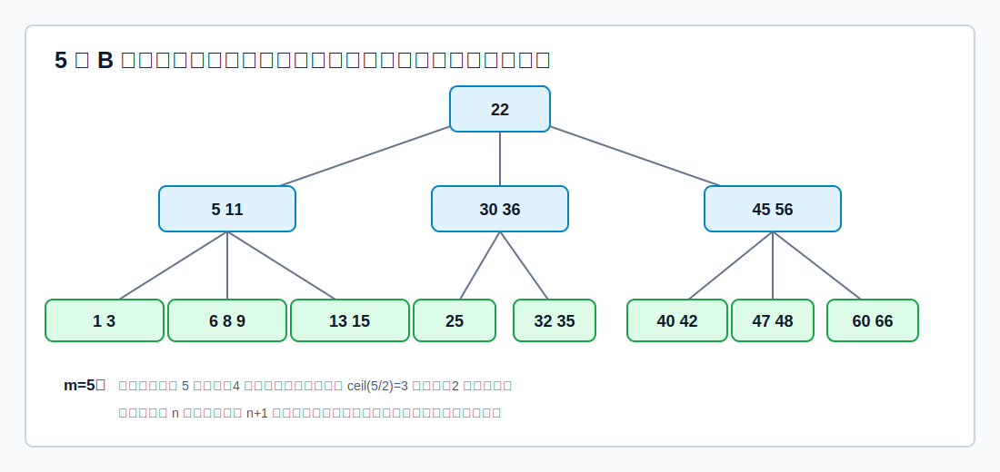
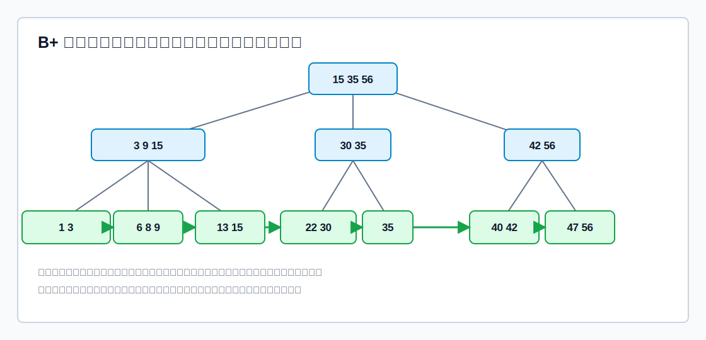

# B 树的定位

**B 树**又称多路平衡查找树。它可以理解为把 [[binary-search-tree|二叉排序树]] 推广为多叉查找树，并额外要求结点尽量“满”、整棵树保持“绝对平衡”。

这里的“绝对平衡”是指：所有叶结点，也就是查找失败的外部结点，都在同一层。

B 树常用于外存索引。一个结点可以存放多个关键字，查找时一次读入一个结点，可以减少访问层数。

# m 阶 B 树定义

B 树的**阶**是一个结点允许拥有的最大孩子数，通常记为 $m$。

一棵 $m$ 阶 B 树，或为空树，或满足：

1. 每个结点至多有 $m$ 棵子树，即至多有 $m-1$ 个关键字。
2. 若根结点不是终端结点，则根至少有 `2` 棵子树，即至少有 `1` 个关键字。
3. 除根结点外，所有非叶结点至少有 $\lceil m/2\rceil$ 棵子树，即至少有 $\lceil m/2\rceil-1$ 个关键字。
4. 非叶结点内部关键字有序：$K_1<K_2<\cdots<K_n$。
5. 若结点有 $n$ 个关键字，则有 $n+1$ 个孩子指针：$P_0,P_1,\cdots,P_n$。
6. 子树区间有序：$P_0<K_1<P_1<K_2<P_2<\cdots<K_n<P_n$。
7. 所有叶结点都在同一层。这里的叶结点可看作外部失败结点，实际存储中常为空指针，画图时通常省略。

> [!important]
> B 树中“终端结点”和“叶结点”容易混淆。教材里常把最底层含关键字的结点称为终端结点；真正的叶结点是它们下面的失败结点，通常不画。

对 $m$ 阶 B 树：

| 结点类型 | 孩子数范围 | 关键字数范围 |
|---|---:|---:|
| 根结点，非终端 | $[2,m]$ | $[1,m-1]$ |
| 其他非叶结点 | $[\lceil m/2\rceil,m]$ | $[\lceil m/2\rceil-1,m-1]$ |

例如 5 阶 B 树中，除根外每个结点关键字数范围是：

$$
\lceil 5/2\rceil-1 \le n \le 5-1
$$

即：

$$
2 \le n \le 4
$$

# 查找

B 树查找类似多叉查找：

1. 在当前结点内部查找关键字。结点内关键字有序，可以顺序查找，也可以折半查找。
2. 若命中某个关键字，查找成功。
3. 若未命中，根据关键字所在区间选择对应孩子指针继续向下。
4. 若走到失败结点，查找失败。

B 树查找成功可能停在任意一层，不一定到最底层。

# 高度

多数教材计算 B 树高度时，不把外部失败结点计入高度。

设 B 树有 $n$ 个关键字，阶为 $m$，高度为 $h$。

## 最小高度

要让高度尽量小，就让每个结点尽可能满：

- 每个结点最多 $m-1$ 个关键字。
- 每个非叶结点最多 $m$ 个孩子。

高度为 $h$ 时，最多关键字数为：

$$
(m-1)(1+m+m^2+\cdots+m^{h-1})=m^h-1
$$

因此：

$$
n\le m^h-1
$$

推出：

$$
h\ge \log_m(n+1)
$$

## 最大高度

要让高度尽量大，就让每个结点尽可能少：

- 根结点最少 `2` 个孩子。
- 其他非根结点最少 $k=\lceil m/2\rceil$ 个孩子。

高度为 $h$ 时，第 $h+1$ 层失败结点至少有：

$$
2k^{h-1}
$$

个。又因为 $n$ 个关键字会把数域切分成 $n+1$ 个失败区间，所以：

$$
n+1\ge 2k^{h-1}
$$

推出：

$$
h\le \log_{\lceil m/2\rceil}\frac{n+1}{2}+1
$$

综合：

$$
\log_m(n+1)\le h\le \log_{\lceil m/2\rceil}\frac{n+1}{2}+1
$$

# B 树建立与插入

B 树建立就是不断插入关键字。

插入的核心规则：

1. 新关键字一定插入到最底层终端结点。
2. 先按 B 树查找规则找到插入位置。
3. 插入后保持结点内关键字有序。
4. 若该结点关键字数不超过 $m-1$，插入结束。
5. 若超过 $m-1$，结点溢出，需要分裂。

[html-card height=720](../assets/b-tree-insert.html)

## 分裂规则

对 $m$ 阶 B 树，插入后若某结点有 $m$ 个关键字，超过上限 $m-1$：

1. 找到第 $\lceil m/2\rceil$ 个关键字。
2. 该关键字上提到父结点。
3. 它左边的关键字留在原结点。
4. 它右边的关键字放入新结点。
5. 若父结点也因此溢出，继续向上分裂。
6. 若根结点溢出，则产生新根，树高增加 `1`。

以 5 阶 B 树为例，结点最多 `4` 个关键字。若插入后得到：

$$
25,\ 38,\ 49,\ 60,\ 80
$$

第 $\lceil 5/2\rceil=3$ 个关键字 `49` 上提：

- 左结点：`25 38`
- 上提：`49`
- 右结点：`60 80`

这就是 B 树插入最重要的画图动作。

# B 树删除

B 树删除先按查找规则定位目标关键字，再分情况处理。

[html-card height=740](../assets/b-tree-delete.html)

## 删除终端结点中的关键字

若目标关键字在最底层终端结点中：

1. 直接删除该关键字。
2. 若删除后该结点关键字数仍不少于下限 $\lceil m/2\rceil-1$，结束。
3. 若低于下限，需要向相邻兄弟借，或与兄弟合并。

## 删除非终端结点中的关键字

若目标关键字在非终端结点中，不能直接挖空内部关键字。常用处理：

1. 找到该关键字的直接前驱或直接后继。
2. 用前驱或后继替代该关键字。
3. 再到最底层终端结点中删除原来的前驱或后继。

这样可以把“删除非终端结点关键字”转化为“删除终端结点关键字”。

直接前驱：当前关键字左侧指针所指子树中最右下的关键字。  
直接后继：当前关键字右侧指针所指子树中最左下的关键字。

## 兄弟够借

若删除后某结点低于下限，并且相邻兄弟结点的关键字数大于下限，则可以借。

借关键字不是简单把兄弟关键字平移过来，而是经过父结点旋转：

- 从右兄弟借：父结点中的分隔关键字下移到缺少结点，右兄弟最小关键字上移到父结点。
- 从左兄弟借：父结点中的分隔关键字下移到缺少结点，左兄弟最大关键字上移到父结点。

这样才能保持各子树区间顺序。

## 兄弟不够借

若删除后某结点低于下限，且相邻兄弟也只有下限个关键字，就不能借，只能合并。

合并规则：

1. 将缺少结点、父结点中的分隔关键字、相邻兄弟合并为一个结点。
2. 父结点失去一个关键字和一个孩子。
3. 若父结点因此低于下限，继续向上借或合并。
4. 若父结点是根，并且关键字数变为 `0`，删除旧根，合并后的结点成为新根，树高减少 `1`。

# B+ 树基本概念

**B+ 树**也是多路平衡查找结构，但它把“索引”和“记录”分得更清楚。

一棵 $m$ 阶 B+ 树通常满足：

1. 每个分支结点最多有 $m$ 棵子树。
2. 非叶根结点至少有 `2` 棵子树；其他分支结点至少有 $\lceil m/2\rceil$ 棵子树。
3. 分支结点中，关键字个数等于子树个数。
4. 所有叶结点包含全部关键字及对应记录指针。
5. 叶结点按关键字大小有序排列，并且相邻叶结点互相链接。
6. 分支结点只保存各子结点中的最大关键字及孩子指针，只起索引作用。

## B+ 树查找特点

B+ 树查找可以从根开始多路查找，也可以从叶结点链表顺序查找。

与 B 树不同：B+ 树中无论查找成功还是失败，最终都要走到最底层叶结点。

原因是：只有叶结点保存全部关键字及记录指针；分支结点中的关键字只是索引副本。

# B 树与 B+ 树对比

约定都是$m$阶。

| 对比项       | B 树                           | B+ 树                      |
| --------- | ----------------------------- | ------------------------- |
| 关键字与孩子数   | $n$ 个关键字对应 $n+1$ 棵子树          | $n$ 个关键字对应 $n$ 棵子树        |
| 每节点关键字数量  | $\lceil m/2\rceil-1 \sim m-1$ | $\lceil m/2\rceil \sim m$ |
| 关键字是否重复出现 | 各结点关键字不重复                     | 分支结点关键字会在叶结点中再次出现         |
| 记录存放位置    | 每个关键字所在结点都可存记录地址              | 只有叶结点存记录地址                |
| 查找成功位置    | 可能停在任意一层                      | 必须到叶结点                    |
| 顺序查找      | 不支持                           | 叶结点链表支持顺序查找和范围查找          |

