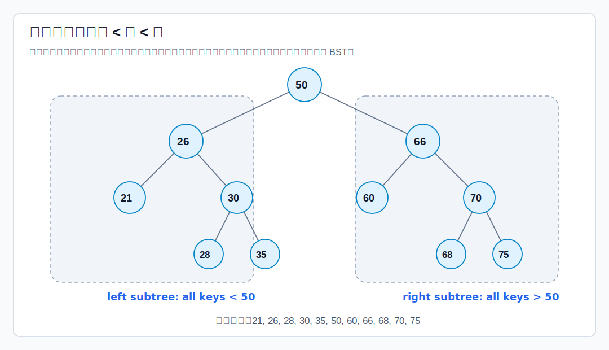

# 定义

二叉排序树又称二叉查找树，英文是 **Binary Search Tree**，常写作 **BST**。它可以是空二叉树；若非空，则满足：

- 左子树上所有结点的关键字都小于根结点关键字。
- 右子树上所有结点的关键字都大于根结点关键字。
- 左子树和右子树也分别是二叉排序树。

基础定义也可参考 [[binary-search-tree-concept|二叉排序树概念]]。本篇重点放在查找、插入、删除。



BST 的直接推论：==中序遍历 BST 可以得到递增有序序列==。因为中序遍历顺序是“左子树、根、右子树”，而 BST 正好满足“左 < 根 < 右”。

# 查找

BST 查找每次只需要沿一条路径向下：

- 若 `key == root->key`，查找成功。
- 若 `key < root->key`，去左子树查找。
- 若 `key > root->key`，去右子树查找。
- 若走到空指针，查找失败。

[html-card height=620](../assets/bst-search.html)

```c
typedef struct BSTNode {
    int key;
    struct BSTNode *left;
    struct BSTNode *right;
} BSTNode;

BSTNode *bst_search(BSTNode *root, int key) {
    while (root != NULL) {
        // 当前结点就是目标, 直接返回。
        if (key == root->key) {
            return root;
        }

        if (key < root->key) {
            // 目标小于当前结点，只可能在左子树。
            root = root->left;
        } else {
            // 目标大于当前结点，只可能在右子树。
            root = root->right;
        }
    }

    // 沿查找路径走到空指针，说明目标关键字不存在。
    return NULL;
}
```

查找长度就是比较过的结点数。若树高为 $h$，查找到最下层结点最多比较 $h$ 次。

若采用上面的非递归写法，只使用若干指针变量，额外空间复杂度为 $O(1)$。若采用递归写法，递归调用栈最坏会达到树高，额外空间复杂度为 $O(h)$。

# 插入与构造

BST 插入本质上是一次失败查找。沿查找路径找到应插入的空指针位置后，把新结点挂上去。

[html-card height=640](../assets/bst-insert.html)

```c
#include <stdlib.h>

static BSTNode *new_node(int key) {
    BSTNode *node = (BSTNode *)malloc(sizeof(BSTNode));
    if (node == NULL) {
        return NULL;
    }

    // 新结点刚插入时没有孩子，因此一定先作为叶结点出现。
    node->key = key;
    node->left = NULL;
    node->right = NULL;
    return node;
}

BSTNode *bst_insert(BSTNode *root, int key) {
    // parent 保存 current 的父结点；current 用来沿查找路径向下走。
    BSTNode *parent = NULL;
    BSTNode *current = root;

    while (current != NULL) {
        parent = current;

        if (key == current->key) {
            // 这里约定 BST 中不存放重复关键字。
            return root;
        }

        // 继续查找插入位置：小于走左子树，大于走右子树。
        current = key < current->key ? current->left : current->right;
    }

    // current 为 NULL 时，parent 就是新结点应该挂接的父结点。
    BSTNode *node = new_node(key);
    if (node == NULL) {
        return root;
    }

    if (parent == NULL) {
        // 原树为空，新结点就是整棵树的新根。
        return node;
    } else if (key < parent->key) {
        // 查找失败位置在 parent 的左空链域。
        parent->left = node;
    } else {
        // 查找失败位置在 parent 的右空链域。
        parent->right = node;
    }

    return root;
}
```

插入要点：

- 原树为空时，新结点直接成为根结点。
- 原树非空时，先比较并向左/右子树移动，直到遇到空位置。
- 新插入结点一定是叶结点。
- 若不允许重复关键字，遇到相同关键字时通常不插入。
- 使用返回根指针的写法时，调用形式应为 `root = bst_insert(root, key);`。这样能统一处理空树插入和非空树插入。

按一个关键字序列反复插入，就能构造 BST。不同插入序列可能构造出同一棵 BST，也可能构造出不同形态的 BST。形态不同会直接影响查找效率。

# 删除

删除前先查找目标结点 `z`。删除后必须仍保持 BST 的中序序列有序。

## 1. 删除叶结点

若 `z` 是叶结点，直接删除即可。它没有子树，删除不会影响其他结点之间的大小关系。

[html-card height=620](../assets/bst-delete-leaf.html)

## 2. 删除只有一棵子树的结点

若 `z` 只有左子树或只有右子树，让 `z` 的子树替代 `z` 的位置，成为 `z` 父结点的子树。

原因是：这棵唯一子树中的所有关键字本来就位于 `z` 应在的范围内。让它上接到 `z` 的父结点，不会破坏 BST 性质。

[html-card height=650](../assets/bst-delete-one-child.html)

## 3. 删除有两棵子树的结点

若 `z` 同时有左、右子树，不能简单用某一棵子树替代。常用方法是：

1. 找到 `z` 的直接后继，也就是 `z` 右子树中最左下的结点。
2. 用后继结点的关键字替代 `z` 的关键字。
3. 在 `z` 的右子树中删除那个后继结点。

也可以使用直接前驱：左子树中最右下的结点。直接后继一定没有左子树，直接前驱一定没有右子树，所以替代后再删除它们时，会转化为“叶结点”或“只有一棵子树”的简单情况。

[html-card height=660](../assets/bst-delete.html)

```c
static BSTNode *min_node(BSTNode *root) {
    // 一直向左走，找到以 root 为根的子树中的最小关键字结点。
    while (root != NULL && root->left != NULL) {
        root = root->left;
    }
    return root;
}

BSTNode *bst_delete(BSTNode *root, int key) {
    if (root == NULL) {
        // 没找到目标结点，空树仍为空。
        return NULL;
    }

    if (key < root->key) {
        // 目标在左子树；删除后要把新的左子树根接回 root->left。
        root->left = bst_delete(root->left, key);
        return root;
    }

    if (key > root->key) {
        // 目标在右子树；删除后要把新的右子树根接回 root->right。
        root->right = bst_delete(root->right, key);
        return root;
    }

    // 走到这里，说明 root 就是待删除结点。
    if (root->left == NULL || root->right == NULL) {
        // 情况 1/2：叶结点或只有一棵子树。
        // 若是叶结点，child 为 NULL；若只有一棵子树，child 指向那棵子树。
        BSTNode *child = root->left != NULL ? root->left : root->right;
        free(root);
        // 返回 child，让父结点改接它；这一步完成“用子树替代 z”。
        return child;
    }

    // 情况 3：左右子树都存在。用右子树中最小结点，即直接后继替代 root。
    BSTNode *successor = min_node(root->right);
    root->key = successor->key;
    // 后继已被复制到 root；接着在右子树中删除原后继结点。
    // 直接后继没有左子树，因此这次递归会落入情况 1/2。
    root->right = bst_delete(root->right, successor->key);
    return root;
}
```

这段代码采用“直接后继”方案。若使用前驱，则应找左子树中最右下结点，并在左子树中删除该前驱。

# 查找效率

BST 的查找效率取决于树高，而树高取决于插入序列形成的树形。

最好情况下，BST 接近平衡。$n$ 个结点的二叉树最小高度为 $\lfloor\log_2 n\rfloor+1$，与完全二叉树同数量级：

$$
h=O(\log_2 n)
$$

此时平均查找长度也是 $O(\log_2 n)$。

最坏情况下，插入序列本身有序，BST 退化成单链表，树高为 $n$：

$$
h=O(n)
$$

此时平均查找长度退化为 $O(n)$。

成功 ASL 按成功结点层数加权平均。若各关键字等概率：

$$
ASL_{success}=\frac{\sum \text{所有成功结点所在层数}}{n}
$$

失败 ASL 按失败位置对应的比较次数加权平均。失败位置可以看作 BST 空链域。若一棵有 $n$ 个结点的 BST 有 $n+1$ 个空链域，则失败情况通常按这些空链域统计。

> [!example]
例如一棵较平衡 BST 有 8 个结点，成功 ASL 为：
$$
ASL_{success}=\frac{1\times1+2\times2+3\times4+4\times1}{8}=2.625
$$
若同样 8 个关键字构造成接近单支的 BST，成功 ASL 可能变为：
$$
ASL_{success}=\frac{1\times1+2\times2+3\times1+4\times1+5\times1+6\times1+7\times1}{8}=3.75
$$
失败 ASL 也会随树形变化。较平衡时可能是：
$$
ASL_{fail}=\frac{3\times7+4\times2}{9}=3.22
$$
接近单支时可能变为：
$$
ASL_{fail}=\frac{2\times3+3+4+5+6+7\times2}{9}=4.22
$$
