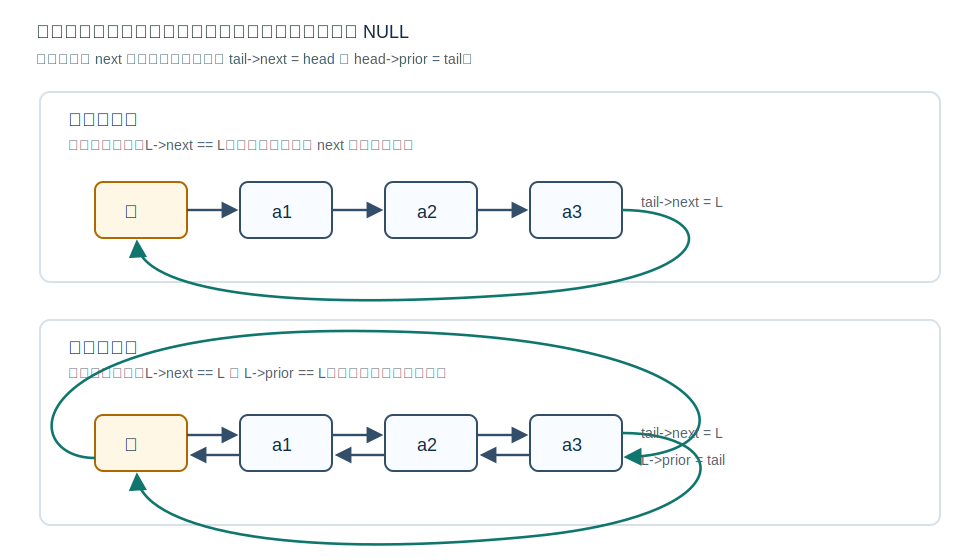

# 循环链表



## 循环单链表

循环单链表将表尾结点的 `next` 指针指向头结点，而不是 `NULL`。

带头结点循环单链表的空表通常满足：

`L->next == L`

```c
bool InitCLinkList(LinkList *L) {
    *L = (LNode *)malloc(sizeof(LNode));
    if (*L == NULL) return false;
    (*L)->next = *L;
    return true;
}

bool Empty(LinkList L) {
    return L->next == L;
}
```

特点：从任意结点出发，沿 `next` 指针可以回到起点并访问其他结点；从尾部到头部为 `O(1)`。

[html-card](../assets/circular-single-linked-list.html)

## 尾指针的价值

很多链表操作发生在头部或尾部。循环单链表中，若让 `L` 指向表尾结点，则：

- 找尾结点：`O(1)`。
- 找头结点：`L->next`，`O(1)`。
- 在表头或表尾插入更方便。

代价是插入、删除时要维护尾指针是否变化。

若 `tail` 指向尾结点，在表尾插入新结点 `newNode`：

[html-card](../assets/circular-tail-insert.html)

```c
newNode->next = tail->next;  // 新结点先指向头结点
tail->next = newNode;        // 旧尾接上新结点
tail = newNode;              // 更新尾指针
```

这里 `tail->next` 是头结点。插入后必须更新 `tail`，否则尾指针仍指向旧尾。

## 循环双链表

循环双链表中：

- 表头结点的 `prior` 指向表尾结点。
- 表尾结点的 `next` 指向头结点。

带头结点循环双链表的空表通常满足：

```c
L->next = L;
L->prior = L;
```

初始化：

[html-card](../assets/circular-double-linked-list.html)

```c
bool InitCDLinkList(DLinkList *L) {
    *L = (DNode *)malloc(sizeof(DNode));
    if (*L == NULL) return false;
    (*L)->next = *L;
    (*L)->prior = *L;
    return true;
}
```

## 操作特点

循环双链表在插入、删除时通常不需要判断结点是否为表尾，因为表尾后继不是 `NULL`，而是头结点。这能减少边界特殊情况。

在 `prev` 后插入 `newNode`：

```c
newNode->next = prev->next;
prev->next->prior = newNode;
newNode->prior = prev;
prev->next = newNode;
```

删除 `prev` 的后继 `target`：

```c
DNode *target = prev->next;
prev->next = target->next;
target->next->prior = prev;
free(target);
```

循环双链表中这两段代码不需要判断 `prev->next == NULL` 或 `target->next == NULL`，因为不存在普通双链表意义上的空后继。真正需要防的是误删头结点，题目若要求保留头结点，应检查 `target != head`。

## 易错点

遍历循环链表时不能再用 `p != NULL` 作为终止条件，应以是否回到头结点或起始结点作为停止条件。

```c
for (LNode *p = L->next; p != L; p = p->next) {
    visit(p->data);
}
```

## 关联

循环链表是在 [[singly-linked-list-definition|单链表]] 或 [[doubly-linked-list|双链表]] 的基础上改变首尾连接关系。
