# 循环队列



## 为什么需要循环队列

普通顺序队列用数组存储。若只让 `rear` 后移入队、`front` 后移出队，数组前面被删除的位置会空出来，但 `rear` 可能已经到数组末尾，造成“假溢出”。

循环队列用模运算把数组逻辑上看成环：

```c
next = (index + 1) % MaxSize;
```

## 基本结构

常见约定：

```c
#define MaxSize 10

typedef struct {
    ElemType data[MaxSize];
    int front;
    int rear;
} SqQueue;
```

初始化：

```c
void InitQueue(SqQueue *queue) {
    queue->front = 0;
    queue->rear = 0;
}
```

`front` 指向队头元素，`rear` 指向队尾元素的下一个位置。

## 牺牲一个存储单元的方案

[html-card](../assets/circular-queue-enqueue-dequeue.html)

这种方案用一个空位区分队空和队满：

- 队空：`front == rear`
- 队满：`(rear + 1) % MaxSize == front`
- 元素个数：`(rear + MaxSize - front) % MaxSize`

入队：

```c
bool EnQueue(SqQueue *queue, ElemType value) {
    if ((queue->rear + 1) % MaxSize == queue->front) return false;
    queue->data[queue->rear] = value;
    queue->rear = (queue->rear + 1) % MaxSize;
    return true;
}
```

出队：

```c
bool DeQueue(SqQueue *queue, ElemType *value) {
    if (queue->front == queue->rear) return false;
    *value = queue->data[queue->front];
    queue->front = (queue->front + 1) % MaxSize;
    return true;
}
```

## 增加 size 的方案

若不想浪费一个存储单元，可以增加 `size` 记录元素个数：

- 队空：`size == 0`
- 队满：`size == MaxSize`
- 入队成功：`size++`
- 出队成功：`size--`

这种方案判断直观，但结构体多一个计数字段。

## 增加 tag 的方案

也可以增加 `tag` 记录最近一次成功操作：

- 入队成功后令 `tag = 1`
- 出队成功后令 `tag = 0`
- 队空：`front == rear && tag == 0`
- 队满：`front == rear && tag == 1`

原因是只有出队可能导致队空，只有入队可能导致队满。

## 易错点

- 使用模运算更新 `front` 和 `rear`，不要直接 `++` 后忘记回绕。
- 先确认 `rear` 的含义：若 `rear` 指向队尾元素，公式会不同；若 `rear` 指向队尾后一位，常用上面的公式。
- 牺牲一个存储单元时，最多只能存 `MaxSize - 1` 个元素。
