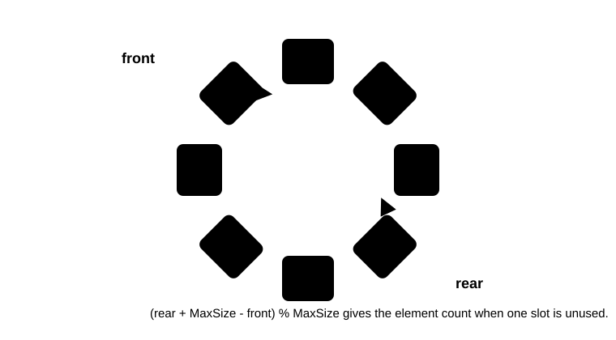

# 循环队列

定义 `front` 为队首，队列不为空时是队列第一个入队的元素的位置，表示队列下一个出队元素的下标；`rear` 为队尾，是队列最后一个入队的元素的下一个位置，表示队列下一个入队元素的下标。 

若只让 `rear` 后移入队、`front` 后移出队，数组前面被删除的位置会空出来，但 `rear` 可能已经到数组末尾，造成假溢出。

所以用模运算把数组逻辑上看成环，队首队尾后移的操作为 `front = (front + 1) % MaxSize` 与 `rear = (rear + 1) % MaxSize` 。



**但这会带来 `rear==front` 二义性的问题**：即若不加处理，这种情况既可以表示队满，也可以表示队空。

于是有以下两种处理思想。
# 牺牲一个存储单元

[html-card](../assets/circular-queue-enqueue-dequeue.html)

这种方案牺牲一个空位，以区分队空和队满：

- 队空：`front == rear`
- 队满：`(rear + 1) % MaxSize == front`
- 元素个数：`(rear + MaxSize - front) % MaxSize`

在这样的情况下，队列元素数量最多为 `MaxSize - 1` 。

## C语言示例

定义：

```c
#define MaxSize 10

typedef struct {
    ElemType data[MaxSize];
    int front;
    int rear;
} SqQueue;
```

初始化：

```c
void InitQueue(SqQueue *queue) {
    queue->front = 0;
    queue->rear = 0;
}
```


入队：

```c
bool EnQueue(SqQueue *queue, ElemType value) {
    if ((queue->rear + 1) % MaxSize == queue->front) return false;
    queue->data[queue->rear] = value;
    queue->rear = (queue->rear + 1) % MaxSize;
    return true;
}
```

出队：

```c
bool DeQueue(SqQueue *queue, ElemType *value) {
    if (queue->front == queue->rear) return false;
    *value = queue->data[queue->front];
    queue->front = (queue->front + 1) % MaxSize;
    return true;
}
```


# 不牺牲存储单元
## 增加 size 属性的方案

若不想浪费一个存储单元，可以增加 `size` 记录元素个数：

- 队空：`size == 0`
- 队满：`size == MaxSize`
- 入队成功：`size++`
- 出队成功：`size--`

这种方案判断直观，但结构体多一个计数字段。

## 增加 tag 变量的方案

也可以增加 `tag` 记录最近一次成功操作：

- 入队成功后令 `tag = 1`
- 出队成功后令 `tag = 0`
- 队空：`front == rear && tag == 0`
- 队满：`front == rear && tag == 1`

原因是只有出队可能导致队空，只有入队可能导致队满。
