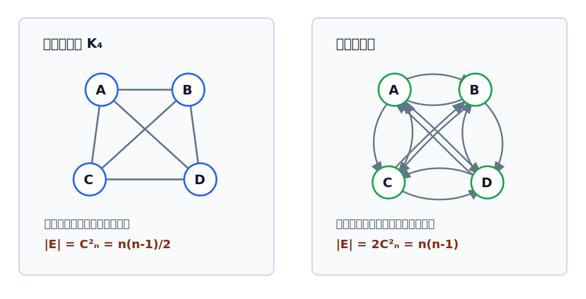

# 完全图

完全图强调“任意两个不同顶点之间都**直接**相连”。无向图和有向图的完全图计数不同，关键差别来自边是否有方向。

完全图给出了同顶点数图的边数上界，也常用于理解[[sparse-and-dense-graph|稀疏图与稠密图]]。

## 无向完全图

在无向图中，若任意两个不同顶点之间都存在边，则称该图为**无向完全图**。

若顶点数为 $n$，则每两个顶点确定一条无向边，因此边数为：

$$
C_n^2=\frac{n(n-1)}{2}
$$

一般 $n$ 个顶点的无向图，边数范围为：

$$
0\le |E|\le C_n^2
$$

其中 $|E|=C_n^2$ 时就是无向完全图。

## 有向完全图

在有向图中，若任意两个不同顶点之间都存在方向相反的两条弧，则称该图为**有向完全图**。

对任意两个不同顶点 $v_i$ 和 $v_j$，有向完全图同时包含：

$$
\langle v_i,v_j\rangle
$$

$$
\langle v_j,v_i\rangle
$$

若顶点数为 $n$，则每对不同顶点贡献两条方向相反的弧，因此弧数为：

$$
2C_n^2=n(n-1)
$$

一般 $n$ 个顶点的有向图，弧数范围为：

$$
0\le |E|\le n(n-1)
$$

其中 $|E|=n(n-1)$ 时就是有向完全图。

> [!tip] 计数区别
> 无向完全图中，$(v_i,v_j)$ 和 $(v_j,v_i)$ 是同一条边；有向完全图中，$\langle v_i,v_j\rangle$ 和 $\langle v_j,v_i\rangle$ 是两条方向相反的弧。
