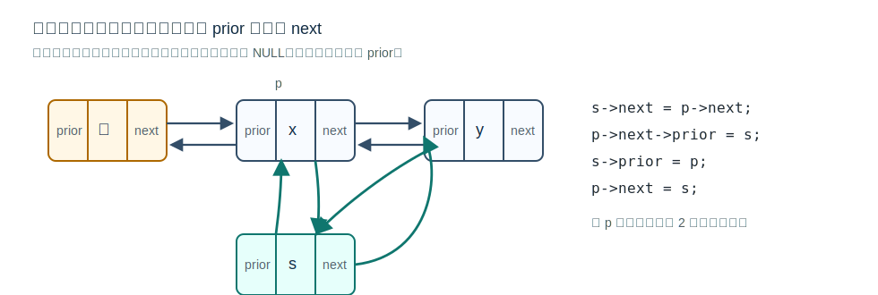

# 双链表



## 定义

双链表的每个结点包含数据域、前驱指针和后继指针：

```c
typedef struct DNode {
    ElemType data;
    struct DNode *prior, *next;
} DNode, *DLinkList;
```

相比单链表，双链表可以从当前结点直接访问前驱和后继，弥补单链表无法逆向检索的局限。

## 初始化：带头结点

空的带头结点双链表通常满足：

```c
L->prior = NULL;
L->next = NULL;
```

头结点不存储有效数据。

## 后插操作

在结点 `prev` 后插入结点 `newNode`，若 `prev` 有后继结点：

[html-card](../assets/doubly-linked-list-insert-after.html)

```c
newNode->next = prev->next;
prev->next->prior = newNode;
newNode->prior = prev;
prev->next = newNode;
```

若 `prev` 是最后一个结点，`prev->next == NULL`，不能执行 `prev->next->prior = newNode`，需要特殊判断。

更稳妥的完整写法：

```c
bool InsertAfter(DNode *prev, DNode *newNode) {
    if (prev == NULL || newNode == NULL) return false;
    newNode->next = prev->next;
    if (prev->next != NULL) {
        prev->next->prior = newNode;  // 原后继的 prior 改回新结点
    }
    newNode->prior = prev;
    prev->next = newNode;
    return true;
}
```

这段代码的关键是先让 `newNode` 记录原后继，再处理原后继的 `prior`。若先改 `prev->next`，就会丢失原后继结点的位置。

## 删除后继结点

删除 `prev` 的后继结点 `target`：

[html-card](../assets/doubly-linked-list-delete-next.html)

```c
prev->next = target->next;
if (target->next != NULL) {
    target->next->prior = prev;
}
free(target);
```

若 `target` 是最后一个结点，`target->next == NULL`，不能访问 `target->next->prior`。

完整写法：

```c
bool DeleteNext(DNode *prev) {
    if (prev == NULL || prev->next == NULL) return false;
    DNode *target = prev->next;
    prev->next = target->next;
    if (target->next != NULL) {
        target->next->prior = prev;  // 若目标不是尾结点，更新后继的 prior
    }
    free(target);
    return true;
}
```

删除时的边界是“被删结点是否存在”和“被删结点是否为尾结点”。前者决定能不能删，后者决定能不能访问 `target->next->prior`。

## 遍历

- 后向遍历：沿 `next` 指针访问。
- 前向遍历：沿 `prior` 指针访问。
- 若带头结点，前向遍历时注意是否需要跳过头结点。

双链表仍不能随机存取，按位查找和按值查找一般仍是 `O(n)`。

## 关联

双链表解决的是 [[singly-linked-list-definition|单链表]] 无法逆向检索的问题。若进一步把首尾相连，就得到 [[circular-linked-list|循环双链表]]。
