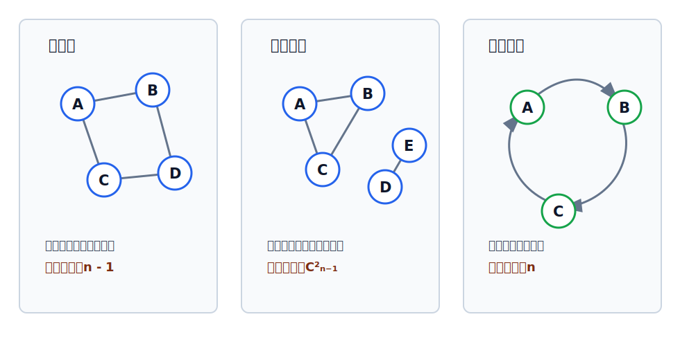
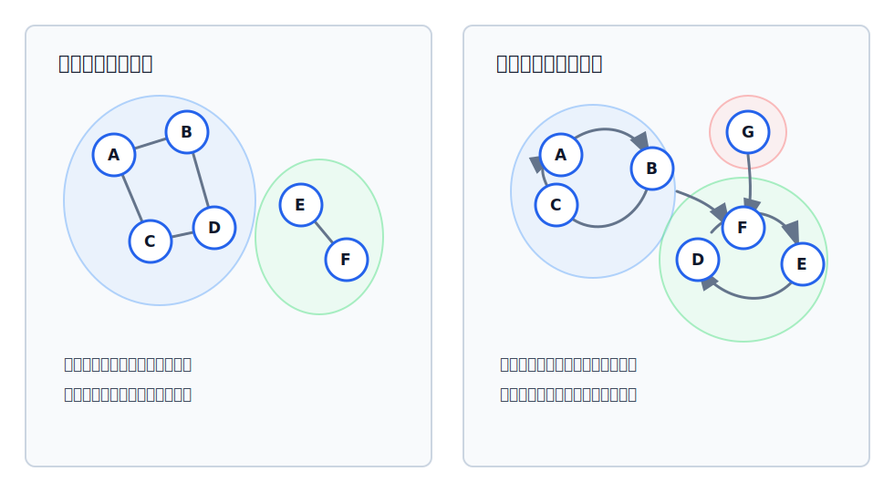

# 图的连通性与连通分量

连通性讨论顶点之间是否“走得到”。无向图看是否有路径，有向图还要看两个方向是否都走得到。

相关概念可配合 [[graph-relation-concepts-table|图的关系概念速查表]] 复习。

## 无向图的连通与连通图

在[[undirected-and-directed-graph|无向图]]中，若从顶点 $v$ 到顶点 $w$ 存在路径，则称 $v$ 和 $w$ 是**连通的**。

若图 $G$ 中任意两个顶点都是连通的，则称 $G$ 为**连通图**；否则称为**非连通图**。

对于 $n$ 个顶点的无向图：

- 若 $G$ 是连通图，则最少有 $n-1$ 条边（树）。
- 若 $G$ 是非连通图，则最多可能有 $C_{n-1}^{2}$ 条边。

非连通图最多边数的理解：为了让图仍然非连通，至少要有一个顶点与其余顶点不连通；其余 $n-1$ 个顶点内部最多构成无向完全图，因此最多有 $C_{n-1}^{2}$ 条边。

## 有向图的强连通与强连通图

在有向图中，若从顶点 $v$ 到顶点 $w$ 有路径，并且从 $w$ 到 $v$ 也有路径，则称 $v$ 和 $w$ 是**强连通的**。

> [!warning]
> 只有在**有向图**中才有强连通图这个概念。

若有向图中任何一对顶点都是强连通的，则称此图为**强连通图**。

对于 $n$ 个顶点的有向图：

- 若 $G$ 是强连通图，则最少有 $n$ 条弧。
- 最少弧数的典型形态是让所有顶点构成一个有向回路。

## 连通分量

先区分三个层级：

| 概念     | 含义                             |
| ------ | ------------------------------ |
| 子图     | 从原图中取一部分顶点和一部分边，且这些边的端点也在所取顶点中 |
| 连通子图   | 本身是连通图的子图                      |
| 极大连通子图 | 在保持连通的前提下，不能再从原图中加入更多顶点或边的连通子图 |

无向图中的**极大连通子图**称为连通分量。

这里的“极大”不是指顶点数一定大于其他所有连通子图，而是指**对原图中的包含关系已经大到不能再扩展**：

- 若还能加入原图中的某个顶点，并且加入后仍然连通，就还不是极大连通子图。
- 若顶点范围已经确定，原图中这些顶点之间属于该连通区域的边也应保留，不能任意少取。
- 一个非连通图可以有多个连通分量，每个分量都是自己所在连通区域内的“最大块”。

因此，连通分量不是随便取几个互相连通的顶点，而是一个非连通无向图中已经不能再扩大的连通块。

## 强连通分量

有向图中的**极大强连通子图**称为强连通分量。

需要实际求出有向图的强连通分量时，可用 [[how-to-calculate-SCC#Kosaraju 手算 SCC 个数|Kosaraju]] 或 [[how-to-calculate-SCC|Tarjan 算法]]。

判断强连通分量时抓住三点：

- 子图内部任意两个顶点双向可达；
- 在保持强连通的前提下，顶点尽可能多；
- 相关弧保留到不能继续扩大该强连通区域为止。

考试若要求判断一个有向图有几个强连通分量，优先按 [[how-to-calculate-SCC#Kosaraju 手算 SCC 个数|Kosaraju 手算方式]]：原图 DFS 记完成时间，反图按完成时间从大到小 DFS，每启动一次 DFS 就得到一个强连通分量。

> [!tip] 连通分量与强连通分量的区别
> 连通分量用于无向图，只看是否有路径相连；强连通分量用于有向图，要看任意两点之间两个方向是否都存在路径。
