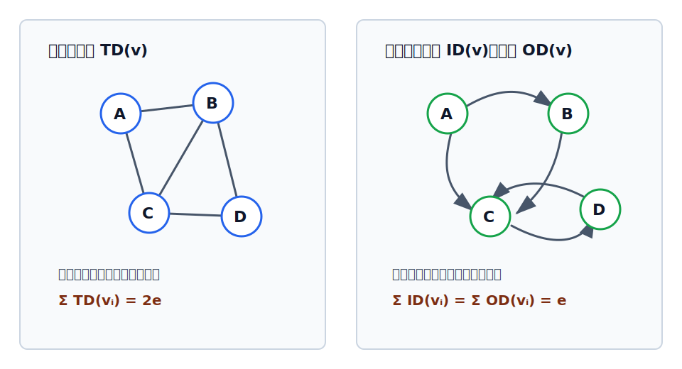

# 图的顶点度

顶点的**度**描述一个顶点与多少条边或弧相关，是图中最常考的局部数量关系之一。

相关概念可配合 [[graph-relation-concepts-table|图的关系概念速查表]] 复习。

## 无向图的度

在[[undirected-and-directed-graph|无向图]]中，顶点 $v$ 的度是指**依附于该顶点的边的条数**，记作 $TD(v)$。

上图左侧中：

| 顶点 | 依附的边 | 度 |
|---|---|---|
| $A$ | $AB, AC$ | $TD(A)=2$ |
| $B$ | $AB, BC, BD$ | $TD(B)=3$ |
| $C$ | $AC, BC, CD$ | $TD(C)=3$ |
| $D$ | $BD, CD$ | $TD(D)=2$ |

若无向图有 $n$ 个顶点、$e$ 条边，则：

$$
\sum_{i=1}^{n} TD(v_i)=2e
$$

原因很直接：每条无向边有两个端点，在统计所有顶点的度时，每条边都会被两个端点各统计一次。

## 有向图的入度、出度、度

在[[undirected-and-directed-graph|有向图]]中，边有方向，需要分开统计：

| 名称 | 记号 | 含义 |
|---|---|---|
| 入度 | $ID(v)$ | 以顶点 $v$ 为终点的有向边数 |
| 出度 | $OD(v)$ | 以顶点 $v$ 为起点的有向边数 |
| 度 | $TD(v)$ | 入度与出度之和 |

$$
TD(v)=ID(v)+OD(v)
$$

上图右侧中：

| 顶点 | 入度 | 出度 | 度 |
|---|---:|---:|---:|
| $A$ | 1 | 2 | 3 |
| $B$ | 1 | 1 | 2 |
| $C$ | 2 | 1 | 3 |
| $D$ | 1 | 1 | 2 |

若有向图有 $n$ 个顶点、$e$ 条弧，则：

$$
\sum_{i=1}^{n} ID(v_i)=\sum_{i=1}^{n} OD(v_i)=e
$$

每条弧恰好贡献一次出度、一次入度，所以所有顶点的入度和等于弧数，所有顶点的出度和也等于弧数。进一步可得：

$$
\sum_{i=1}^{n} TD(v_i)=2e
$$

> [!tip] 做题切入点
> 无向图先看“度数和为偶数”；有向图先分别看入度和、出度和是否都等于弧数。题目给出局部度数时，常用这些公式反推缺失的边数或弧数。
