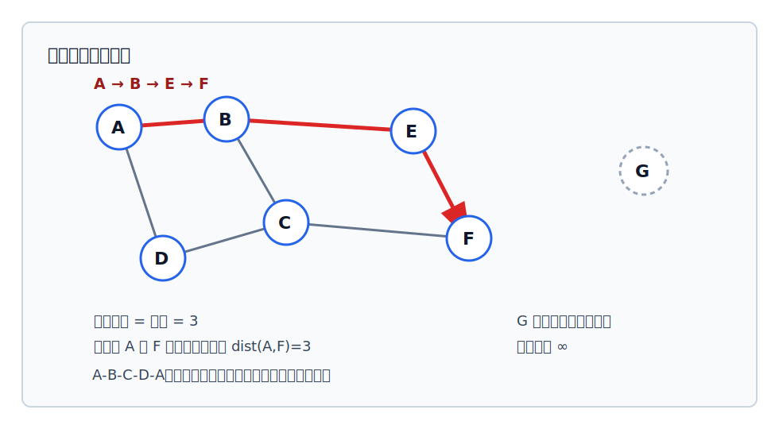

# 图的路径与距离

路径描述“能不能从一个顶点走到另一个顶点”，距离则在可达的基础上取最短路径长度。

相关概念可配合 [[graph-relation-concepts-table|图的关系概念速查表]] 复习。

## 路径

顶点 $v_p$ 到顶点 $v_q$ 的一条路径，是一个顶点序列：

$$
v_p, v_{i_1}, v_{i_2}, \cdots, v_{i_m}, v_q
$$

序列中相邻顶点之间要有边或弧相连。

- 在无向图中，只要边存在，就可以沿边的两个方向理解连接关系。
- 在[[undirected-and-directed-graph|有向图]]中，路径要沿着弧的方向走；有边形状相连不等于路径一定存在。

## 回路、简单路径、简单回路

| 概念 | 判定方式 |
|---|---|
| 路径 | 相邻顶点之间都有边或方向正确的弧 |
| 回路，也称环 | 第一个顶点和最后一个顶点相同的路径 |
| 简单路径 | 顶点序列中顶点不重复出现 |
| 简单回路 | 除第一个和最后一个顶点相同外，其余顶点不重复出现 |

图中左侧例子：

- $A \to B \to D$ 是一条路径，长度为 $2$。
- $A \to B \to C \to A$ 是一个回路。
- $A \to B \to C$ 是简单路径。
- $A \to B \to C \to A$ 是简单回路。

## 路径长度

路径长度是**路径上边或弧的数目**，不是顶点数。

例如：

$$
A \to B \to D
$$

这条路径经过 $3$ 个顶点，但只有 $2$ 条边，所以路径长度为 $2$。

## 点到点的距离

从顶点 $u$ 到顶点 $v$ 的最短路径若存在，则这条最短路径的长度称为 $u$ 到 $v$ 的距离。

- 若存在多条路径，只取长度最短者。
- 若从 $u$ 到 $v$ 根本不存在路径，则距离记为 $\infty$。
- 在有向图中，$u$ 到 $v$ 的距离和 $v$ 到 $u$ 的距离可能不同，也可能一个存在、另一个不存在。

> [!example] 有向路径的方向性
> 如果只有 $A \to B \to C$，则从 $A$ 到 $C$ 存在长度为 $2$ 的路径；但不能据此推出从 $C$ 到 $A$ 也存在路径。
