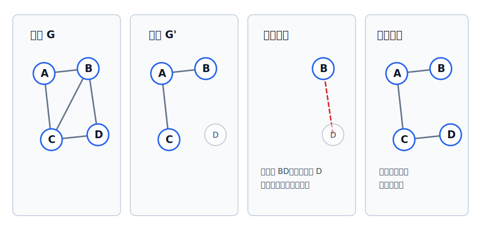

# 子图与生成子图

子图描述“从原图中取出一部分结构”。取子图时，顶点和边不能随意拼接：一条边若被取出，它的两个端点也要在子图顶点集中。

子图的概念同时适用于无向图和有向图；区别只在于有向图取出的是带方向的弧，弧的方向也要与原图一致。

设有两个图：

$$
G=(V,E),\quad G'=(V',E')
$$

若满足：

$$
V'\subseteq V,\quad E'\subseteq E
$$

并且 $E'$ 中每条边或弧的端点都属于 $V'$，则称 $G'$ 是 $G$ 的**子图**。

## 子图不是任意点边组合

从原图中随便挑几个点、几条边，不一定能构成子图。

关键检查：

- 顶点是否来自原图；
- 边或弧是否来自原图；
- 每条被选中的边或弧，其端点是否也被选入子图；
- 有向图中弧的方向也要与原图一致。

## 生成子图

若子图 $G'$ 满足：

$$
V(G')=V(G)
$$

则称 $G'$ 是 $G$ 的**生成子图**。

生成子图保留原图的全部顶点，但边可以只保留一部分。因此：

- 生成子图一定覆盖全部顶点；
- 生成子图不一定连通；
- [[spanning-tree|生成树]] 是连通无向图中一种特殊的生成子图。

> [!tip] 查阅重点
> 子图看“点和边是否都来自原图”；生成子图在此基础上还要看“是否保留全部顶点”。
