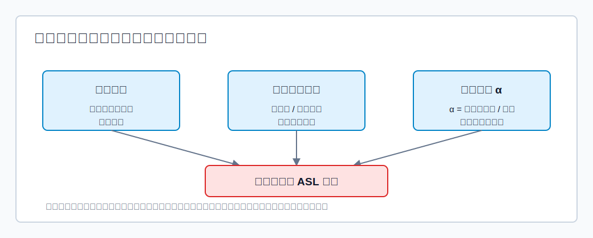

# 基本概念

**散列表**也叫哈希表，英文是 **Hash Table**。它的特点是：可以根据数据元素的关键字直接计算出它在表中的存储地址。

**散列函数**也叫哈希函数，记作：

$$
Addr=H(key)
$$

它建立了“关键字 $\rightarrow$ 存储地址”的映射关系。

理想情况下，查找一个关键字只需要：

1. 用散列函数计算地址。
2. 到该地址检查关键字是否匹配。

因此理想时间复杂度可达到 $O(1)$。

## 冲突与同义词

**冲突**：插入一个数据元素时，根据关键字算出的地址已经存放了其他元素。

**同义词**：不同关键字通过同一个散列函数映射到同一个地址。

例如表长为 `13`，散列函数为：

$$
H(key)=key\bmod 13
$$

则：

$$
1\bmod 13=1,\quad 14\bmod 13=1
$$

所以 `1` 和 `14` 是同义词。若地址 `1` 已存 `14`，再插入 `1` 就发生冲突。

## 装填因子

散列表查找效率不是只由散列函数决定，而主要由三类因素共同决定：

1. 散列函数是否让关键字均匀分布。
2. 处理冲突的方法。
3. 装填因子。

**装填因子** $\alpha$ 表示散列表的装满程度：

$$
\alpha=\frac{\text{表中已存元素个数}}{\text{散列表长度}}
$$

装填因子越大，空位越少，发生冲突的概率越高，平均查找长度通常越大。

对开放定址法，$\alpha$ 必须小于 `1`，否则表满后无法继续插入。对拉链法，$\alpha$ 可以大于 `1`，因为每个桶后面可以接链表，但链表过长也会降低查找效率。

## 聚集

**聚集**是指散列表中某些存储区域形成连续或局部密集的关键字群，使后续关键字更容易继续冲突，探测路径变长。

聚集常见于开放定址法，尤其是线性探测法。

线性探测发生冲突后，会依次检查后续地址：

$$
d_i=0,1,2,3,\cdots,m-1
$$

一旦某段连续位置被占用，任何散列到这段区域附近的新关键字都可能被迫继续向后探测，使这段连续占用区域越来越长。这就是典型的**一次聚集**。

避免或减轻聚集的方法：

- 设计分布更均匀的散列函数。
- 控制装填因子，必要时扩容或重散列。
- 使用平方探测、双散列或伪随机探测，减少线性探测造成的连续堆积。
- 使用拉链法，把同义词放入链表，不在主表中形成连续探测段。

# 散列函数的设计

设计散列函数时应注意：

1. 定义域必须覆盖所有可能出现的关键字。
2. 值域不能超出散列表地址范围。
3. 地址应尽可能均匀分布，从而减少冲突。
4. 函数应尽量简单，能快速计算。

## 一些常见散列函数
### 除留余数法

$$
H(key)=key\bmod p
$$

若散列表表长为 $m$，通常取不大于 $m$ 且最接近 $m$ 的质数 $p$。

取质数是为了减少关键字规律与取模数之间的公因子影响，使地址分布更均匀。

### 直接定址法

$$
H(key)=key
$$

或：

$$
H(key)=a\cdot key+b
$$

优点是计算简单且不会产生冲突；缺点是若关键字分布不连续，会浪费大量空间。

适用于关键字分布基本连续的情况。

### 数字分析法

从关键字中选取数码分布较均匀的若干位作为散列地址。

适用于关键字集合已知，且某几位数码分布较均匀的情况。例如手机号后四位分布较均匀时，可取后四位作为地址。

### 平方取中法

取关键字平方值的中间若干位作为散列地址。

平方后中间位会受到关键字多位共同影响，因此地址分布可能更均匀。适用于关键字各位取值都不够均匀的情况。

# 冲突处理方法

冲突不可避免时，需要规定处理冲突的方法。

主要有：

- 拉链法。
- 开放定址法。

## 拉链法

**拉链法**又称链接法、链地址法。做法是：把所有散列到同一地址的同义词存储在同一个链表中。

插入步骤：

1. 计算散列地址 $H(key)$。
2. 将关键字插入该地址对应的链表。

链表可以头插，也可以尾插。头插实现简单；若链表保持有序，查找时可在遇到大于目标关键字时提前失败，查找效率可能略好。

查找步骤：

1. 计算散列地址。
2. 在对应链表中逐个比较关键字。
3. 命中则查找成功；链表结束仍未命中则失败。

删除步骤：

1. 先按查找过程定位关键字。
2. 找到则从链表中删除。
3. 找不到则删除失败。

拉链法删除可以物理删除链表结点，不会破坏其他关键字的查找路径。

## 开放定址法

**开放定址法**：若发生冲突，就根据某个探测序列去寻找另一个空闲位置。

开放定址法的统一公式为：

$$
H_i=(H(key)+d_i)\bmod m
$$

其中：

- $m$ 是散列表长度。
- $H(key)$ 是初始散列地址。
- $d_i$ 是第 $i$ 次探测的增量。

之所以叫“开放定址”，是因为一个地址既可能存放同义词，也可能存放非同义词。只要探测序列走到这里且这里为空，就可以插入。

对于$d_{i}$的取值，常见有以下四种：

### 线性探测法

$$
d_i=0,1,2,3,\cdots,m-1
$$

线性探测从初始地址开始，依次向后检查。

**优点：一定可以探测到散列表每个位置。只要表中还有空位，就一定可以插入成功。**

**缺点：容易产生聚集。**

### 平方探测法

又称二次探测法：

$$
d_i=0^2,1^2,-1^2,2^2,-2^2,\cdots,k^2,-k^2
$$

其中 $k\le m/2$。

**平方探测可以减少线性探测的一次聚集，但不能到所有位置**。因此即使表中还有空位，也可能插入失败。

要求表长 $m$ 是形如 $4j+3$ 的质数。

### 双散列法

$$
d_i=i\times hash2(key)
$$

双散列法使用第二个散列函数决定步长。

能否探测到所有位置，取决于 $hash2(key)$ 与表长 $m$ 是否互质。常见做法是令表长 $m$ 为质数，并取：

$$
hash2(key)=m-(key\bmod m)
$$

这样 $hash2(key)$ 与 $m$ 通常互质，探测覆盖率更好。

### 伪随机序列法

$d_i$ 是预先设计的伪随机序列，例如：

$$
d_i=0,5,3,11,\cdots
$$

它是否能覆盖全部地址，取决于伪随机序列设计是否合理。

### 开放定址法的删除

开放定址法删除时，不能简单把被删位置清空。

原因是：清空会截断后续关键字的探测路径，使本来存在的关键字被误判为查找失败。

正确做法是**逻辑删除**：

- 删除时把位置标记为“已删除”。
- 查找时遇到“已删除”位置不能停，要继续沿探测序列查找。
- 插入新关键字时，可以复用“已删除”位置。

逻辑删除的问题是：多次删除后，散列表看起来很满，实际有效元素较少，查找效率会下降。因此需要不定期整理或重散列。

# ASL 计算

平均查找长度 ASL 指所有查找过程中关键字比较次数的平均值。

散列表中通常分别计算：

- 查找成功 ASL。
- 查找失败 ASL。

[html-card height=620](../assets/hash-asl-comparison.html)

## 拉链法 ASL

拉链法查找成功时，查找长度等于目标关键字在对应链表中的比较次数。

例如目标在链表第 `2` 个结点，则查找长度为 `2`。

拉链法查找失败时，只比较对应链表中的关键字：

- 若链表非空，失败长度等于该链表中被比较的关键字数。
- 若链表为空，失败长度为 `0`。

> [!important]
> 拉链法不会把“空链表本身”算作一次关键字比较。

## 开放定址法 ASL

开放定址法查找成功时，查找长度等于沿探测序列检查到目标关键字所经历的单元数。

开放定址法查找失败时，要沿探测序列一直检查到第一个空单元。这个空单元也算一次探测次数。

> [!important]
> 开放定址法失败 ASL 会把“空”单元计入次数；拉链法失败 ASL 不会把空链表计入次数。

计算开放定址法失败 ASL 时，通常要对每个可能的初始散列地址分别计算失败查找长度，再取平均。
