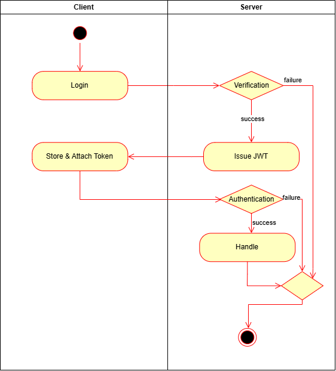

# 1. 什么是 JWT？

JWT 全称是 JSON Web Token，由三部分组成，用点 . 隔开。例如： xxxxx.yyyyy.zzzzz

1. Header (头部) - xxxxx
   
   - 内容 ：记录令牌的类型（就是 JWT）和加密算法（比如 HMAC SHA256）。
   - 作用 ：告诉服务器怎么去解读这张令牌，包括令牌的类型和加密算法。

2. Payload (载荷) - yyyyy
   
   - 内容 ：承载声明，存放实际的用户信息。一般为Subject(主体标识)、ExpiresAt(过期时间)、IssuedAt(签发时间)、Issuer(签发者)、NotBefore(生效时间)等。这部分内容是公开的，任何人都能解码看到，所以不能放密码等敏感信息。
   - 作用 ：让服务器知道当前请求是谁发起的，有什么权限。

3. Signature (签名) - zzzzz
   
   - 内容 ：由服务器的密钥对前两部分签名，生成的防伪标识。它是通过把头部和载荷组合起来，再加上一个只有服务器知道的“密钥”（Secret），然后用头部声明的加密算法生成的。
   - 作用 ：
     - 防伪 ：客户端无法伪造签名，因为他们没有服务器的“密钥”。
     - 防篡改 ：如果 载荷 (Payload) 里的任何信息（比如把普通用户ID改成管理员ID）被修改了，那么用同样的密钥算出来的签名就会和原始签名对不上。服务器一校验，就知道信息被改过了，就会拒绝这个请求。 

这种方式是“无状态的”，服务器不需要自己存储 session 信息。

# 2. 工作流程

1. 登录 ：用户使用账号密码登录。
2. 签发 ：服务器验证账号密码成功后，生成一个包含用户ID等信息的 JWT（就像办了一张有时效的门禁卡），并把这个 JWT 发送给前端。
3. 携带 ：前端收到 JWT 后，把它存起来（比如存在浏览器的 localStorage ）。之后每次向服务器发请求，都在请求头 Authorization 里带上这个 JWT，格式通常是 Bearer <token> 。
4. 验证 ：服务器收到请求后，从请求头里拿出 JWT。用自己保存的密钥去验证这个 JWT 的签名是否正确。
   - 如果签名正确，且没过期，服务器就相信这个请求是合法的，并从 JWT 的载荷中获取用户信息，处理请求。
   - 如果签名错误或已过期，就拒绝请求（返回 401 Unauthorized 错误）。





# 3. 后端签发/验证 JWT（go）

```go
package main

import (
  "net/http"
  "os"
  "time"
  "github.com/gin-gonic/gin"
  "github.com/golang-jwt/jwt/v5"
)

// definition of user struct, in gorm model

func main() {
  r := gin.Default()
  secret := []byte("1111111") // secret是自己设置的字符串，但实际不应明文写在代码里，实际可写在环境变量里，用secret := []byte(os.Getenv("JWT_SECRET"))读取；或者写在某配置文件里，用类似于secret := []byte(os.ReadFile(filepath.Join(".", "jwt.secret")))的方式从配置文件读取

  // 注册路由组，所有 JWT 相关接口都在 /api 下
  api := r.Group("/api")

  // 1. 登录接口：验证用户名密码后签发 JWT
  api.POST("/login", func(c *gin.Context) {
    var req struct{ Username, Password string }
    if err := c.BindJSON(&req); err != nil { 
        c.Status(http.StatusBadRequest)
        return 
    }
    // 验证用户名密码（这里简单对比，实际应使用gorm从数据库查询）
    if req.Username != "user" || req.Password != "1" {
      c.Status(http.StatusUnauthorized)
      return
    }
    // 创建一个待签名的 token，签名算法指定为 HS256
    token := jwt.NewWithClaims(jwt.SigningMethodHS256, jwt.RegisteredClaims{
      Subject:   req.Username, // 用户名/uid作为 subject
      ExpiresAt: jwt.NewNumericDate(time.Now().Add(time.Hour)), // 这里设置过期时间1小时后，可以设置为其他值
      IssuedAt:  jwt.NewNumericDate(time.Now()),
      NotBefore: jwt.NewNumericDate(time.Now()),
    })
    // 用密钥签名 token
    s, err := token.SignedString(secret);
    if err != nil { 
        c.JSON(http.StatusInternalServerError, gin.H{"error": "Error creating token"})
        return 
    }
    c.JSON(http.StatusOK, gin.H{"token": s})
  })

// 2. 验证受保护接口
    // 中间件：检查请求头 Authorization 是否包含有效的 JWT
  auth := func(c *gin.Context) {
    h := c.GetHeader("Authorization")
    tokenStr := strings.TrimPrefix(h, "Bearer ")
    if len(tokenStr) == 0 || tokenStr == h { 
        c.AbortWithStatusJSON(http.StatusUnauthorized, gin.H{"error": "Invalid token format"})
        return 
    }
    claims := &jwt.RegisteredClaims{}
    tok, err := jwt.ParseWithClaims(tokenStr, claims, func(t *jwt.Token) (any, error) {
      return secret, nil
    })
    if err != nil || !tok.Valid { 
        c.AbortWithStatusJSON(http.StatusUnauthorized, gin.H{"error": "Invalid or expired token"})
        return 
    }
    // 把用户名设置到上下文，后续处理函数可以从上下文中获取
    c.Set("Subject", claims.Subject) 
    c.Next()
  }
  api.GET("/me", auth, func(c *gin.Context) { 
    // 从上下文获取用户名
    username, ok := c.Get("Subject")
    if !ok {
      c.JSON(http.StatusInternalServerError, gin.H{"error": "User claims not found in context"})
	  return
    }
    // 这里是根据用户名/uid调用gorm相关查询用户信息的逻辑
    //...
    c.JSON(http.StatusOK, gin.H{"username": username}) //以json格式返回200状态码以及用户信息，可以根据实际情况添加其他用户信息
  })
  r.Run() //默认8080。也可以指定端口，如 r.Run(":3000")
}
```

# 4. 前端存储/使用 JWT（JavaScript）

这里使用 localStorage；生产更推荐使用 httpOnly+Secure 的 Cookie。

1. 登录后存储 token

```javascript
fetch("api/login",{
  method:"POST",
  headers:{"Content-Type":"application/json"},
  body:JSON.stringify({username:"user",password:"1"})
}).then(r=>r.json()).then(d=>localStorage.setItem("token", d.token))
```

2. 携带 token 访问受保护接口

```javascript
const t = localStorage.getItem("token")
fetch("api/me",{headers:{Authorization:`Bearer ${t}`}})
  .then(r=>r.json())
  .then(console.log)
```

# 5. `secret`这个字段是干什么的？

`secret` 是用于签名和验证 JWT 的密钥，可以把它设置成任何你想要的字符串。这个密钥是 JWT 安全性的核心，它扮演着“盐”的角色。

*"盐"是什么意思？*

在密码学中，“盐”指的是一小段随机的、附加的数据 ，它被加到原始密码上，然后再一起进行哈希（hash）或加密处理。

比如做一道炒鸡蛋，这道菜的“配方”（哈希算法）是公开的。

如果没有盐，则鸡蛋（ 原始数据 ）直接下锅炒。因为配方公开，任何人只要拿到鸡蛋，都能炒出和一模一样味道的菜。如果一个黑客知道使用的是“123456”这个“鸡蛋”，他就能轻松“炒”出一模一样的“菜”（哈希值），从而破解密码。

而现在，在炒鸡蛋时，jwt往里面加了一撮独有的、保密的“盐”。即使别人知道用的是鸡蛋、也知道配方，但因为不知道“盐”，他就永远也炒不出一模一样的味道。

所以“盐”的核心作用有两个：

1. 让结果独一无二。即使两个用户使用完全相同的密码（比如都是 123456 ），因为给他们分配了 不同 的“盐”，他们最终存储在数据库里的哈希值也是完全不同的。
2. 抵御预计算攻击（如“彩虹表”） ：黑客们会提前计算好常用密码（如“123456”、“password”）的哈希值，做成一张大表（彩虹表），甚至直接查表就能反推出原始密码。但如果加了“盐”，原始数据变了，这张彩虹表就完全失效了，因为黑客不可能为每一个可能的“盐”都预先计算一张表。

在 JWT 的场景里，则：

- “鸡蛋” ：是 JWT 的 Header (头部) 和 Payload (载荷)。
- “盐” ：`secret` 。
- “烹饪方法” ：是 Header 中指定的签名算法，比如 HMAC-SHA256 。
- “炒鸡蛋” ：就是 JWT 的第三部分 Signature (签名)。

它保证了：

1. 真实性 (Authenticity) ：只有知道 `secret` 这个“盐”的服务器才能制作出味道正确的“菜”（合法的签名）。任何伪造者都做不出来。
2. 完整性 (Integrity) ：如果有人篡改 Payload 里的内容，由于无法知道 `secret`，则该jwt的Signature必定和服务器根据篡改后的Payload和`secret`重新计算出来的Signature不一致。验证签名时就会失败，服务器就会拒绝它。
