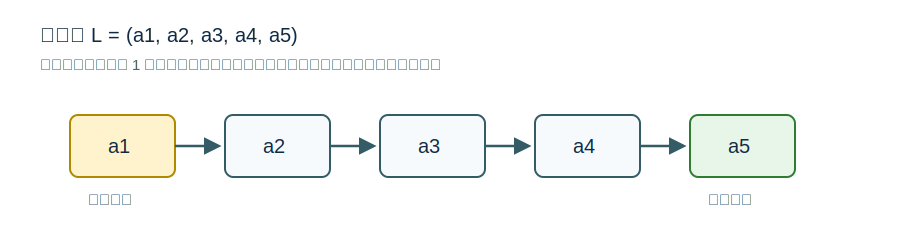

# 线性表定义与基本操作



## 定义

线性表是具有相同数据类型的 `n (n >= 0)` 个数据元素的有限序列。`n` 为表长，`n = 0` 时为空表。

一般表示为：

$$L = (a_1, a_2, ..., a_i, a_{i+1}, ..., a_n)$$

其中 `a_i` 是第 `i` 个元素，`i` 称为位序。位序从 1 开始，**数组下标通常从 0 开始**，这是顺序表代码题常见易错点。

$a_1$ 是表头元素，$a_n$ 是表尾元素。表头元素没有直接前驱，表尾元素没有直接后继。

## 逻辑特征

- 所有数据元素具有相同数据类型。
- 元素有次序。
- 除第一个元素外，每个元素有且仅有一个直接前驱。
- 除最后一个元素外，每个元素有且仅有一个直接后继。

线性表强调**有限**序列。若只说“所有整数按递增次序排列”，由于整数集合无限，不能直接看作通常意义上的线性表。

## 基本操作

- `InitList(&L)`：初始化表，构造空表并分配必要空间。
- `DestroyList(&L)`：销毁表，释放占用空间。
- `ListInsert(&L, i, e)`：在第 `i` 个位置插入元素 `e`。
- `ListDelete(&L, i, &e)`：删除第 `i` 个位置的元素，并用 `e` 返回被删值。
- `LocateElem(L, e)`：按值查找，查找关键字值等于 `e` 的元素。
- `GetElem(L, i)`：按位查找，获取第 `i` 个位置的元素。
- `Length(L)`：返回表长。
- `PrintList(L)`：按顺序输出元素。
- `Empty(L)`：判断是否为空表。

## C 语言接口为什么常写成这样

教材中的操作名是抽象接口，不等于唯一代码写法。用 C 写时，需要考虑“函数能否修改调用者手里的对象”。

```c
bool ListInsert(SqList *L, int i, ElemType e);
bool ListDelete(SqList *L, int i, ElemType *e);
ElemType GetElem(SqList L, int i);
int LocateElem(SqList L, ElemType e);
```

- `SqList *L`：插入、删除会改变表长或表内元素排列，需要把修改带回调用处。
- `ElemType *e`：删除时需要把被删除元素带回调用处。
- `SqList L`：只读查询可以传值；若结构很大，实际工程中也常传指针或 `const` 指针。

## 引用参数

当函数需要把修改结果带回调用处时使用 `&`。例如初始化、销毁、插入、删除可能改变表本身；删除还需要通过 `&e` 带回被删除元素。

## 关联

线性表可以用 [[sequential-list-storage|顺序表]] 或 [[singly-linked-list-definition|链表]] 实现。不同实现不改变逻辑结构，但会改变操作复杂度。
