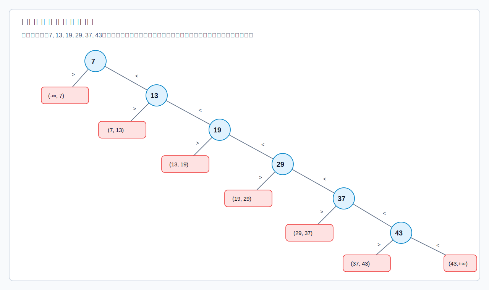
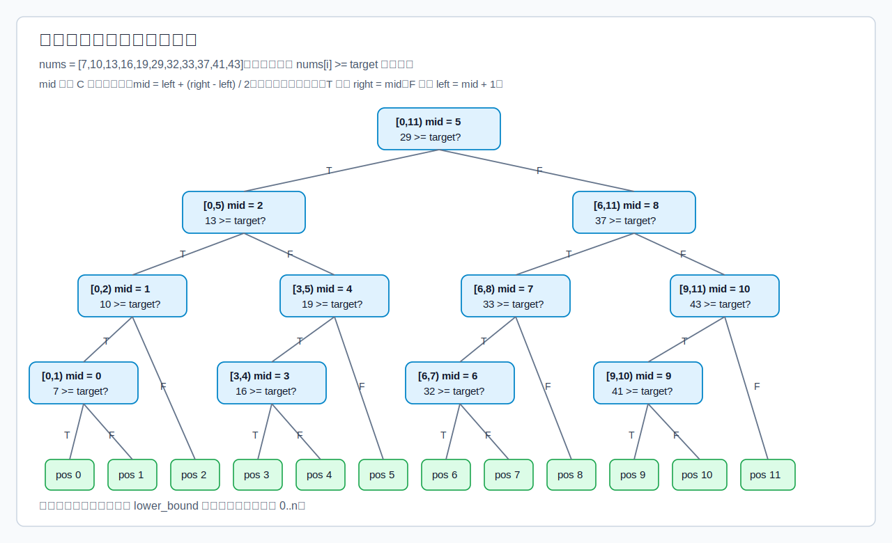

# 顺序查找

顺序查找也称线性查找，通常用于线性表。基本思想是从表的一端开始，逐个比较关键字，直到查找成功或查完整个表。

[html-card height=620](../assets/sequential-search-process.html)

## 普通顺序查找

```c
int sequential_search(const int a[], int n, int key) {
    for (int i = 0; i < n; ++i) {
        // 每次循环都比较一次关键字。
        if (a[i] == key) {
            return i;
        }
    }
    return -1;
}
```

普通顺序查找中，若表长为 $n$：

$$
ASL_{success}=\frac{1+2+\cdots+n}{n}=\frac{n+1}{2}
$$

若查找失败，需要比较完所有 $n$ 个元素：

$$
ASL_{fail}=n
$$

若采用从下标 1 开始、0 号位置放哨兵的教材写法，则失败时会停在 0 号位置。此时常见写法的返回值能直接区分成功与失败，但 0 号哨兵不是有效数据元素。

```c
int sequential_search_with_sentinel(int a[], int n, int key) {
    a[0] = key;

    int i = n;
    while (a[i] != key) {
        --i;
    }

    // 返回 0 表示查找失败；返回 1..n 表示目标所在位置。
    return i;
}
```

哨兵的优点是循环中无需额外判断 `i >= 1`，可以减少边界判断。

若各元素被查概率不相等，顺序表不要求有序时，应把被查概率大的元素**靠近查找起点**，降低成功 ASL。

## 有序表中的顺序查找

若线性表已经按关键字递增排列，顺序查找可以提前失败：当当前元素已经大于目标关键字时，后面的元素更大，不可能再出现目标。



```c
int ordered_sequential_search(const int a[], int n, int key) {
    for (int i = 0; i < n; ++i) {
        if (a[i] == key) {
            return i;
        }

        // 递增表中，当前关键字已超过 key，后续元素不可能命中。
        if (a[i] > key) {
            return -1;
        }
    }
    return -1;
}
```

有序顺序查找的成功 ASL 仍是：

$$
ASL_{success}=\frac{n+1}{2}
$$

失败查找有 $n+1$ 个失败区间。对于递增表 $a_1<a_2<\cdots<a_n$：

- $(-\infty,a_1)$：比较 $a_1$ 后失败，长度为 1。
- $(a_1,a_2)$：比较到 $a_2$ 后失败，长度为 2。
- $\cdots$
- $(a_{n-1},a_n)$：比较到 $a_n$ 后失败，长度为 $n$。
- $(a_n,+\infty)$：比较完 $n$ 个元素后失败，长度为 $n$。

从判定树角度看，这些失败区间就是：

- 在第 1 层发现 `key < a_1`。
- 在第 2 层发现 $a_1<key<a_2$。
- $\cdots$
- 在第 $n$ 层发现 $a_{n-1}<key<a_n$。
- 比较完第 $n$ 个元素后仍未命中，即 $key>a_n$。

因此：

$$
ASL_{fail}=\frac{1+2+\cdots+n+n}{n+1}
=\frac{n}{2}+\frac{n}{n+1}
$$


# 折半查找

折半查找也称二分查找，适用于有序的顺序表。这里按 [[binary-search|Binary Search]] 的写法理解：用半开区间 `[lo, hi)` 维护搜索范围，在单调谓词上寻找边界。

对递增数组，常用谓词是：

$$
f(i): nums[i]\ge target
$$

于是问题变成：找最小的 `ans`，使 `f(ans)` 成立。也就是找第一个 `nums[ans] >= target` 的位置。

- 若 `f(mid)` 成立，`mid` 可能是答案，但左侧可能还有更小答案，所以记录 `ans = mid`，并令 `hi = mid`。
- 若 `f(mid)` 不成立，`mid` 一定不是答案，且答案只可能在右侧，所以令 `lo = mid + 1`。
- 循环结束时 `lo == hi`，搜索区间为空，返回记录到的 `ans` 或返回 `lo`。

[html-card height=1020](../assets/lower-bound-binary-search-process.html)

## 边界判定树

半开区间二分的判定树，每个内部结点对应一次 `mid` 判断：
$$
nums[mid]\ge target\;?
$$

- `true`：`mid` 可能是答案，转向左侧区间 `[lo, mid)`。
- `false`：`mid` 不可能是答案，转向右侧区间 `[mid+1, hi)`。
- 叶子：循环结束时的返回位置。



返回位置即为叶节点。对递增数组，返回位置既可以表示命中位置，也可以表示插入位置。

因此，若 `target` 正好等于 `nums[pos]`，这个叶子表示查找成功；若 `target` 落在两个关键字之间，或大于所有关键字，这个叶子表示查找失败时的插入位置。

## 判定树的形态性质与ASL计算

1. **任意节点左右子树高度差不超过1**
2. **不考虑外部节点（表示查找失败的结点）时，任意节点的左子树结点个数与右子树节点个数之差只可能是0或1**

由于$2^{h-1}-1< 2n+1 \leqslant 2^{h} -1$,所以得到

$$
h=1+\lceil \log_2(n+1)\rceil
$$


所以
$$
ASL_{success} = ASL_{fail}= h = 1 +  \lceil \log_2(n+1)\rceil
$$

算法的时间复杂度为$O(\log_2 n)$


> [!warning] 折半查找不一定每次都更快
>
折半查找的时间复杂度是 $O(\log_2 n)$，顺序查找是 $O(n)$，这说明折半查找在**数量级**上更优。但对某一次**具体**查找，折半查找未必比较次数更少。

> [!example]
例如目标正好是顺序表第一个元素时，顺序查找只需要比较 1 次；折半查找要先比较中间元素，再逐步缩小到左端。
折半查找的优势体现在大规模、平均意义和最坏情况控制上。

# 分块查找

分块查找也称索引顺序查找。它把查找表分成若干块，并建立索引表。索引表中通常保存每个块的最大关键字和该块的存储区间。

分块查找的结构要求是：==块间有序，块内可以无序==。也就是说，前一块中所有元素的关键字都小于后一块中所有元素的关键字，但同一块内部不要求排序。

[html-card height=680](../assets/block-search-process.html)

分块查找过程分两步：

1. 在索引表中确定目标可能属于哪一块。索引表可以顺序查找，也可以折半查找。
2. 在对应块内顺序查找。

若折半查找索引表时没有直接命中目标关键字，循环最后会出现 `low > high`。此时应进入 `low` 指向的块，而不是 `high` 指向的块。

原因是索引表保存的是各块最大关键字。折半结束时，`low` 左边的索引最大值都小于目标关键字，`high` 右边的索引最大值都大于等于目标关键字。第一个最大关键字大于等于目标的块，正是 `low` 所指的块。若 `low` 已越过索引表范围，则说明目标大于所有块的最大关键字，查找失败。

```c
typedef struct {
    int max_key;
    int start;
    int end;
} IndexBlock;

static int lower_bound_block(const IndexBlock index[], int block_count, int key) {
    int low = 0;
    int high = block_count - 1;
    int answer = block_count;

    while (low <= high) {
        int mid = low + (high - low) / 2;

        if (index[mid].max_key >= key) {
            answer = mid;
            high = mid - 1;
        } else {
            low = mid + 1;
        }
    }

    return answer;
}

int block_search(const int a[], const IndexBlock index[], int block_count, int key) {
    int block = lower_bound_block(index, block_count, key);
    if (block == block_count) {
        return -1;
    }

    for (int i = index[block].start; i <= index[block].end; ++i) {
        if (a[i] == key) {
            return i;
        }
    }

    return -1;
}
```

## 分块查找的 ASL

设长度为 $n$ 的查找表被均匀分为 $b$ 块，每块 $s$ 个元素，因此 $n=bs$。设索引查找的平均查找长度为 $L_I$，块内查找的平均查找长度为 $L_S$，则：

$$
ASL=L_I+L_S
$$

1. 若索引表采用顺序查找：

$$
L_I=\frac{1+2+\cdots+b}{b}=\frac{b+1}{2}
$$

块内采用顺序查找：

$$
L_S=\frac{1+2+\cdots+s}{s}=\frac{s+1}{2}
$$

所以：

$$
ASL=\frac{b+1}{2}+\frac{s+1}{2}
=\frac{s^2+2s+n}{2s}=\frac{1}{2}\left( s+ \frac{n}{s} \right)+1 \geqslant \sqrt{ s \cdot \frac{n}{s} } + 1
$$

当仅当 $s=\sqrt n$ 时，顺序索引的分块查找 ASL 取得最小值：

$$
ASL_{min}=\sqrt n+1
$$

2. 若索引表采用折半查找，常按树高估计：

$$
L_I=\lceil \log_2(b+1)\rceil,\qquad
L_S=\frac{s+1}{2}
$$

因此：

$$
ASL=\lceil \log_2(b+1)\rceil+\frac{s+1}{2}
$$

分块查找适合在“完全有序代价较高，但又希望比纯顺序查找更快”的场景中使用。它是顺序查找和后续树形查找、B+ 树索引思想之间的过渡。
